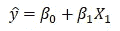
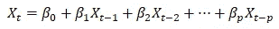
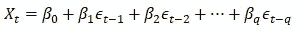
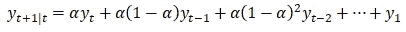
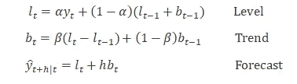
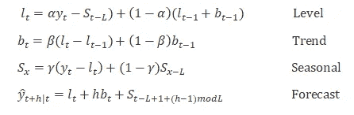

# 让我们用经典方法来预测你的时间序列

> 原文：<https://towardsdatascience.com/lets-forecast-your-time-series-using-classical-approaches-f84eb982212c?source=collection_archive---------5----------------------->

## 时间数列预测法

## 14 种经典预测技术及其在 Python 中的实现


# 背景

在我之前的文章中，我们学习了各种数据准备技术，还建立了一个健壮的 T2 评估框架。现在，我们准备探索不同的预测技术。

随着许多机器学习模型的出现，我们经常会忘记经典算法的强大功能。从经典方法开始是一个好主意。即使经典的方法集中在线性关系上，假设数据是适当准备的，它们在广泛的问题上表现良好。

下面是本文将要讨论的技术列表。我们还将讨论它们的 Python 实现。

**1。单变量时间序列预测** 1.1。自回归
1.2。移动平均线
1.3。自回归移动平均线
1.4。自回归综合移动平均线
1.5。季节性自回归综合移动平均线
**2。多元时间序列预测** 2.1。向量自动回归
2.2。向量移动平均线
2.3。向量自动回归移动平均
**3。3.1 具有外生变量的时间序列预测** 。萨里玛与外生变量
3.2。向量自回归移动平均与外生回归
**4。用平滑技术进行时间序列预测** 4.1。移动平均平滑
4.2。单一指数平滑
4.3。双指数平滑
4.4。三重指数平滑

# 单变量时间序列预测

这些数据集每次只观察到一个变量，例如每小时的温度。单变量时间序列被建模为其滞后的线性组合。也就是说，序列的过去值用于预测当前和未来。

## 自回归(AR)

自回归基于输入变量的线性组合(前一时间步的值)对输出(下一步的值)进行建模。例如，在线性回归中，y-hat 是预测值， *β* ₀和 *β* ₁是模型根据训练数据计算的系数，x 是输入值。



同样，在时间序列中，给定当前和先前时间步的观测值，我们可以预测下一个时间步的值。



p’是自回归趋势参数，p 的理想值可以从自相关图中确定。

*该方法适用于没有趋势和季节成分的时间序列。*

**Python 实现— AR**

```
# Import libraries
from statsmodels.tsa.ar_model import AutoReg
from random import random
# Generate a sample dataset
data = [x + random() for x in range(1, 100)]
# fit model
model = AutoReg(data, lags=1)
model_fit = model.fit()
# make prediction
yhat = model_fit.predict(len(data), len(data))
print(yhat)
```

## 移动平均线

观察值和预测值之间的差异称为残差。这些来自时间序列预测的误差提供了另一个我们可以建模的信息来源。其计算方法如下:

```
residual error = observed — predicted
```

因此，移动平均法也被称为残差模型，这种方法将序列中的下一步建模为残差的线性函数。您可以在下面的等式中观察到这种差异。



q '是移动平均趋势参数，q 的理想值可以从部分自相关图中确定。

*该方法适用于没有趋势和季节成分的时间序列。*

**Python 实现—马**

```
# Import libraries
from statsmodels.tsa.arima_model import ARMA
from random import random
# Generate a sample dataset
data = [x + random() for x in range(1, 100)]
# fit model
model = ARMA(data, order=(0, 1))
model_fit = model.fit(disp=False)
# make prediction
yhat = model_fit.predict(len(data), len(data))
print(yhat)
```

## 自回归移动平均(ARMA)

自回归移动平均(ARMA)方法使用上述信息(原始观测值和残差)进行预测，这是对单个 AR 和 MA 模型的改进。

因此，该方法将序列中的下一步建模为前一时间步的观测值和残差的线性函数。

建模者必须为模型的两个组件指定参数 p 和 q，即自回归(AR)和移动平均(MA)。

*该方法适用于没有趋势和季节成分的时间序列。*

**Python 实现— ARMA**

```
# Import libraries
from statsmodels.tsa.arima_model import ARMA
from random import random
# Generate a sample dataset
data = [random() for x in range(1, 100)]
# fit model
model = ARMA(data, order=(2, 1))
model_fit = model.fit(disp=False)
# make prediction
yhat = model_fit.predict(len(data), len(data))
print(yhat)
```

## 自回归综合移动平均(ARIMA)

到目前为止，我们讨论的统计模型假设时间序列是平稳的，但实际上，大多数时间序列都不是平稳的，即序列的统计特性(如均值、方差)会随时间而变化。

因此，我们可以增加一个步骤作为预处理步骤，即差分(‘d’)时间序列，使其平稳。

现在，我们有一种方法，它结合了自回归(AR)和移动平均(MA)模型以及序列的差分预处理步骤，使序列平稳，称为积分(I)。

因此，我们需要找出我们正在处理的时间序列是否是平稳的。我们可以通过观察时间序列图中的季节性和趋势，检查不同时期的均值和方差的差异，以及增强的 Dickey-Fuller (ADF)检验来诊断平稳性。你可以在我以前的文章“为时间序列预测建立基础”中找到这些技术的细节。

*该方法适用于有趋势且无季节性成分的时间序列。*

**Python 实现— ARIMA**

```
# Import libraries
from statsmodels.tsa.arima_model import ARIMA
from random import random
# Generate a sample dataset
data = [x + random() for x in range(1, 100)]
# fit model
model = ARIMA(data, order=(1, 1, 1))
model_fit = model.fit(disp=False)
# make prediction
yhat = model_fit.predict(len(data), len(data), typ='levels')
print(yhat)
```

## 季节性自回归综合移动平均线

该方法是 ARIMA 模型处理季节性数据的扩展。它分别对该系列的季节性和非季节性部分进行建模。

除了 ARIMA 方法中使用的三个趋势相关参数之外，还有四个其他季节性参数添加到该方法中。

**非季节性参数与 ARIMA 相同**

p:自回归阶
d:差分阶
q:移动平均阶

**季节参数**

p:季节自回归阶
D:季节差分阶
Q:季节移动平均阶
m:单个季节周期的时间步数

*该方法适用于具有趋势和/或季节成分的时间序列。*

**Python 实现— SARIMA**

```
# Import libraries
from statsmodels.tsa.statespace.sarimax import SARIMAX
from random import random
# Generate a sample dataset
data = [x + random() for x in range(1, 100)]
# fit model
model = SARIMAX(data, order=(1, 1, 1), seasonal_order=(1, 1, 1, 1))
model_fit = model.fit(disp=False)
# make prediction
yhat = model_fit.predict(len(data), len(data))
print(yhat)
```

# 多元时间序列预测

这些数据集每次观察两个或多个变量。在多元时间序列中，每个变量被建模为其自身的过去值和系统中其他变量的过去值的线性组合**。**

## 向量自回归

它是自回归模型的推广，用于预测多个平行平稳时间序列。它包括系统中每个变量的一个方程。每个方程的右边包括一个常数和系统中所有变量的滞后。

使用 VAR 进行预测时，我们需要做出两个决定，即系统中应该包含多少变量(K)和多少滞后(p)。

VAR 中待估计的系数数量等于 K+pK(或每个方程 1+pK)。例如，对于具有 K=5 个变量和 p=2 个滞后的 VAR，每个方程有 11 个系数，总共有 55 个系数要估计。需要估计的系数越多，估计误差越大。

因此，建议保持 K 值较小，并且只包含彼此相关的变量，因此在预测彼此时很有用。信息标准通常用于选择要包含的滞后数(p)。

**Python 实现— VAR**

```
# Import libraries
from statsmodels.tsa.vector_ar.var_model import VAR
from random import random
# Generate a sample dataset with correlated variables
data = list()
for i in range(100):
    v1 = i + random()
    v2 = v1 + random()
    row = [v1, v2]
    data.append(row)
# fit model
model = VAR(data)
model_fit = model.fit()
# make prediction
yhat = model_fit.forecast(model_fit.y, steps=1)
print(yhat)
```

VAR 也可以使用 Statsmodels 中的 VARMAX 函数实现，该函数允许通过 order 参数估计 VAR、VMA、VARMA 和 VARMAX 模型。

## 向量移动平均(VMA)

它是移动平均模型的推广，用于预测多个平行平稳时间序列。

**Python 实现— VMA**

```
# Import libraries
from statsmodels.tsa.statespace.varmax import VARMAX
from random import random
# Generate a sample dataset with correlated variables
data = list()
for i in range(100):
    v1 = i+ random()
    v2 = v1 + random()
    row = [v1, v2]
    data.append(row)
# fit VMA model by setting the ‘p’ parameter as 0.
model = VARMAX(data, order=(0, 1))
model_fit = model.fit(disp=False)
# make prediction
yhat = model_fit.forecast()
print(yhat)
```

## 向量自回归移动平均(VARMA)

它结合了 VAR 和 VMA 模型以及广义的 ARMA 模型来预测多个平行的平稳时间序列。

这种方法需要“p”和“q”参数，并且通过将“q”参数设置为 0 也能够像 VAR 模型一样工作，并且通过将“p”参数设置为 0 也能够像 VMA 模型一样工作。

**Python 实现— VARMA**

```
# Import libraries
from statsmodels.tsa.statespace.varmax import VARMAX
from random import random
# Generate a sample dataset with correlated variables
data = list()
for i in range(100):
    v1 = random()
    v2 = v1 + random()
    row = [v1, v2]
    data.append(row)
# fit model
model = VARMAX(data, order=(1, 1))
model_fit = model.fit(disp=False)
# make prediction
yhat = model_fit.forecast()
print(yhat)
```

# 具有外生变量的时间序列预测

## 具有外生变量的 SARIMA(SARIMAX)

带有外生变量的季节性自回归综合移动平均(SARIMAX)是 SARIMA 模型的扩展，它也包括外生变量的建模。

在继续之前，让我们了解内生和外生变量。

> **外生变量**是其值在模型之外确定并强加于模型的变量。这里，X 是一个外生变量
> 
> 一个**内生变量**是一个其值由模型决定的变量。这里，要预测的主要序列是一个内生变量。

在时间序列中，外生变量是一个平行的时间序列，不直接建模，但用作模型的加权输入。

*该方法适用于具有趋势和/或季节成分以及外生变量的单变量时间序列。*

**Python 实现— SARIMAX**

```
# Import libraries
from statsmodels.tsa.statespace.sarimax import SARIMAX
from random import random
# Generate a sample dataset with independent exogenous variable
data1 = [x + random() for x in range(1, 100)]
data2 = [x + random() for x in range(101, 200)]
# fit model
model = SARIMAX(data1, exog=data2, order=(1, 1, 1), seasonal_order=(0, 0, 0, 0))
model_fit = model.fit(disp=False)
# make prediction
exog2 = [200 + random()]
yhat = model_fit.predict(len(data1), len(data1), exog=[exog2])
print(yhat)
```

SARIMAX 方法也可用于通过包含外生变量对其他外生变量进行建模，如 ARX、最大值、ARMAX 和 ARIMAX。

## 带外生回归量的向量自回归移动平均(VARMAX)

这种方法是 VARMA 模型的扩展，也包括外生变量的建模。它是 ARMAX 方法的多元版本。

*该方法适用于无趋势的多元时间序列和有外生变量的季节成分。*

**Python 实现— VARMAX**

```
# Import libraries
from statsmodels.tsa.statespace.varmax import VARMAX
from random import random
# Generate a sample dataset with correlated multiple time series and an independent exogenous variable
data = list()
for i in range(100):
    v1 = random()
    v2 = v1 + random()
    row = [v1, v2]
    data.append(row)
data_exog = [x + random() for x in range(100)]
# fit model
model = VARMAX(data, exog=data_exog, order=(1, 1))
model_fit = model.fit(disp=False)
# make prediction
data_exog2 = [[100]]
yhat = model_fit.forecast(exog=data_exog2)
print(yhat)
```

# 滑动平均平滑的时间序列预测

移动平均平滑是时间序列预测中一种简单而有效的方法。与我们开始讨论的移动平均线模型同名，但有很大不同。早期版本的移动平均(MA)是一种残差模型，而这种平滑技术包括对连续时段窗口内的值进行平均。

一般来说，有两种类型的移动平均线被使用:

## 居中移动平均线

时间(t)时的值计算为时间(t)前后电流的平均值。例如，窗口宽度为 3:

```
centered_ma(t) = mean(obs(t+1), obs(t), obs(t-1))
```

中心移动平均线需要未来值的可用性，我们经常发现这种方法不适合用于预测。

## 移动平均线

时间(t)时的值计算为时间(t)前电流的平均值。例如，窗口宽度为 3:

```
trail_ma(t) = mean(obs(t), obs(t-1), obs(t-2))
```

跟踪移动平均线仅使用当前和历史观察值来预测未来。

这种方法主要用于特征工程，也可用于预测。我们可以使用新创建的“移动平均值”系列，通过一个简单的模型来预测下一步。在预测之前，我们假设时间序列的趋势和季节性成分已经被去除或调整。

这种方法没有可用的 python 函数，相反，我们可以创建一个自定义函数，您可以参考我以前的[文章](/build-evaluation-framework-for-forecast-models-fbc1bd775edd)中的朴素模型实现。

# 指数平滑时间序列预测

指数平滑是一种单变量数据的时间序列预测方法。它是流行的博克斯-詹金斯 ARIMA 类方法的近似替代方法。

这两种方法都预测过去观测值的加权和，这里有一个重要的区别需要注意。

*ARIMA 家族开发了一种模型，其中预测是最近的过去观察值或滞后值的加权线性和，而指数平滑明确地使用过去观察值的指数递减权重。*

## 单指数平滑

这种方法也称为简单指数平滑法，适用于没有明确趋势或季节模式的预测数据。数学上，



其中，α是介于 0 和 1 之间的平滑参数。较大的值意味着模型重视最近的观察，而较小的值意味着最早的观察更重要。

**Python 实现— SES**

```
# Import libraries
from statsmodels.tsa.holtwinters import SimpleExpSmoothing
from random import random
# Generate a sample dataset
data = [x + random() for x in range(1, 100)]
# fit model
model = SimpleExpSmoothing(data)
model_fit = model.fit()
# make prediction
yhat = model_fit.predict(len(data), len(data))
print(yhat)
```

## 双指数平滑

双指数平滑法是上述方法(SES)的扩展，这种方法允许用趋势预测数据。数学上，



除了 *alpha、* a 平滑因子之外，还添加了一个额外的平滑因子来控制趋势变化影响的衰减，称为 *beta。*

这些方法往往会过度预测，尤其是对于较长的预测范围。受这一观察结果的激励，Gardner & McKenzie (1985)引入了一个参数，该参数在未来某个时候将趋势“抑制”到一条平坦的线。

因此，结合平滑参数α和β(值在 0 和 1 之间)，该方法还包括范围也在 0 和 1 之间的阻尼参数ϕ。

**Python 实现—双指数平滑**

```
# Import libraries
from statsmodels.tsa.holtwinters import ExponentialSmoothing
from random import random
# Generate a sample dataset
data = [x + random() for x in range(1, 100)]
# fit model
model = ExponentialSmoothing(data,trend='add', seasonal=None, damped=True)
model_fit = model.fit()
# make prediction
yhat = model_fit.predict(len(data), len(data))
print(yhat)
```

## 三重指数平滑

三重指数平滑是该系列中最高级的变化，这种方法也被称为霍尔特-温特斯指数平滑，以该方法的两位贡献者命名:查尔斯·霍尔特和彼得·温特斯。



除了 alpha 和 beta 平滑因子之外，还添加了一个名为 *gamma* ( *g* )的新参数，用于控制对季节性成分的影响。

加法和乘法霍尔特-温特斯方法都可以产生阻尼。一种经常为季节性数据提供准确可靠预测的方法。

**Python 实现—霍尔特-温特斯指数平滑**

```
# Import libraries
from statsmodels.tsa.holtwinters import ExponentialSmoothing
from random import random
# Generate a sample dataset
data = [x + random() for x in range(1, 100)]
# fit model
model = ExponentialSmoothing(data,trend="add", seasonal="add", seasonal_periods=12, damped=True)
model_fit = model.fit()
# make prediction
yhat = model_fit.predict(len(data), len(data))
print(yhat)
```

# 摘要

在本文中，您发现了所有重要的经典预测技术，这些技术可以帮助您开始解决预测问题。您可以深入研究合适的技术，并根据需要进一步调整。要构建一个健壮的预测模型，您必须从执行正确的数据转换开始，建立一个评估策略，并准备好一个持久性(基准)模型。

感谢阅读！请随时分享任何意见或反馈。

希望这篇文章对您有所帮助，在接下来的几篇文章中，我将详细讨论一些常用的技术。

# 参考

[1] Galit Shmueli 和 Kenneth Lichtendahl，实用时间序列预测与 R:实践指南，2016 年。

[2]杰森·布朗利，[https://machinelearningmastery.com/](https://machinelearningmastery.com/)

[3][https://scikit learn . org/stable/modules/generated/sk learn . model _ selection。TimeSeriesSplit.html](https://scikit-learn.org/stable/modules/generated/sklearn.model_selection.TimeSeriesSplit.html)

[4][https://www . stats models . org/stable/user-guide . html #时序分析](https://www.statsmodels.org/stable/user-guide.html#time-series-analysis)