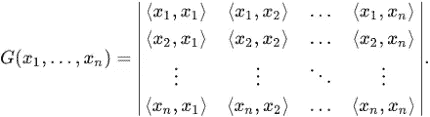
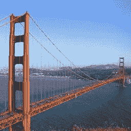
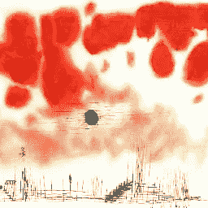
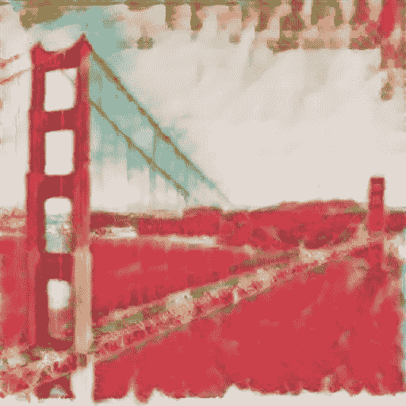
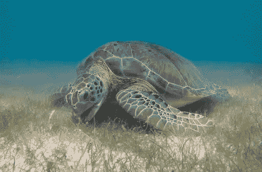
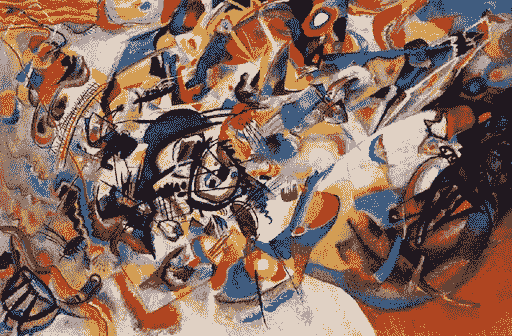
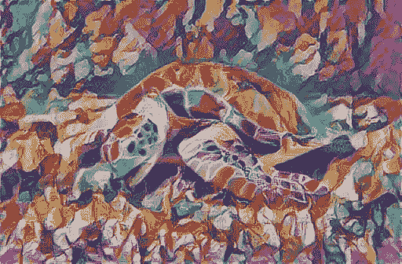
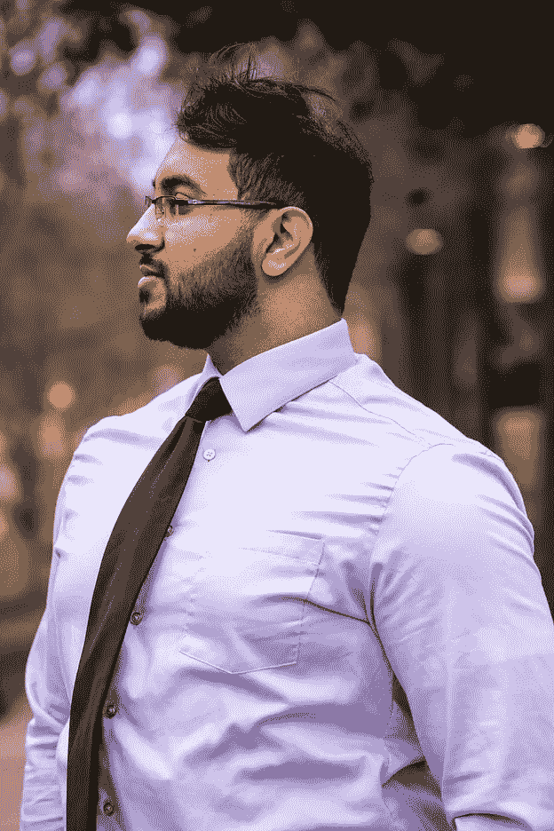
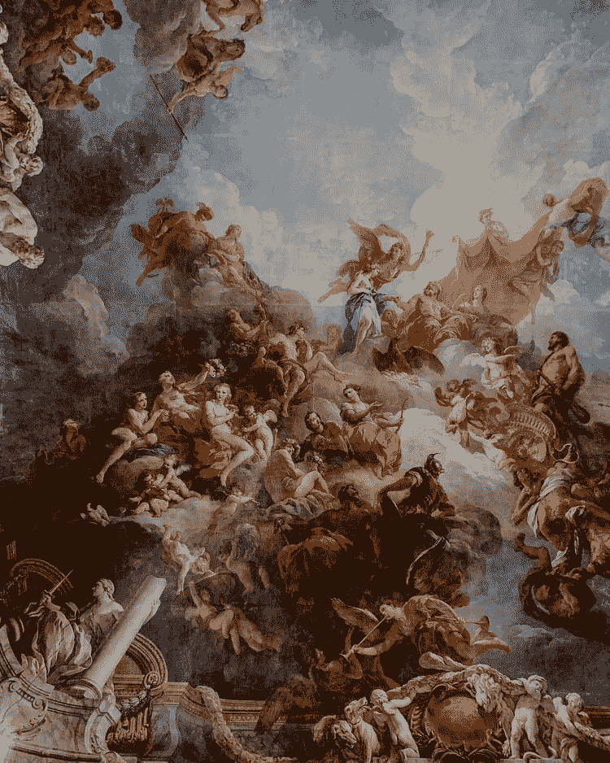
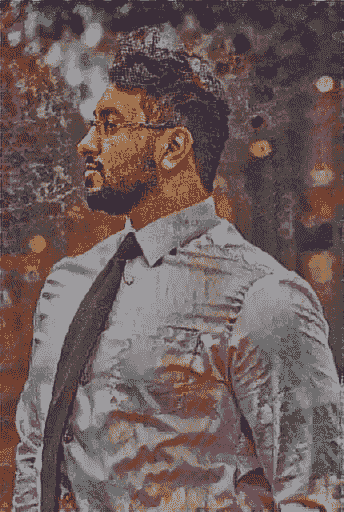

# 让我们开始艺术吧！用神经网络创建自定义 Snapchat 过滤器！

> 原文：<https://towardsdatascience.com/lets-get-artsy-creating-custom-snapchat-filters-with-neural-networks-8b73134b6cd7?source=collection_archive---------56----------------------->

## 利昂·a·盖茨比神经风格迁移初探


普里西拉·杜·普里兹在 [Unsplash](https://unsplash.com?utm_source=medium&utm_medium=referral) 上的照片

和很多人一样，我可以强烈地说，拍照不是我的强项。我学会了变得更好，并养成了一种像《我是如何遇见你母亲》中的巴尼那样的半笑。最近，我想努力变得更上镜，所以我通过我的社交媒体搜索，看看别人是如何做到的。然后我突然想到，这些照片中的大多数都经过了某种过滤，主要来自 Snapchat。这让我困惑了一段时间，直到我亲自尝试。这些滤镜又古怪又愚蠢，而且确实让我在镜头前看起来更好看！

那时我就在想，“如果我们能自己制作过滤器会怎么样”？经过一些研究，我了解到 Snapchat 从许多计算机视觉技术中创建了这些增强现实过滤器。最后，经过几个小时的研究，我发现了一篇有趣的论文，名为“艺术风格的神经算法”，作者是里昂·A·盖茨比(Leon A. Gatsy)及其同事。他们使用神经网络从一张照片和一件艺术品中创建一个“风格化的图像”。然后，在突然意识到之后，我想探索一下我们是否可以使用这种技术来创建自定义过滤器，就像 Snap chat 上的过滤器一样。这是我用 Python 实现它的旅程！

附注:这种技术已经成为研究的热门话题好几年了，有许多很好的在线资源和视频很好地解释了这些概念。本文主要是尽我所能提供这种技术的高层次概述。好吧，让我们开始吧！

# 神经类型转移:算法

那么这个算法想要完成什么呢？本质上，我们希望产生一个图像，类似于我们的内容图像(我们希望风格化的图像)，具有我们的风格图像的艺术风格。


图宾根斯纳卡前线梵高《星夜》风格转移的一个例子([图片来源](https://www.researchgate.net/publication/330383053_Automated_Deep_Photo_Style_Transfer)

在最初的论文中，他首先使用 VGG19 模型来实现这个结果。VGG19 是一种流行的图像识别神经网络，但我们主要关注它如何从照片中提取特征。特征提取是通过可以检测小图案的多个连续层来完成的。它最初拾取的要素非常简单，但随着更多要素图层的添加而变得更加复杂。然后，我们可以使用这些功能，重新创建我们的原始图像！

## 内容损失

在这一步中，我们希望或多或少地重新创建我们内容图像的本质。为了实现这一点，我们将首先创建一个充满随机噪声的图像。然后，我们将使用从我们的网络中提取的特征作为指导，将这个图像塑造成看起来像我们的内容图像。随机图像特征和内容特征之间的距离被称为我们的“内容损失”。为了获得最佳的风格化图像，我们希望通过反向传播来最小化这个损失函数。我们将最终循环这整个事情，并优化每一步，以获得一个很好的重建我们的形象。

```
for i in range(1,epochs+1):target_features = model_activations(target,model)content_loss = torch.mean((content_features['conv4_2']-target_features['conv4_2'])**2)
```

## 风格丧失



格拉姆矩阵方程([图像来源](https://en.wikipedia.org/wiki/Gramian_matrix)

在这一步，我们要重新创建我们的风格形象的核心艺术方向。盖茨比用一种有趣的方式解决了这个问题！我们不是将我们的风格特征与另一个图像进行比较，而是将每个特征图与其自身进行比较。我们首先将样式特征转换成一个 gram 矩阵，它基本上是一个矩阵的内积。“风格损失”基本上是模型网络中所有特征地图损失的总和。我们将做一个类似的循环过程，并优化每一步。

```
style_loss = 0for layer in style_wt_meas:style_gram = style_grams[layer]target_gram = target_features[layer]_,d,w,h = target_gram.shapetarget_gram = gram_matrix(target_gram)style_loss += (style_wt_meas[layer]*torch.mean((target_gram-style_gram)**2))/d*w*h
```

我们在这个过程中的最后一步是计算我们的最终损失，作为我们的内容损失和风格损失的加权和。我们还将在训练循环的每一步优化这种损失。

```
total_loss = content_wt*content_loss + style_wt*style_loss
```

# 问题和未来工作

盖茨比风格转换法是此类方法中的首创，但也存在一些问题。主要的问题是它非常慢。这是因为由于优化是在训练循环中的每个周期进行的，所以算法需要一些时间来产生任何东西。其次，有时改变权重会大大破坏照片的稳定性。有一个修复方法是添加一个总损失变量，该变量与内容和样式图像的均值和方差对齐。根据我的研究，看起来神经风格转移仍然是一个热门话题，应用程序被应用于视频处理、模拟和设计。

我在 Youtube 上使用 Ayush Chaurasia: [艺术神经风格转移从零开始](https://www.youtube.com/watch?v=K_xBhp1YsrE)来创建代码。就像我在本文开头提到的，你可以在网上找到很多很好的资源。如果你想开始解决计算机视觉问题，我认为构建神经风格转换应用程序会非常有趣和令人兴奋！所以我希望这有所帮助，如果你想继续下去，我祝你好运！

# 感谢阅读！

这里有一些我拍摄的很酷的结果，我迫不及待地想看看你会创造出什么！



金门大桥上的红云



卡丁斯基论大海龟



米开朗基罗在你的真实(我)上的绘画(风格来源:照片由[阿德里安娜·吉奥](https://unsplash.com/@adrigeo_)在 [Unsplash](https://unsplash.com/) 上拍摄)

完整的代码可以在我的 Google Colab 上找到:

[](https://colab.research.google.com/drive/1iUdLwtgV5cJZefR1j09PtpAYpcWxfZ1e) [## 谷歌联合实验室

### Snapchat 应用

colab.research.google.com](https://colab.research.google.com/drive/1iUdLwtgV5cJZefR1j09PtpAYpcWxfZ1e) 

您可以查看我的 GitHub 获取更多资源！

[](https://github.com/MehrabiHasan/Snapchat-App) [## MehrabiHasan/Snapchat-App

### GitHub 是超过 5000 万开发人员的家园，他们一起工作来托管和审查代码、管理项目和构建…

github.com](https://github.com/MehrabiHasan/Snapchat-App) 

# 参考

1.  【https://www.youtube.com/watch?v=K_xBhp1YsrE 
2.  [https://www.youtube.com/watch?v=c3kL9yFGUOY](https://www.youtube.com/watch?v=c3kL9yFGUOY)
3.  [https://towards data science . com/breaking-down-Leon-gatys-neural-style-transfer-in-py torch-fa F9 f 0 EB 79 db](/breaking-down-leon-gatys-neural-style-transfer-in-pytorch-faf9f0eb79db)
4.  [https://arxiv.org/abs/1703.06868](https://arxiv.org/abs/1703.06868)
5.  [https://arxiv.org/abs/1603.08155](https://arxiv.org/abs/1603.08155)
6.  [https://arxiv.org/abs/1508.06576](https://arxiv.org/abs/1508.06576)
7.  [https://github.com/reiinakano](https://github.com/reiinakano)