# 让我们从 MongoDB 开始吧

> 原文：<https://towardsdatascience.com/lets-get-you-started-with-mongodb-part-1-85c64828c815?source=collection_archive---------48----------------------->

## 如何设置 MongoDB Atlas，Compass 和 PyMongo


米卡·鲍梅斯特在 [Unsplash](https://unsplash.com?utm_source=medium&utm_medium=referral) 上的照片

# 介绍

[MongoDB](https://www.mongodb.com/) 是一个非常流行的[非关系数据库](https://docs.microsoft.com/en-us/azure/architecture/data-guide/big-data/non-relational-data#:~:text=A%20non%2Drelational%20database%20is,type%20of%20data%20being%20stored.)应用程序。世界上许多主要的开发商和公司(EA，Google，威瑞森，Adobe 等。)使用 MongoDB 作为一种存储形式，因为它具有高可用性、可伸缩性、容错性、敏捷性和灵活性。

MongoDB 是一个文档数据库。这意味着它不是在数据框中存储传统的表和数据行，而是存储类似 JSON/dictionary 的对象。这使得它非常强大和灵活，因为您可以在文档中存储文档，并且您的文档不需要有固定/一致的格式。

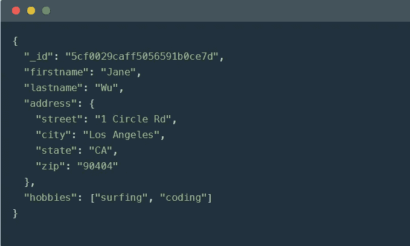

从 [MongoDB](https://www.mongodb.com/) 获得的一个文档截图

MongoDB 为我们提供了非常强大的查询语言。在我看来，它和 MYSQL 一样简单，查询非常直观。更重要的是，MongoDB 为我们所有人提供了一个免费的云存储层。

本文的目的不是解释 MongoDB 提供的每一个方法。这是为了让您开始使用 MongoDB。因此，我强烈建议您访问[文档](https://docs.mongodb.com/manual/)。我将解释一些更重要的功能。

在本系列结束时，您应该:

1.  设置您的云存储
2.  将您的数据放在云端
3.  能够处理所述数据
4.  能够使用 MongoDB 的 GUI[Compass](https://www.mongodb.com/products/compass)分析数据。

说够了，我们开始吧！

# 安装和设置

您需要设置 3 个主要区域。

## MongoDB 地图集

MongoDB Atlas 是 MongoDB 完全托管的云数据库。您将需要设置它来将您的数据存储在云中。别担心，这是免费的。

1.  参观[https://www.mongodb.com/cloud/atlas](https://www.mongodb.com/cloud/atlas)
2.  点击“免费开始”并创建一个帐户
3.  创建一个空闲集群

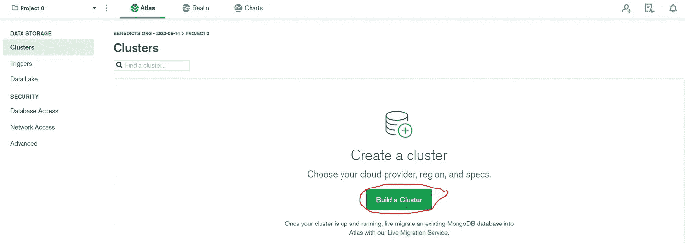

创建一个集群

4.将所有内容保留为默认值，并将集群名称更改为任何名称。对于本文，我将把它命名为“mflix”

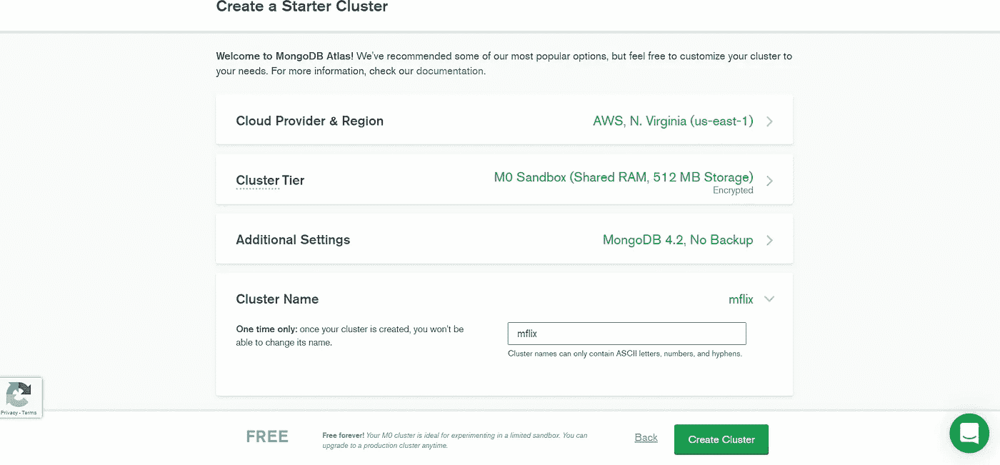

更改集群名称并创建集群

5.在左下角，注意它是免费的。这样，您可以单击“创建集群”

6.白名单 IP 地址。MongoDB 允许特定的网络和计算机访问您的数据库。

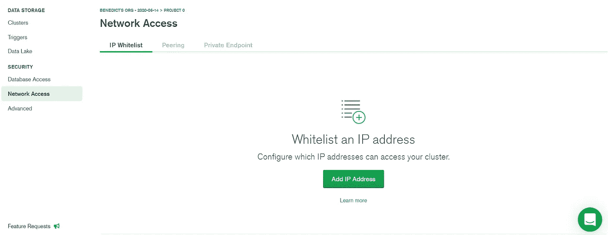

切换到网络访问

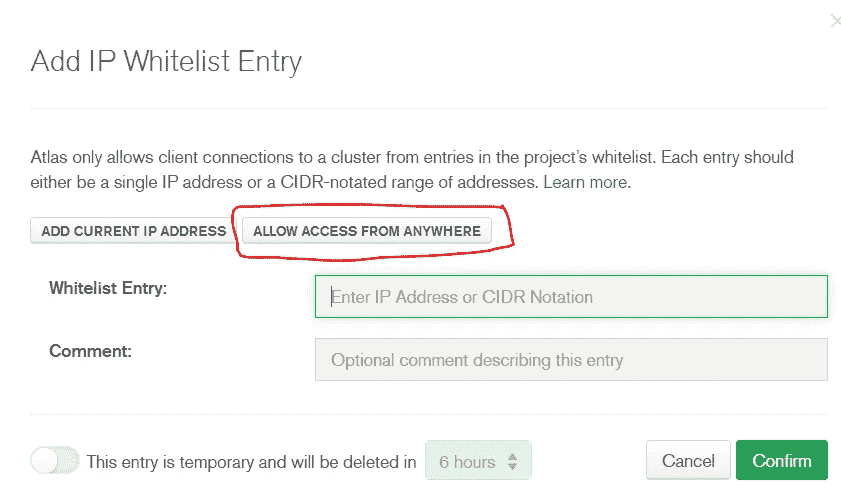

允许所有人访问

7.添加用户。MongoDB 使我们能够为特定用户提供访问权限。我们将需要设置一个用户，有数据库访问您的数据库。对于本文，我将用户名设置为“analytics”，密码设置为“analytics-pw”。你可以随意改变它，但你必须记住它。此外，将权限更改为“Atlas Admin”。

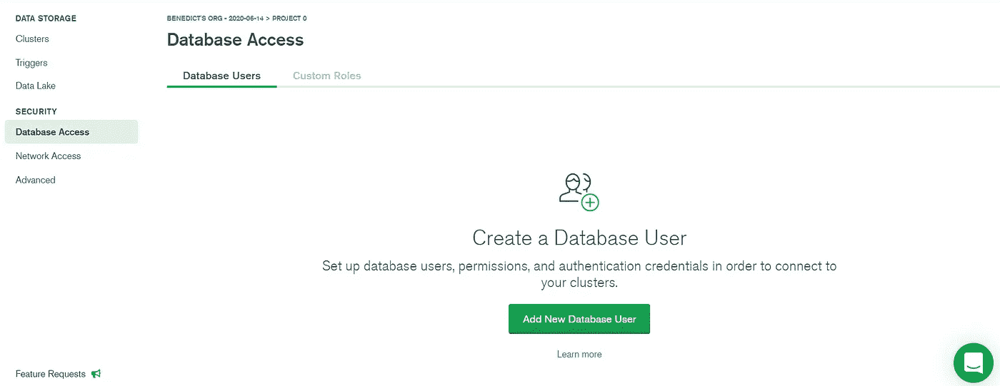

切换到数据库访问

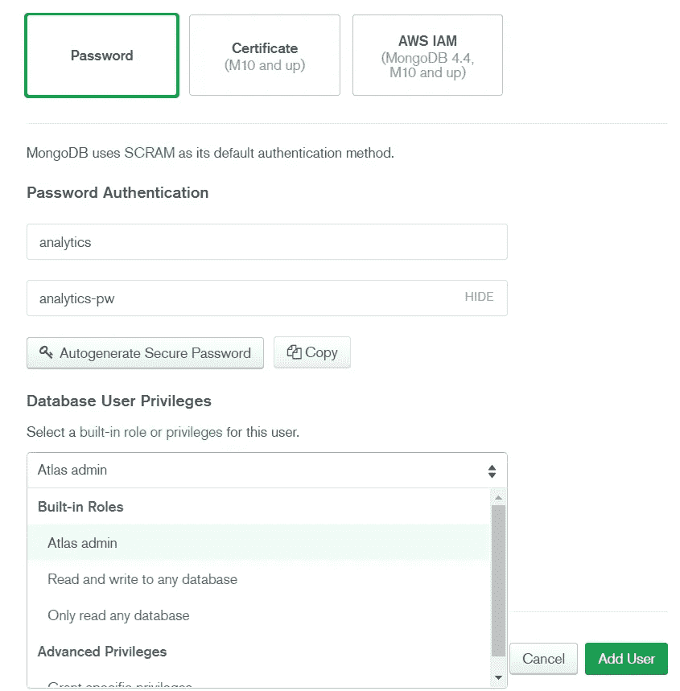

键入您的凭证，更改权限并添加用户

您的云存储现在已经准备就绪！

## MongoDB 服务器

我们将下载[企业版](https://www.mongodb.com/try/download/enterprise)。您可以将所有内容设置为默认值并完成安装。这也将为我们安装 Compass，一个 MongoDB GUI。

如果你想在命令提示符下使用`mongo`命令，记得用[设置你的环境变量](https://docs.oracle.com/en/database/oracle/r-enterprise/1.5.1/oread/creating-and-modifying-environment-variables-on-windows.html#GUID-DD6F9982-60D5-48F6-8270-A27EC53807D0)。要设置的路径应该在这里:`C:\ProgramFiles\MongoDB\Server\4.2\bin\`

成功后，您应该能够实现以下目标:

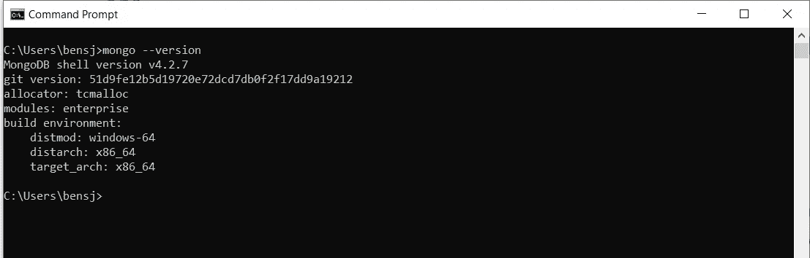

确保 Mongo 正在命令提示符下工作

## Jupyter 笔记本

我们将使用 Python 的库 [PyMongo](https://pymongo.readthedocs.io/en/stable/) 与我们的数据库进行交互。

使用以下命令下载 PyMongo:

```
pip install pymongo dnspython
```

# 将数据导入云中

我们将使用的数据是 mflix，它包含关于电影的信息。

有一些术语你必须知道:

*   集合是数据表。
*   文档是数据行。
*   在 MongoDB 中，客户端由数据库组成。数据库由集合组成。集合由文档组成。

## 使用 mongoimport 手动导入数据

首先，在这里下载 movies_initial.zip [，由](https://github.com/bensjx/MongoDB_Demo) [Gratiaa](https://github.com/gratiaa/mflix/tree/master/data/mflix) 提供。提取 CSV 文件并将其放在您的桌面上。

接下来，我们需要一串标识符来标识我们的数据库。按照下面的截图获取您的字符串。

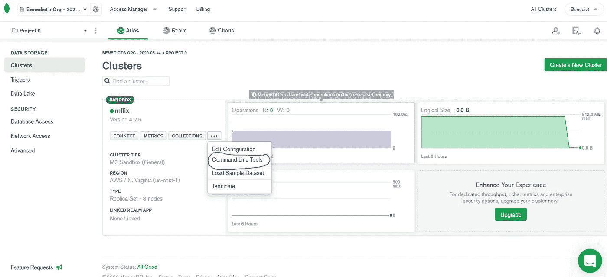

切换到命令行工具

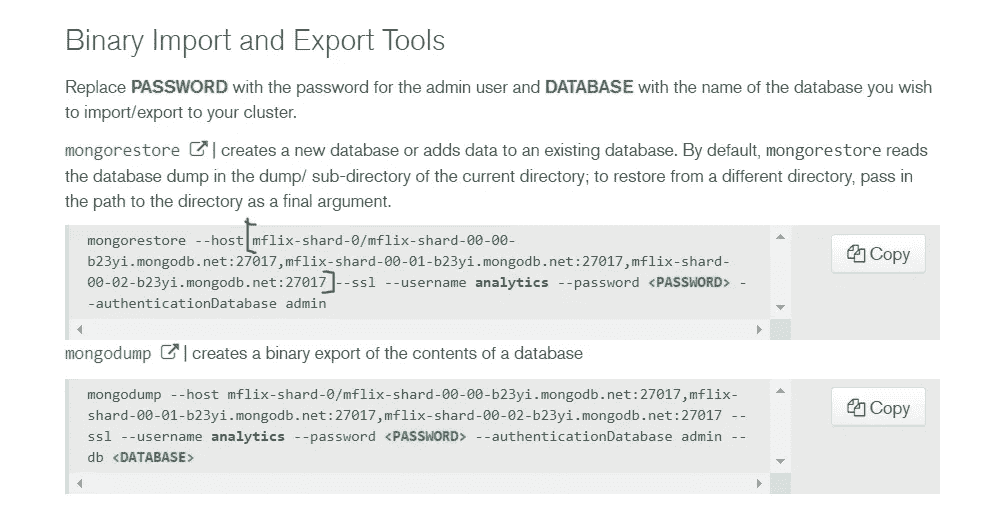

获取您的网络字符串

现在，打开命令提示符，将目录切换到桌面(或数据所在的任何位置)。在替换字符串、用户名和密码时，键入以下命令。

```
mongoimport --type csv --headerline --db mflix --collection movies_initial --host "mflix-shard-0/mflix-shard-00-00-b23yi.mongodb.net:27017,mflix-shard-00-01-b23yi.mongodb.net:27017,mflix-shard-00-02-b23yi.mongodb.net:27017" --authenticationDatabase admin --ssl --username analytics --password analytics-pw --file movies_initial.csv
```

以下是其中一些的含义:

*   `mongoimport`是将数据导入 Atlas 集群的命令
*   `--type csv`表示这是一个 CSV 文件
*   `--headerline`表示您的 CSV 文件行是文件头
*   `-- db mflix`表示我们正在写入的数据库是 mflix
*   `--collection`表示我们正在写入的集合是 movies_initial
*   `--host "<STRING>"`表示到我们数据库的路线。用上面复制的字符串替换它
*   `--username analytics --password analytics-pw`表示您的用户账户。替换为您的用户名和密码
*   `--file movies_initial.csv`表示数据的文件名。确保您的数据与您的命令提示符位于同一路径

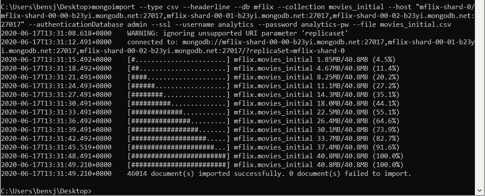

数据上传！

## 使用 Compass 手动导入数据

或者，您也可以使用 Compass 导入数据。当你打开指南针时，你会看到这样一句话:


使用 Compass 连接到您的数据库

要查找连接字符串，请执行以下操作:

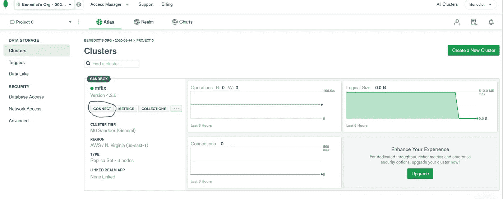

连接

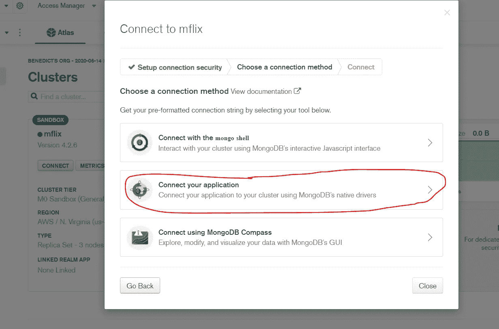

连接应用程序

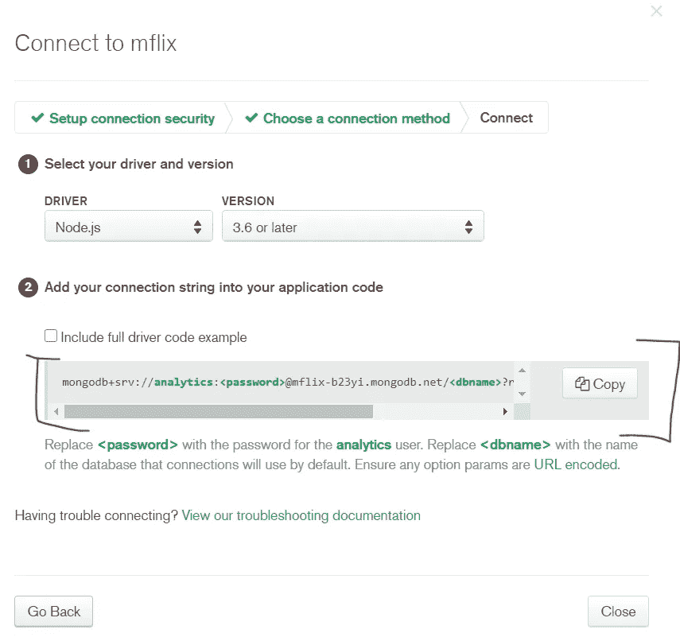

获取连接字符串

复制上面截图中的字符串。但是，您不需要整个字符串。您只需要:

```
mongodb+srv://<username>:<password>[@mflix](http://twitter.com/mflix)-b23yi.mongodb.net
```

穿过绳子进入你的指南针，你将能够像这样连接:


单击创建数据库，继续导入 CSV

只需按照图形用户界面导入您的数据！

## 导入样本数据

MongoDB 好心的给我们提供了[样本数据](https://docs.atlas.mongodb.com/sample-data/sample-mflix/)。我们全部导入吧！

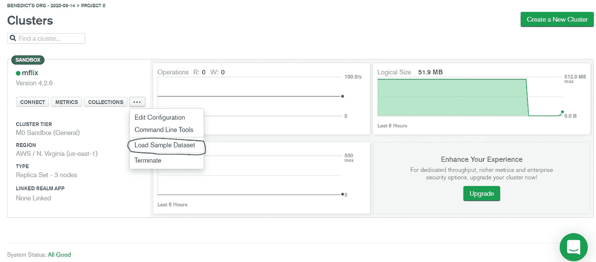

加载样本数据集

数据约为 350MB，需要几分钟时间才能导入集群。

## 体系结构

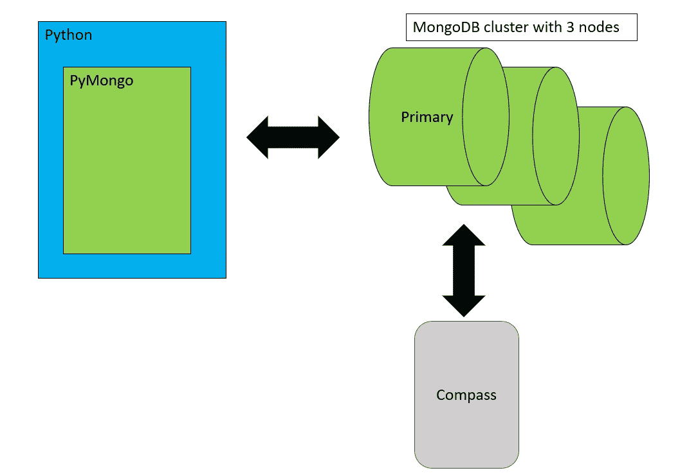

在上面的架构中，我们的数据存储在 MongoDB 集群中。在空闲层中，我们有 3 个节点。这意味着您的数据在 3 个不同的节点上复制了 3 次。每当主节点出现故障时，两个节点中的另一个将逐步成为主节点，为您提供数据。这也称为容错，即在一个节点出现故障的情况下，您的数据不会消失。

您可以使用 Compass 和 PyMongo 与数据进行交互。Compass 是一个 GUI，PyMongo 是一个库/框架，允许您使用 Python 语法在 MongoDB 上工作。

# 结论

恭喜你！现在，您已经成功地设置了 MongoDB 集群，导入了数据，并且现在能够使用 Compass 查看您的数据了。在本文的第二部分，我将深入研究 PyMongo 的 CRUD 操作的基础知识。本质上，您将学习如何插入、读取、操作和删除数据库中的数据。在那之前，注意安全！

# 参考

1.  [https://www.coursera.org/learn/introduction-mongodb](https://www.coursera.org/learn/introduction-mongodb)
2.  https://docs.mongodb.com/