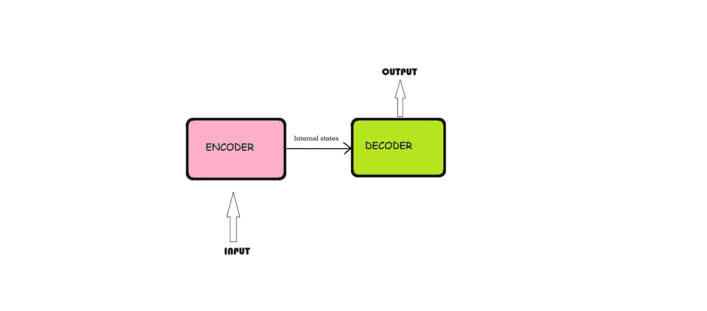
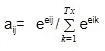
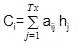
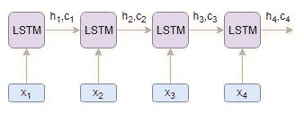
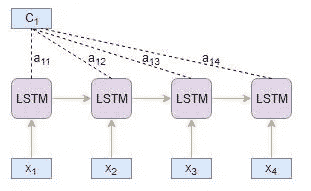
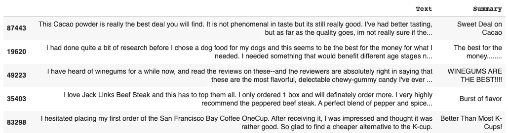
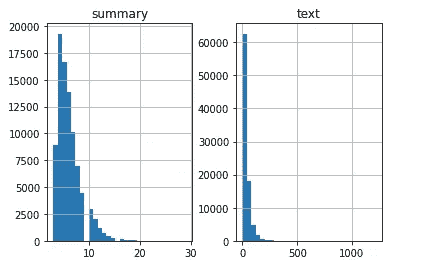
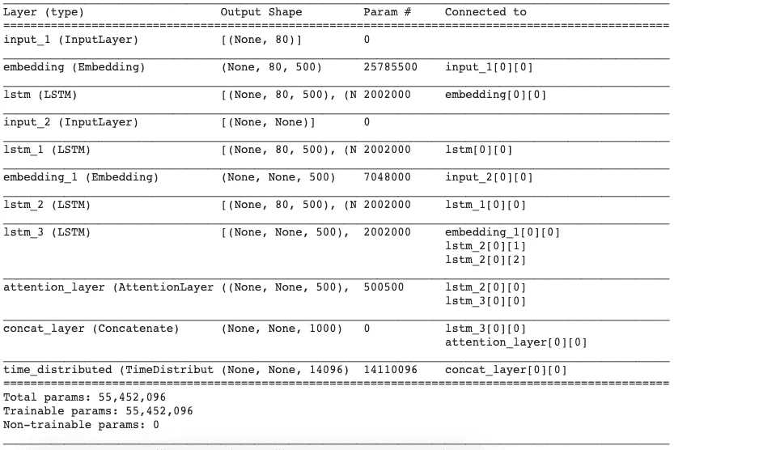
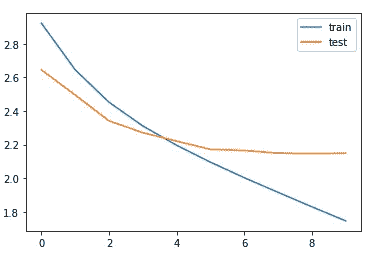

# 让我们对摘要文本给予一些“关注”..

> 原文：<https://towardsdatascience.com/lets-give-some-attention-to-summarising-texts-d0af2c4061d1?source=collection_archive---------39----------------------->

## 使用 LSTM 编解码器模型的文本摘要。


罗曼·维涅斯在 [Unsplash](https://unsplash.com?utm_source=medium&utm_medium=referral) 上的照片

文本摘要是自然语言处理领域中最具挑战性和最有趣的问题之一。这是一个从多种文本资源(如书籍、新闻文章、博客帖子、研究论文、电子邮件和推文)中生成简明而有意义的文本摘要的过程。现在，随着大量文本语料库的可用性，摘要是一项更加重要的任务。

# 那么有哪些不同的方法呢？

## 摘录摘要

这些方法依赖于从一段文本中提取几个部分，如短语和句子，并将它们堆叠在一起以创建摘要。因此，识别用于摘要的正确句子在抽取方法中是至关重要的。我们用一个例子来理解这个。

**正文:** *梅西和 c 罗的战绩都比他们的同行好。在所有比赛中表现出色。他们被认为是我们这一代中的佼佼者。*

**摘录总结:** *梅西和 c 罗的战绩都比同行好。我们这一代最好的。*

正如你在上面看到的，粗体字已经被提取出来并连接在一起形成了一个摘要——尽管有时候这个摘要在语法上很奇怪。

## **抽象概括**

这些方法使用先进的 NLP 技术来生成全新的摘要。本摘要的某些部分甚至可能不会出现在原文中。我们用一个例子来理解这个。

**正文:** *梅西和 c 罗的战绩都比同行好。在所有比赛中表现出色。他们被认为是我们这一代中的佼佼者。*

**抽象总结:** *梅西和 c 罗的战绩都比同行好，所以被认为是我们这一代的佼佼者。*

抽象文本摘要算法创建新的短语和句子，从原始文本中传递最有用的信息——就像人类一样。

在本文中，我们将关注**抽象概括**技术，并且我们将使用**编码器-解码器架构**来解决这个问题。

# 什么是编码器-解码器架构？

常用的序列对序列模型(编码器-解码器)的总体结构如下所示



基本的编码器-解码器架构

该模型由三部分组成:**E*n 编码器、中间向量和解码器。***

## **E*n 编码器***

*   编码器基本上由一系列 LSTM/GRU 单元组成(请阅读 [LSTM](https://keras.io/api/layers/recurrent_layers/lstm/) / [GRU](https://keras.io/api/layers/recurrent_layers/gru/) 文档以更好地理解该架构)。
*   编码器接收输入序列，并将信息封装为内部状态向量。
*   解码器使用编码器的输出和内部状态。
*   在我们的文本摘要问题中，输入序列是来自文本的所有单词的集合，需要对其进行摘要。每个单词表示为 *x_i* ，其中 *i* 是该单词的顺序。

## 中间(编码器)向量

*   这是从模型的编码器部分产生的最终隐藏状态。它是用上面的公式计算的。
*   该向量旨在封装所有输入元素的信息，以帮助解码器做出准确的预测。
*   它充当模型解码器部分的初始隐藏状态。

## 解码器

*   几个循环单元的堆栈，每个循环单元在时间步长 *t* 预测一个输出 *y_t* 。
*   每个递归单元接受来自前一个单元的隐藏状态，并产生和输出它自己的隐藏状态。
*   在摘要问题中，输出序列是来自摘要文本的所有单词的集合。每个单词都表示为 *y_i* ，其中 *i* 是该单词的顺序。
*   任何隐藏状态 *h_i* 都是使用以下公式计算的:


如你所见，我们只是使用前一个隐藏状态来计算下一个。

*   使用以下公式计算时间步长 *t* 的输出 *y_t* :


我们使用当前时间步长的隐藏状态以及相应的权重 W(S)来计算输出。 [Softmax](https://www.youtube.com/watch?v=LLux1SW--oM) 用于创建一个概率向量，该向量将帮助我们确定最终输出(如问答问题中的单词)。

# 请注意:

首先，我们需要明白什么是注意力。

> *在时间步长* ***t*** *生成一个单词，我们需要对输入序列中的每一个单词投入多大的注意力？这是注意力机制概念背后的关键直觉。*

让我们用一个简单的例子来理解这一点:

**问题**:近十年来， ***谁是最好的******足球运动员*** ？

**回答** : ***梅西*** 是最好的 ***球员*** 。

在上面的例子中，问题**中的第五个字**与谁相关**莱昂内尔** **梅西**和第九个字**足球运动员**与第六个字**球员**相关。

因此，我们可以增加源序列中产生目标序列的特定部分的重要性，而不是查看源序列中的所有单词。这是注意力机制背后的基本思想。

根据所关注的上下文向量的导出方式，存在 2 种不同类别的注意机制:

## 全球关注

这里，注意力放在所有的源位置上。换句话说，**编码器的所有隐藏状态都被考虑用于导出关注上下文向量。**在这个总结任务中，我们将使用**全球注意力。**

## 当地的关注

这里，注意力仅放在几个源位置上。**仅考虑编码器的几个隐藏状态来导出关注上下文向量。**

现在让我们了解这种**注意力**到底是如何运作的:

*   编码器输出源序列中每个时间步长 **j** 的隐藏状态( **hj**
*   类似地，解码器输出目标序列中每个时间步长 **i** 的隐藏状态( **si**
*   我们计算一个称为**对齐分数(eij** )的分数，基于该分数，使用分数函数将源单词与目标单词对齐。使用 score 函数从源隐藏状态 **hj** 和目标隐藏状态 **si** 计算校准分数。这由下式给出:

> **eij=得分(si，hj )**

其中 **eij** 表示目标时间步长 **i** 和源时间步长**j**的对齐分数

*   我们使用 softmax 函数归一化比对分数，以检索注意力权重( **aij** ):



*   我们计算关注权重 **aij** 和编码器隐藏状态 **hj** 的乘积的线性和，以产生关注上下文向量( **Ci** ):



*   关注的上下文向量和解码器在时间步 **i** 的目标隐藏状态被连接以产生关注的隐藏向量 **Si，**其中，*Si=连接(【Si；Ci])*
*   然后将关注的隐向量 **Si** 送入稠密层，产生 **yi，** *yi=稠密(Si)。*

让我们借助一个例子来理解以上的注意机制步骤。考虑源文本序列为[x1，x2，x3，x4]，目标摘要序列为[y1，y2]。

*   编码器读取整个源序列，并输出每个时间步长的隐藏状态，比如说 **h1、h2、h3、h4**



*   解码器读取偏移了一个时间步长的整个目标序列，并输出每个时间步长的隐藏状态，例如 **s1、s2、s3**


**目标时间步长 i=1**

*   使用 score 函数从源隐藏状态 **hi** 和目标隐藏状态 **s1** 计算校准分数 **e1j** :

```
e11= score(s1, h1)
e12= score(s1, h2)
e13= score(s1, h3)
e14= score(s1, h4)
```

*   使用 softmax 标准化比对分数 **e1j** 产生注意力权重 **a1j** :

```
a11= exp(e11)/((exp(e11)+exp(e12)+exp(e13)+exp(e14))
a12= exp(e12)/(exp(e11)+exp(e12)+exp(e13)+exp(e14))
a13= exp(e13)/(exp(e11)+exp(e12)+exp(e13)+exp(e14))
a14= exp(e14)/(exp(e11)+exp(e12)+exp(e13)+exp(e14))
```

*   参与上下文向量 **C1** 由编码器隐藏状态 **hj** 和对齐分数 **a1j** 的乘积的线性和得到:

```
C1= h1 * a11 + h2 * a12 + h3 * a13 + h4 * a14
```



*   关联上下文向量 **C1** 和目标隐藏状态 **s1** 被连接以产生关联隐藏向量 **S1**

```
S1= concatenate([s1; C1])
```

*   注意力隐藏向量 **S1** 然后被送入密集层产生 **y1**

```
y1= dense(S1)
```

同样，我们可以计算 Y2。

Keras 没有提供注意力层，所以我们可以自己写或者使用别人提供的注意力层。这里我们使用[这个](https://github.com/thushv89/attention_keras/blob/master/layers/attention.py)实现关注层。

# 实施时间:

这个汇总任务的全部代码可以在这里找到[。](https://gist.github.com/sayakmisra/6133be0554ce916d8cae4cdb83d475d8)

## 显示数据:

我们将在本文中使用[亚马逊食品评论数据集](https://www.kaggle.com/snap/amazon-fine-food-reviews)。让我们看一下数据的快照:



数据集的快照。

## 清理数据:

我们首先需要清理我们的数据，因此我们需要遵循的步骤是:

*   将所有内容转换为小写
*   删除 HTML 标签
*   收缩映射
*   移除(' s)
*   删除括号( )内的任何文本
*   消除标点符号和特殊字符
*   删除停用词。
*   删除短词

## 数据的分布:

然后，我们将分析评论和摘要的长度，从而对文章 t **长度的**分布有一个总体的了解。**这将帮助我们确定序列的最大长度。**



x 轴:字数，Y 轴:句子数量。

## 将数据标记化:

记号赋予器构建词汇表并将单词序列转换成整数序列。我们将使用 Keras 的分词器对句子进行分词。

## 模型构建:

我们终于进入了模型构建阶段。但在此之前，我们需要熟悉一些术语，这些术语是构建模型之前所必需的。

*   **Return Sequences = True:** 当 Return Sequences 参数设置为 **True** 时，LSTM 为每个时间步长产生隐藏状态和单元格状态
*   **返回状态=真:**当返回状态= **真**时，LSTM 只产生最后一个时间步长的隐藏状态和单元格状态
*   **初始状态:**用于初始化第一个时间步长的 LSTM 内部状态
*   **堆叠的 LSTM:** 堆叠的 LSTM 有多层 LSTM 堆叠在一起。这导致序列的更好的表示。我鼓励你尝试将 LSTM 的多层叠加在一起(这是学习的好方法)。



模型总结。

## 训练和提前停止:

这是在训练期间损失是如何减少的，我们可以推断在纪元 10 之后验证损失略有增加。因此，我们将在这个时代之后停止训练模型。



培训和测试损失

## **推论:**

现在，我们将为编码器和解码器设置推理。这里编码器和解码器将一起工作，产生一个摘要。解码器将被堆叠在编码器之上，解码器的输出将再次被馈送到解码器以产生下一个字。

## 测试:

在这里，最后，我们可以用我们的定制输入来测试我们的模型。

```
**Review**: right quantity japanese green tea able either drink one sitting save later tastes great sweet  
**Original summary:** great japanese product  
**Predicted summary:**  great tea**Review:** love body wash smells nice works great feels great skin add fact subscribe save deal great value sold
**Original summary:** great product and value  
**Predicted summary:**  great product**Review**: look like picture include items pictured buy gift recipient disappointed  
**Original summary:** very disappointed  
**Predicted summary:**  not what expected 
```

这是这篇文章的笔记本。

# 包装它

在本文中，我们已经看到了如何使用序列到序列模型来总结文本。我们可以通过增加数据集，使用**双向 LSTM** ，使用**波束搜索策略**等来进一步改进这个模型。

在我们的[下一个故事](/text-summarization-with-glove-embeddings-1e969ef9a452)中，我们将看到如何用迁移学习来实现它。我们将使用预训练的 **GloVe** 单词嵌入，并观察我们的模型如何表现，以及它是否能够通过预训练的嵌入更好地理解语义。在那里见。

# 参考

1.  [https://www . analyticsvidhya . com/blog/2019/06/comprehensive-guide-text-summary-using-deep-learning-python/](https://www.analyticsvidhya.com/blog/2019/06/comprehensive-guide-text-summarization-using-deep-learning-python/)
2.  [https://blog . keras . io/a-ten-minute-introduction-to-sequence-to-sequence-learning-in-keras . html](https://blog.keras.io/a-ten-minute-introduction-to-sequence-to-sequence-learning-in-keras.html)
3.  【https://www.kaggle.com/snap/amazon-fine-food-reviews 