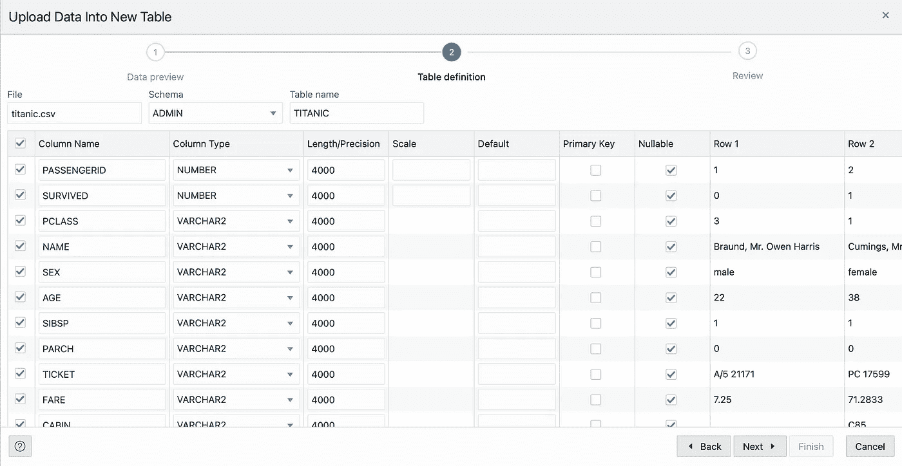
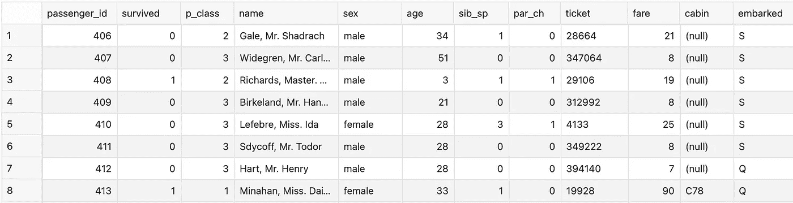
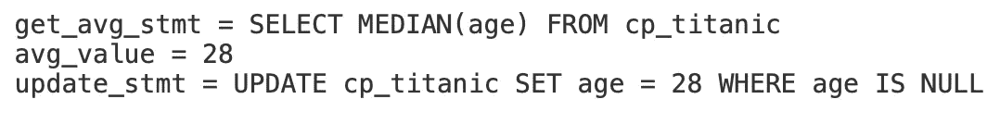

# 让我们用 SQL 估算缺失值

> 原文：<https://towardsdatascience.com/lets-impute-missing-values-with-sql-e350c89d9e2a?source=collection_archive---------33----------------------->

## 易于理解的自动化脚本来完成工作。

缺失值是机器学习中的一个巨大问题。在机器学习可以直接在数据库中完成的时代，人们想知道如何在没有其他编程语言(如 Python 和 r)的情况下使用 SQL 进行充分的数据准备。今天我们将看到它是多么简单。


照片由[伊莱贾·赫特](https://unsplash.com/@elijahdhiett?utm_source=medium&utm_medium=referral)在 [Unsplash](https://unsplash.com?utm_source=medium&utm_medium=referral) 拍摄

出于本文的目的，我们将使用 [Oracle Cloud](https://www.oracle.com/index.html) ，因为它是免费的，无需在您的机器上进行任何下载和安装即可使用——通过 *SQL Developer Web* 。如果您决定跟随，创建一个免费的 OLTP 数据库，并转到*服务控制台—开发— SQL Developer Web* 。

关于数据集，我们将使用众所周知的 [Titanic 数据集](https://gist.githubusercontent.com/michhar/2dfd2de0d4f8727f873422c5d959fff5/raw/fa71405126017e6a37bea592440b4bee94bf7b9e/titanic.csv)，原因有二:

*   这很简单，很容易理解
*   它包含了足够的缺失值供我们使用

一旦您下载了数据集，您就可以使用 *SQL Developer Web* 的*上传数据*功能来创建表并上传数据:



使用您的最佳判断更改数据类型，您已经准备好了！

# 准备和探索

我不想把源表搞乱，这个表叫做`titanic`，所以我们复制一个:

```
CREATE TABLE cp_titanic AS 
SELECT * FROM titanic;
```

让我们快速选择一下，确认一切正常:

```
SELECT * FROM cp_titanic;
```



厉害！如果您对这个数据集做过任何工作，您就会知道`Age`列是最容易出现缺失值的列。让我们检查一下有多少:

```
SELECT COUNT(*) AS num_age_missing 
FROM cp_titanic 
WHERE age IS NULL;
```


如果我们考虑到数据集少于 1000 行，这就很多了。因此，我们需要找出如何填充这些缺失的值，并以一种简单和自动化的方式来完成。

# 插补时间

为了处理缺失数据插补，我们将创建一个`PL/SQL`程序。如果你不知道那是什么，不要担心，因为跟随它会非常简单。在我们用代码做任何事情之前，让我们列出这个过程应该做的事情:

1.  获得一个用于插补的值(平均值/中值/众数将在这个简单的例子中起作用)
2.  对表进行更新-用计算值替换空值

太好了！这应该不难做到。我们还将接受用户的一些输入，更准确地说是 3 个参数:

*   *表名* —缺失数据所在的表的文本表示
*   *属性* —包含缺失值的列
*   *估算方法*——估算的一种方式——均值、中值或众数

这就是我们要开始学习的全部内容。让我们用目前已知的信息创建一个过程:

```
CREATE OR REPLACE PROCEDURE impute_missing(
    in_table_name    IN VARCHAR2,
    in_attribute     IN VARCHAR2,
    in_impute_method IN VARCHAR2 DEFAULT ‘mean’
) IS
BEGIN
END;
/
```

厉害！在关键字`IS`下面，我们将声明一些其他变量——用于保存将要使用的估算函数、获取平均值的语句、平均值本身以及更新语句。我们的过程现在看起来如下:

```
CREATE OR REPLACE PROCEDURE impute_missing(
    in_table_name    IN VARCHAR2,
    in_attribute     IN VARCHAR2,
    in_impute_method IN VARCHAR2 DEFAULT ‘mean’
) IS
    impute_func   VARCHAR2(16);
    get_avg_stmt  VARCHAR2(128);
    avg_value     NUMBER;
    update_stmt   VARCHAR2(128);
BEGIN
END;
/
```

剩余的代码将位于关键字`BEGIN`和`END`之间。

## 估算方法

如前所述，我们的程序可以通过使用均值、中值或众数统计函数来处理缺失值插补。同样，这些是用户可以为`in_impute_method`参数提供的值。

唯一的问题是——这些统计函数在 SQL 中的调用有点不同。我们可以使用`CASE`操作符来处理这个问题，并将结果存储到`impute_func`变量中。代码如下:

```
CASE in_impute_method
    WHEN ‘mean’   THEN impute_func := ‘AVG’;
    WHEN ‘median’ THEN impute_func := ‘MEDIAN’;
    WHEN ‘mode’   THEN impute_func := ‘STATS_MODE’;
    ELSE RAISE_APPLICATION_ERROR(-20001, ‘Invalid impute method!’);
END CASE;
```

那并不难，是吗？

我们差不多完成了一半，接下来的部分也很简单。

## 获取平均值

为了得到平均值，我们将不得不使用一个叫做*动态 SQL* 的东西。这意味着我们不会硬编码 SQL 语句，而是根据提供的用户输入来创建语句。

让我们看看如何创建一个动态查询来获取平均值，关于用户输入的参数(表名、属性和估算方法):

```
get_avg_stmt **:=** q’[SELECT ]’
  **||** impute_func
  **||** q’[(]’
  **||** in_attribute
  **||** q’[) FROM ]’
  **||** in_table_name;DBMS_OUTPUT.PUT_LINE(‘get_avg_stmt = ‘ **||** get_avg_stmt);
```

它可能看起来和感觉起来有点奇怪，直到你习惯了这一点，但你以后会看到这一切归结为什么。这个`DBMS_OUTPUT`行不是必需的，但是一旦我们运行这个过程，它会将`get_avg_stmt`输出到控制台。

但是这还不够，因为我们仍然需要执行这条语句并将其结果存储在`avg_value`变量中。这很容易做到:

```
BEGIN
    EXECUTE IMMEDIATE get_avg_stmt INTO avg_value;
END;DBMS_OUTPUT.PUT_LINE(‘avg_value = ‘ || avg_value);
```

这一部分已经完成，现在我们应该以某种方式对表进行更新，以实际填充缺失的值。让我们看看怎么做。

## 归罪

如果你已经理解了前一部分，你就会理解这一部分。同样，我们需要动态创建一个 SQL 语句并执行它。唯一的区别是这次结果不会存储在变量中，因为这对一个`UPDATE`语句没有意义。相反，该表被就地修改:

```
update_stmt :=
     q’[UPDATE ]’
  || in_table_name
  || q’[ SET ]’
  || in_attribute
  || q’[ = ]’
  || avg_value
  || q’[ WHERE ]’
  || in_attribute
  || q’[ IS NULL]’;DBMS_OUTPUT.PUT_LINE(‘update_stmt = ‘ || update_stmt);BEGIN 
    EXECUTE IMMEDIATE update_stmt;
END;COMMIT;
```

这里唯一的新东西是`COMMIT`关键字。它用于结束当前事务并使所有更改永久化。如果你不确定哪些语句必须提交，[这里有一个解释](https://stackoverflow.com/questions/9541013/oracle-what-statements-need-to-be-committed)。不客气

基本上就是这样，我们已经做了我们该做的一切。

## 概述

以下是整个过程，以防你遗漏了什么:

```
CREATE OR REPLACE PROCEDURE impute_missing(
    in_table_name    IN VARCHAR2,
    in_attribute     IN VARCHAR2,
    in_impute_method IN VARCHAR2 DEFAULT ‘mean’
) IS
    impute_func   VARCHAR2(16);
    get_avg_stmt  VARCHAR2(128);
    avg_value     NUMBER;
    update_stmt   VARCHAR2(128);
BEGIN
    CASE in_impute_method
        WHEN ‘mean’   THEN impute_func := ‘AVG’;
        WHEN ‘median’ THEN impute_func := ‘MEDIAN’;
        WHEN ‘mode’   THEN impute_func := ‘STATS_MODE’;
        ELSE RAISE_APPLICATION_ERROR(-20001, ‘Invalid impute method!’);
    END CASE; get_avg_stmt **:=** q’[SELECT ]’
      **||** impute_func
      **||** q’[(]’
      **||** in_attribute
      **||** q’[) FROM ]’
      **||** in_table_name;
    DBMS_OUTPUT.PUT_LINE(‘get_avg_stmt = ‘ **||** get_avg_stmt); BEGIN EXECUTE IMMEDIATE get_avg_stmt INTO avg_value;
    END;
    DBMS_OUTPUT.PUT_LINE(‘avg_value = ‘ || avg_value); update_stmt :=
         q’[UPDATE ]’
      || in_table_name
      || q’[ SET ]’
      || in_attribute
      || q’[ = ]’
      || avg_value
      || q’[ WHERE ]’
      || in_attribute
      || q’[ IS NULL]’;
    DBMS_OUTPUT.PUT_LINE(‘update_stmt = ‘ || update_stmt); BEGIN EXECUTE IMMEDIATE update_stmt;
    END;
    COMMIT;END;
/
```

现在，让我们来测试一下！

# 测试

我们已经完成了所有的艰苦工作，现在我们可以测试是否一切都像宣传的那样工作。为此，我们将使用`age`列的中值来估算其缺失值。方法如下:

```
BEGIN
    impute_missing(‘cp_titanic’, ‘age’, ‘median’);
END;
/
```

就是这样！如果我们执行这段代码，我们将得到一些控制台输出，这是由于过程中的所有`DBMS_OUTPUT`调用:



厉害！如果我们再次检查缺失值的数量，我们可以看到一切都按预期进行了:

```
SELECT COUNT(*) AS num_age_missing 
FROM cp_titanic 
WHERE age IS NULL;
```


# 有哪些可以改进的地方？

我们的程序完成了工作，但这并不意味着它不能进一步改进。这里有几个想法:

*   舍入结果——在几乎任何情况下调用`AVG`都会产生大量的小数点
*   用户可以选择输入插补值，而不是使用平均值/中值/众数

这不是一个明确的列表，所以你可以根据自己的需要随意修改程序。

*喜欢这篇文章吗？成为* [*中等会员*](https://medium.com/@radecicdario/membership) *继续无限制学习。如果你使用下面的链接，我会收到你的一部分会员费，不需要你额外付费。*

[](https://medium.com/@radecicdario/membership) [## 通过我的推荐链接加入 Medium-Dario rade ci

### 作为一个媒体会员，你的会员费的一部分会给你阅读的作家，你可以完全接触到每一个故事…

medium.com](https://medium.com/@radecicdario/membership) 

[**加入我的私人邮件列表，获取更多有用的见解。**](https://mailchi.mp/46a3d2989d9b/bdssubscribe)