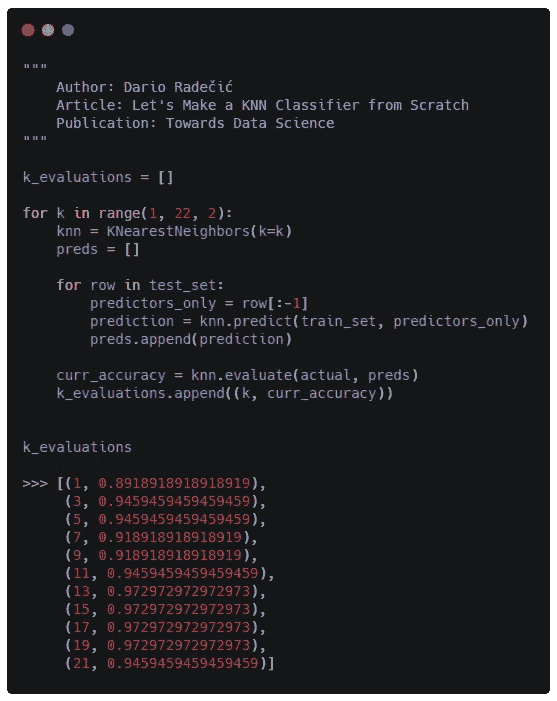

# 让我们从头开始制作一个 KNN 分类器

> 原文：<https://towardsdatascience.com/lets-make-a-knn-classifier-from-scratch-e73c43da346d?source=collection_archive---------11----------------------->

## 你只需要一点钱和一点时间。包括源代码。

从头开始编写整个机器的算法可能是一个乏味的过程。这就是为什么我们有图书馆。另一个原因是，如果我们没有投入足够的时间和精力，我们自己的实现很可能无法与来自 **Scikit-Learn** 的现成解决方案竞争。

由[阿尔文·恩格勒](https://unsplash.com/@englr?utm_source=medium&utm_medium=referral)在 [Unsplash](https://unsplash.com?utm_source=medium&utm_medium=referral) 上拍摄的照片

然而，这并不意味着你不应该从头开始编写算法。以下是这样做的一些好处:

1.  你已经完成了对代码的控制
2.  你将把你对算法的理解提升到一个全新的水平

今天，我想向你展示用 *NumPy* 库编写一个简单的 **K 最近邻算法**是多么容易。当然，它不会是最先进的，会有很多东西需要优化，但这是一个好的开始。在这篇文章的结尾，我希望你能感觉到你已经发明了它。

如果你不想自己写代码，这里有 [GitHub repo](https://github.com/daradecic/K-Nearest_Neighbors/blob/master/K-Nearest_Neighbors.ipynb) 。

事不宜迟，我们开始吧。你唯一需要的库是 *Numpy* (暂时是*)所以确保导入它。*

# *什么是 KNN？*

*KNN 代表 K-最近邻。这基本上是一种分类算法，它将根据定义的最近邻数量来预测目标变量的类别。它将计算从您要分类的实例到训练数据集的每个实例的**距离**，然后根据 k 个最近实例的大多数类别对您的实例进行分类。*

*如果你是第一次阅读这篇文章，这听起来可能会令人困惑，但它实际上是一个非常简单的算法。*

*由于有大量的理论解释，我决定不再深入研究，而是把时间集中在实现方面。然而，如果你缺乏理论背景，请随意参考这篇文章(*或任何你在网上找到的其他文章*):*

* [## K-最近邻算法快速介绍

### 大家好！今天我想谈谈 K-最近邻算法(或 KNN)。KNN 算法是一种…

blog.usejournal.com](https://blog.usejournal.com/a-quick-introduction-to-k-nearest-neighbors-algorithm-62214cea29c7)* 

# *两个向量之间的距离*

*你可以把数据集中的行和 X 看作向量。有了这个想法，你可能知道有很多方法可以测量向量之间的距离。我脑海中闪现的一些想法是:*

1.  *欧几里得距离*
2.  *余弦距离*

*在本文中，我将把注意力集中在第一个方面，我们将从头开始编写代码。简单来说，欧氏距离就是欧氏空间中两个数据点之间的一个**直线距离**[1]。它可以计算如下:*

**

*这真的是一个简单的公式，你不必事先知道维数。让我们用 Python 来编码:*

**

*这就是全部了！*

*现在让我们做两个快速检查:*

*   *在相同的向量上(*距离应为 0* )*
*   *在不同的向量上(*距离不应为 0* )*

**

# *算法实现*

*好了，前面的部分显然是工作的，现在是时候编码出算法的核心了。我将声明一个函数`predict()`，它将接受 3 个参数:*

*   *`k`:k 的值*
*   *`train_set`:带有目标变量的整个矩阵*
*   *`test_instance`:没有目标变量值的单个矢量*

*以下是所需的步骤:*

1.  *计算`test_instance`和`train_set`每行之间的欧氏距离*
2.  *按距离值对距离进行排序，从最低到最高*
3.  *保持`k`最小的距离*
4.  *获取距离最小的`k` `train_set`行的目标变量值*
5.  *无论哪个目标变量类占多数，都将获胜*

*正如我所说的，这个算法非常简单，编码出来应该不成问题。为了方便起见，我对每一行代码都做了注释，这样你就不会迷路了:*

**

*我知道要写相当多的代码，但这是值得的。*

*现在，如果我们不能以某种方式**评估**这个算法，那么实现这个算法就毫无意义。这就是为什么我决定实现一个基本的准确性报告功能，它将报告算法在测试集上的表现如何:*

**

# *让我们组成一个班级*

*如果你问我，我认为一切看起来比它应该的更乱。这主要是因为我们到处都有函数。因此，让我们通过将所有这些函数放在一个名为`KNearestNeighbors`的类中来解决这个问题。你需要做一些小的修改，但是因为这些都是无关紧要的，所以我决定不对它们进行评论。*

*不管怎样，这是完整的课程:*

**

# *我们来评价一下*

*是时候评估我们的算法了。为了简单起见，我决定使用著名的**虹膜数据集**，它可以从 *Scikit-Learn* 加载。*

*下面是让您开始工作的代码:*

**

*这是所有东西应该看起来的样子:*

**

*如果你想知道什么是 Bamboolib，请看这篇文章:*

* [## 熊猫图形用户界面 Bamboolib 简介

### 学习熊猫和数据分析从未如此容易

towardsdatascience.com](/introducing-bamboolib-a-gui-for-pandas-4f6c091089e3) 

现在，我们需要以某种方式将数据集分成训练和测试部分。这很容易做到，代码如下:

现在让我们创建一个`KNearestNeighbors`类的实例，并将`k`设置为 3。然后，我们可以训练模型并轻松评估其性能:

**K = 3** 似乎是一个合理的选择。就这样，我们得到了 94.6%的准确率，这是惊人的。

但是我们怎么知道这是不是 K 的最优值呢？

我们不知道，我们需要手动验证。归结起来就是在一个循环中从上面包围代码:

如果你想知道为什么我决定只使用奇数**，那是因为这样在算法进行分类时不可能得到平局。**

**K 的值 3 和 5 似乎产生相同的精度，我们可以设置 **K = 13** 来获得更好的模型。对于您来说，准确性分数可能会有所不同，这是因为训练集和测试集是随机采样的，但不应该有任何明显的差异。*** 

# ***下一步是什么？***

***这是 K-最近邻算法的一个相当简单的实现。它工作得很好，但仍有一些事情你可以做，如:***

*   ***尝试其他距离算法(*如余弦距离*)***
*   *****数据标准化*****

***后者实际上对 KNN 正常工作非常重要，因为您的输入可能不在同一个单元中。可以这样想——2.5 米和 250 厘米对你来说是一样的，但是算法会认为后者更重要，因为**的尺度更大**。***

***Iris dataset 没有这个问题，所以我决定跳过这一部分。在真实世界的数据集上，您可能不应该这样做。***

***感谢阅读，我希望你的机器一切正常。如果没有，就从我的 [GitHub repo](https://github.com/daradecic/K-Nearest_Neighbors/blob/master/K-Nearest_Neighbors.ipynb) 下载代码。***

***喜欢这篇文章吗？成为 [*中等会员*](https://medium.com/@radecicdario/membership) *继续无限制学习。如果你使用下面的链接，我会收到你的一部分会员费，不需要你额外付费。****

*** [## 通过我的推荐链接加入 Medium-Dario rade ci

### 作为一个媒体会员，你的会员费的一部分会给你阅读的作家，你可以完全接触到每一个故事…

medium.com](https://medium.com/@radecicdario/membership)*** 

# ***参考***

***[1][https://en.wikipedia.org/wiki/Euclidean_distance](https://en.wikipedia.org/wiki/Euclidean_distance)***