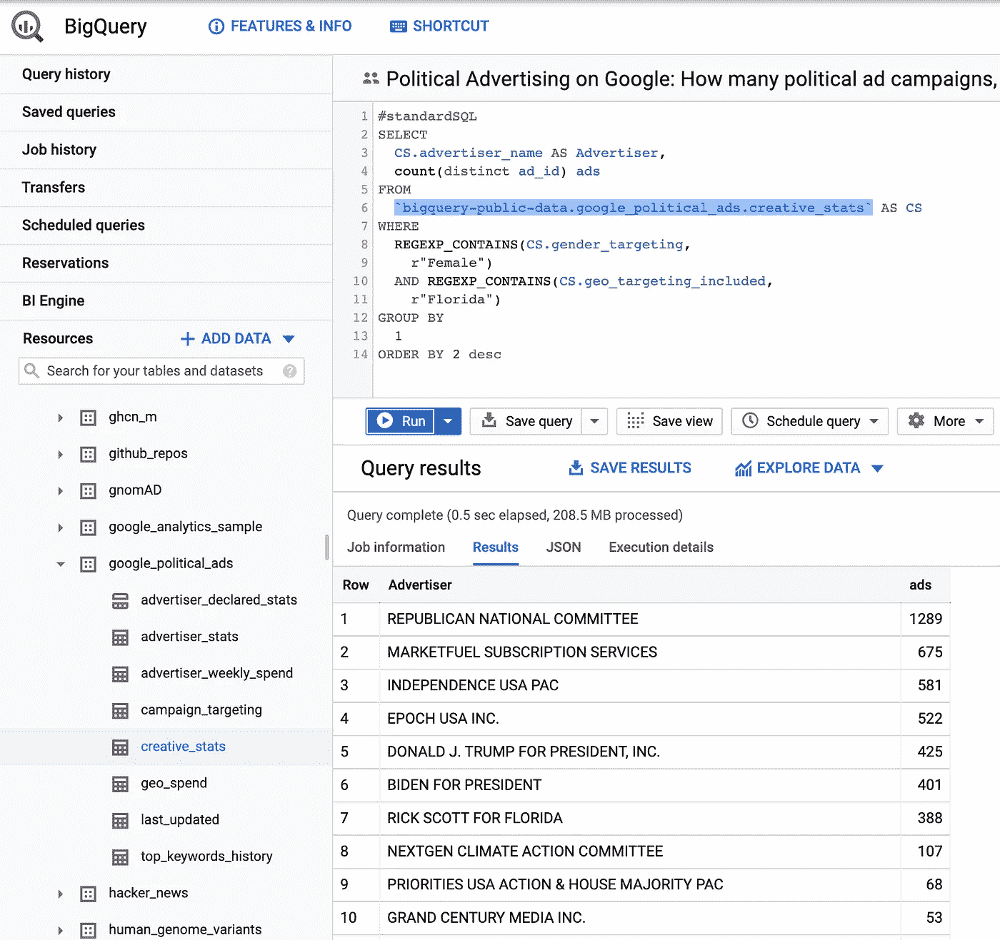
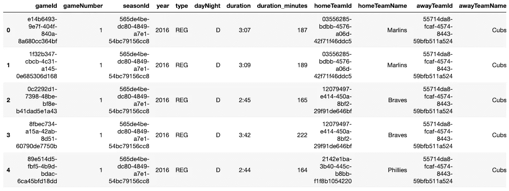

# 用谷歌的公共数据集升级

> 原文：<https://towardsdatascience.com/level-up-with-googles-public-datasets-5ffce0893ea0?source=collection_archive---------56----------------------->

## 将 Jupyter 笔记本电脑连接到万亿字节的数据


瓦西里·科洛达在 [Unsplash](/s/photos/hooray?utm_source=unsplash&utm_medium=referral&utm_content=creditCopyText) 上的照片

我记得我的第一个数据科学项目，分析一万部电影的 6.5MB 文件。从几个击键的数据中快速找到模式是很神奇的，很快我就开始寻找其他数据集进行分析。通过 Kaggle 并最终通过网络爬行产生独特的数据，我发现大多数可下载的数据集都很小(<1GB) and that collecting and working with large datasets required a different type of skill: data engineering.

Most aspiring data scientists only know how to analyze clean, comma separated files that fit on their RAM (usually <8GB). In practice, data science is much more unpredictable when you deal with terabytes of data in different formats from different data streams. So how does an aspiring data scientist gain exposure to big data?

To take you to big data, we will explore:

1.  Diving into Big Data with Google Cloud Public Datasets
2.  What is BigQuery?
3.  How to Connect Your Jupyter Notebook to BigQuery

# Diving into Big Data with Google Cloud Public Datasets

It turns out that Google has a repository of most publicly available data such as [空气质量](https://console.cloud.google.com/marketplace/product/openaq/real-time-air-quality?filter=solution-type:dataset&q=air quality)、[美国人口普查](https://console.cloud.google.com/marketplace/product/united-states-census-bureau/us-census-data?filter=solution-type:dataset&q=census&id=2c089839-2b4a-477a-962b-4a8b730d0a12)、 [Reddit](https://console.cloud.google.com/bigquery?project=fh-bigquery&redirect_from_classic=true&p=fh-bigquery&d=reddit_comments&t=2019_12&page=table) 、[航班](https://console.cloud.google.com/bigquery?project=fh-bigquery&redirect_from_classic=true&p=fh-bigquery&d=flights&t=ontime_201903_summary&page=table))。如果有一个公共数据集，谷歌可能会托管它，供你查询。更重要的是，新的数据集(即[新冠肺炎](https://console.cloud.google.com/marketplace/product/bigquery-public-datasets/covid19-dataset-list?filter=solution-type:dataset&q=covid&id=4a850823-3f83-48f5-92d1-01ba6f8ed81e))不断被添加和更新。

有了 BigQuery 上托管的数据，您可以轻松地查询数据，看看它是否有趣。例如，我可以查询并回答这个问题:“谷歌上有多少针对佛罗里达州女性的政治广告活动？”



探索谷歌公共数据集上的其他可用数据集！

# **什么是 BigQuery？**

BigQuery 是 Google 的无服务器数据仓库。获取数据很容易，因为**每月第一个 1tb 的查询是免费的**。正如一位 Spotify 工程师所说:


我喜欢 BigQuery 的是它的速度。将它的速度与超过 100 个公共数据集的存储库结合起来，我们可以快速分析数据，以确定它是否值得分析。

由于数据集托管在同一个数据仓库中，我们可以连接两个公共数据集来进行唯一的分析。例如，我们可以根据[天气预报](https://console.cloud.google.com/bigquery?project=cptsrewards-hrd&p=bigquery-public-data&d=noaa_gsod&t=gsod2015&page=table)来预测对[纽约出租车](https://console.cloud.google.com/bigquery?project=cptsrewards-hrd&p=bigquery-public-data&d=new_york_taxi_trips&t=tlc_yellow_trips_2015&page=table)的需求。谷歌甚至为此写了一篇不错的博文:[如何用谷歌大查询、公共数据集和 TensorFlow 预测需求](https://cloud.google.com/blog/products/gcp/how-to-forecast-demand-with-google-bigquery-public-datasets-and-tensorflow)。

# 如何将您的 Jupyter 笔记本连接到 BigQuery

既然我们已经找到了想要在 BigQuery 上分析的数据，让我们把它带到本地 jupyter 笔记本环境中。我们可以利用 BigQuery 的 API 将数据加载到 dataframe 中。

第一步是安装 BigQuery 客户端库，可以使用 pip 或 conda 来完成。

```
pip install --upgrade google-cloud-bigquery
```

或者

```
conda install -c conda-forge google-cloud-bigquery
```

接下来，我们需要为我们的 jupyter 笔记本创建一个服务帐户密钥，以便在 Google Cloud 上使用和验证。

1.  在云控制台中，转到[创建服务帐户密钥页面](https://console.cloud.google.com/apis/credentials/serviceaccountkey?_ga=2.206600659.1193354495.1593399490-1928542389.1549667178)
2.  从服务帐户列表中，选择新建服务帐户。
3.  在“服务帐户名称”字段中，输入一个名称(即 pythonBigQuery)
4.  从角色列表中，选择项目>所有者。您可以稍后使用云控制台查看和更改此字段。如果您正在开发生产应用程序，请指定更精细的权限。
5.  单击创建。一个 JSON 文件，包含下载到您计算机的密钥

下载 JSON 密钥后，我们可以验证 jupyter 笔记本以连接到 BigQuery。我们导入操作系统库，将我们的 Google 凭证设置为下载的密钥。如下面的笔记本所示，我现在可以将 BigQuery 表作为 dataframe 查询和检索，其中列名和数据类型都是从该表继承的！



df . head()for big query-public-data . baseball . schedules

Google 官方文档: [BigQuery API 客户端库](https://cloud.google.com/bigquery/docs/reference/libraries#cloud-console)

# 结论

谷歌公共数据集是探索大数据的良好开端。利用云计算和仓储，我们可以在几秒钟内探索万亿字节的数据。有了本地支持的 API，我们可以轻松地将 BigQuery 上的数据集成到我们的 jupyter 笔记本中！