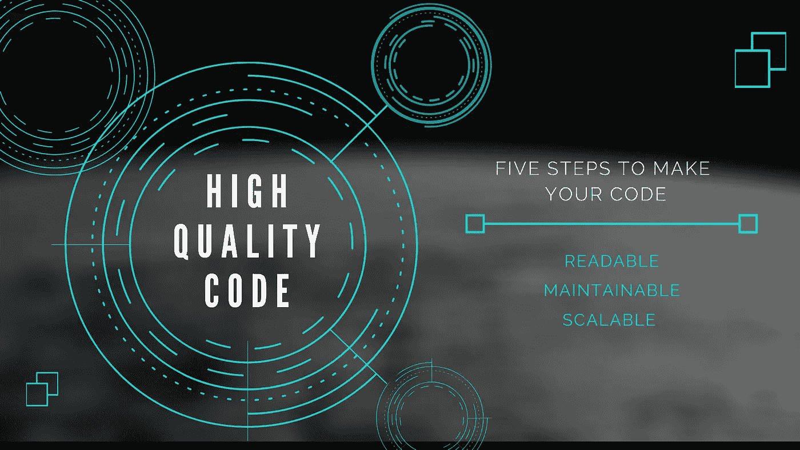
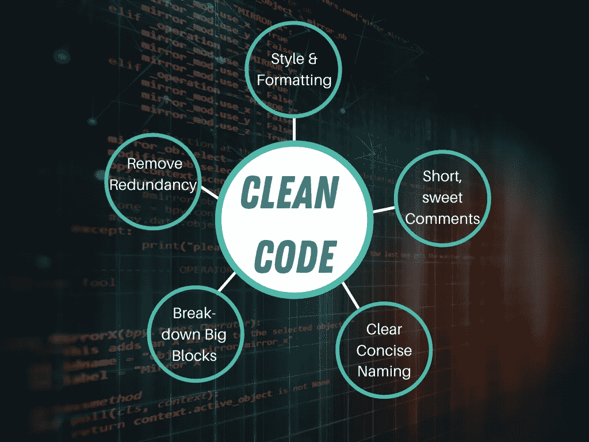

# 提升你的代码

> 原文：<https://towardsdatascience.com/level-up-your-code-e1424fff031d?source=collection_archive---------45----------------------->

## 编写干净、高质量代码的 5 个简单步骤

作者使用 [Canva](https://www.canva.com/) 拍摄的图片

> “任何傻瓜都能写出计算机能理解的代码。优秀的程序员会写出人类能理解的代码。”马丁·福勒

颂歌不总是程序员和计算机之间的对话；事实上，它通常是一组开发人员一起工作或单独工作来构建一个工作产品。通常，编写一段有效的代码并不是唯一的目标；相反，它是编写一段干净、可读、有效的代码。

## 什么是“干净代码”？

Clean code 是一种以读者为中心的代码编写风格，可以生成可读性强、易于维护的代码。编写不需要太多解释的干净代码(如果有的话)被认为是艺术。程序员通常在意识到他们编写的代码不仅仅是计算机要执行的代码后就开始编写干净的代码；其他人也可以阅读、扩展或构建它。编写干净的代码是每个专业程序员都应该努力获得的技能，这不是一件容易的事情，但最终，这绝对是值得努力的。

## 为什么干净的代码很重要？

在很多情况下，糟糕的代码会导致大公司和优秀产品的失败，如果他们的内部代码写得很清楚，这些产品会很棒。尤其是在今天，如果一个产品或应用程序运行不正常，公司可能会损失数百万美元的利润，更不用说客户和时间损失了。干净的代码，使任何代码库的开发和部署过程高效和顺利。

干净代码是包含以下特征的高质量代码:

*   ***可读性:*** 可读代码是一个编程新手和一个专业开发人员都能同等理解的代码。这是一种理解和使用起来并不耗时的代码。
*   ***可维护性:*** 如果代码写得很好，那么测试、发现 bug 并为每个从事代码基础工作的人修复它们就更容易了。
*   ***可伸缩性:*** 任何成功的产品都可能需要可伸缩性来保持成功，如果代码库是稳定的、干净的、写得好的，那么可伸缩代码和在其上扩展的过程将会更加简单。

# 编写干净的代码

作者使用 [Canva](https://www.canva.com/) 拍摄的图片

尽管“干净的代码”这个短语可能是主观的，我的意思是，并不是我们所有人对什么是干净的代码都有相同的理解。但是，可以使用一些技术来使代码看起来更好，读起来更舒服，伸缩更流畅。以下是我从 9 年多的代码编写经验中学到的 5 个步骤，教你如何在编写代码时遵循这些步骤，这将有助于你的代码更加整洁和高质量。

## 样式和格式

想想写任何一行代码，就像用英语或者其他口语写一个句子一样，长而复杂的句子更难理解；你可能需要看两遍或更多遍才能完全理解。代码也是如此，尽量让你的代码简洁明了，避免那些你认为会让你看起来像个编程巨星，却让其他人看不懂的超级复杂的语法。您还应该关心样式，这意味着编写的代码对于人眼来说很容易理解。这里有一个 Python 中的例子，说明了样式和格式是如何产生巨大影响的。

*代替这个:*

*写这个:*

今天几乎所有的编辑器都有*短绒*来帮助你写一个风格和格式都很好的代码。

Linters 是 IDE 的插件，可以帮助你发现小错误。例如变量名中的拼写错误、忘记了右括号、Python 中不正确的跳转、调用带有错误数量参数的函数。它们还可以帮助你处理风格不一致和危险的逻辑，这些会让你的代码看起来不太好。

## 命名

命名是编写干净代码的重要方面之一。确保您的方法、变量和其他自定义定义的名称是自描述的，并且易于理解，这是非常有益的，不仅对于那些将与您的代码进行交互的人，甚至对于作为代码作者的您也是如此。您会发现以后编辑和扩展会更容易。以下是一些帮助我提高代码可读性的命名技巧:

*   使用可以发音的名字。避免那些只会引起混乱的奇怪的名字。
*   不要在代码(函数或类)的各个位置用不同的词来指代同一个动作，比如在指代同一个内存交互时同时使用 ***【保存】*** 和 ***【存储】*** 。
*   命名函数时使用动词，命名变量、常数和类时使用名词。

## 分解大块

当你写代码的时候，尽可能的简洁。不可能设置一个数字来表示正确的块大小。然而，肯定有一个临界长度。如果你觉得你的代码太混乱或太长，那么是时候重组和重构它，也许把它分成更小的单独的代码文件。

## 移除冗余

您的代码应该只包含对代码功能有贡献的行，仅此而已。如果你写了一个测试函数，然后又写了一个更好、更有效的版本，删除旧的，不要对它进行注释。这会使代码看起来混乱。此外，使用内部的内置函数，而不是创建自己的函数，这只会让你的代码毫无理由地变得更长、更复杂。

如果您发现自己有多个嵌套的条件语句或循环，请重新编写代码以避免冗余嵌套，您可以使用保护子句、早期返回或函数式编程的某些元素来实现这一点。

## 评论

养成对代码写注释的习惯是非常好的。这是使代码更加清晰的一个很好的方法。然而，他们不是来详细解释你的代码的，把这些留给文档吧。你的评论应该甜蜜、简短、切中要点。为了方便起见，请使用注释来强调以下几点:

*   表达你对一个函数或一段代码的目标。
*   警告代码中可能的异常或错误。
*   强调函数或类的主要工作，或者代码的任何部分。

为了写出更好的评论，我总是提醒自己，评论不是来*给人*解释代码的；代码是用来*向计算机*解释注释的。

编写干净、高质量的代码不是一件容易的事情；这很有挑战性，好的方面是，这是可行的，只是需要练习。然而，有时编写干净的代码并不是一个选项或者是一个非常棘手的选项！

那是什么？

只要尽你所能让代码尽可能的干净和可读，记住，写代码是一种艺术，所以写一些让你自豪的艺术，人民会喜欢阅读。