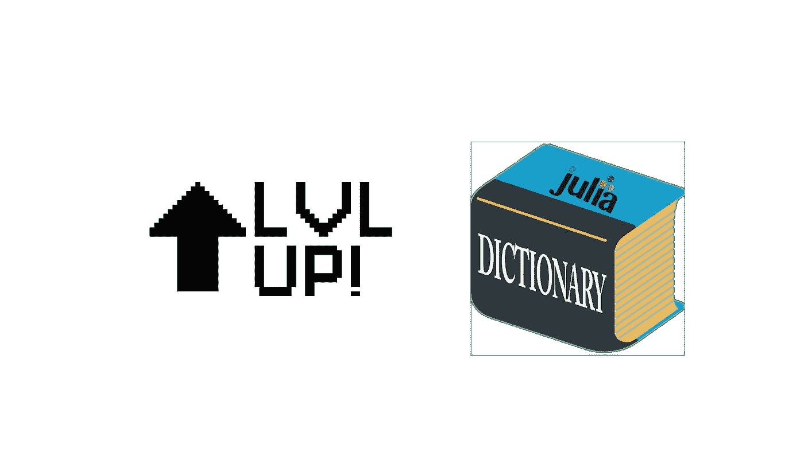
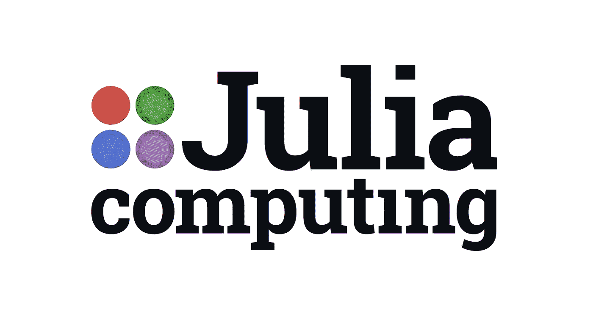
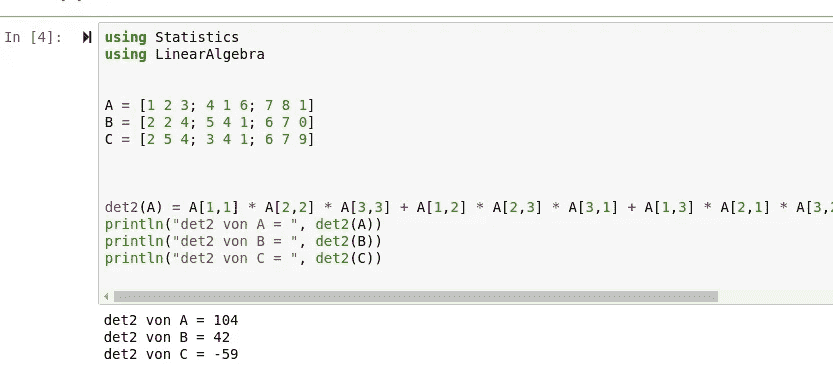
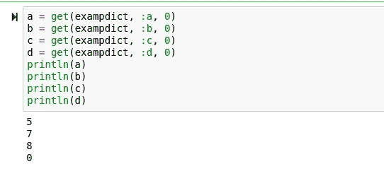
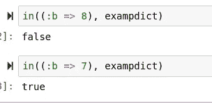

# 提升你的朱莉娅词典

> 原文：<https://towardsdatascience.com/level-up-your-julia-dictionaries-76f633ae2975?source=collection_archive---------41----------------------->

## 充分发挥 dict 数据类型的潜力！



(茱莉亚标志由[http://julia-lang.org/提供)](http://julia-lang.org/))

D ictionaries 不仅是 Julia 中最有用的数据类型之一，也是 Python 和 Nimrod 等许多类似语言中最有用的数据类型之一。字典对于数据科学家来说是一个特别有价值的工具，一旦你意识到这一点，这一点就会更加明显

> 数据帧。JL 的数据框架只是字典。

字典经常被忽视，被视为相对简单的数据类型，只包含数组和键，但我认为这是一个错误。我认为这是一个错误，因为 Julia 字典非常强大，用途极其广泛，可以毫不费力地用于从数据帧到 API 返回的许多事情。

> [笔记本](https://github.com/emmettgb/Emmetts-DS-NoteBooks/blob/master/Julia/Level%20up%20your%20JL%20dictionaries.ipynb)

# 句法表达



Julia 最酷的特性之一是能够使用语法表达式。这对于字典来说没有什么不同，因为您可以使用语法表达式用字典做一些非常酷的事情。这对于统计计算来说真是太棒了，因为它可以用一些非常简洁的语法提供一个简单且性能更好的选项。我个人喜欢使用矩阵乘法的语法表达式:

```
det2(A) = A[1,1] * A[2,2] * A[3,3] + A[1,2] * A[2,3] * A[3,1] + A[1,3] * A[2,1] * A[3,2] - A[3,1] * A[2,2] * A[1,3] - A[3,2] * A[2,3] * A[1,1] - A[3,3] * A[2,1] * A[1,2]
```



尽管我热爱矩阵，但我认为在字典上使用它的能力可能比在矩阵上使用它更有价值。我发现这种方法的一个很好的用途是在我目前正在开发的图形库内部，在那里我使用线程和字典索引进行迭代，而不是使用双重迭代。

> 这使得它快了很多。

# 获取()

为了证明使用这种方法的合理性，我将首先向您展示一个场景。假设我们刚刚使用 get 请求从 API 中提取了一堆数据，我们希望在脚本运行时持续提取这些数据，但不会监控这些脚本。在这种情况下，我们会想尽一切办法避免访问数据中不存在的键，因为那样会终止脚本并导致异常。

为了减轻这种情况，我们可以使用 get()方法为我们的脚本创建一个缺省值，以便在我们要搜索的索引不在字典中的情况下使用。该方法采用 3 个参数；我们的字典，exampdict，我们的键，在这个例子中是:a，以及我们的缺省值，如果在字典中找不到这个键，我们可以使用这个缺省值。

```
exampdict = Dict(:a => 5,:b => 7,:c => 8)
a = get(exampdict, :a, 0)
```



如您所见，即使:d 因为数据不在字典中而无法访问，我们仍然相应地得到了所有的值，以及 d 的默认值。

# 在()

使用 in()方法，我们可以更快地检查一个键或一对键。这将返回一个布尔值，并带有两个参数，我们想要搜索的键和我们想要搜索的字典。

```
in((:b => 8), exampdict)
```



# 过滤器()

由于 Julia 的多重调度，filter()方法可以用在字典键上，也可以用在其他任何地方。使用 filter()，我们基本上可以从数据框架中过滤掉任何可以表示为条件的东西。在这里，我结合条件来检查以字母 K 开头并且值小于 4 的键。

```
strdict = Dict("Orange" => 3, "Kiwi" => 2, "Kayak" => 5)
filter(tuple -> startswith(first(tuple), "K") && last(tuple) < 4, collect(strdict))
```


不用说，filter()当然是一个非常有用的方法！这种方法可以用于任何事情，从只从字典中获取特定的键到删除丢失的值和低于特定数字的值。

# 地图键

另一个从茱莉亚基地归来的帅魔是 map()。当然，map 在各种语言中都有使用，并且也证明了它的实用性。但是，在 Julia 中，我们可以映射字典的键和值，例如，我们可以映射所有的大写键:

```
map(uppercase, collect(keys(dict)))
```

这在许多情况下肯定是有用的，但在我看来肯定比 filter()强！

# 结论

在 Julia 中，你可以用字典做很多很酷的事情。在我看来，他们确实是经过深思熟虑的！Julia 的一个优点是，由于多态性，您可以在语言中使用的几乎每种类型上使用 Julia 的 10 个标准函数，这使得语言中的学习方法及其操作变得非常简单。希望这些提示有用，并派上用场，也许使用这些提示甚至会提高你的朱莉娅词典！