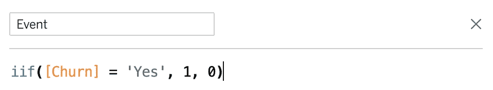
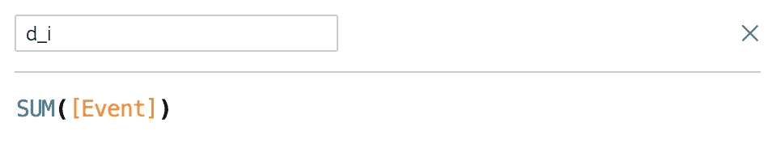
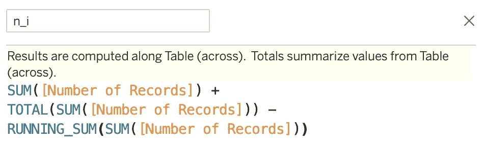
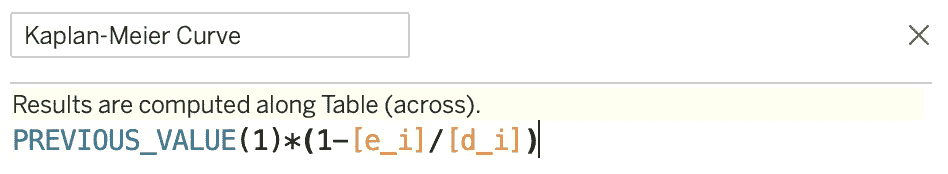
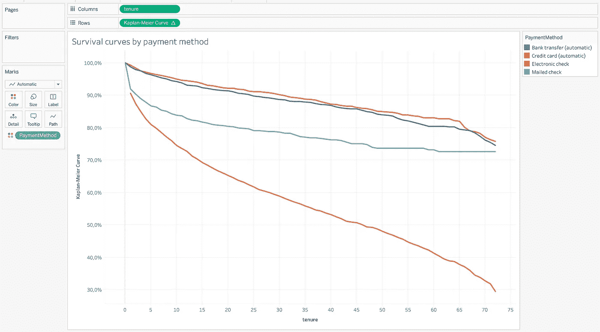
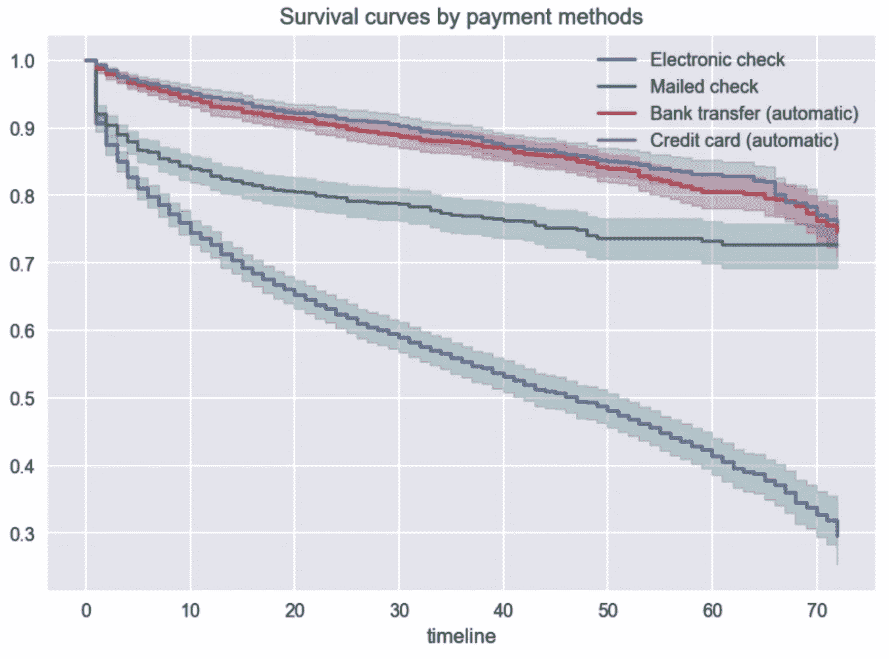
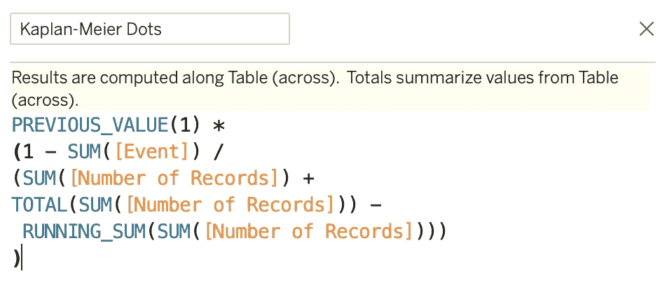
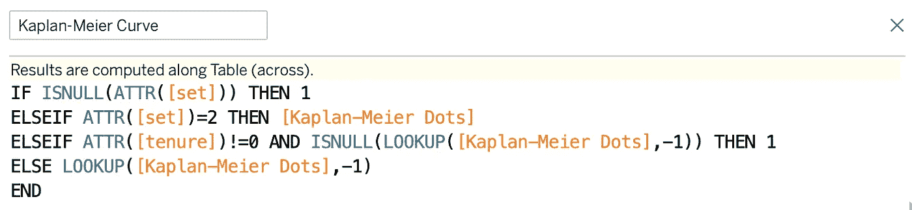
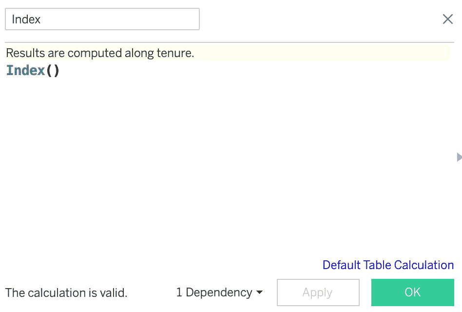
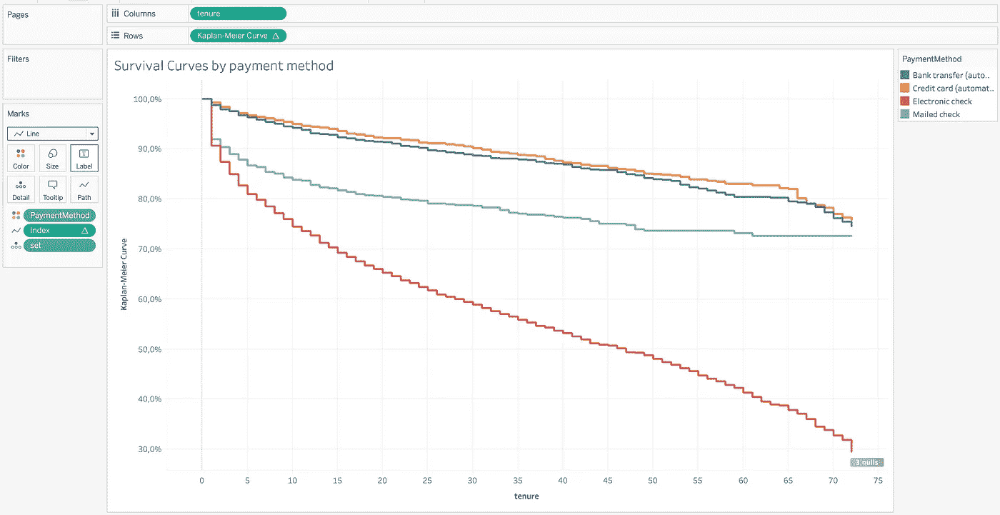

# 用 Tableau 提升你的 Kaplan-Meier 曲线

> 原文：<https://towardsdatascience.com/level-up-your-kaplan-meier-curves-with-tableau-bc4a10ec6a15?source=collection_archive---------26----------------------->


来源: [Unsplash](https://unsplash.com/photos/Ijx8OxvKrgM)

## 方便访问整个公司的生存分析！

在[之前的一篇文章](/introduction-to-survival-analysis-the-kaplan-meier-estimator-94ec5812a97a)中，我展示了我们如何使用 Python 创建卡普兰-迈耶曲线。尽管我热爱 Python 和编写代码，但可能有一些替代方法有其独特的好处。进入 Tableau！


[来源](https://www.pcmag.com/reviews/tableau-desktop)

Tableau 是一个商业智能工具，用于在来自大量来源的数据基础上创建优雅的交互式可视化(你会惊讶地发现有这么多不同的来源！).为了使定义更简短，Tableau 用于构建仪表板。

那么，为什么数据科学家会对使用 Tableau 而不是 Python 感兴趣呢？当用 Python 创建一个包含生存分析练习结果的笔记本/报告时，读者将总是限于:

*   视觉化图像的创造者在想什么，
*   创建报告时有哪些数据可用。

换句话说，读者没有多少自由去探索其他的角度。此外，如果公司中有人在几年后偶然发现了该报告，使分析保持最新的唯一方法是找到数据科学家，让他们重新运行笔记本并生成另一份报告。绝对不是最好的情况。

这就是基于 Tableau(或其他商业智能工具，如 PowerBI、Looker 等)的解决方案。)闪耀。由于可视化是直接在数据源之上构建的，因此可视化将与数据一起更新。数据科学家的工作量减少了！

另一个额外的好处是可以包含一些过滤器，因此读者可以尝试探索不同的数据子集。根据经验，这是产品负责人经常使用的功能，他们希望深入了解细节，同时不希望不断地向数据人员提出新过滤器或功能的另一个请求。又赢了:)

最后，通过使用这样的工具，分析师使数据和分析的访问民主化，因为基本上公司中的任何人都可以访问仪表板，并尝试回答他们自己的问题或验证他们的假设。

在这个介绍之后，让我们直接进入重新创建我们在[上一篇文章](/introduction-to-survival-analysis-the-kaplan-meier-estimator-94ec5812a97a)中创建的完全相同的卡普兰-迈耶曲线。我们再次使用电信客户流失数据集，在分析之前几乎不需要额外准备。如果你需要复习 Kaplan-Meier 估计量，请参考那篇文章，因为我们这次不讨论理论。此外，我们假设一些基本的 Tableau 知识。

**注** : Tableau 是一个商业软件，需要许可证。您可以按照这里的说明[获得 14 天的试用期。](https://www.tableau.com/products/trial)


图片来自 [Pixabay](https://pixabay.com/?utm_source=link-attribution&utm_medium=referral&utm_campaign=image&utm_content=3185170) 的[穆罕默德·哈桑](https://pixabay.com/users/mohamed_hassan-5229782/?utm_source=link-attribution&utm_medium=referral&utm_campaign=image&utm_content=3185170)

# 方法 1:简单模式

第一种方法被称为 easy，因为它有利于速度和简单性，同时也带来了一些缺点。首先，我们从一个文本文件中加载数据(此处[可用](https://github.com/erykml/medium_articles/blob/master/data/telco_customer_churn.csv))。

为了在 Tableau 中进行生存分析，我们需要以下变量:

*   事件发生时间-表示为从加入样本到发生感兴趣的事件或审查所经过的时间段(例如，几天或几个月)。
*   感兴趣的事件-用二进制变量表示，其中 1 表示事件已经发生，否则为 0。
*   附加分类变量-用于过滤和/或分组。

`tenure`变量不需要任何准备，因为它已经表示了自注册电信公司的服务以来的月数。但是 Churn 变量表示为是/否字符串，因此我们需要使用计算字段将其编码为二进制:



要创建该字段，右击左侧变量选择器中的`Churn`变量(数据选项卡)，选择创建- >计算字段。

下一步，我们将创建一个新的计算字段`d_i`，它表示一段时间内发生的事件数量:



我们使用的变量名称对应于 Kaplan-Meier 估计量公式中的元素。

我们创建的下一个变量将是在给定时间用于计算风险函数的分母。它表示自上一个时间段以来的观察总数:



正如您可能已经猜到的，变量`Number of Records`是一个用于统计观察值的辅助变量。为此，较新版本的 Tableau 基于数据源的名称创建一个变量。然而，您可以通过创建一个计算字段并将`1`放入字段定义中来轻松地手动创建这个变量。最后，我们将卡普兰-迈耶曲线定义为:



更正:图片中的公式应该写明 PREVIOUS _ VALUE(1)*(1-[d _ I]/[n _ I])。

在这里，生存的概率被定义为`1 - hazard function`。

所有的积木都准备好了。现在，我们将`tenure`放在 x 轴上，将`Kaplan-Meier Curve`放在 y 轴上，将曲线格式化为百分比，添加图块并将`PaymentMethod`变量放置为颜色。这样，我们创建了以下可视化:



这与我们上次使用`lifelines`获得的结果非常相似:



一些快速观察:

*   Tableau 中获得的存活曲线或多或少是直的，没有特征性的阶梯结构，
*   没有置信区间，因为它们的计算没有 Tableau 那么简单。

使用 Tableau，我们可以很容易地向可视化添加一些额外的过滤器，如群组日期、年龄或任何可用的分类变量。

# **方法#2:正常模式**

在这种方法中，我们将着重于再现卡普兰-迈耶曲线特有的阶梯状形状。这种方法被称为正常模式，因为它需要更多的准备。

对于附加的数据预处理，我们需要完成两个步骤。首先，在包含电信客户流失数据的 CSV 文件中添加一个名为`link`的列。该列应该用一个`‘link’`字符串填充。事实上，这个字符串可以是任意的，就像列名一样。重要的是一致性，但一切很快就会明朗。第二步是创建一个新的 CSV 文件(我们称之为`blending.csv`，它包含以下内容:

```
link, set
link, 1
link, 2
```

是的，差不多就是这样。为了您的方便，我将两个文件都存储在我的 [GitHub](https://github.com/erykml/medium_articles/tree/master/data) 中。

有了这两个文件，我们将它们加载到 Tableau 中，并使用`link`变量连接这些表。你可以在下图中看到这一点。


由于这是“正常模式”，我们将同时结合几个步骤，创建一个名为`Kaplan-Meier Dots`的计算字段:



您可以从“简易模式”中轻松识别该字段的内容，这一次，我们将所有内容都放入一个字段中。这样做之后，新的部分就来了。我们将`Kaplan-Meier Curve`定义为:



这个复杂的公式将使我们能够得到曲线的阶梯形。最后，我们还需要一个辅助变量:



进行此操作时，请点击*默认表格计算*，并指定沿着`tenure`计算结果。

最后，我们有了创建曲线的所有构件。我们的设置与“简单模式”相似，不同之处在于将`Index`作为路径，将`set`作为细节。为了重新创建 Python 中的曲线，我们再次使用`PaymentMethod`作为颜色。



在上图中，我们使用 Python 中的`lifelines`库精确地重新创建了之前获得的曲线。这肯定需要更多的工作，但最终会有回报。

我们还可以使用`Kaplan-Meier Dots`来形象化事件沿着曲线发生的过程。在这种情况下，我认为这只会使可视化变得混乱。它更适合于较小的数据集。

我们可以通过添加一些过滤器/拆分来进一步改进仪表板，然后通过公司的报告门户(在这种情况下，是 Tableau Server 的一个实例)与我们的同事共享它。

# 结论

在本文中，我解释了使用 Tableau 等商业智能工具进行生存分析的潜在好处，并展示了如何使用 Kaplan-Meier 曲线创建仪表板。

通常情况下，没有免费的东西，这种方法也有一些缺点:

*   计算置信区间肯定更难，需要相当大的努力。
*   在 Tableau 中，没有简单的方法来执行对数秩检验以比较不同的生存曲线(除非我们使用 Tableau 中的 R，但这可能是未来文章的一个想法)。
*   如果向数据中添加新的功能，例如，新的客户细分或每个观察的另一个类别，这仍然需要分析师做一些工作来添加到已经存在的仪表板中。然而，大多数情况下这并不经常发生，或者只需要很少的额外工作。

我希望你喜欢这种可视化卡普兰-迈耶曲线的替代方法。一如既往，我们欢迎任何建设性的反馈。你可以在推特上或者评论里联系我。

如果您喜欢这篇文章，您可能也会喜欢这个系列中的其他文章:

[](/introduction-to-survival-analysis-6f7e19c31d96) [## 生存分析导论

### 了解生存分析的基本概念，以及可以用来做什么任务！

towardsdatascience.com](/introduction-to-survival-analysis-6f7e19c31d96) [](/introduction-to-survival-analysis-the-kaplan-meier-estimator-94ec5812a97a) [## 生存分析导论:卡普兰-迈耶估计量

### 了解用于生存分析的最流行的技术之一，以及如何用 Python 实现它！

towardsdatascience.com](/introduction-to-survival-analysis-the-kaplan-meier-estimator-94ec5812a97a) [](/introduction-to-survival-analysis-the-nelson-aalen-estimator-9780c63d549d) [## 生存分析导论:尼尔森-艾伦估计量

### 了解如何使用非参数方法来估计累积风险函数！

towardsdatascience.com](/introduction-to-survival-analysis-the-nelson-aalen-estimator-9780c63d549d) 

# 参考

[1] Kaplan Meier 生存测试完整解决方案(无 R) —此处可用