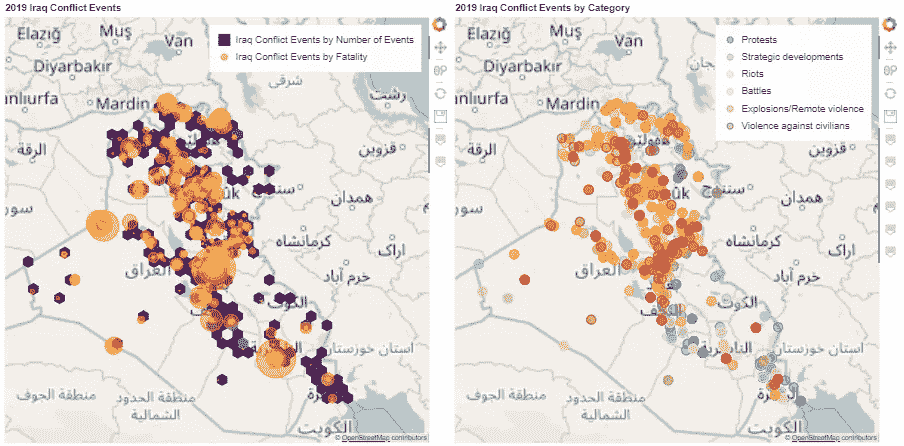
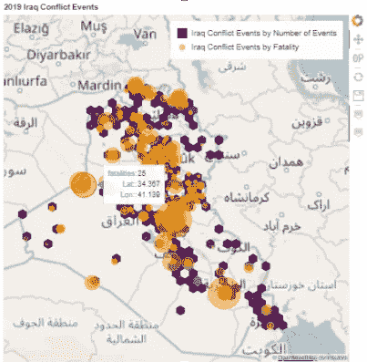
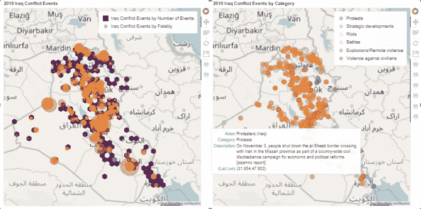

# 提升可视化效果:使用 Python 和散景制作交互式地图

> 原文：<https://towardsdatascience.com/level-up-your-visualizations-make-interactive-maps-with-python-and-bokeh-7a8c1da911fd?source=collection_archive---------11----------------------->

## 学习用 Python 制作交互式热图、气泡图和分类图

让我们面对现实吧，数据科学家们:我们的客户喜欢仪表盘。为什么不呢？可视化我们的数据有助于我们讲述一个故事。可视化将数千行数据转化为引人注目的美丽故事。事实上，仪表盘可视化已经变得如此普遍，以至于几乎每份简历都至少有一个(也许几个)仪表盘项目。怎样才能让自己的脱颖而出？条形图和时间序列折线图是不够的。

地图帮助我们讲述一个故事！

输入:地理数据。什么是地理数据？广义来说，它是任何你可以放到地图上的东西。它有纬度/经度坐标吗？存在于地理空间吗？那是地理数据。

地图帮助我们讲述故事。想想你最喜欢的一些小说——其中有多少书中有地图？地图让我们沉浸在故事的环境中；在这种情况下，你的客户的数据的故事。

本文将教你处理三种类型的地图:热图、气泡图和分类图。在本教程结束时，您将成为一名空间数据向导，可以将您的仪表板可视化效果与其他工具区分开来。让我们开始吧！

## 笔记本

要获得与这个项目相关的完整代码，并查看交互式图例和悬停工具提示，请参见与这个项目相关的 [Jupyter 笔记本](https://colab.research.google.com/drive/1G2QGZO78CRMRNTXqcct48pBaSLLLhpK_?usp=sharing)！

## 我们的数据

出于本教程的目的，我们将使用来自[武装冲突地点事件数据库(ACLED)](https://acleddata.com/#/dashboard) 的数据。我敦促你在这个项目中尝试使用你自己的数据！如果这对您来说听起来太复杂，您可以从与本文相关的 [github repo 中获得我使用的数据](https://github.com/ConnerBrew/Iraq-Conflict-Data)。

## 简短的免责声明:

本文不会对数据集进行探索性分析；我将假设您已经熟悉基本的可视化技术和术语，以及与 Bokeh、Numpy 和 Pandas 库相关的基本概念。要查看我对数据的探索性分析，请参见[本笔记本](https://github.com/ConnerBrew/Iraq-Conflict-Data/blob/master/Iraq_Conflict_Data_Exploratory_Analysis.ipynb)。

如果这是你第一次使用散景，试试他们的用户指南中的一些初学者教程。

# 让我们开始吧！

## 导入模块

我们将在这个项目中使用所有的散景、熊猫和 Numpy。

## 加载数据

您可以在此访问用于本项目[的数据。使用 pandas *'read_csv()'* 方法导入数据。您需要将*纬度*和*经度*列设为**浮点**类型，以便我们稍后可以将它们转换为 web 墨卡托单位。无论你选择哪一列来定义你的气泡图的半径，都应该是一个 **int** 或 **float** 类型。在本演示中，是*死亡人数*列。](https://raw.githubusercontent.com/ConnerBrew/Iraq-Conflict-Data/master/conflict_data_irq.csv)

## 初始化地图对象

像许多 Python 库一样，Bokeh 非常面向对象。在绘制数据之前，我们必须以散景图的形式初始化一个地图对象。使用散景制作地图时需要考虑的一个重要因素是散景使用**墨卡托单位**进行绘图。大多数空间数据可能以经纬度坐标的形式出现(通常称为 wgs84)。首先，我们将把这些坐标转换成墨卡托坐标，然后我们将为我们的数据初始化绘图对象。

要初始化绘图对象，我们必须定义地图可见性的 x 和 y 范围或范围。我希望地图的范围与我稍后将可视化的六边形和气泡的大小成恒定的比例，所以我使用一个变量来建立地图比例。为此选择的数字是任意的——我只是简单地摆弄了几个不同的数字，直到我对缩放级别满意为止。将它设置为一个变量使得以后更改非常容易！

此外，您还必须为您的地图选择一个切片提供商。我更喜欢开放的街道地图(OSM)，但你可以在这里找到完整的 Bokeh 支持的地图区块列表。将地图级别设置为“underlay ”,如果使用 Jupyter 笔记本，使用*“output _ notebook()”*方法在线显示地图。

## 创建地图生成函数

首先，我们将为 hexbin 映射创建一个函数。Hexbins 在数学上比大多数标准热图更精确，尤其是对于以椭圆形式呈现的数据或地理精度范围较低的数据。它们还有视觉上吸引人的额外好处！您还会注意到，我创建了一个悬停工具，它将显示每个六边形中的项目数以及与每个六边形相关联的 q，r 坐标。

接下来，我们将编写一个函数来创建气泡图。气泡图有助于描述事件的规模。在这种情况下，气泡的半径将与每个事件造成的死亡人数成比例-这种类型的地图也非常适合描绘天气事件、疫情案例和其他标量数据集。

## 来看看我们的作品吧！

现在只需将您的参数输入到您创建的函数中！请注意，在我编写的函数中，我设置了一些默认参数，以使调用函数更容易。

一旦你的情节出现在窗口中，尝试用鼠标悬停在它上面！当您将鼠标悬停在地图数据上时，除了信息性的工具提示之外，您还应该看到地图数据会改变颜色。尝试单击图例中的条目来打开和关闭地图图层！

## 为什么是函数？

为了便于重复使用，我们使用函数来创建地图。将来，如果我们有想要使用气泡图或热图绘制的数据，我们可以重用这些相同的函数，而不是完全重写代码。使用函数完成常见的任务是一个很好的习惯，尤其是如果你在一个团队中工作，团队成员可能会经常使用彼此的代码！

## 分类数据的交互式图例

您可能已经注意到，在上面的地图中，您可以通过单击图例中的项目来切换图层可见性。怎样才能更好的利用这个特性呢？接下来，我们将分类显示我们的数据。对于这个数据，我将使用*事件类型*。请注意，下面的代码不是为最大效率或可重用性而设计的；而是为了可读性。初学者应该能够阅读和理解接下来的几个步骤。如果你是更高级的，试着写一个函数，使这个情节更可重用！

首先，让我们初始化一个新的绘图对象。

有许多方法可以完成下一步，但是分类变量的每个因素都需要单独绘制到它自己的级别。在这段代码中，我为每个因子初始化了空列表，并将附加与每个类型相关的信息。

对于每个空列表，迭代器在数据帧中搜索该类型的事件，并在列表中附加诸如 x 和 y 坐标、纬度/经度坐标以及其他描述性信息。如果您选择这种方法，您将不得不对每个空列表都这样做。您也可以将迭代器嵌套在一起来实现这一点，但是出于演示的目的，我选择编写每个单独的代码块来提高代码的可读性——如果不大量使用注释，嵌套迭代器通常很难理解。

一旦列表中填充了与每个类别相关的信息，每个列表都会作为我们之前创建的绘图对象的一个单独的层进行迭代绘图。我们这样做的原因，而不是一次绘制所有数据，是为了增强交互式图例的切换能力。现在，在生成的地图绘图中，用户可以单击图例中的不同类别，按事件类型过滤数据。

使用 Bokeh 的 *'show(row())'* 方法在仪表板上同时显示两幅地图。佩服你的作品！尝试将鼠标悬停在地图条目上以获取更多信息，并单击图例以过滤显示内容。就是这样！

## 摘要

现在，您可以在散景中绘制地图，并创建有用的交互，让您的客户或顾客从他们的空间数据中获得最大的洞察力。您学习了如何创建 hexbin 热图、气泡图和交互式分类图。通过将这些技能与其他数据可视化技术相结合，您将准备好为您的下一个数据科学项目创建视觉上令人惊叹且有用的仪表板可视化！