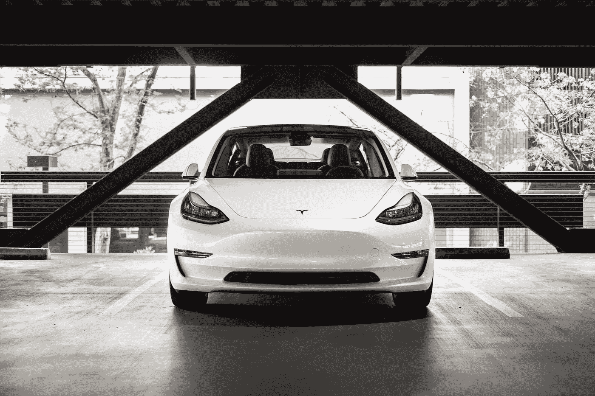
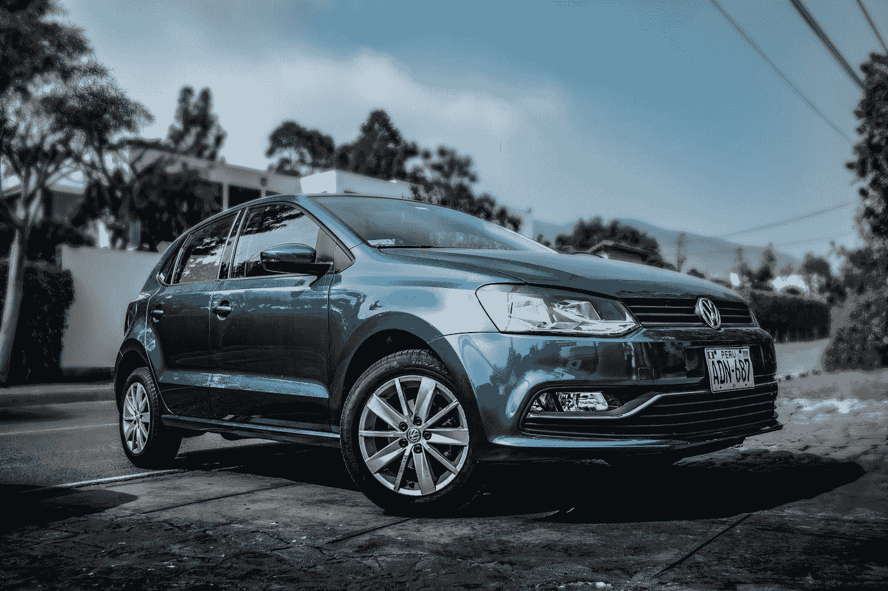
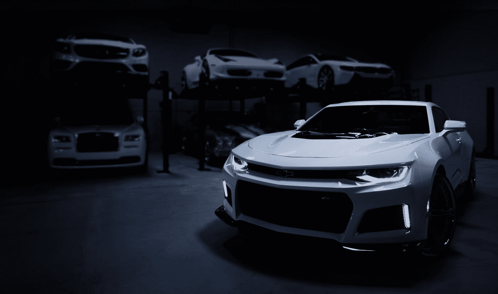

# 解释自动驾驶汽车的等级

> 原文：<https://towardsdatascience.com/levels-of-self-driving-cars-explained-24454463b8eb?source=collection_archive---------36----------------------->

## 定义自主性的 6 个层次及其重要性

查理·迪茨在 [Unsplash](https://unsplash.com?utm_source=medium&utm_medium=referral) 上的照片

当你听到自动驾驶汽车时，你的脑海中会浮现出什么形象？这是一辆很普通的车，但允许你有时松开方向盘，也许可以自己停车？或者是一个未来的卧室，你可以在那里看电影和放松，而汽车将为你做所有的驾驶？

嗯，没有正式的定义。所以，汽车工程师协会的人给我们提供了一个如何评价汽车的便捷指南。

但是这有什么关系呢？难道只是在不需要的时候随意的练习分类？

事实证明，它可能比我们预期的更有用。美国政府采用了 SAE 自动化水平。这意味着它可以在未来用于管理特定级别车辆的生产和测试。

不仅如此，它还可以用于标记车辆和确定保险费率。毕竟，让汽车自动驾驶并不能让它免于事故。

# 0 级

照片由[丹金](https://unsplash.com/@danielcgold?utm_source=medium&utm_medium=referral)在 [Unsplash](https://unsplash.com?utm_source=medium&utm_medium=referral) 上拍摄

这个级别可能描述了你现在正在使用的汽车。司机全权负责驾驶汽车，基本上不涉及自动化。

它可能包括一个接近警告系统来帮助你停车。但是，它仍然需要用户干预才能真正停止。

这个级别的汽车无法在老式巡航控制之外自动驾驶。

# 一级

何塞·卡巴贾尔在 [Unsplash](https://unsplash.com?utm_source=medium&utm_medium=referral) 上拍摄的照片

接下来是第一级。如果汽车能够根据从周围环境收集的信息在某种程度上控制自己，它就属于这一类。

所以，像车道辅助这样受欢迎的功能，当你的车开始有点漂移时，可以帮助你回到车道上。或者是基于雷达的巡航控制，它会根据车前的情况自动减速并恢复到之前的速度。

这些小的辅助技术将会使你的车达到 1 级。

# 第二级

Meik Schneider 在 [Unsplash](https://unsplash.com?utm_source=medium&utm_medium=referral) 上拍摄的照片

这里有一些汽车可以在特定的情况下完全靠自己驾驶，通过转向和操控加速，而不是只做其中一项。

如果你有一个更先进的自动巡航控制系统，也可以将汽车向左或向右移动。或者也许你有一个自动泊车功能，可以在没有你的帮助下将你的车挤进一个狭小的停车位。这是适合你的类别。

请记住，尽管这种程度的自动驾驶汽车仍然需要驾驶员始终保持专注，并随时准备干预。

# 第三级

由[彼得·布鲁姆菲尔德](https://unsplash.com/@peterbroomfield?utm_source=medium&utm_medium=referral)在 [Unsplash](https://unsplash.com?utm_source=medium&utm_medium=referral) 上拍摄

现在，我们开始了一些有趣的事情。3 级汽车能够根据驾驶员选择的目的地沿正常道路和特定路径行驶。

应该很棒吧。不完全是。这些汽车没有有意义的故障保险。

这让他们处于一种奇怪的中间状态。制造自动驾驶汽车的全部目的是增加安全性，并允许驾驶员在路上做其他有意义的任务。

然而，3 级汽车应该仍然有人类司机，如果出现问题，他们可以立即干预。这意味着，如果你的全自动驾驶汽车在你看电影时遇到了它无法独自解决的情况，这种情况可能不会有好结果。

因此，许多汽车制造商试图直接跳到第四级也就不足为奇了。

# 四级

Bram Van Oost 在 [Unsplash](https://unsplash.com?utm_source=medium&utm_medium=referral) 上拍摄的照片

与 level 3 类似，这些汽车使用人类驾驶员作为自动防故障装置，但它足够智能，可以自行处理某些棘手的情况。这意味着 4 级汽车可以被设计成完全处理某些任务或在有限的地理区域内行驶。

它仍然需要人类驾驶员来处理过于复杂的情况，比如在繁忙的高速公路上进行艰难的合并。最大的区别是，如果这种级别的汽车遇到它自己无法处理的情况，它必须能够通过停车来安全地中止驾驶，直到里面的人可以接管。

目前，谷歌的自动驾驶 [Waymo](https://www.theverge.com/2019/12/9/21000085/waymo-fully-driverless-car-self-driving-ride-hail-service-phoenix-arizona) 车队包含 4 级车辆。这意味着它们可以在没有人的情况下运行，但是它们被限制在特定的位置。现在，他们位于凤凰城内。

福特计划在 2022 年之前制造自己的[商用自动驾驶汽车](https://techcrunch.com/2020/04/28/ford-postpones-autonomous-vehicle-service-until-2022/)，由于疫情的原因，时间表略有变动。

# 第 5 级

照片由[梅丽莎·乔恩](https://unsplash.com/@melissamj?utm_source=medium&utm_medium=referral)在 [Unsplash](https://unsplash.com?utm_source=medium&utm_medium=referral) 拍摄

这是自动驾驶车辆的圣杯。一辆在转向时能控制一切的汽车。它根本不需要驾驶员的任何干预。

更疯狂的是，大多数 5 级概念车连方向盘都没有。它应该能够处理人类会处理的任何情况。理论上，它应该能够做得更好，比人类司机更安全。

尽管像英伟达和奥迪这样的公司目前正在研究第 5 级汽车和所需的技术，但还不清楚这何时会成为现实。

不仅公众必须相信自动驾驶汽车会从头到尾安全地载着他们，不会把他们推下悬崖。政府对这类汽车的监管也存在重大问题。

# 结论

完全自动驾驶的汽车还没有出现，很难定义这些汽车应该能够做什么。SAE 量表允许我们更好地定义当前的发展水平。它还可以帮助监管此类车辆及其所需的测试。

它还有助于突出与每个级别相关的问题，以及要真正实现完全自动驾驶汽车必须做些什么。

# 参考

[1] SAE International 发布了自动驾驶车辆“驾驶自动化水平”标准的更新视力表。(2018).于 2020 年 10 月 7 日从[https://www . SAE . org/news/press-room/2018/12/SAE-international-releases-updated-visual-chart-for-its-% E2 % 80% 9 clevels-of-driving-automation % E2 % 80% 9D-standard-for-self-driving-vehicles-vessels](https://www.sae.org/news/press-room/2018/12/sae-international-releases-updated-visual-chart-for-its-%E2%80%9Clevels-of-driving-automation%E2%80%9D-standard-for-self-driving-vehicles)

[2]k .科罗塞克(2020 年)。福特将自动驾驶汽车服务推迟至 2022 年。检索 2020 年 10 月 07 日，来自[https://TechCrunch . com/2020/04/28/Ford-deflates-autonomous-vehicle-service-until-2022/](https://techcrunch.com/2020/04/28/ford-postpones-autonomous-vehicle-service-until-2022/)