# 利用 Chrome 开发工具进行动态网页抓取

> 原文：<https://towardsdatascience.com/leverage-chrome-dev-tools-for-dynamic-web-scraping-2d3f7703ea4a?source=collection_archive---------12----------------------->


奥斯曼·拉纳

## 如何利用 ChromeDev 工具

所以你有一个你想刮的网站？但是不一定知道使用什么包或者如何进行这个过程。这是常见的，当第一次开始网页抓取。了解如何有效地从网站上获得你想要的东西需要时间和多个脚本。

在这篇文章中，我们将通过规划一个网页抓取脚本的过程。

# 在本文中，您将了解到

1.  了解网页抓取的工作流程
2.  如何快速分析一个网站进行数据提取
3.  如何利用 Chrome 工具进行网页抓取

# 了解网页抓取的工作流程

有三个关键领域要考虑时，寻找做网页抓取

1.  **视察网站**
2.  从页面中规划您需要的数据及其选择器/属性
3.  编写代码

在本文中，我们将重点检查网站。这是网络抓取的第一步，也是最重要的一步。这也是最少被谈论的，这就是为什么你在这里读这篇文章！

## 1.数据是在一个页面上，几个页面上还是通过页面的多次点击？

当你第一次想到要从中提取数据的网站时，你会对你想要的数据有所了解。

您可以想象，一个页面上的信息是最简单的，代码必然会更简单，而嵌套的信息页面会产生更多的 HTTP 请求，结果代码会更复杂。了解这一点有助于计划进行清理需要什么类型的函数。

## 2.网站是怎么搭建的？Javascript 的使用率有多高？

在这个过程的早期，了解网站是如何建立的是至关重要的一部分。这通常决定了刮擦的难易程度。互联网上几乎所有的页面都将使用 HTML 和 CSS，python 中有很好的框架可以轻松处理这些。然而，知道是否有任何 javascript 被实现来操纵网站。加载可访问或不可访问的新信息很重要。

## 3.该页面需要登录吗？

登录在网络抓取中是一个特殊的挑战，如果需要登录，这会降低抓取的效率，但也会使你的抓取器很容易被阻塞。

## 4.有动态生成的内容吗？

我们的意思是，看一眼就足以知道网站的功能是交互式的，很可能是由 javascript 生成的吗？网站上的互动越多，刮刮乐就越有挑战性。

## 5.是否启用了无限滚动？

无限滚动是面向 javascript 的特性，其中向服务器发出新的请求，并且基于这些通用或非常具体的请求，操纵 DOM 或使来自服务器的数据可用。现在无限滚动需要发出 HTTP 请求，并在页面上显示新信息。理解这一点很重要，因为我们通常要么需要模拟这种行为，要么使用浏览器活动来模拟这种行为。

## 6.有下拉菜单吗？

任何类型的下拉菜单都会给网页抓取带来特殊的挑战。这是因为您通常需要模拟浏览器活动来获取数据。

## 7.有表格吗？

许多网站经常使用表单，要么是为了搜索数据，要么是为了登录网站的一部分。HTML 表单通常调用 javascript 将数据发送到服务器，服务器将进行身份验证并用您想要的信息进行响应。Javascript 能够调用 HTTP 请求，并且经常是在不呈现页面的情况下更改页面信息的来源。所以你需要了解网站是如何做到这一点的，有没有 API 响应 javascript 调用的 HTTP 请求？这能用来获得你想要的信息吗？还是需要自动化？

## 8.有没有可以提供信息的表格

让我们面对现实吧，桌子是一种痛苦！在 HTML 中创建是痛苦的，清除也是痛苦的。小心表格数据，你可能会头疼。幸运的是，有一些框架可以快速获取表数据，但是要做好准备，不能 100%确定您能够使用这些框架，并且可能需要手动循环访问行来获取您想要的数据

## 9.是否有隐藏的 API？

这是抓取动态内容网站的关键。通常，API 端点用于提供响应，这些响应携带了网站在现代页面上显示的数据。网站通常不会明确显示这一点，但是通过查看呈现网站的请求，我们可以了解网站是否使用了 API。这就是面向 javascript 的网站的工作方式，它们向服务器发出 HTTP 请求，显示的数据出现在网站上。如果我们能够模拟这些 HTTP 请求，我们就有机会获得相同的数据。这被称为重新设计 HTTP 请求。

## 10.我们需要浏览器活动来抓取数据吗？

这一点值得仔细思考。自动化浏览器活动应该是最后的手段，如果刮擦一点也不小的话。需要浏览器活动的中型到大型的抓取会花费很长时间，并且容易受到网站结构变化的影响。有时，这是获取所需数据的唯一方法，因此如果有其他选择，我们应该使用它。


乔巴·塔拉贝尔 Unsplash

# 网页抓取示例

因此，在考虑了这些问题之后，现在让我们来深入研究一个例子，它展示了其中的一些原则。

## 挑战:

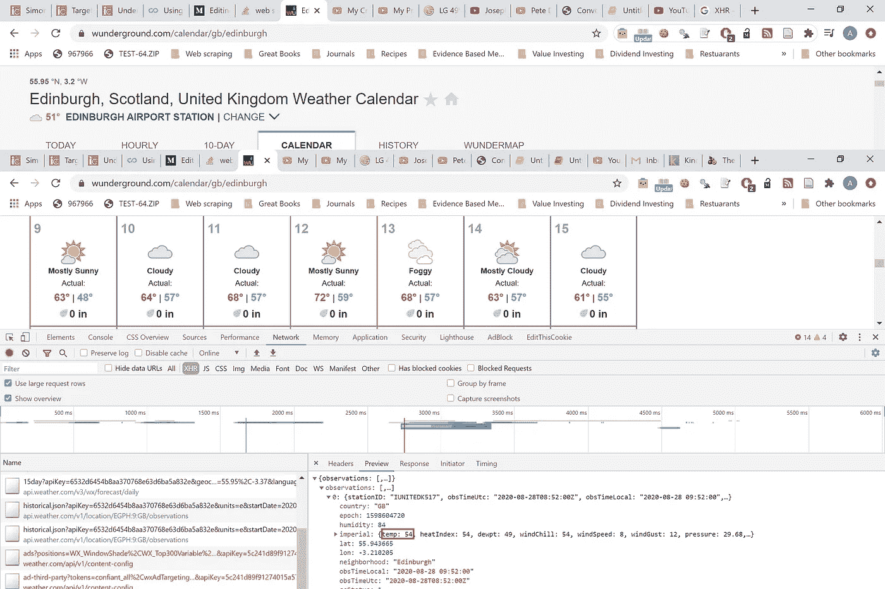

从 WeatherUnderground 网站[这里](https://www.wunderground.com/calendar/gb/edinburgh)刮取当前温度

那么我们如何近距离分析这一页呢？答案是 Chrome 的开发工具！Chrome 浏览器为你提供了大量分析任何网站的方法，应该成为你所有网络抓取项目的一部分。

# 在 5 分钟内分析网页

如果你看看谷歌的开发工具页面，你可以看到有很多关于网络开发人员的细节。工具集中有几个区域对 Web Scrapers 非常有用。

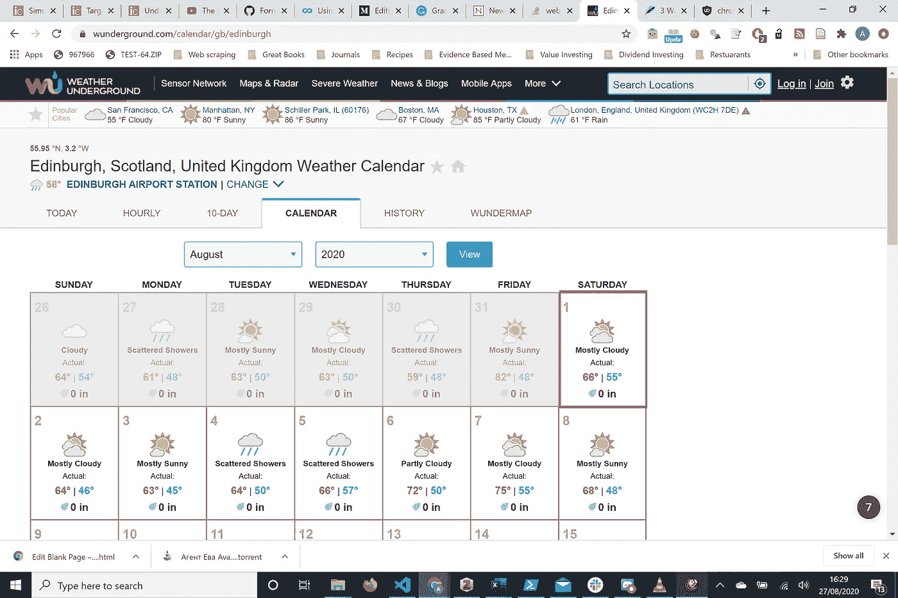

网站概述

让我们一次检查一个问题。

1.  数据是在一页还是多页上？
    信息在一页上！太好了，这让生活变得简单多了
2.  网站是怎么搭建的？

查看信息，有多个选项卡可以点击，很可能调用一些 javascript 来显示您想要的数据。大多数现代网站会将来自服务器的数据显示在网站上，并通过视觉检查，这里就是这种情况。

提示:禁用 javascript 是了解网站布局和信息中包含多少 javascript 的可靠方法。

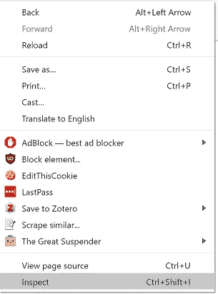

右键单击并检查要分析的页面

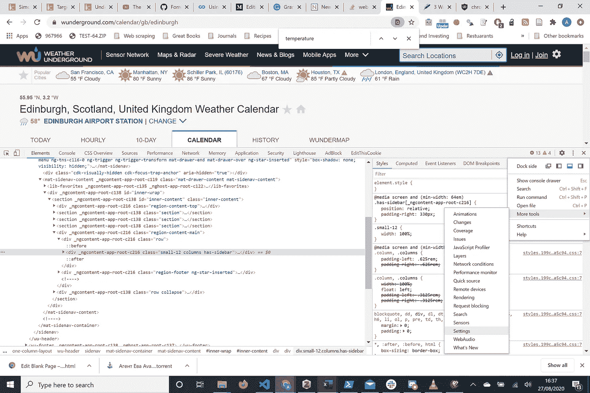

导航到 Chrome 开发工具设置。不要忘记点击右边的三个点！

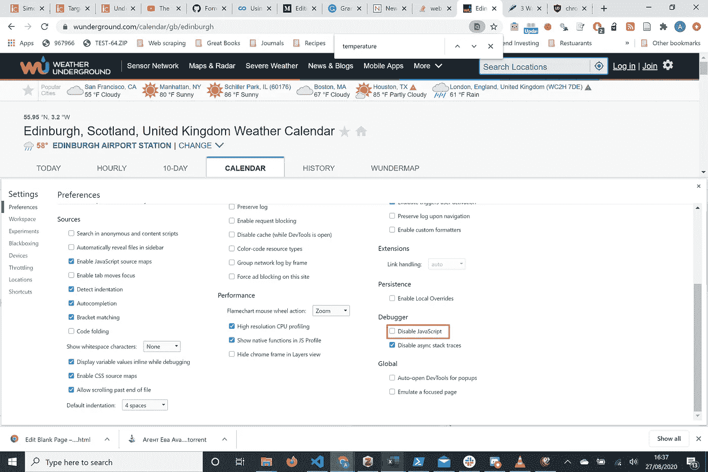

在设置中禁用 Javascript

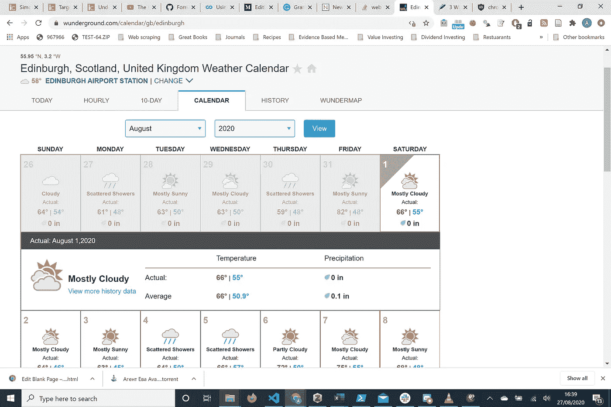

我们已经禁用了 javascript，看起来我们仍然能够访问您想要的所有数据！这让我们的生活更轻松！

3.网站需要登录吗？不要！

4.内容是动态创建的吗？一句话，大概！温度数据可能会发生变化，这些变化很可能会反映在服务器级别上，然后可以显示出来，而无需不断更新网站。禁用 javascript 似乎不会改变温度数据，但这只是一次一个快照。

5.有没有无限滚动？不要！

6.有下拉菜单吗？不要！

7.有什么表格吗？不要！

8.有桌子吗？是的，但我们会看看如何驾驭它！

在我们继续之前，让我们总结一下。

我们知道这个页面在一个表中有数据，在一个页面上，不需要任何登录，当 javascript 被禁用时也不会改变。我们现在能够更好地获取这些数据。

现在，我们准备看看我们是否可以轻松地获取信息。

9.有 API 吗？

要知道这是不是真的，我们必须对 Chrome 开发工具有更多的了解。在每个被检查的页面下，都有一个名为“网络”的选项卡。在这里，我们可以通过在网络选项卡打开时刷新页面或在网站上执行特定功能来记录浏览器发出和接收的任何传入请求和响应。记得打开网络标签，否则，活动将不会被记录！

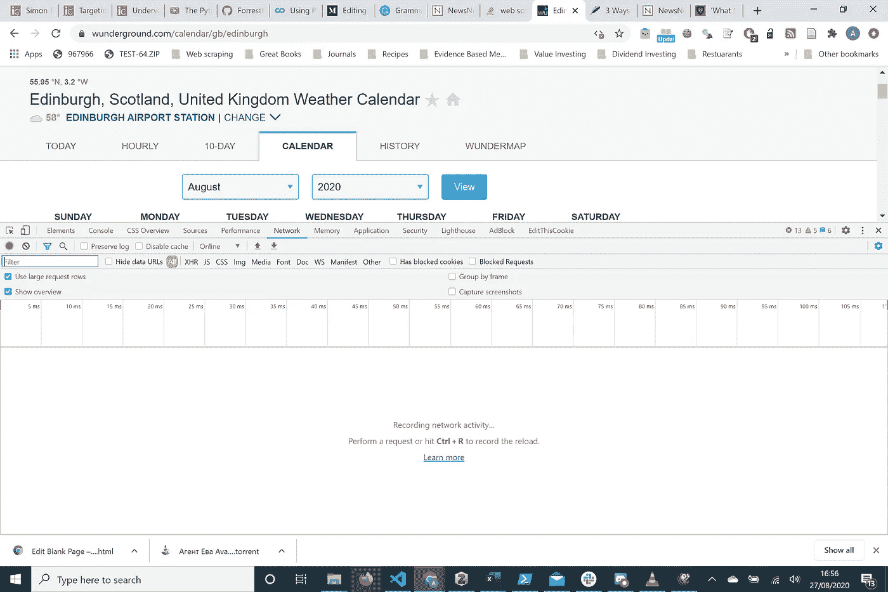

我们可以从屏幕上看到我们没有记录任何东西。刷新页面给我们下图

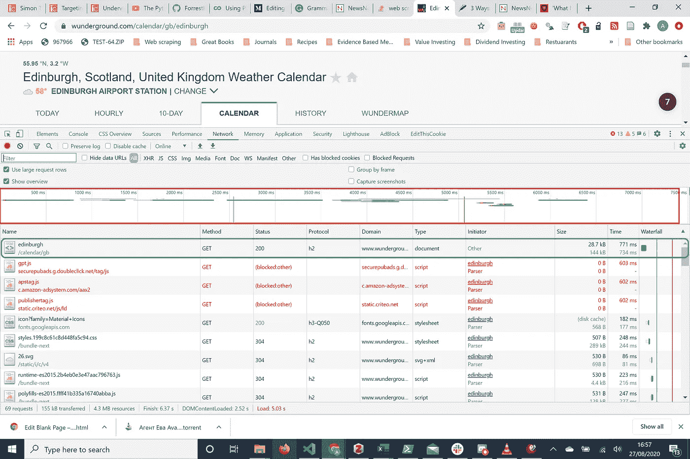

红框:这是概述所有的行都是服务器活动的量度
绿框:这是对服务器的单个请求。这里显示了名称、使用的 HTTP 方法和响应的大小！

开发工具上有一个名为“XHR”的标签。这代表 XML HTTP 请求，与服务器交互的任何内容都将从浏览器发出的所有请求中过滤掉。API 最有可能出现在这里，因为所有的 API 都与服务器交互。

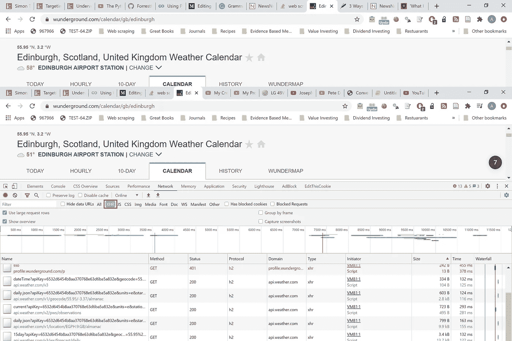

单击 XHR 获取 API 请求

按照大小对请求进行排序是一个很好的做法。你想要的数据通常是最大的回复。

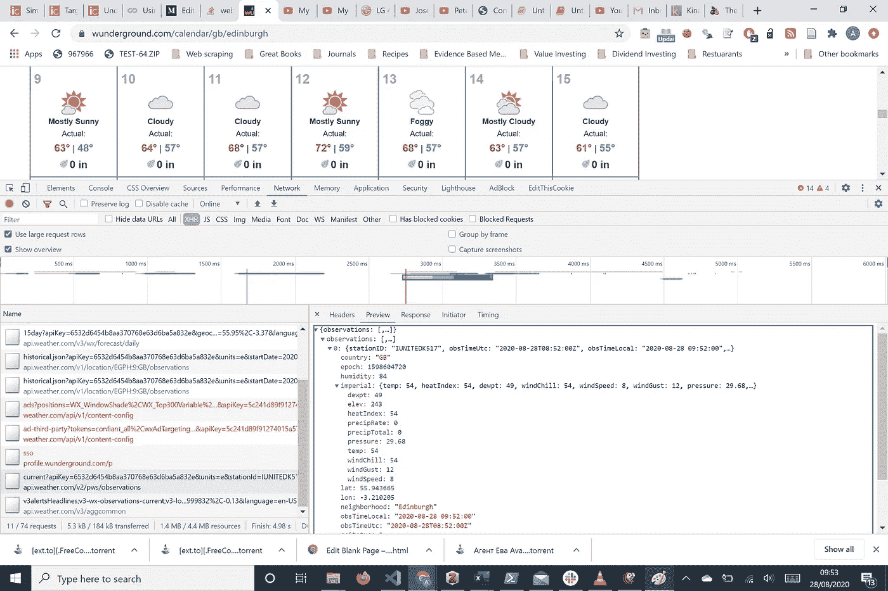

这里我们根据响应的大小对请求进行了排序。单击一个请求会给我们带来一个右侧面板，显示 HTTP 请求和响应的标题信息，以及需要在 HTTP 请求中传递给服务器的任何数据。

有一个非常有用的预览选项卡，你可以看到数据的快照。我们可以立即看到，我们想要的数据有可能来自那里。

让我们来看看它的“headers”选项卡

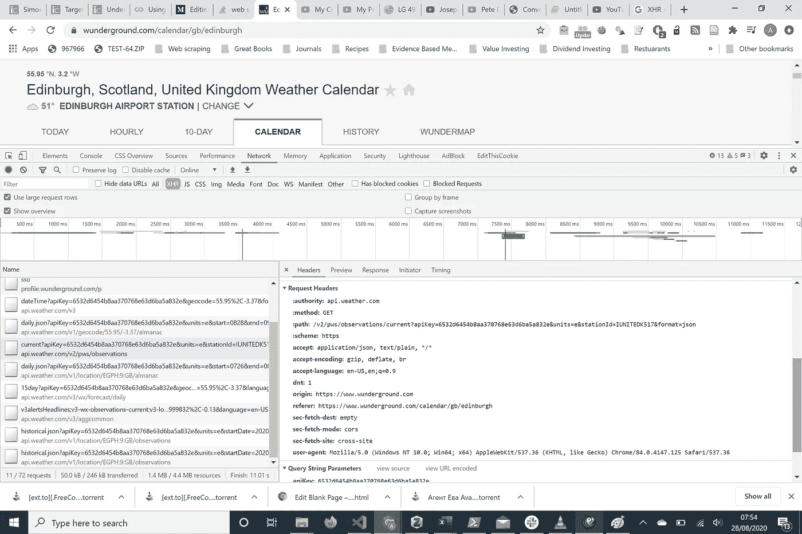

在右侧面板中，我们可以看到请求 URL，我们可以看到它是一个 API `api.weather.com/v2/pws/obeservations/.....`

有几个参数和 URL 一起传递，包括一个`apiKey, units, stationid,format`。请注意，我们稍后会用到它。

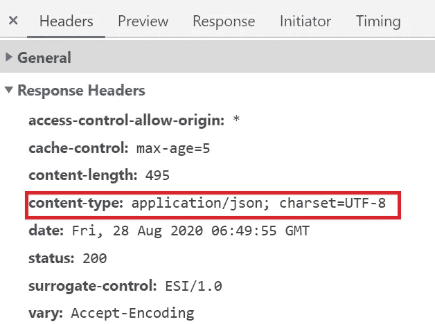

同样重要的是，从回复标题中我们可以看到`content-type: application/json; charset=UTF-8`。这告诉我们响应是在一个 JSON 对象中！高度结构化的数据！太棒了。

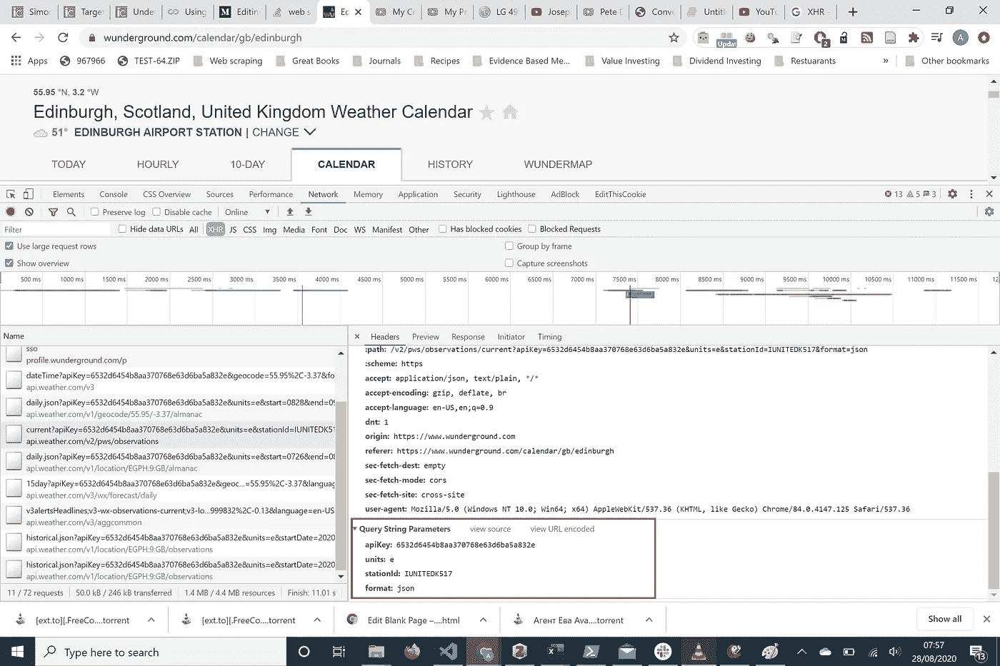

这是数据随请求传递的地方。注意，在单位、stationID 和格式旁边有一个`apiKey`。这是我们在请求 URL 中看到的数据，但是它在这里被清楚地格式化了！

# 获取数据

现在，我们可以使用参数对请求进行硬编码，并潜在地获得对数据的访问。但是有一个方便的网站通过转换请求的 cURL 命令并将其转换为 python 请求来消除这一点。为此，请参见下图

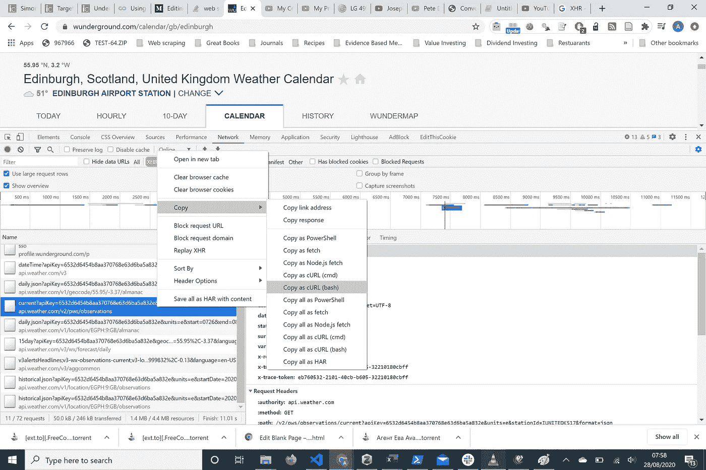

我们复制了“复制为卷曲”( bash ),并把它粘贴到一个网站上`curl.trillworks.com`

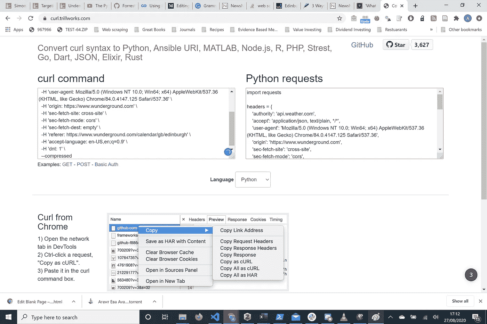

现在我们有了一个很好的格式化的 HTTP 请求，我们可以把它复制到任何我们想要的编辑器中。见下面的例子。

## 代码示例

```
import requestsheaders = {
    'authority': 'api.weather.com',
    'accept': 'application/json, text/plain, */*',
    'user-agent': 'Mozilla/5.0 (Windows NT 10.0; Win64; x64) AppleWebKit/537.36 (KHTML, like Gecko) Chrome/84.0.4147.125 Safari/537.36',
    'origin': '[https://www.wunderground.com'](https://www.wunderground.com'),
    'sec-fetch-site': 'cross-site',
    'sec-fetch-mode': 'cors',
    'sec-fetch-dest': 'empty',
    'referer': '[https://www.wunderground.com/calendar/gb/edinburgh'](https://www.wunderground.com/calendar/gb/edinburgh'),
    'accept-language': 'en-US,en;q=0.9',
    'dnt': '1',
}params = (
    ('apiKey', '6532d6454b8aa370768e63d6ba5a832e'),
    ('units', 'e'),
    ('stationId', 'IUNITEDK517'),
    ('format', 'json'),
)response = requests.get('[https://api.weather.com/v2/pws/observations/current'](https://api.weather.com/v2/pws/observations/current'), headers=headers, params=params)
```

请注意，它不仅包括我们正在讨论的参数，还包括请求头。这是一个需要提出的重要概念。我们正试图模仿 HTTP 请求从网站上抓取数据。现在，有时 API 端点只需要一个简单的 HTTP Get 请求。但有时它需要更多，有时它需要头，包括用户代理或 cookies。有时它需要参数，比如这里的例子。

在 python 中尝试不带头文件的 HTTP 请求和带头文件的 HTTP 请求，以查看它们是否需要这些信息来获取您想要的数据，这很有用。玩了一圈之后，你会发现实际上所需要的只是参数。

```
import requests
params = (
    ('apiKey', '6532d6454b8aa370768e63d6ba5a832e'),
    ('units', 'e'),
    ('stationId', 'IUNITEDK517'),
    ('format', 'json'),
)response = requests.get('[https://api.weather.com/v2/pws/observations/current'](https://api.weather.com/v2/pws/observations/current'), params=params)
response.json()
```

笔记

1.  使用`requests.get()`方法，我们发出一个 HTTP get 请求
2.  在`get()`中，该方法允许随请求体一起传递参数。在这种情况下，我们希望具体指定 apiKey 和其余的查询参数。
3.  这允许与服务器进行认证，并给我们正确的输出
4.  `response.json()` 将 JSON 对象转换成 python 字典

## 输出

```
{'observations': [{'stationID': 'IUNITEDK517',
   'obsTimeUtc': '2020-08-28T08:54:16Z',
   'obsTimeLocal': '2020-08-28 09:54:16',
   'neighborhood': 'Edinburgh',
   'softwareType': 'N23DQ V2.2.2',
   'country': 'GB',
   'solarRadiation': 123.3,
   'lon': -3.210205,
   'realtimeFrequency': None,
   'epoch': 1598604856,
   'lat': 55.943665,
   'uv': 1.0,
   'winddir': 79,
   'humidity': 84,
   'qcStatus': 1,
   'imperial': {'temp': 54,
    'heatIndex': 54,
    'dewpt': 49,
    'windChill': 54,
    'windSpeed': 7,
    'windGust': 12,
    'pressure': 29.68,
    'precipRate': 0.0,
    'precipTotal': 0.0,
    'elev': 243}}]}
```

现在查看我们刚刚创建的 python 字典，我们可以看到，实际上我们需要的数据在一个名为`observations`的键后面。观察值是一个只有一项的列表，所以要从字典中获取值，我们需要选择该项`observations[0]`

在这个列表中，item 是一个名为`imperial`的键，其中嵌套了一个名为`temp`的键。大量的嵌套，但这是 JSON 对象的本质！

为了访问我们想要的数据，我们向下迭代到我们需要的键。

```
response.json()['observations'][0]['imperial']['temp']
```

## 输出

```
54
```

浏览这本字典，我们现在可以发布最后一段代码了

```
import requests
params = (
 ('apiKey', '6532d6454b8aa370768e63d6ba5a832e'),
 ('geocode', '55.95,-3.37'),
 ('language', 'en-US'),
 ('units', 'e'),
 ('format', 'json'),
)
response = requests.get('[https://api.weather.com/v3/wx/forecast/daily/15day'](https://api.weather.com/v3/wx/forecast/daily/15day'), params=params)
response = requests.get('[https://api.weather.com/v3/wx/forecast/daily/15day'](https://api.weather.com/v3/wx/forecast/daily/15day'), params=params)
temp = response.json()['observations'][0]['imperial']['temp']
print('Temperature: ', temp)
```

## 输出

```
Temperature:  52
```

# 摘要

在本教程中，我们已经有效地了解了网页抓取的工作流程，以及每个网页抓取项目中我们应该问的问题。我们还介绍了如何通过 API 端点获取动态数据。这些 API 通常不是显式的，需要利用 chrome 开发工具来理解如何模拟 Javascript 调用的请求。Chrome Dev Tools 中的网络非常适合为我们提供做出正确 HTTP 请求所需的所有信息。

这被称为重新设计 HTTP 请求，是抓取动态内容的最有效的方法。当然还有其他方法，但它们通常涉及浏览器活动，并且如上所述，这通常不适合大型数据集抓取，因为效率低，并且可能很容易受到网站需求变化的影响。

# 关于作者

我是一名执业医师和教育家，也是一名网站开发者。

请在这里查看关于我在博客和其他帖子上的项目进展的更多细节。更多技术/编码相关内容，请点击这里订阅我的简讯

我将非常感谢任何评论，或者如果你想与 python 合作或需要帮助，请联系我。如果你想和我联系，请在这里 asmith53@ed.ac.uk 或在 twitter 上联系。

# 相关文章

[](/approach-to-learning-python-f1c9a02024f8) [## 学习 Python 的方法

### 今天如何最大限度地学习 python

towardsdatascience.com](/approach-to-learning-python-f1c9a02024f8) [](/how-to-run-scrapy-from-a-script-ff07fd6b792b) [## 如何从脚本运行 Scrapy

### 忘记 scrapy 的框架，全部用使用 scrapy 的 python 脚本编写

towardsdatascience.com](/how-to-run-scrapy-from-a-script-ff07fd6b792b) [](/efficient-web-scraping-with-scrapy-571694d52a6) [## 使用 Scrapy 进行有效的网页抓取

### Scrapy 的新功能使您的刮削效率

towardsdatascience.com](/efficient-web-scraping-with-scrapy-571694d52a6)