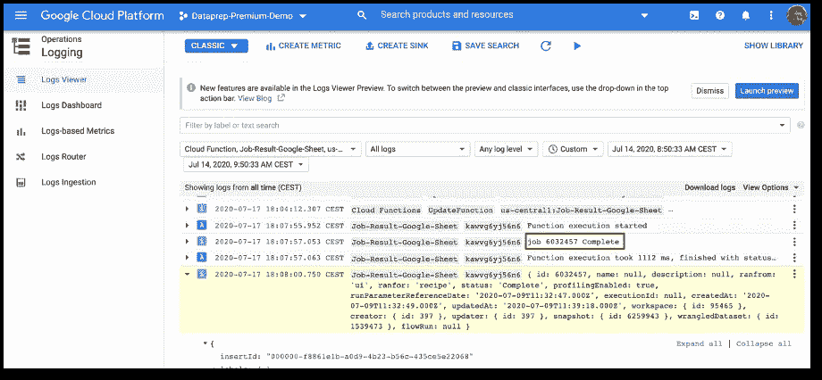

# 利用云函数和 API 来监控 Google 表单中的云数据准备作业状态

> 原文：<https://towardsdatascience.com/leverage-cloud-functions-and-apis-to-monitor-cloud-dataprep-jobs-status-in-a-google-sheet-b412ee2b9acc?source=collection_archive---------46----------------------->

如果您在 Google Cloud 中管理数据和分析管道，您可能希望监控它并获得端到端分析流程的全面视图，以便在出现问题时快速做出反应。

本文向您展示了如何通过利用云函数的 API 来捕获云 Dataprep 作业状态。然后，我们将状态输入到一个 Google Sheet 中，以便简单地检查作业的状态。使用相同的原理，您可以在 Google Sheets 中结合其他 Google 云服务状态，以获得您的数据管道的全面视图。

为了说明这个概念，我们将假设您想要通过快速查看 Google 工作表来监控一个每日调度的 Dataprep 作业，以获得潜在故障的概述。锦上添花的是，你还可以在 Google Sheets 中查看菜谱名称和工作简介结果。

本文是一个分步指南，介绍了当一个[云数据准备](https://cloud.google.com/dataprep)任务完成时触发[云功能](https://cloud.google.com/functions)以及将任务结果、状态和直接链接发布到[谷歌表单](https://www.google.com/intl/en/sheets/about/)的过程。

下面是一个谷歌表单的例子，其中发布了工作结果和链接。

图 1-Google Sheet data prep 工作结果，可访问工作简介 PDF

图 2 —基于云数据准备作业执行触发云功能的高级流程

## 1.入门指南

为了让这个指南更实用，我们在 Github 中分享了它，这是云函数的 Node.js 代码。

你需要一个有效的谷歌帐户，并访问云数据准备和云功能来尝试它。你可以从谷歌控制台[https://console.cloud.google.com/](https://console.cloud.google.com/)启动服务。

**备注**:要调用 API，需要一个访问令牌。要生成这个访问令牌，必须是 Google Cloud 项目的所有者。如果你不是谷歌云项目负责人，你可以使用个人 Gmail 帐户进行尝试。

图 3 —从设置菜单中获取访问令牌

## 2.创建 HTTP 云函数以在 Google 工作表中发布

首先，我们需要创建 HTTP Cloud 函数，当 Dataprep 作业完成时，它将作为 Webhook 被触发。

从谷歌云控制台[这里](https://console.cloud.google.com/functions/)创建一个云功能。触发器类型必须是“HTTP”。给它起个名字，得到一个类似[https://us-central 1-data prep-premium-demo . cloud functions . net/data prep-web hook-Function](https://us-central1-dataprep-premium-demo.cloudfunctions.net/Dataprep-Webhook-Function)的 URL。稍后，在 Dataprep 中创建 Webhook 时，我们将需要这个 URL。在我们的示例中，我们将使用上面提供的 Node.js 作为源代码部分下的运行时。

图 4 创建从 Dataprep 调用的云函数

如果你想探索更多关于云函数的知识，可以看看这个[教程](https://cloud.google.com/functions/docs/tutorials/storage)。

云函数代码遵循以下逻辑:

1.  检索由 Dataprep 提供的作业 id 和状态(失败或完成)。
2.  在 API 调用中利用 Dataprep 用户访问令牌，以便由云 Dataprep 进行身份验证。
3.  通过 getJobGroup Dataprep API 调用获得关于作业的更多信息(状态、配方 id)。关于这个 Dataprep API 端点的文档可以在这里找到:[https://clouddataprep . com/documentation/API/# operation/getJobGroup](https://clouddataprep.com/documentation/api/#operation/getJobGroup)
4.  通过 getWrangledDataset Dataprep API 调用获取有关作业配方的信息(名称、描述)。关于这个 Dataprep API 端点的文档可以在这里找到:[https://clouddataprep . com/documentation/API/# operation/getwrangeddataset](https://clouddataprep.com/documentation/api/#operation/getWrangledDataset)
5.  发布信息和链接到谷歌表。工作结果页面和下载 PDF 格式结果简介的链接写在 Google 表单中:

*   作业结果 URL 是[https://clouddataprep.com/jobs/<作业 id>](https://clouddataprep.com/jobs/%3CjobID%3E)
*   PDF 格式的工作结果简介可从以下网址下载:[https://clouddataprep.com/v4/jobGroups/<工作 ID > /pdfResults](https://clouddataprep.com/v4/jobGroups/%3CjobID%3E/pdfResults)

图 5——node . js 代码获取作业细节并在 Google 工作表中发布作业结果状态

Node.js 代码这里是[这里是](https://github.com/victorcouste/google-cloudfunctions-dataprep/blob/master/job-result-google-sheet.js)。您需要编辑突出显示的红色值，并将其替换为您在 Cloud Dataprep 项目中检索到的正确值。

*   调用 Dataprep API 的访问令牌:

**var DataprepToken = " eyjhjkfrye 353 lgh 12 ghjkdfsghk "**

*   您要发布结果的 Google 工作表 ID:

**const job sheetid = " 1x 63 lfifsdfd D3 dsfn 0 WM 3 skx-Ro "**

要检索谷歌电子表格 ID，请遵循这里的解释。

*   Google API 密钥:

**sheet SAPI . spreadsheets . values . append({ key:" aizasdfsfdflh 0 qu 8 q "，**

要检索 Google API 密钥，请遵循这里的解释。

您还需要将以下依赖项添加到 Node.js 云函数(包。JSON 选项卡):

图 6 — Node.js 依赖包

然后，您需要部署云功能。部署后，云函数正在运行，并等待在执行作业时从 Cloud Dataprep 调用。你可以在这里了解更多关于部署和执行云功能的[。](https://cloud.google.com/functions/docs/deploying/console)

## 3.创建一个云数据准备流并配置一个 Webhook

接下来，您需要创建 Cloud Dataprep 流，它将调用 HTTP Cloud 函数在 Google Sheets 中发布作业结果。

您需要在您的流中创建并配置一个 Webhook 任务，它将调用您的 HTTP Cloud 函数。

图 7——创建云数据准备流程并在流程上配置 Webhook 任务

Webhook 任务需要配置以下信息:

*   **URL** :这是您之前创建的 HTTP Cloud 函数的 URL。比如[https://us-central 1-data prep-premium-demo . cloud functions . net/data prep-web hook-Function](https://us-central1-dataprep-premium-demo.cloudfunctions.net/Dataprep-Webhook-Function)。
*   **Headers** :使用类似下面截图中的内容类型和应用程序/json 的头。
*   **Body** :使用值{"jobid":"$jobId "，" jobstatus":"$jobStatus"}，如下图所示。
*   **触发事件**:您可以决定触发任何状态的 Webhook，或者只触发失败或完成的作业。
*   **触发对象**:您可以决定只为流程中的特定输出，或者为流程中执行的任何作业触发 Webhook。

输入这些信息后，就可以测试调用云函数的 Webhook 任务了。

图 8 —调用云函数的 Webhook 任务参数

保存 Webhook 任务后，就可以在执行作业时调用它了。

图 9 —创建的 Webhook 任务

## 4.测试端到端流程

现在，您已经准备好测试端到端流程，方法是从 Dataprep 作业中运行一个作业，并查看添加到 Google 工作表中的作业结果状态。

图 10 —运行一个数据准备作业

图 11——Google 工作表中发布的工作结果状态和链接

最后，您还可以通过查看位于[此处](https://console.cloud.google.com/logs/viewer?resource=cloud_function)的 Google Cloud Functions 日志来检查正确的执行细节(带参数的 API 调用和 Cloud Dataprep 作业状态)。

图 12 —云函数日志

## 结论

现在，您应该理解了在 Google Sheet 中自动发布 Dataprep 工作结果的基本原则，这样您就可以轻松地监控和与更广泛的团队共享摘要信息。

你已经了解了

*   云数据准备 API
*   云数据准备 Webhooks
*   调用 API 的云函数

您还可以扩展这个解决方案来监控额外的 Google 云服务，以实现端到端的数据管道监控。

现在，您可以自动监控您的工作状态了。您还可以利用另一个云功能或外部调度程序来自动化云数据准备。看看这些文章，它们解释了[如何使用 Cloud Composer](https://cloud.google.com/blog/products/data-analytics/how-to-orchestrate-cloud-dataprep-jobs-using-cloud-composer) 编排云数据准备作业，以及[如何在文件到达云存储](https://medium.com/google-cloud/how-to-automate-a-cloud-dataprep-pipeline-when-a-file-arrives-9b85f2745a09)时自动化云数据准备管道。

*原载于*[*www.trifacta.com*](https://www.trifacta.com/blog/monitor-jobs-google-sheet/)