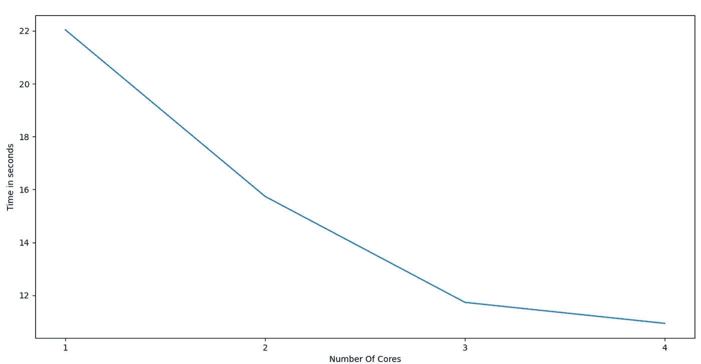

# 在 Scikit-Learn 中利用多核实现更快的性能

> 原文：<https://towardsdatascience.com/leverage-multicore-for-faster-performance-in-scikit-learn-147c374ad2d3?source=collection_archive---------39----------------------->

## [内部 AI](https://towardsdatascience.com/machine-learning/home)

## 随着物联网、传感器和存储能力的进步，可用的数据量呈超级指数级增长。


[翁贝托](https://unsplash.com/@umby?utm_source=medium&utm_medium=referral)在 [Unsplash](https://unsplash.com?utm_source=medium&utm_medium=referral) 上的照片

十年后我们生活的世界将会完全不同，比现在的世界更加复杂。

随着世界变得越来越复杂，底层数据也越来越复杂。机器学习的挑战之一是处理复杂数据集对计算能力和时间的需求不断增加。

Scikit-learn 不支持像 Keras 或 TensorFlow 这样的 GPU，但我们可以利用多核 CPU 并行执行几个任务。

在本文中，我们将看到加速机器学习和缩短建模时间的过程。

我们将在本文中使用“Volcanoes”数据集来理解 Sckit-learn 中的并行任务处理过程。

```
from sklearn.datasets import fetch_openml
from sklearn.ensemble import RandomForestClassifier
from time import time
from matplotlib import pyplot as plt
```

在下面的代码中，“火山”数据集是从 openml 中提取的。

```
X,y= fetch_openml(name="volcanoesb3",version=1,
return_X_y=True,as_frame=True)
```

训练每个模型所用的时间将保存在列表“timetaken”中。我有一台四核笔记本电脑，因此将训练最多四核的机器学习模型。如果您有一个八核或更多内核，那么您可以提到“n_cores ”,最多八个或更多内核。

```
timetaken = []
n_cores = [1, 2, 3, 4]
```

在下面的代码中，机器学习模型在一个循环中从单核到四核进行训练，并且节省了训练所用的时间。

我们可以用 RandomForestClassifier 中的“n_jobs”参数指定并行运行的作业数量。如果我们希望使用所有可用的内核，那么我们可以将“n_jobs”指定为“-1”

```
for n in n_cores:
    start = time()
    model = RandomForestClassifier(n_estimators=1500,
                                   random_state=42, n_jobs=n)
    model.fit(X, y)
    end = time()
    elapsedtime = end - start
    timetaken.append(elapsedtime)
```

直观显示用不同核心训练模型所需的时间是很有帮助的。

```
plt.plot(n_cores, timetaken)
plt.show()
```

我们可以看到，模型训练时间大幅减少，因为它是从一个核心训练到三个核心。从使用三个内核到使用所有四个内核只会略微增加一点时间。

用单核训练该模型花费了将近 22 秒，现在下降到大约。约 11 秒，三核。



> 结论和要点

随着物联网、传感器和存储能力的进步，可用的数据量呈超级指数级增长。

GPU 和 TPU 是加速处理和提高机器学习算法性能的救星。

不幸的是，Scikit-Learn 不支持 GPU，但我们可以利用多核微处理器并行处理少量任务，并更快地获得结果。

即使是四核和八核笔记本电脑，我们也可以大幅缩短机器学习的处理时间。

可以在 Python 中了解更多关于[线性回归的内容:Sklearn vs Excel](/linear-regression-in-python-sklearn-vs-excel-6790187dc9ca)