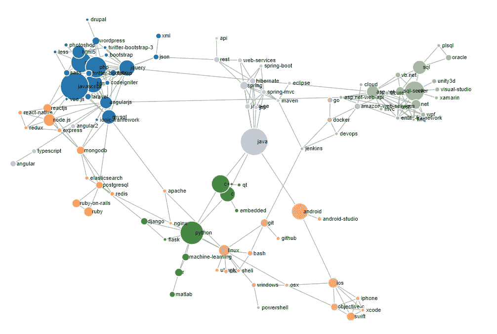
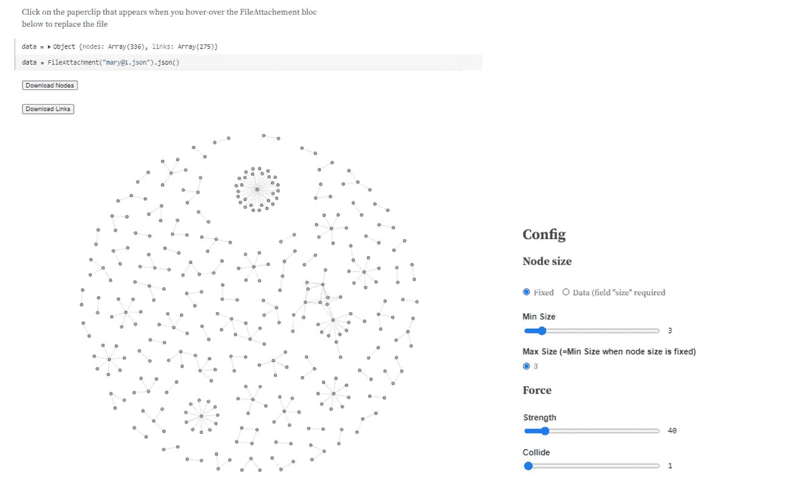
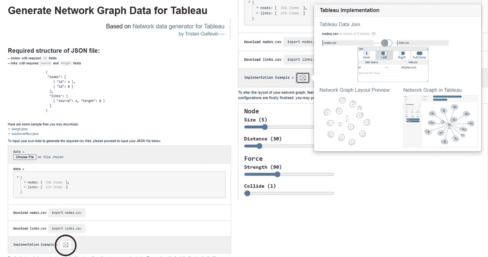
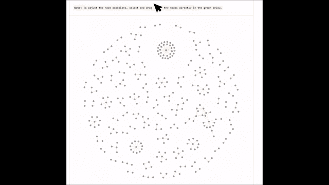
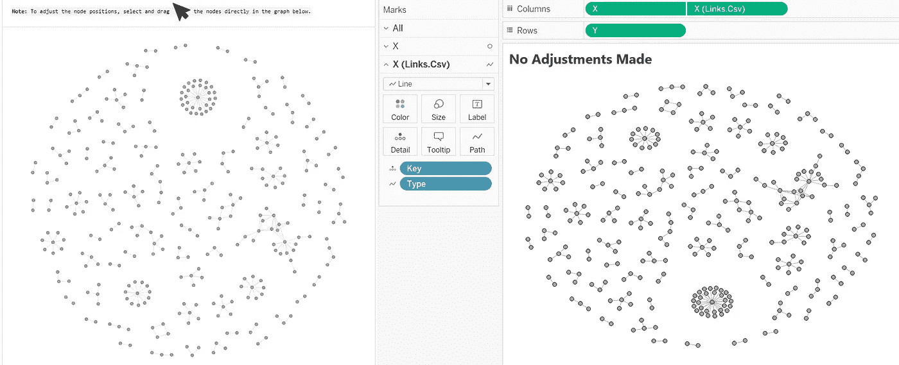
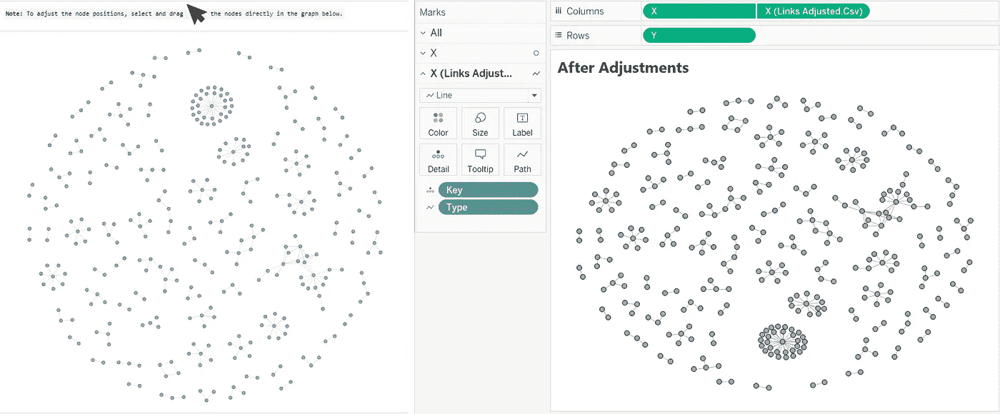
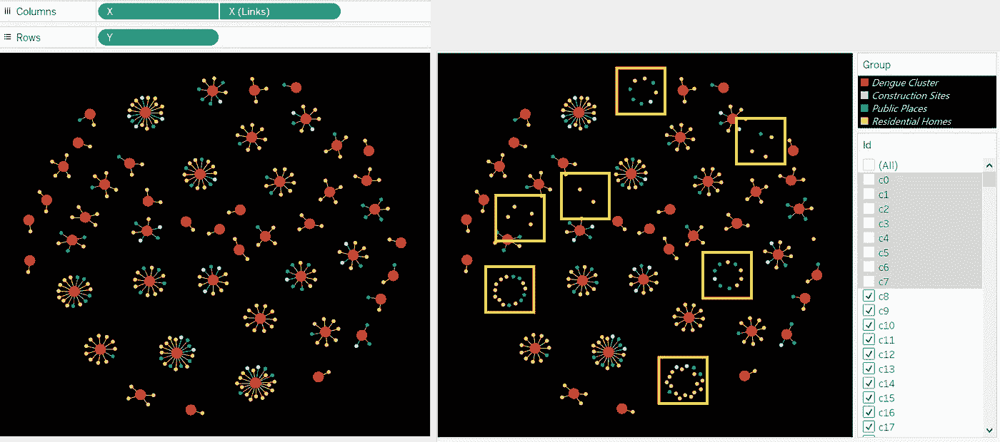
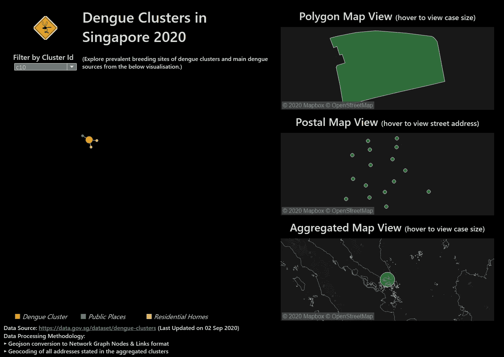
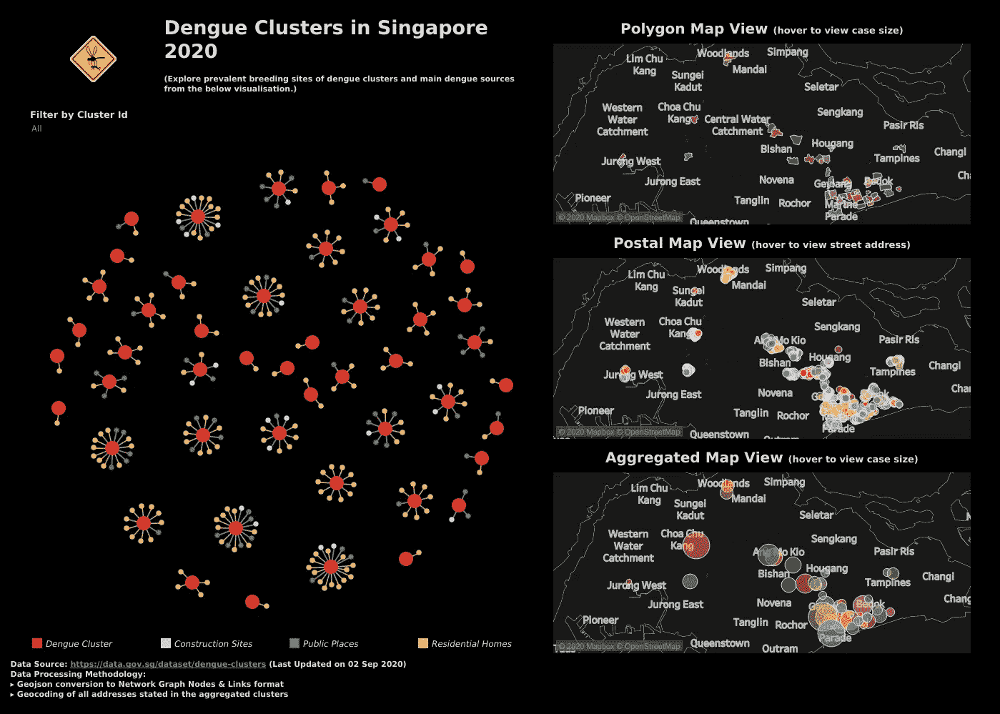

# 利用 D3.js v4 构建 Tableau 的网络图

> 原文：<https://towardsdatascience.com/leverage-on-d3-js-v4-to-build-a-network-graph-for-tableau-with-ease-cc274cba69ce?source=collection_archive---------23----------------------->

## 使用 D3.js 自动计算每个节点的(x，y)坐标，并根据您的喜好调整布局

因此，最近世界各国都在狂热地追踪接触者，以控制新冠肺炎感染率。作为一名数据分析师，我最近接触了很多网络图。看到一个主要由**节点**和**链接**组成的图不仅美观，而且有效地表示了不同实体之间的连接，这很有趣。



Image by Author |一个由 d3.js 渲染的网络图示例，用于可视化 stackoverflow 上#标签的出现频率

大多数网络图可视化大多部署在 web 应用程序上。残酷的事实是 web 开发时间远远超过 dashboarding。此外，我工作过的团队通常只对网络图的快照感兴趣，因此在 Tableau 等仪表板工具上绘制网络图的能力将为突出显示与图形的交互性不太重要的重要发现提供更大的便利。因此，我继续探索和实现用最小的努力在 Tableau 上绘制完全相同的图形的方法。这让我创建了一个由 **2** 部分组成的宠物项目

**第一部分:**直接为 Tableau 输出数据的 web 应用程序(功能包括手动调整图形布局的灵活性+最终 Tableau 就绪数据输出的导出)

**第二部分:**使用在*第一部分*中创建的数据生成器，相应地在我的下一个 Tableau 仪表板中包含一个网络图。

# 第一部分:创建 Web 应用工具

关于项目的这一部分，我的网络应用程序的布局和功能是基于特里斯坦·吉列文的 https://observablehq.com/@ladataviz/network-data-generator



图片由作者提供|展示了[https://observablehq.com/@ladataviz/network-data-generator](https://observablehq.com/@ladataviz/network-data-generator)上的功能，包括:使用户能够输入自己的 JSON 文件来呈现网络图，并为 Tableau 导出 2 个 CSV 文件。此外，可以调整节点**尺寸**和**力**参数的配置，以改变整体布局。

不要误会我的意思，虽然我觉得这很棒，而且我对利用 d3 图形库的独创性印象深刻，但当我试图使用 Tableau 中的输出时，有两个主要限制——

*   约束 1:该工具不允许直接将节点拖动到其他位置来实现更加定制的布局。*虽然强度和碰撞参数可以切换，但节点的移动是不可预测的，难以操纵。*
*   约束 2:最终生成的输出确实呈现了工具中预览的精确布局。然而，当我试图过滤一些**节点**或**链接**的显示时，数据输出中没有特定的字段— *nodes.csv* 和 *links.csv* ，这使得这在 Tableau 中很容易发生。

在解决以上两个问题之前，我继续开发了一个类似于 Tristan Guillevin 的 web 界面:



作者图片|我在[https://tableau-data-utility.glitch.me/](https://tableau-data-utility.glitch.me/)部署的 web 应用预览。类似地，用户可以按照指定的格式输入他们自己的 JSON 文件。图形布局也启用了配置。此外，带有 Tableau 图标的按钮说明了两个输出文件— **nodes.csv** 和 **links.csv** 之间的后续数据连接是如何发生的

基本上，它是一个单页应用程序，包含所有的说明和所需的信息。现在，这里出现了一个有争议的最用户友好的特性— *允许用户手动改变和拖动节点，以使图形符合他们想要的布局:*



作者图片|在[https://tableau-data-utility.glitch.me/](https://tableau-data-utility.glitch.me/)对网络应用程序中图表的原始布局进行简单调整的演示

这里有一个明显的对比，工具在移动后成功地改变了节点的坐标:



作者图片| ( **左**)D3 . js 渲染的网络图调整前布局| ( **右**)导出 csv 文件的 Tableau 图形可视化



作者图片| ( **左**)D3 . js 渲染的网络图调整后布局| ( **右**)导出 csv 文件的 Tableau 图形可视化

因此，解决了(1/2)的约束条件——另一个未解决的问题是，当在 Tableau 中绘制时，生成的原始输出不允许对特定的**节点**或**链接**进行过滤(这将在**第二部分**中进行阐述)。

# 第二部分:在 Tableau Dashboard 中包含一个网络图，用于数据剖析/分析

最终，我决定在 2020 年第三季度确定新加坡的登革热集群。原始数据源在最终的仪表板中说明，但是在地理编码和一些数据转换之后，生成 Tableau 图所需的 JSON 输入被生成:[https://github . com/wended-geek-cc/Tableau-data-utility/blob/master/public/data/SG _ dengue _ clusters . JSON](https://github.com/incubated-geek-cc/tableau-data-utility/blob/master/public/data/sg_dengue_clusters.json)

在绘制网络图并将地图添加到仪表板上之后，我面临的第二个约束是无法通过特定节点/链接进行过滤:

*   [Id] (nodes.csv):每个节点的标识符
*   [Id] (links.csv):节点的[Id]，即源/目标
*   [Key] (links.csv):自动生成的数值，用于标识源节点和目标节点
*   [类型] (links.csv):源/目标

实际上，只有`[Id]`字段可用于识别要过滤的节点/链接。然而，由于输出格式，当*单个节点*被过滤时，节点的*链接*默认不被过滤，这在图中留下了许多挂起的链接:



作者图片| Tableau 演示，显示节点 c0 至 c7 已过滤。请注意，过滤节点的链接仍然存在。

我想到的解决方案是生成一个名为`[Link Id]`的额外字段，它基本上连接了源节点的`[Id]`和目标节点的`[Id]`。这与用于区分链路的`[Key]`字段的目的相同，但是节点和链路现在都可以被`[Link Id]`识别。

此后，用以下公式创建一个称为`[Filter by Link Id]`的字段:

```
IF [Parameters].[Cluster Id]='All' THEN TRUE 
ELSE 
 RIGHT(link_id,LEN([Parameters].[Cluster Id]))=[Parameters].[Cluster Id] 
END
```

因此，仪表板最终可以同时在网络图和其他视图中交叉过滤:



图片按作者| Node [Id] c10 被选中，在部署于[https://public . tableau . com/views/singapores dengue clusters 2020/SG _ dengue _ clusters _ 2020？:language = en&:display _ count = y&:origin = viz _ share _ link](https://public.tableau.com/views/SingaporesDengueClusters2020/sg_dengue_clusters_2020?:language=en&:display_count=y&:origin=viz_share_link)

## 感谢您花时间阅读，我在 Tableau 仪表盘上绘制网络图的探索到此结束！

请随意使用部署在 https://tableau-data-utility.glitch.me/[的工具来生成 Tableau 网络数据集。](https://tableau-data-utility.glitch.me/)



图片作者| Dashboard 部署于[https://public . tableau . com/views/Singapore sdengeclusters 2020/SG _ dengue _ clusters _ 2020？:language = en&:display _ count = y&:origin = viz _ share _ link](https://public.tableau.com/views/SingaporesDengueClusters2020/sg_dengue_clusters_2020?:language=en&:display_count=y&:origin=viz_share_link)

[](https://geek-cc.medium.com/membership) [## 通过我的推荐链接加入灵媒——李思欣·崔

### 获得李思欣·崔和其他作家在媒体上的所有帖子！😃您的会员费直接…

geek-cc.medium.com](https://geek-cc.medium.com/membership)