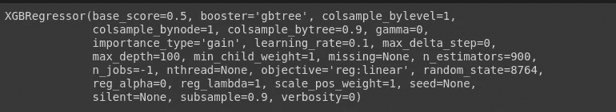
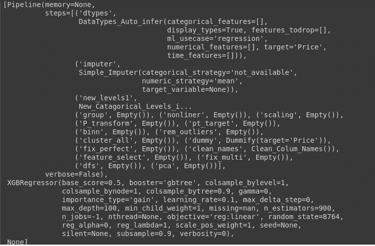

# 利用 PyCaret 的力量

> 原文：<https://towardsdatascience.com/leverage-the-power-of-pycaret-d5c3da3adb9b?source=collection_archive---------16----------------------->

## 用一行代码学习机器学习！


照片由 [Guillaume Jaillet](https://unsplash.com/@i_am_g?utm_source=medium&utm_medium=referral) 在 [Unsplash](https://unsplash.com?utm_source=medium&utm_medium=referral)

P yCaret 是一个开源、低代码的 Python 机器学习库，旨在减少周期时间，并允许您使用您选择的笔记本环境在几秒钟内从准备数据到部署模型。

本文的目标读者是熟悉机器学习概念，并且知道如何使用不同的库(如 Scikit-Learn)实现各种机器学习算法的人。完美的读者意识到自动化的需要，并且不想花太多时间寻找最佳算法及其超参数。

作为机器学习从业者，我们知道在一个完整的数据科学项目的生命周期中涉及到几个步骤，其中包括数据预处理——缺失值处理、空值处理、更改数据类型、分类特征的编码技术、数据转换——log、box cox 转换、特征工程、探索性数据分析(EDA)等。在我们真正开始建模、评估和预测之前。因此，我们使用 python 中的各种库来完成这些任务，如 numpy、pandas、matplotlib scikit-learn 等。因此 Pycaret 是一个非常强大的库，可以帮助我们实现过程的自动化。

# 正在安装 Pycaret

```
!pip install pycaret==2.0
```

一旦 Pycaret 安装完毕，我们就可以开始了！我将在这里讨论一个回归问题，Pycaret 可用于许多问题，如分类、异常检测、聚类、自然语言处理。

我将在这里使用我从 Flipkart 网站获得的笔记本电脑价格数据集[](https://github.com/mathangpeddi/Flipkart-Web-Scraping/blob/master/flipkart_web_scraping.ipynb)****。****

```
**df = pd.read_csv('changed.csv') # Reading the dataset
df.head()**
```

********

```
**from pycaret.regression import *
reg = setup(data = df, target = 'Price')**
```

****Pycaret 的 setup()函数完成了大部分的校正工作，这通常需要多行代码才能完成——只用一行代码就完成了！这就是这个令人惊叹的图书馆的美妙之处！****

****我们使用设置变量，在目标中，我们提到特性名称(因变量)——这里我们想预测笔记本电脑的价格，因此它成为因变量。****

```
**X = df.drop('Price',axis=1) 
Y = df['Price'] 
Y = pd.DataFrame(Y)**
```

****************

******比较所有回归模型******

```
**compare_models()**
```

****训练所有的回归模型。因此，在此之后，我们可以创建任何模型——要么是 CatBoost，要么是 XGBoost regressor 模型，然后我们可以执行超参数调优。****

****************

****我们可以看到，与所有其他模型相比，我们的梯度推进回归(GBR)模型表现相对更好。但是我也使用 XGBoost 模型进行了分析，这个模型比 GBR 模型表现得更好。****

********

****使用梯度推进回归模型时出错****

****因为我们已经确定了最好的模型是 xgboost，所以我们在 create_model 函数的帮助下创建了 XGBoost 模型，并提到了 max_depth(模型运行的迭代次数)****

******创建模型******

```
**xgboost = create_model('xgboost', max_depth = 10)**
```

********

****使用 XGBoost 模型时出错****

****因此，在创建深度为 10 的模型后，它运行 10 次迭代，并在每次迭代中计算 MAE(平均绝对误差)、MSE(均方误差)、RMSE(均方根误差)、R2(R2 分数-R 平方值)、MAPE(平均绝对百分比误差)。最后，它显示这 10 次迭代中所有误差的平均值和标准偏差。机器学习模型的错误越少越好！因此，为了减小误差，我们试图找出能使误差最小的超参数。****

****为此，我们应用 tune_model 函数并应用 K-fold 交叉验证来找出最佳超参数。****

******模型的超调******

```
**xgboost = tune_model(xgboost, fold=5)**
```

********

****超调后出错****

****该模型运行 5 次迭代，并给出所有误差的平均值和标准偏差。5 次迭代后，GBR 和 XGBoost 模型的平均平均误差几乎相同，但在超调并进行预测后，XGBoost 模型的误差更小，表现优于 GBR 模型。****

******使用最佳模型进行预测******

```
**predict_model(xgboost)**
```

********

****做出预测****

****应用交叉验证后检查分数(我们主要需要平均绝对误差)。这里我们可以看到，最佳模型的平均误差已降至 10847.2257，因此平均绝对误差约为 10，000。****

******检查 xgboost 模型的所有参数******

```
**print(xgboost)**
```

********

****检查超参数****

******XGBoost 模型超参数******

```
**plot_model(xgboost, plot='parameter')**
```

********

****检查超参数****

******残差图******

****实际值和预测值之间的距离(误差)****

```
**plot_model(xgboost, plot='residuals')**
```

********

****残差图****

****我们可以清楚地看到，我的模型过度拟合，因为训练集的 R 平方是 0.999，测试集是 0.843。这其实并不奇怪，因为我的数据集总共只包含 168 行！但是这里的要点是强调 Pycaret 的优秀特性，因为您只需一行代码就可以创建图表和曲线！****

******绘制预测误差******

```
**plot_model(xgboost, plot='error')**
```

********

****预计误差****

****该模型的 R 平方值为 0.843。****

******厨师距离图******

```
**plot_model(xgboost, plot='cooks')**
```

********

****库克距离图****

******学习曲线******

```
**plot_model(xgboost, plot='learning')**
```

********

****学习曲线****

******验证曲线******

```
**plot_model(xgboost, plot='vc')**
```

********

****验证曲线****

****这两个图也向我们显示了模型明显过度拟合！****

******特征重要度图******

```
**plot_model(xgboost, plot='feature')**
```

********

****特征重要性****

****通过这个图，我们可以看到 Processor_Type_i9 (i9 CPU)是决定笔记本电脑价格的一个非常重要的特性。****

******将数据集分割成训练集和测试集******

```
**from sklearn.model_selection import train_test_split
X_train,X_test,Y_train,Y_test = train_test_split(X,Y,test_size=0.2)**
```

******部署的最终 XGBoost 参数******

```
**final_xgboost = finalize_model(xgboost)**
```

********

****XGB 模型的最终参数****

******对未知数据(测试集数据)进行预测******

```
**new_predictions = predict_model(xgboost, data=X_test)
new_predictions.head()**
```

********

****测试集上的预测****

******保存转换管道和模型******

```
**save_model(xgboost, model_name = 'deployment_08082020')Transformation Pipeline and Model Succesfully Saved deployment_08082020 = load_model('deployment_08082020')Transformation Pipeline and Model Sucessfully Loadeddeployment_08082020**
```

********

****最终机器学习模型****

****所以这是最终可以用于部署的机器学习模型。****

********

****模型以 pickle 格式保存！****

****更多信息，请查看文档[**此处**](https://pycaret.org/)****

****在这篇文章中，我没有详细讨论每件事。但是你可以随时参考我的 [**GitHub 资源库**](https://github.com/mathangpeddi/Laptop-Prices-Predictor/blob/master/Laptop_Prices_Prediction.ipynb) 获取完整代码。我从这篇文章得出的结论是，不要期待一个完美的模型，而是期待一些你今天可以在自己的公司/项目中使用的东西！****

****喊出 [**Moez Ali**](https://towardsdatascience.com/@moez_62905) 为这个绝对辉煌的图书馆干杯！****

****在 LinkedIn 上与我联系 [**这里**](https://www.linkedin.com/in/mathang-peddi-23763317b/)****

> ****底线是自动化降低了人为错误的风险，并为企业系统增加了一些智能。—史蒂芬·艾略特****

****我希望你觉得这篇文章很有见地。我很乐意听到反馈，以便即兴创作，并带来更好的内容。****

****非常感谢您的阅读！****