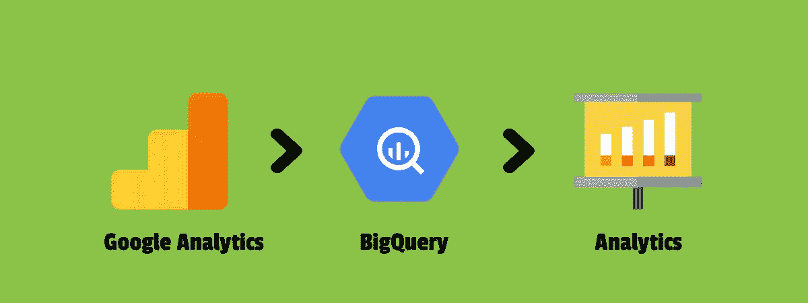
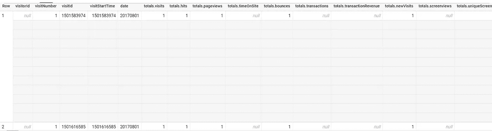
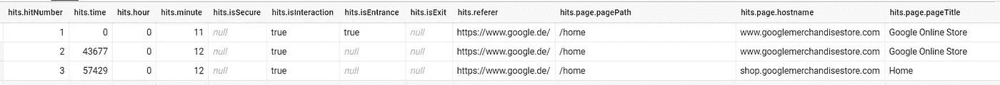

# 利用 BigQuery 和 Google 分析数据

> 原文：<https://towardsdatascience.com/leveraging-bigquery-with-google-analytics-data-b6085d8415b?source=collection_archive---------17----------------------->



作者照片

谷歌分析是一个了不起的工具。它使您能够让数据为您服务，获得更广泛的图片，并更好地了解您的访问者。

当你对这个“报告”工具有更多期望时，问题就来了。我会告诉你为什么你应该考虑利用 BigQuery(或类似的工具)以及你的谷歌分析数据。

**目录:**

A.为什么要将 BigQuery 与谷歌分析数据结合使用？

B.用 BigQuery 查询 Google Analytics 数据

一.如何运作？

二。先决条件

三。我们来查询一下

## A.为什么要将 BigQuery 与谷歌分析数据结合使用？

## 3 个原因:

**1。处理随时间变化:**

随着时间的推移，每个网站都会经历变化。与此同时，存储数据的方式也将发生变化。因此，为了进行苹果之间的比较，您需要将数据转换成一个通用的视图。

**2。数据采样**

如果你依赖 Google Analytics，你会知道 GA 经常对其数据进行采样。只要你没有足够的建模数据或者你使用的是现成的报告，GA 会给你 100%准确的数据。只有当你开始过滤数据或增加其基数时，谷歌分析才会开始按比例对数据进行采样，以保持其速度。

*采样:在采样过程中，GA 会根据较小的样本空间而不是整个数据池返回指标。

**3。缺乏数据操作和转换**

一旦数据存储在分析服务器中，您将无法使用公式或其他逻辑修改数据。这一点非常重要，因为对于一个拥有大量受众和多种内容类别的网站来说，数据分类和转换的空间总是很大。此外，在一些情况下，您需要清理数据。这些场景可能是人为错误、实施出错、谷歌分析遗漏的机器人。如果你想知道更多关于识别被谷歌分析遗漏的机器人的信息，[阅读我关于这个主题的文章](https://sumilmehta.in/blog/bot-detection-recaptcha/?utm_source=analytics_vidhya&utm_medium=referral&utm_campaign=guest_post)。

## B.利用 BigQuery

BigQuery 是一个基于云的数据仓库工具，可以让你以闪电般的速度存储和分析数 Pb 的数据。对于 GA 360 用户，Google 为你提供了将网站每日会话数据转储到 BigQuery 的选项。你可以利用这些数据来克服谷歌分析的局限性。

**一、如何运作？:**

1.  Google Analytics 每天都将其会话数据存储在 BigQuery 服务器中。这个会话数据是一个表，其中每一行都专用于一次用户访问，而每一列都代表一个不同的维度或指标，可以重复和嵌套。大致来说:A 列:访问者 Id 或 cookie id，B 列:会话日期。当表在一行中存储所有的点击量(事件)、页面浏览量和定制维度时，它就变得复杂了。这就是 BigQuery 不同于平面表系统的地方。



BigQuery 中的 Google Analytics 数据示例(作者提供图片)

2.这个表作为我们的输入。首先，我们通过展平这个复杂的嵌套数据来取消嵌套和缝合。然后，我们根据需要把它缝回去。



扁平化数据(作者照片)

3.作为一个合适的基于云的 ETL 工具，它为我们提供了很好的转换特性，并以很快的速度返回未采样的数据。

在接下来的章节中，你将深入了解 Google Analytics 如何存储和计算所有报告。期待一些创造性的想法出现在你的脑海中，找到谷歌分析无法提供的答案。

## 二。先决条件

下面几节将期待谷歌分析指标的基本知识和 SQL 的一些知识。这是一篇来自“LovesData”的 Benjamin 的伟大文章，用来修正 [Google Analytics Metrics](https://www.lovesdata.com/blog/google-analytics-glossary) 概念。我最喜欢的教程网站:W3 School 提供的另一个很棒的修改 SQL 概念的[教程](https://www.w3schools.com/sql/)。

## 三。让我们查询

下面是存储在 BigQuery 中的 Google Analytics 数据的[详细模式。我将首先从高级和基本的指标开始，如会话、用户等，然后逐渐转向更深入和复杂的指标。有两种方法可以计算高级指标:第一种方法是查询表中的“总计”记录；第二种方法是查询扁平表(将复杂数据结构解析为扁平表)并应用相关逻辑。对于这篇博客中的所有指标，我将采用第二种方法。我们将使用这个特殊的](https://support.google.com/analytics/answer/3437719?hl=en)[数据集](https://bigquery.cloud.google.com/table/bigquery-public-data:google_analytics_sample.ga_sessions_20170801)进行学习

1.  用户

该表包含一个名为“完整访问者 Id”的字段。这只是一个 cookie ID，对于机器上的浏览器是唯一的。因此，如果您可以找到这些 id 的不同数量，您就可以找到用户的数量。

```
Select
Count ( Distinct fullVisitorId) as Usersfrom
`bigquery-public-data.google_analytics_sample.ga_sessions_20170801` , UNNEST(hits) AS hits
```

2.会议

除了“完整访问者 id”字段，该表还包含“visitNumber”等字段，这是该用户特定会话的序列号(完整访问者 Id)。此外，“visitStartTime”表示会话开始的时间。如果我们将这些术语连接起来并找到不同的计数，我们将得到会话的数量。

```
SelectCount ( DistinctCASE
WHEN totals.visits=1 THEN
CONCAT( fullvisitorid,"-",CAST(visitNumber AS string),"-",CAST(visitStartTime AS string))End)
as Sessionsfrom
`bigquery-public-data.google_analytics_sample.ga_sessions_20170801` , UNNEST(hits) AS hits
```

3.浏览量

为了计算浏览的页面数量，我们将通过计算会话中页面浏览点击/事件的次数来使用“点击类型”字段。

```
SelectSUM(
Case when hits.type="PAGE" then 1 else 0 END
)as Pageviewsfrom
`bigquery-public-data.google_analytics_sample.ga_sessions_20170801` , UNNEST(hits) AS hits
```

4.独特的浏览量

通过忽略一个会话的重复浏览量来计算唯一浏览量。如果页面 A 在一个会话中有 2 次浏览量，A 的唯一浏览量将只有 1 次。

因此，我们需要会话标识符和页面标识符的组合，并对该组合进行唯一计数。

```
SelectCount ( Distinct 
CONCAT( fullvisitorid,"-",CAST(visitNumber AS string),"-",CAST(visitStartTime AS string),"-",hits.page.pagePath)
)as Unique_Pageviewsfrom
`bigquery-public-data.google_analytics_sample.ga_sessions_20170801` , UNNEST(hits) AS hits
```

5.跳出率

退回是指只有一个交互事件的会话。为了计算这一点，我们将计算总反弹，并除以会话数。

```
SELECT
Page,( ( bounces / sessions ) * 100 ) AS Bounce_Rate,
SessionsFROM (SELECThits.page.pagePath AS Page,Count ( Distinct
CASE
WHEN totals.visits=1 THEN
CONCAT( fullvisitorid,"-",CAST(visitNumber AS string),"-",CAST(visitStartTime AS string))
End)
as Sessions,SUM ( totals.bounces ) AS Bouncesfrom
`bigquery-public-data.google_analytics_sample.ga_sessions_20170801` , UNNEST(hits) AS hitsGROUP BY
Page )
ORDER BY
Sessions DESC
```

6.入口

入口是通过使用一个名为 isEntrance 的字段来计算的。如果命中是会话的第一个，则该字段的值为“真”。

```
Select
hits.page.pagePath AS Page,SUM(
CASE
WHEN hits.isEntrance = TRUE and hits.type="PAGE" AND totals.visits=1 THEN 1
ELSE 0
END
) AS Entrances,from
`bigquery-public-data.google_analytics_sample.ga_sessions_20170801` , UNNEST(hits) AS hitsgroup by Page
```

7.出口

类似地，也有一个专用于出口的字段。如果点击是该会话的最后一次点击，则设置为 TRUE。

```
Select
hits.page.pagePath AS Page,SUM(
CASE
WHEN hits.isExit = TRUE and hits.type="PAGE" AND totals.visits=1 THEN 1
ELSE 0
END
) AS Exits,from
`bigquery-public-data.google_analytics_sample.ga_sessions_20170801` , UNNEST(hits) AS hitsgroup by Page
```

8.平均会话持续时间

用于计算参与度指标 Avg。会话持续时间，我们将首先计算每个会话的总持续时间。这是通过找到该会话中交互点击的点击时间来完成的。然后，将这个持续时间汇总到一个维度(如 Channel)中，并除以会话数。

```
Select Channel, SUM(Total_Session_Duration)/Count(Distinct Session) as Avg_Session_Duration
from(SelectChannel, Session,MAX(hitTIme)as Total_Session_Durationfrom(SelectchannelGrouping as Channel,case when totals.visits=1 then CONCAT( fullvisitorid ,"-",Cast(visitNumber as string),"-",cast(visitStartTime as string)) end as Session,Case when hits.IsInteraction=TRUE then  hits.Time/1000 else 0 end as hitTime,from
`bigquery-public-data.google_analytics_sample.ga_sessions_20170801` , UNNEST(hits) AS hits

 )
 group by channel, session)group by Channel
```

9.页面上的平均时间

计算一个页面的平均时间类似于计算 avg。会话持续时间。主要区别在于，我们汇总了特定页面的最后交互点击的时间戳，而不是会话的时间戳。

```
select 

  Page, SUM(TIMEOnPage) as TimeOnPage, SUM(Exits) as Exits, SUM(Pageviews) as Pageviews,
  safe_divide(SUM(TIMEOnPage),(SUM(Pageviews)-Sum(Exits))) as Avg_Time_On_Pagefrom(SELECT
  Sessions, Page, Pageviews,

 Case when exit =TRUE 
  then  LastInteraction-hitTime
  else  LEAD(hitTime) OVER (PARTITION BY Sessions ORDER BY hitseq) - hitTime
  end  as TimeOnPage, 

  Exits
FROM (
  SELECT
   CASE
      WHEN totals.visits=1 THEN CONCAT( fullvisitorid,"-",CAST(visitNumber AS string),"-",CAST(visitStartTime AS string))
  END
    AS Sessions,

    hits.Page.pagePath AS Page,
    hits.IsExit AS exit,
     Case when hits.Isexit =TRUE 
  then 1 else 0 end As Exits,
    hits.hitNUmber as hitSeq,
    hits.Type AS hitType,
    hits.time/1000 AS hitTime,

    CASE
      WHEN type="PAGE" AND totals.visits=1 THEN 1
    ELSE
    0
  END
    AS PageViews,
    MAX(
    IF
      (hits.isInteraction =TRUE
      ,
        hits.time / 1000,
        0)) OVER (PARTITION BY fullVisitorId, visitStartTime) AS LastInteraction,

 from
 `dm-corp-marketing-001.137933647.ga_sessions_20200803` , UNNEST(hits) AS hits

    order by Sessions,hitSeq
    )
WHERE
  hitType='PAGE'
  )
  group by Page order by Pageviews  desc
```

10.基于事件的目标

如果您想要计算基于事件的目标的总完成数，您需要计算发生该事件的会话数。以下示例计算了事件类别的目标完成情况:销售线索生成和事件活动:手册下载。我使用的是正则表达式筛选器，而不是“等于”运算符；在这种情况下你可以使用任何一个。

```
SelectCount( distinctCASE  WHEN 
REGEXP_CONTAINS(hits.eventInfo.eventAction,r'^Brochure Download$') AND 
REGEXP_CONTAINS(hits.eventInfo.eventCategory,r'^Lead Generation')THEN CONCAT( fullvisitorid,"-", CAST(visitStartTime AS string) ) 
end)as Goal_Lead_Generationfrom
`bigquery-public-data.google_analytics_sample.ga_sessions_20170801` , UNNEST(hits) AS hits
```

11.第 n()页路径

如果你想看到最常见的第 n()页比如最常见的第 1 页(登陆页)，最常见的第 2 页(登陆页之后的页面)等等，那么这段代码就是为你准备的。您可以操作这些代码来查看不同的页面流，直到第 n()级和顶级页面路径级，还可以查看这些“数据视图”以了解特定的行为，如转换、设备类型等。

```
SELECT
    second_page_path, count (distinct SessionIdentity) as Sessions
  FROM (
    SELECT
      CASE
        WHEN totals.visits=1 THEN CONCAT( fullvisitorid,"-",CAST(visitNumber AS string),"-",CAST(visitStartTime AS string))
    END
      AS SessionIdentity,

      CASE
        WHEN hits.isEntrance=TRUE THEN hits.page.pagePath
    END
      AS Landing_Page,
      CASE
          WHEN hits.isEntrance = TRUE THEN LEAD( hits.page.pagePath,1) OVER (PARTITION BY fullVisitorId, visitNumber ORDER BY hits.type)
        ELSE
        NULL
      END
        AS second_page_path,
        CASE
          WHEN hits.isEntrance = TRUE THEN LEAD( hits.page.pagePath,2) OVER (PARTITION BY fullVisitorId, visitNumber ORDER BY hits.type)
        ELSE
        NULL
      END
        AS third_page_path,
        CASE
          WHEN hits.isEntrance = TRUE THEN LEAD( hits.page.pagePath,3) OVER (PARTITION BY fullVisitorId, visitNumber ORDER BY hits.type)
        ELSE
        NULL
      END
        AS fourth_page_path,
        CASE
          WHEN hits.isEntrance = TRUE THEN LEAD( hits.page.pagePath,4) OVER (PARTITION BY fullVisitorId, visitNumber ORDER BY hits.type)
        ELSE
        NULL
      END
        AS fifth_page_path,

   from
`bigquery-public-data.google_analytics_sample.ga_sessions_20170801` , UNNEST(hits) AS hits
   ORDER BY
      SessionIdentity,
      Landing_Page)
  WHERE
    SessionIdentity IS NOT NULL
    AND landing_page IS NOT NULL
  GROUP BY
    second_page_path

  ORDER BY
    Sessions Desc
```

最后，我要说 BigQuery 是利用 GA 数据的一个很好的工具。它为你提供了查看数据的自由，这是通过谷歌分析无法看到的。

> 认识作者: [www.sumilmehta.in](http://www.sumilmehta.in)