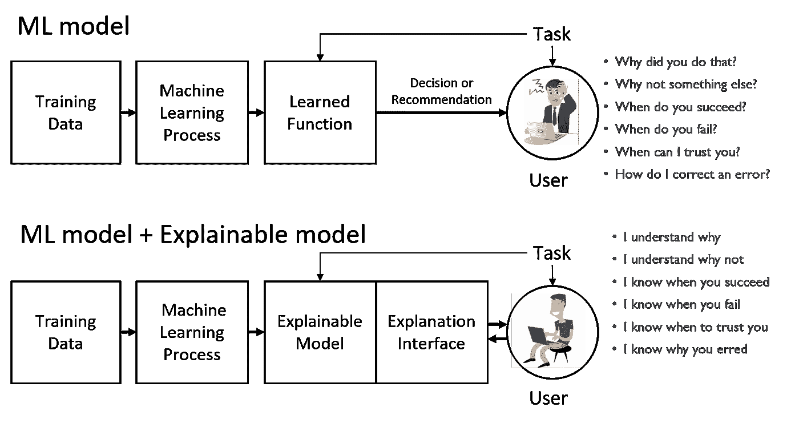

# 在现实世界的 ML 应用中利用可解释性

> 原文：<https://towardsdatascience.com/leveraging-explainability-in-real-world-ml-applications-part-1-3be567c00594?source=collection_archive---------49----------------------->

## 利用可解释性优化 ML 模型

来源:[https://we present . we transfer . com/story/yes-but-why-yayoi-ku sama/](https://wepresent.wetransfer.com/story/yes-but-why-yayoi-kusama/)

# 为什么是 XAI？

如今，现实世界的机器学习应用受《通用数据保护条例(GDPR)》法律的管辖，当自动决策发生时，该法律赋予“所有个人获得有关逻辑的有意义解释的解释权”。

传统的机器学习模型(如神经网络)很复杂，缺乏透明度，它们实际上被认为是黑盒模型，数据进来，预测出来，而不知道导致这些预测的内部逻辑。

在医疗或军事应用等许多安全关键环境中，了解内部机制并获得用户的信任是 ML 应用的关键要素。

## 数据偏差

在使用大量数据的数据驱动应用程序中，解释的需求也是至关重要的，因为我们收集的数据可能包含人类的偏见和成见。

其中一个例子是 COMPASS，这是美国法院用来评估被告成为惯犯的可能性的软件。2016 年,《propublica.org 》(一份在线报纸)显示，根据该软件提供的特征分析分数，没有再次犯罪的黑人被归类为高风险的两倍于没有再次犯罪的白人，白人惯犯被归类为低风险的两倍于黑人惯犯。

根据 Lipton Zachary C. [1]的说法，当使用 ML 应用程序进行犯罪率预测来分配警察时，训练数据集中的种族偏见可能会导致预测，从而通过过度监管某些街区来延续监禁循环。

> 理解 ML 算法的预测是如何产生的，为什么在某些情况下模型会失败，以及它何时能正确工作，这些都是当今 ML 模型中更透明、可信和稳健的基本要素。

## **XAI 的目标**

1.  提供预测的解释
2.  了解整体优势和劣势
3.  对系统未来行为的理解。

**来源:** Broad Agency 公告可解释人工智能(XAI)DARPA-BAA-16–53

# 如何在 ML 应用中集成 XAI？

为了获得一个可解释的 ML 模型，有必要考虑下面的需求列表:

*   **复杂性**人类能够理解输入和预测之间关系的程度。衡量可解释性通常与模型的大小有关，如决策树的深度、树的深度、规则的数量等。
*   **准确性**可解释的 ML 模型准确预测未知实例的程度。
*   **保真度**可解释模型能够模仿黑盒行为的程度。它被定义为可解释模型相对于黑盒模型预测的准确性。

## **全球和局部可解释模型**

全局可解释模型包括提供模型的整体逻辑和模式，并遵循导致所有不同结果的整体推理。换句话说，它解释了因变量(预测)和自变量(解释变量)之间的条件交互作用。

一个局部可解释的模型反而为单个实例的预测提供了解释。它解释了关于单个实例的因变量(预测)和自变量(解释变量)之间的条件交互作用。

## **XAI 在现实生活中的应用**

使用 XAI 模型提出了许多解决可信性、公平性和健壮性的方法，我在这里引用一些例子:

在[2]中，作者提出了一个解释模型来提高系统的可信度。解释模型包括解释任何 ML 文本分类器的预测，这是通过在预测周围局部地学习可解释模型并提供对该模型的洞察来实现的，该洞察可用于将不可信的模型或预测转换成可信的模型或预测。

在[3]中，作者提出了一种方法，该方法包括利用基于树的集成分类器的路径，以在调整特征值时产生关于将真正的负样本转换为正预测样本的建议。这种方法被应用于在线广告的环境中，因为它可以通过移动它们在广告质量特征空间中的位置，将低质量广告(真正的负面实例)转换成一组新的“提议的”高质量广告(正面实例)。

在人脸识别系统领域,[4]的作者提出了一种方法，该方法提供了失败中的模式，例如测试图像的模糊性，并用人类可以理解的语义特征来概括它们。ML 工程师可以在训练时使用这些故障模式来设计更好的功能或收集更集中的训练数据。它还可以在测试时使用，以了解何时忽略系统的输出，从而使其更加可靠。

# 摘要

大多数部署的真实 ML 应用程序都被构造成不透明的黑盒。能够理解 ML 模型的结果在许多领域变得至关重要。在我的下一篇文章中，我将更详细地描述 XAI 的技术和实现的工具，它允许一个 ML 工程师容易地集成一个 XAI 模型。敬请期待！！

# **参考文献**

克里斯托弗·莫尔纳尔。可解释的机器学习:使黑盒模型可解释的指南，2018 年

国防高级研究计划局。可解释的人工智能(XAI)，2016

Guidotti Riccardo、Monreale Anna、Ruggieri Salvatore、Turini Franco、Giannotti Fosca 和 Pedreschi Dino。"解释黑盒模型的方法综述。"美国计算机学会计算调查(CSUR)51.5(2018):1–42。

[1] Lipton Zachary C .,“模型可解释性的神话”*队列*16.3(2018):31–57。

[2]里贝罗·马尔科·图利奥、萨梅尔·辛格和卡洛斯·盖斯特林。“我为什么要相信你？”解释任何分类器的预测。第 22 届 ACM SIGKDD 知识发现和数据挖掘国际会议论文集。2016.

[3] Tolomei Gabriele、Silvestri Fabrizio、Haines Andrew 和 Lalmas Mounia。“通过可操作的特征调整对基于树的集合进行可解释的预测。”*第 23 届 ACM SIGKDD 知识发现和数据挖掘国际会议论文集*。2017.

[4]班萨尔·阿尤什、阿里·法尔哈迪和德维·帕里克。"走向透明系统:故障模式的语义表征."欧洲计算机视觉会议。施普林格，查姆，2014 年。