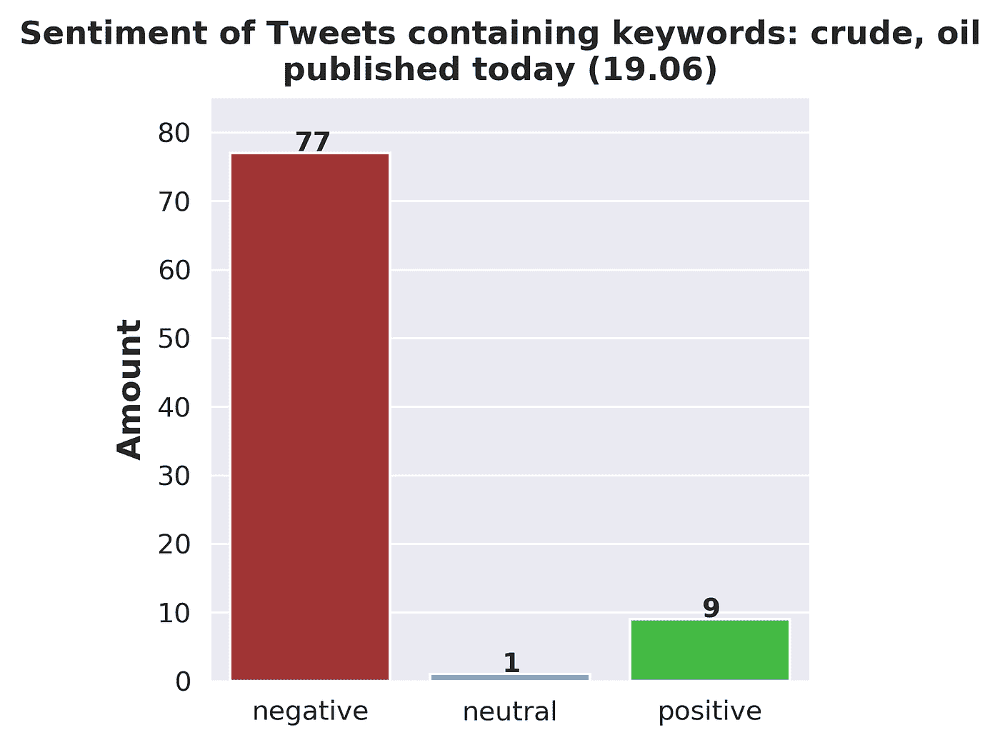

# 利用 ML 和社交媒体数据，根据当前市场情绪改进投资策略

> 原文：<https://towardsdatascience.com/leveraging-ml-and-social-media-to-improve-investing-strategies-based-on-the-current-market-f00d2c6e528a?source=collection_archive---------15----------------------->

## 数据科学

## 为可视化最新推文的情感分析结果创建管道


图片由[开工作室](https://stock.adobe.com/pl/contributor/207815932/open-studio?load_type=author&prev_url=detail)来自[土坯库存](https://stock.adobe.com/pl/images/futuristic-stock-exchange-scene-with-charts-numbers-and-world-trading-map-displayed-on-multi-screens-3d-illustration/230617255?asset_id=212616746)

机器学习和投资是与计算机科学实际应用相关的最常搜索的主题。不幸的是，它们也经常被自称为数据科学家的人滥用，这些人只在 YouTube 上看过几个教程，并声称通过对给定股票的先前价值应用线性回归，你很有可能预测其未来价格。

然而，事实远非如此。投资任何金融工具都是一件非常复杂的事情。教计算机如何模仿明智的商业决策是极具挑战性的——例如，什么是购买特定股票的最佳时机。这样的决定应该基于广泛的专业知识和严谨的研究——没有人能比你自己更好地决定如何使用你的钱。然而，我确实相信机器学习可以为你买到当今世界最珍贵的商品之一:时间。

如果你是一个积极的投资者，你很可能会定期浏览新闻网站，看看一些新的政府法规或另一个全球事件是否会拉低你刚刚购买的股票的价格。如果是这样的话，系好安全带，让我向你展示如何利用你选择的金融工具的最新推文建立你自己的情绪分析管道。

## **旁注**

请记住，本文的目的不是成为一个全面的 Python 教程——它展示了一个特定的 Python 应用程序。如果你是一个完全的初学者，我建议看看下面这篇关于学习 Python 的最佳资源的文章:

[](https://www.stxnext.com/blog/learn-python-top-sites-courses/) [## 如何学习 Python:顶级网站和课程，从初学者到专业人士

### 2.证明自己是 Codewars 方面的 Python 专家如果你正在寻找一个有益的学习经历，你不能去…

www.stxnext.com](https://www.stxnext.com/blog/learn-python-top-sites-courses/) 

或者，如果您对使用 Python 学习机器学习的基础知识特别感兴趣，请随时查看我的同事写的文章:

[](https://www.stxnext.com/blog/getting-started-machine-learning-python/) [## 教程:Python 机器学习入门

### 每隔一段时间，我都会很高兴在这个博客上发表一篇真正震撼我的世界的文章。这是其中之一…

www.stxnext.com](https://www.stxnext.com/blog/getting-started-machine-learning-python/) 

## **入门**

开始做的第一件事是获得使用官方 Twitter API(应用程序编程接口)的凭证。你可以在这里找到一个关于如何做到这一点的优秀教程:[点击](/access-data-from-twitter-api-using-r-and-or-python-b8ac342d3efe)

要继续，您需要:

*   一个 API 密钥，
*   一个 API 密钥，
*   一个访问令牌，
*   访问令牌机密。

有几种方法可以使用 API 凭证，最简单的方法是直接在程序中包含 API 键和令牌。然而，这不是一个好主意:如果你的程序因为某种原因被发布到网上，你的证书将会被公开。相反，我建议使用凭证作为 conda 环境变量。为此，你需要借助官方教程下载 Anaconda 或 Miniconda 发行版:[https://docs . conda . io/projects/conda/en/latest/user-guide/install/Linux . html)。](https://docs.conda.io/projects/conda/en/latest/user-guide/install/linux.html).) Conda 主要是一个包和一个环境管理系统，默认情况下以 Python 及其最流行的数据分析库为特色。我们以后会用到它们。

一旦安装了 Conda，您应该为您的项目创建并激活一个单独的环境。您可以通过键入以下命令来完成此操作:

```
conda create --name twitter_sentiment python=3.7
conda activate twitter_sentiment
```

如果您使用 Linux 发行版或 Mac，请在终端中键入它。如果您使用 Windows，请在 Anaconda 提示符下键入它。接下来，我们将继续设置环境变量。

## **设置环境变量— Linux/Mac**

接下来，让我们将 Twitter API 键作为您的环境特有的变量。在终端中写入:

```
cd $CONDA_PREFIX
```

然后，您需要创建一个新的“etc”目录，在这个目录中，您应该还有两个目录:“activate.d”和“deactivate.d”。

```
mkdir ./etc
mkdir ./etc/conda/activate.d
mkdir ./etc/conda/deactivate.d
```

这是在文件中包含凭据的步骤。将目录更改为`./etc/activate.d`，然后用您最喜欢的文本编辑器(我喜欢用 *vi* 来编辑一个名为`env_vars.sh`的文件)和您的 Twitter API 凭证:

```
cd ./etc/conda/activate.d
vim env_vars.sh
```

`env_vars.sh`文件的内容应该如下:

```
#!/bin/sh
export consumer_key='your_consumer_key'
export consumer_secret='your_consumer_secret'
export access_token_key='your_acess_token_key'
export access_token_secret='your_acess_token_secret'
```

接下来，将目录更改为`../deactivate.d`，然后创建另一个`env_cars.sh`文件:

```
cd ../deactivate.d
vim env_vars.sh
```

用以下内容填充`env_vars.sh`文件:

```
#!/bin/sh
unset consumer_key
unset consumer_secret
unset access_token_key
unset access_token_secret
```

你的证件现在都准备好了。现在，您可以暂时停用您的环境(必须这样做才能正确设置环境变量)，将您当前的工作目录切换到您想要的位置(让我们假设这是`$HOME/twitter_sentiment`)并重新激活 Conda 环境，以便您:

```
conda deactivate
mkdir $HOME/twitter_sentiment
cd $HOME/twitter_sentiment
conda activate twitter_sentiment
```

## **设置环境变量—窗口**

这个过程与 Linux 或 Mac 的过程非常相似，但是有一些微小的变化，因为 Windows 不支持 Bash shell。一旦您的新环境被激活，您可以随意将目录更改为环境的主目录，并创建必要的目录和`env_vars.bat`文件——在 Anaconda 提示符下键入以下命令:

```
cd %CONDA_PREFIX%
mkdir .\etc\conda\activate.d
mkdir .\etc\conda\deactivate.d
type NUL > .\etc\conda\activate.d\env_vars.bat
type NUL > .\etc\conda\deactivate.d\env_vars.bat
```

然后，用任何文本编辑器(可以使用记事本)打开文件`.\etc\conda\activate.d\env_vars.bat`:

```
cd ./etc/conda/activate.d
notepad env_vars.bat
```

并将您的 Twitter API 凭证插入到`env_vars.bat`文件中:

```
set consumer_key='your_consumer_key'
set consumer_secret='your_consumer_secret'
set access_token_key='your_acess_token_key'
set access_token_secret='your_acess_token_secret'
```

接下来，将目录更改为`../deactivate.d`，然后编辑位于那里的`env_vars.bat`文件:

```
cd ../deactivate.d
notepad env_vars.sh
```

包含以下内容:

```
set consumer_key=
set consumer_secret=
set access_token_key=
set access_token_secret=
```

你的证件现在都准备好了。现在，您应该暂时停用您的环境(为了正确设置环境变量，必须这样做)，将您当前的工作目录切换到您想要的位置(让我们假设这是`%HOME%/twitter_sentiment`)并重新激活 Conda 环境，以便您:

```
conda deactivate
mkdir %HOME%/twitter_sentiment
cd %HOME%/twitter_sentiment
conda activate twitter_sentiment
```

## **安装 NLTK 和 python-tweeter 包**

在编写一些代码之前，我们需要安装一些包，让我们能够完成我们打算做的工作——即与 Tweeter API 进行通信，然后对获得的 Tweets 文本进行情感分析。对于前者，我建议使用 python-twitter 模块。对于后者，有许多优秀的选择，其中最受欢迎的是 VADER。它已经被集成到 Python 所提供的最强大的自然语言处理引擎中——NLTK(自然语言工具包)。只需键入以下命令:

```
pip install python-twitter
pip install nltk
python -m nltk.downloader vader_lexicon
```

这将安装 python-twitter 和 NLTK 包以及 NLTK 库的 VADER 扩展。现在，让我们继续实际的代码本身。

## 旁注

如果您不使用 Python 的 conda 发行版，您还需要安装 matplotlib 和 seaborn 包—您可以通过在控制台中键入:

```
pip install matplotlib
pip install seaborn
```

## **编码—与 Twitter API 通信**

为了方便起见，我在这里使用的代码也可以在我的 Github 页面上找到:[https://github.com/szymonzaczek/towards-data-science/](https://github.com/szymonzaczek/towards-data-science/blob/master/twitter_sentiment_visualisation_pipeline/twitter_sentiment_visualisation_pipeline.py)

让我们从导入必要的包开始。

“Twitter”包是 Twitter API Python 模块；“os”允许我们与操作系统进行交互；` datetime '用于处理日期(我们将需要它，因为我们将试图获得最近的推文)；“re”包允许使用正则表达式。我们将使用“pandas”来方便地处理数据，并使用“matplotlib.pyplot”和“seaborn”来创建信息丰富且精美的图表。“SentimentIntensityAnalyzer”将是我们的主力——这是一个用于评估给定推文情绪的类。

下一步是设置我们的 API 访问。因为我们使用 conda 环境，所以我们可以通过调用“os.environ.get()”方法轻松访问我们的凭证，并使用这些调用的结果作为实际 Twitter 的参数。API 对象。请记住，我们将利用“tweet_mode="extended " ”,因为我们不想截断 tweet，我们希望对它们进行整体分析。

接下来，我们需要选择关键词，作为我们搜索相关推文的基础。应该明智地选择它们——例如，如果你选择“苹果”作为关键词，大多数搜索结果可能会涉及科技公司，但其中一些也可能与我们喜爱的水果有关。理想情况下，这些关键字不应该有多重含义。我们将搜索包含所有指定关键词的 Twitter 帖子。为了程序正常运行，选择一到三个关键词。我选择了“原油”和“石油”,并将这些关键词组合成一个列表。

现在，让我们确定今天是星期几。Python 有一个非常简洁明了的方法:因为我们已经导入了“datetime”模块，所以只需调用“datetime.date.today()”方法并将其值赋给一个变量:

在这一点上，我们需要在“while”循环中包含我们的代码。为什么？稍后我会讲到这一点，但现在，我们将开始循环:

从现在开始，任何代码都应该缩进(Python 中的缩进默认被视为四个空格或一个制表符)；直到我们离开这个圈子。然后，我们继续为 Twitter 搜索构建一个查询。有几种方法可以做到这一点，我选择用“raw_query”方法搜索 Twitter。这意味着将使用模拟浏览器中使用的查询搜索的查询直接调用 API(有关更多信息，请参见[https://python-Twitter . readthe docs . io/en/latest/searching . html)。](https://python-twitter.readthedocs.io/en/latest/searching.html).)这提供了一种处理搜索时间框架的简洁方法。但是，它要求您非常严格地遵守格式规则，但是一旦查询完成，您就可以忘记这些规则。因为我们想要使用时间框架来搜索 Twitter，所以我们必须根据“raw_query”的要求来格式化“date_for_query ”(顺便说一下，这是格式化日期的一种非常标准的方式):

然后，使用字符串连接构造查询，如下所示:

如果您是 Python 的初学者，这可能看起来很可怕，但是请记住，它拥有您需要的一切，并且会自动适应您的用例。“查询”变量将包含所有先前指定的关键字(通过使用“%20”)。join(keywords)` command)、right day (`date_formatted `)以及` raw_query `()(例如`%20 `和`%3A `标签、过滤掉链接、仅保留回复而不引用原始帖子等)所需的一些其他内容。).之后，我们需要调用实际的搜索方法，同时将其结果赋给一个变量:

就像这样，我们已经有了 Twitter 的搜索结果。然而，我们仍然不知道里面到底有什么。如果对任何社交媒体内容的分析是为了指导投资策略，我们应该确保这种分析不是使用排除的例子，而是一批帖子。让我们假设，出于我们的目的，我们将需要至少 30 条推文。这就是为什么我们将代码封装在“while”循环中:现在我们可以指定，如果我们的搜索结果超过 30 条 Tweets，我们将退出循环:

棘手的部分来了。如果我们没有足够的推文，我们该怎么办？当然，我们可以将搜索范围扩大到更早的日期。为此，我们只需将“查询日期”变量的值更改为当前“查询日期”的前一天。由于代码现在处于循环中，这将很容易。但是，在这样做之前，让我们检查“date_for_query”变量中的当前日期是否不早于七天。这很重要，原因有二。首先，超过那个时间的推文不应该真正影响当前关于你的目标关键词的情绪。其次，Twitter 的基本 API 不允许搜索超过七天的推文。可以使用“datetime.timedelta()”方法对“datetime”对象进行数学运算。此外，如果我们的搜索已经达到极限，我们可以用一个优雅的错误消息抛出 ValueError。这并不是真正的 Pythonic，但是在这里我们宁愿过于急切，也不愿给用户留下几乎没有信息的消息(由于字符串非常长，这里的格式并不完美)。

如果我们还没有达到极限，我们可以将搜索范围扩大到前一天。这很容易做到:

就像这样，我们完成了与 Twitter API 的直接交互。以下代码总结了整个“while”循环:

使用这段代码，我们要么会收到至少 30 个“twitter.models.Status”对象(包含在“search_results”列表中)，要么会收到一条错误消息，提示我们没有为给定关键字找到足够的 Tweets。在这种情况下，你应该修改你的关键字。要么少用一些，要么用更通用的，因为“关键词”列表中的每个关键词都必须在你搜索的每条推文中找到。

## **数据处理**

下一步是从“search_results”列表中包含的“twitter.models.Status”对象列表中提取各个 Tweets 的文本。请记住，我们的目标是对推文进行情感分析，并了解人们对我们选择的关键词的当前感受。在我的情况下，它将是“原油”和“石油”。为了让这种分析尽可能公正，我们应该确保每条推文都是由不同的用户发布的。因此，我们将从初始化两个列表开始:

现在，我们可以开始填充这些列表。为此，我们需要一个循环，在这个循环中，我们将迭代“search_results”。对于每次迭代，我们将检查给定的 Tweet 是否是由唯一的用户发布的。如果同一个用户发布了多条推文，我们将只使用找到的第一条。为此，我们可以使用嵌入在“if/else”子句中的“not in”成员运算符。如果在我们的搜索结果中有同一作者的多个帖子，我们将使用“继续”语句转到下一个帖子。如果我们有一个作者的帖子，而这个作者以前没有出现在我们的搜索中，让我们从 Tweet 中提取“full_text”属性(当然，这是 Tweet 的文本):

Twitter 用户经常过度使用各种标签并提到其他人。我看不出有什么理由要把它们包含在情感分析中，所以让我们把它们去掉吧。这可以使用正则表达式来完成，这是一种在字符串中查找字符串的强大工具。重要的是，正则表达式是编程语言不可知的，因此，它们是一个可以放在口袋里的伟大的通用工具。在 Python 中,“re”模块负责处理它们，它的“re.sub()”方法允许用另一个字符串替换一个字符串。在这种情况下，我们寻找以` @ '或`#`开头的单词，我们简单地通过用空字符串替换它们来删除这些单词。

此外，非常短的帖子往往会给情感评估带来挑战，所以我们可能希望确保将要分析的帖子至少有 20 个字符长。此外，如果在推文的开头有任何标签或提及，这些帖子前面会有空白。让我们通过使用' lstrip()'方法来消除它:

总而言之，从 Tweets 中提取实际的文本，这是填充“tweets_text”列表的整个循环:

## **获取的推文的情感分析**

因此，到目前为止，我们一直在 Twitter 上搜索包含特定关键字的推文，并从中提取文本。情绪分析，这是激动人心的部分，现在开始。说实话，这一部分不需要很多代码，因为我们只需要将文本输入到“SentimentIntensityAnalyzer”对象中，然后提取出想要的输出。在这种情况下，将是从“polarity_scores”方法获得的“复合”分数，该“复合”分数由“SentimentIntensityAnalyzer”类提供。“复合”值描述了所提供文本的总体情感。如果文本的情感是积极的，它的“复合”分数是积极的。如果情绪是负面的，它的“复合”分数是负面的。当文本相当中性时,“复合”分数非常接近 0。“复合”分数的值作为来自字典的关键字被访问，该字典是运行“polarity_scores”方法的结果。此外,“复合”分数是用四个十进制数字格式化的浮点值。因为这样的精度对于我们的目的来说并不是真正必要的，所以让我们把它减少到两位小数。最后但同样重要的是:让我们使用“SentimentIntensityAnalyzer”类(基本上是我们的情感分析引擎)嵌入一个函数，并用类型提示来修饰它，对于输入(` tweet_text: str `)和输出(`-> float `):

总结这一部分,‘Vader _ perspective _ score’函数将单个 tweet 的文本作为参数，并返回一个描述情绪本身的 float。

现在，我们终于可以开始分析我们的推文了。让我们创建另一个列表，我们将在其中存储结果，并通过迭代推文执行一些机器学习，并将它们提供给执行情感分析的函数:

瞧啊。您刚刚对推文进行了情感分析。没那么难吧。您已经正式将机器学习应用于现实世界的数据，并且您已经通过世界上最受欢迎的网站之一的 API 访问了它。我得说，相当令人印象深刻。但是请注意，我们还远未接近终点。即使我们有数据，我们甚至还没有看到我们努力的结果。显然，如果您愿意，您可以只打印数值，但这不会提供太多信息。因此，让我们生成一个简洁、高质量的条形图，总结所有的发现。为此，让我们使用简单的“if `/“elif”语句将在前面步骤中获得的浮点数分配到它们的类别(负、中性和正),同时创建一个“情绪列表”来存储该操作的结果:

## **可视化结果**

现在，我们来看看如何创建条形图。有几个方法可以做到这一点，但我更喜欢的是使用伟大的和多才多艺的' seaborn '模块。出于我们的目的，我们可以只创建两个列表，其中包含绘图的 x 轴和 y 轴的数据。让我们方便地称它们为‘x 轴’和‘y 轴’。第一个将只包含我们的类别，而第二个将包含每个类别的计数。它们的创建方式如下:

如果你迫不及待地想看到结果，你可以通过调用 sns.barplot(x=x_axis，y=y_axis)来可视化你自己的情绪分析结果。然而，有一些额外的东西可能会使我们的情节看起来更加流畅。我非常喜欢尽可能方便地传达发现的可视化效果。这可以通过恰当而周到地使用颜色来实现。例如，让我们把负面的推文变成红色，中性的推文变成蓝色，正面的推文变成绿色。我们可以通过改变 seaborn 模块的调色板来做到这一点:

```
colors = [“firebrick”, “dodgerblue”, “limegreen”]
sns.set_palette(sns.color_palette(colors))
```

我们没有使用这些颜色的标准色调——我真的更喜欢红色的耐火砖变化，而不是标准的红色，等等。

我们还可以在图上包含一个网格，这样就可以更容易地比较条形的高度:

现在我们可以初始化“figure”对象，它就像是绘图的画布。让我们调整它的大小和分辨率:

给轴加标签总是个好主意。因此，让我们将“Amount”标签放在 y 轴上(粗体大字体)，同时创建一个“ax”变量，该变量指向绘图中的一个轴实例:

现在，我们有了创建地块本身的所有基本组件:

不过，我们不要就此打住。根据我们使用的关键字自动生成一个情节标题会很酷。我们也可以在标题中加入日期。然后，您将在单个图中获得分析的所有细节。不过有一个小小的警告——起初，我们试图寻找当天的推文。如果失败了，我们就试着寻找前几天的帖子，直到七天前。因此，如果我们的自动生成能够适应这些细节并有效地处理这两个例子，那将会很酷。为此，我们可以检查“date_for_query”变量是否与“datetime.date.today()”相同，然后使用自定义的绘图名称:

在这一点上，我们有了一个非常整洁的条形图，并根据我们的用例完全定制了标题。但是说实话:我们，人，是懒的。我们很少想要过度伸展我们的大脑。因此，如果图中的任何条形具有非常相似的高度，我们可能会搞不清楚我们是有更多负面还是正面的推文。我们可能会通过将分配给每个类别的推文的实际数量放在图上来更清楚地理解这一切。为此，我们可以使用“ax.annotate()”方法。为了正确地使用它，我们需要找出放置注释的确切位置。这可以通过从迭代可能从“ax”对象访问的补丁开始来完成。然后，对于每个面片，获取每个条的边界框坐标。最好的选择是将实际金额放在条形的正上方，这样注释就应该出现在条形的正上方。我们还想确保在地块中有足够的空间来容纳我们想要在那里找到的所有东西。因此，我们将 y 轴的端点设置为 seaborn 自动分配的值的 110%。我们还希望确保这些数字在条形上方非常居中，这就是我们检查“val”是大于还是小于 10 的原因。如果它更大，为了完全居中，我们添加两倍的偏移量(因为我们有两位数而不是一位):

对情节做的最后一件事就是把它保存在磁盘上。理想情况下，保存的图应有一个完整的描述性名称，包含分析的每个细节，类似于图标题中的内容。这可以使用以下代码来完成:

在这里，您可以找到创建和保存绘图的完整代码:

现在，看看我的图，它展示了我从 6 月 19 日开始对“原油”和“石油”的搜索:



作者创作的情节

## **总结**

现在你知道了！旅途并不艰难，对吧？尽管我们生成的代码并不复杂，但我们确实在这里使用了一些很酷的东西。事实上，你不仅使用官方 Twitter API 对你直接下载的推文进行了情感分析，而且还准备了 100%定制以适应你的用例的令人敬畏的可视化作品。简而言之:我们刚刚开发了一个通用管道，用于对包含您指定的关键词的推文进行情感分析，并创建了一个自动生成的令人敬畏和信息丰富的情节。有了这个管道，你所需要做的就是每天早上执行你的代码，然后你马上就会收到一个全新的图表，它会告诉你 Twitter 用户对你感兴趣的关键词的看法。这肯定会让你作为一个投资者的生活更方便，节省你的时间来处理更紧迫的事情，这肯定会帮助你的决策过程。当然，如果你愿意，你可以根据自己的喜好扩展代码。例如，您可以在云服务中设置这个脚本，让它在每天的固定时间运行，它甚至可以自动向您发送一封包含创建的绘图的电子邮件。不过这超出了本文的范围，也许我会在将来再次讨论它。尽管如此，如果你和我一起编码，你就已经创建了一个基于机器学习的分析管道，可以分析关于你选择的主题的最新推文。是不是很酷？

如果你想直接从有经验的程序员那里学习更多关于软件开发过程的知识，欢迎访问 STX Next 的博客:

 [## Python，软件开发，UX 和产品设计-博客- STX 接下来

### 阅读我们，了解 Python web 开发、技术新趋势和外包软件开发的正确方法。

www.stxnext.com](https://www.stxnext.com/blog)