# 利用 NLP 获得社交媒体、新闻和广播方面的见解

> 原文：<https://towardsdatascience.com/leveraging-on-nlp-to-gain-insights-in-social-media-news-broadcasting-ca89752ef638?source=collection_archive---------15----------------------->

## 为政府实体和私人组织定义社交媒体分析的结构化用例路线图

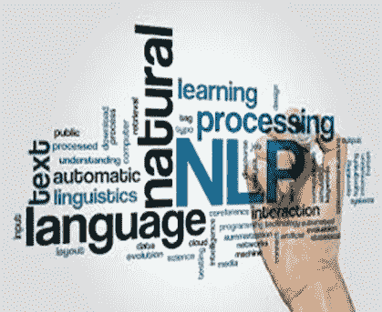

自然语言处理(NLP)是认知科学和人工智能的一个分支，涉及计算机和人类自然语言之间的交互。它专注于处理和分析自然语言数据。主要目标是让机器学习在理解语言方面像人类一样智能。这里的目标是展示各种 NLP 功能，如情感分析、语音识别和关系提取。自然语言处理中的挑战包括主题识别、自然语言理解和自然语言生成。

社交媒体分析利用从社交渠道收集数据并从中发现意义的能力来支持业务决策，并通过社交媒体根据这些决策衡量行动的绩效。例如，中东和北非的消费者是社交媒体平台最活跃的用户。该地区大量的青年人口和高移动渗透率使其成为公司的理想市场

在本文中，我们展示了私人和政府实体如何利用结构化的用例路线图，在社交媒体、新闻订阅、用户评论和广播领域等自然语言处理技术上产生见解。

# 社交媒体分析中的 IBM 方法

IBM 强调，随着社交媒体的流行，“一个伟大产品的消息可以像野火一样传播。关于劣质产品的新闻——或者客户服务代表的不愉快经历——也能迅速传播。消费者现在要求组织对他们的品牌承诺负责，并与朋友、同事和公众分享他们的体验。”

社交媒体分析帮助政府实体和公司处理这些体验，并利用它们来:

1.  发现与产品和品牌相关的趋势
2.  理解对话——说了什么以及如何被接受
3.  获取客户对产品和服务的情感
4.  衡量对社交媒体和其他交流方式的反应
5.  识别产品或服务的高价值特征
6.  发现竞争对手的说法及其有效性
7.  描绘第三方合作伙伴和渠道如何影响绩效

# 社交媒体中的 IBM 数据科学能力

有效的社交媒体分析的第一步是制定目标。目标可以从增加收入到确定服务问题。在那里，可以选择主题或关键字，并设置日期范围等参数。来源也需要具体说明——对 YouTube 视频、脸书对话、Twitter 争论、亚马逊产品评论、新闻网站评论的回应。

*   **自然语言处理**和机器学习技术识别非结构化数据中的实体和关系，非结构化数据是指没有预先格式化以用于数据分析的信息。几乎所有的社交媒体内容都是非结构化的。这些技术对于获得有意义的见解至关重要。
*   **细分**是社交媒体分析的基本需求。它根据地理位置、年龄、性别、婚姻状况、父母身份和其他人口统计数据对社交媒体参与者进行分类。它可以帮助识别这些类别中的影响者。通过了解谁在关键主题上进行互动，可以更好地调整信息、计划和响应，并使其更有针对性。
*   **行为分析** s 用于通过分配用户、推荐者、潜在用户和诋毁者等行为类型来了解社交媒体参与者的关注点。了解这些角色有助于开发有针对性的信息和回应，以满足、改变或转移他们的看法。
*   **情绪分析**测量社交媒体评论的语气和意图。它通常涉及自然语言处理技术，以帮助理解实体和关系，揭示积极、消极、中立或矛盾的属性。
*   **声音份额**分析关于品牌、产品、服务、声誉等话题的流行程度和激烈程度。它有助于确定关键问题和重要主题。它也有助于将讨论分为积极、消极、中立或矛盾。
*   **聚类分析**可以发现隐藏的对话和意想不到的见解。它将频繁出现的关键词或短语联系起来，并衍生出新的主题、问题和机会。例如，制作小苏打的人[利用聚类分析发现了新的用途和机会](https://www.ibm.com/blogs/business-analytics/watson-analytics-social-media-conversation-clusters/)。
*   **仪表盘和可视化**图表、图形、表格和其他演示工具总结和分享社交媒体分析结果，这是交流和运用所学知识的重要能力。它们还使用户能够更快地掌握意义和见解，并在没有高级技术技能的情况下更深入地研究具体的发现。

# 自然语言处理建模的文本预处理活动

在文本预处理期间，执行以下阶段:

*   **分词**是我们 **s** 把文本拆分成句子，再把句子拆分成单词的过程。我们把单词小写，去掉标点符号。
*   词干提取是对相关单词进行编目的一种粗略方法；它基本上是从字母的末端开始，直到到达词干。例如，在英语中，有很多例外。
*   **词汇化**超越了单词缩减，考虑语言的全部词汇，对单词进行形态分析。比如第三人称的单词改成第一人称，过去时态和将来时态的动词改成现在时态。单词被**词干化**——单词被还原成它们的词根形式。

NLP 模型的文本预处理活动

*   **规范化**是一个将单词列表转换成更加统一的序列的过程。这有助于为以后的处理准备文本。通过将单词转换为标准格式，其他操作就能够处理数据，而不必处理可能会影响该过程的问题。例如，将所有单词转换为小写将简化搜索过程。
*   **单词嵌入**或**矢量化**是 NLP 中的一种方法，用于将词汇中的单词或短语映射到相应的实数向量，该向量用于查找单词预测、单词相似性和语义。将文字转换成数字的过程称为**矢量化。**

# 自然语言处理中的文本表示模型

在本节中，我们将概述单词和句子矢量化中使用的最著名的文本表示模型，但我们不会深入研究技术细节。目前使用文本数据的特征提取的简单方法是:

# **1。词汇袋**

**单词袋模型**易于理解和实现，在语言建模和文档分类等问题上取得了巨大成功。

它是自然语言处理和信息检索(IR)中使用的一种简化表示。在这个模型中，一个文本被表示为它的单词的包(多重集),不考虑语法甚至词序，但保持多样性。

单词袋模型通常用于[文档分类](https://en.wikipedia.org/wiki/Document_classification)的方法中，其中每个单词的(出现频率)被用作训练分类器的特征。

单词袋模型易于理解和实现，并在诸如语言建模和文档分类等问题上取得了巨大成功。

我们将展示单词袋模型如何在文本矢量化空间中工作。让我们考虑一下，我们有以下 3 篇来自中东新闻的文章。

1.  [沙特阿拉伯首次向外国人颁发永久居留权](https://gulfnews.com/world/gulf/saudi/saudi-arabia-issues-first-permanent-residencies-to-foreigners-1.1573622585766)
2.  [沙特首次向外国游客敞开大门](http://Saudi Arabia Is Opening Its Doors to Foreign Tourists for the First Time)
3.  [透露利雅得季节对沙特旅游的影响](https://www.arabianbusiness.com/travel-hospitality/438912-revealed-the-success-of-riyadh-season-on-saudi-tourism)

然后，对于每个单词，插入该单词在相应文档中的频率

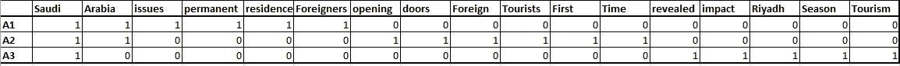

文章中的术语频率表

上表描述了包含每个文档中每个单词的词频的训练特征。这被称为单词袋方法，因为在这种方法中出现的次数而不是单词的顺序或次序是重要的。

# **2。TF-IDF**

**TF:术语频率，**度量术语在文档中出现的频率。因为每个文档的长度不同，所以一个术语在长文档中出现的次数可能比短文档多得多。因此，术语频率通常除以文档长度(又名。文档中的术语总数)作为标准化的一种方式:

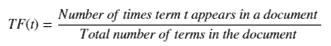

TF 数学公式

**TF-IDF** 权重是一种统计度量，用于评估一个单词对集合或语料库中的文档有多重要。重要性与单词在文档中出现的次数成比例增加，但是被单词在语料库中的频率抵消。

**IDF:逆文档频率**，衡量一个术语的重要程度。在计算 TF 时，所有项都被认为是同等重要的。然而，众所周知，某些术语，如“是”、“的”和“那个”，可能会出现很多次，但并不重要。因此，我们需要通过计算以下各项来降低频繁项的权重，同时提高罕见项的权重

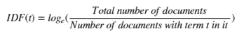

IDF 数学公式

# **3。Word2Vec 的单词嵌入**

**Word2Vec** 模型用于学习单词的向量表示，称为“单词嵌入”。这通常是作为预处理步骤完成的，在此之后，学习到的向量被输入到判别模型中，以生成预测并执行各种有趣的事情。它需要单词的语义。我会在我的下一篇博客中详尽地分析 Word2Vec trin。

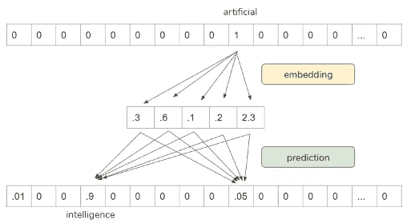

来源:[https://www.infoq.com/presentations/nlp-practitioners/?ITM _ source = presentations _ about _ Natural-Language-Processing&ITM _ medium = link&ITM _ campaign = Natural-Language-Processing](https://www.infoq.com/presentations/nlp-practitioners/?itm_source=presentations_about_Natural-Language-Processing&itm_medium=link&itm_campaign=Natural-Language-Processing)

# 指示性数据和人工智能用例路线图

下面您可以看到一个结构化用例路线图的轮廓，该路线图可以为政府实体和私人组织定制，利用自然语言处理和人工智能从社交媒体、新闻源和广播内容中获得重要的见解。

## 1.主题建模和文本分类

在自然语言处理中，有一个透镜层次，通过它我们可以提取意义——从单词到句子到段落到文档。在文档级别，理解文本的最有用的方法之一是分析其主题。在一系列文档中学习、识别和提取这些主题的过程被称为**主题建模**

有几种现有的算法可以用来执行主题建模。最常见的是 [**潜在语义分析**](https://en.wikipedia.org/wiki/Latent_semantic_analysis)**【LSA】**[**潜在狄利克雷分配(LDA)**](https://en.wikipedia.org/wiki/Latent_Dirichlet_allocation) *和* [**非负矩阵分解****【NMF】**](https://en.wikipedia.org/wiki/Non-negative_matrix_factorization)**在这一节中，我给出了这些技术的概述，但不涉及技术细节。**

***潜在语义分析，**或 LSA，是主题建模的基础技术之一。核心思想是利用我们所拥有的矩阵——文档和术语——并将其分解为一个单独的文档-主题矩阵和一个主题-术语矩阵。第一步是生成我们的文档术语矩阵。*

*作为主题建模中常用的方法，**潜在狄利克雷分配** (LDA)是一种生成统计模型，它允许通过未观察到的组来解释观察集，从而解释为什么数据的某些部分是相似的。例如，如果观察是收集到文档中的单词，那么它假设每个文档是少量主题的混合物，并且每个单词的出现都归因于文档的一个主题。LDA 是主题模型的一个例子，并且属于机器学习工具箱，并且在更广泛的意义上属于人工智能工具箱。*

***非负矩阵分解** (NMF)可以应用于主题建模，其中输入是术语-文档矩阵，通常是 TF-IDF 归一化。它来源于多元分析和线性代数，其中一个矩阵被分解成(通常)两个矩阵 W 和 H，并且这三个矩阵都没有负元素。*

*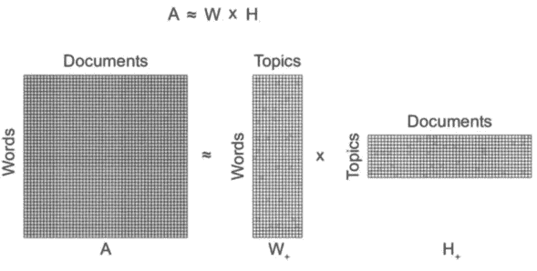*

*来源:[https://www . researchgate . net/figure/Conceptual-illustration-of-non-negative-matrix-factorization-NMF 分解-of-a_fig1_312157184](https://www.researchgate.net/figure/Conceptual-illustration-of-non-negative-matrix-factorization-NMF-decomposition-of-a_fig1_312157184)*

*识别主题有益于各种目的，例如用于聚类文档、组织用于信息检索和推荐的在线可用内容。多个内容提供商和新闻机构正在使用主题模型向读者推荐文章。类似地，招聘公司也在提取职位描述，并将它们与候选人的技能组合对应起来。*

*媒体公司和媒体监管机构可以利用主题建模功能对新闻媒体中的主题和内容进行分类，并识别具有相关性的主题、当前流行的主题或垃圾新闻。在下面的图表中，IBM 团队执行了一个自然语言分类模型来识别相关、不相关和垃圾新闻。*

*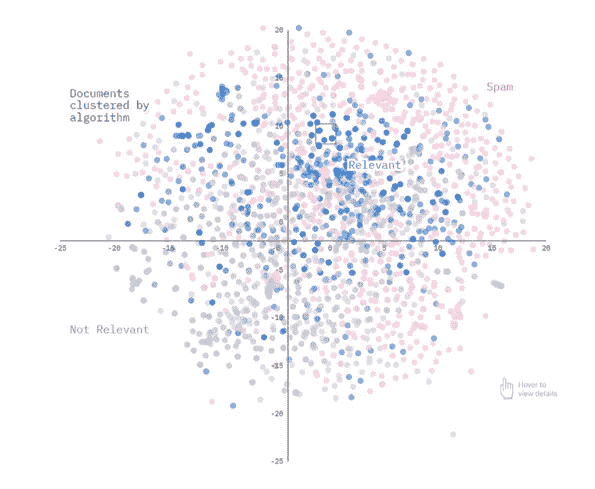*

*基于与特定主题相关和不相关的文档聚类来源:IBM Data Science Elite*

*主题建模有助于探索大量的文本数据、发现单词簇、文档间的相似性以及发现抽象主题。似乎这些理由还不够令人信服，主题建模也被用在搜索引擎中，其中搜索字符串与结果相匹配。*

## *2.情感分析*

*情感分析是指识别书面或口头语言中的情感倾向(积极、中立和消极)。情感分析的另一种方法包括更细粒度的情感分析，其在极性分析的水平上给出更高的精度，该极性分析旨在识别表情中的情感(例如，快乐、悲伤、沮丧、惊讶)。该用例旨在开发一种情感分析方法和可视化，该方法和可视化可以提供关于各种源类型和特征的情感水平的重要见解。*

*如今，企业希望了解买家对其品牌的评价，以及他们对产品的感受。然而，随着所有的“噪音”充斥着我们的电子邮件、社交和其他沟通渠道，倾听客户已经成为一项艰巨的任务。在这份情感分析指南中，您将了解基于机器学习的方法如何大规模地提供客户洞察，并确保您不会错过任何一次对话。*

*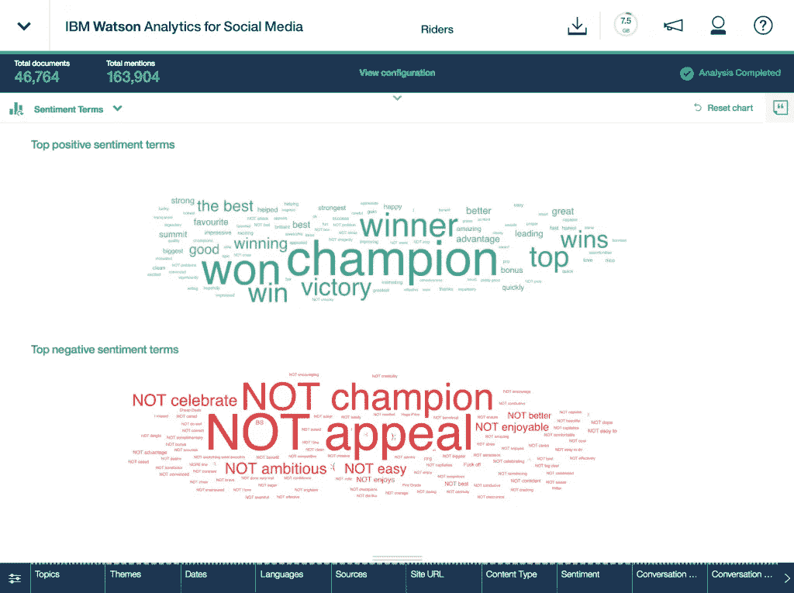*

*情绪分析仪表板。来源 IBM Watson Analytics*

## *3.命名实体识别*

*命名整体识别是一个从非结构化文本中识别信息单元的过程，这些信息单元如名称，包括个人、组织和位置名称，以及数字表达式，包括时间、日期、金钱和百分比表达式。目标是开发实用的和独立于领域的技术，以自动检测高精度的命名实体。*

*[命名实体识别](https://en.wikipedia.org/wiki/Named-entity_recognition) (NER)可能是信息提取的第一步，它试图定位文本中的[命名实体](https://en.wikipedia.org/wiki/Named_entity)并将其分类成预定义的类别，如人名、组织、位置、时间表达式、数量、货币值、百分比等。NER 在自然语言处理(NLP)的许多领域都有应用，它可以帮助回答许多现实世界的问题，例如:*

*   *新闻中提到了哪个公众人物、政府、国家或私人组织？*
*   *投诉或评论中是否提到了特定产品？*
*   *推文包含人名吗？推文包含这个人的位置吗？*

*下面的例子说明了命名实体识别在文章主题中是如何工作的。*

**

*新闻文章:来源:[https://gulf news . com/world/gulf/Saudi/Saudi-Arabia-issues-first-permanent-residence-to-foreign-1.1573622585766](https://gulfnews.com/world/gulf/saudi/saudi-arabia-issues-first-permanent-residencies-to-foreigners-1.1573622585766)*

*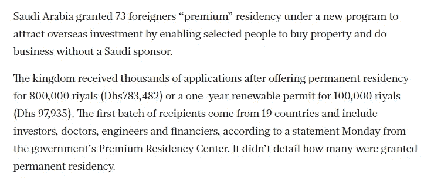*

*节选自《海湾新闻》关于沙特阿拉伯永久居留权的文章*

*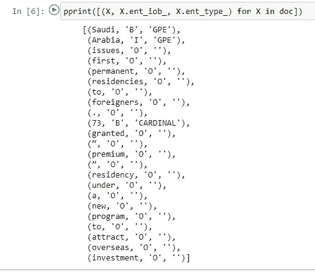*

*海湾新闻文章中的实体名称识别*

*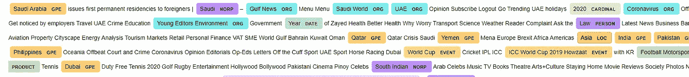*

*海湾新闻文章中的命名实体分类*

***4。词性标注***

*在语料库语言学中，词性标注(POS tagging)也称为语法标注或词类消歧，是根据其定义和上下文(即，其与短语、句子或段落中相邻和相关单词的关系)将文本(语料库)中的单词标记为对应于特定词性的过程。这种方法的一种简化形式通常是教学龄儿童识别名词、动词、形容词、副词等。*

*下面的例子展示了如何在一个特定的句子中应用词性标注，并提取词类来识别代词、动词、名词、形容词等。*

*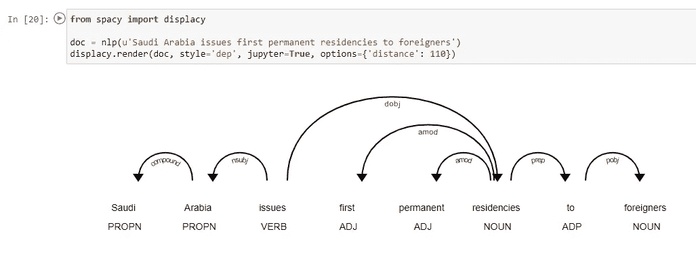*

*词性识别和关系提取*

*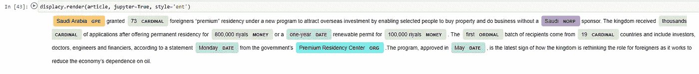*

*新闻文章中的词性标注*

## *5.关系抽取和文本相似性*

*文本挖掘收集和分析文档、社交媒体、评论、新闻源、数据库和存储库中的结构化和非结构化内容。该用例可以利用文本分析解决方案来抓取和导入内容、解析和分析内容以及创建可搜索的索引。语义分析描述了基于意义和上下文理解自然语言(人类交流的方式)的过程。它分析周围文本中的上下文，并分析文本结构，以准确消除具有多个定义的单词的含义。*

*这种技术识别先前在给定文本中识别的命名实体对之间存在的关系。语义文本相似性处理确定两个文本有多相似。例如，这可以采取分配分数或分类(相似与不同)的形式*

*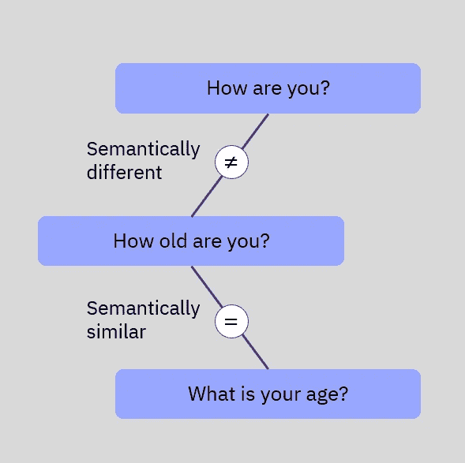*

*文本关系示例:年龄查询来源:IBM*

## *6.视频广播的内容分析*

*内容分析是一种 NLP 驱动的方法，根据用户评论将视频(如 youTube)聚类到相关主题中。最常用的技术是使用单词包的主题建模 LDA，如上所述，它实际上是一种无监督的学习技术，将文档记录为单词包。*

*   *该文档是通过选择一组主题，然后为每个主题选择一组单词而生成的。随后，它试图以一种主动的方式识别哪个单词属于哪个话题。*
*   *它假设文档中的每个单词的主题都是错误的，但其他每个单词的主题都是正确的。最终的输出是对特定主题的分类和排序。*

*处理这个用例的另一种方法是使用一种叫做奇异值分解 SVD 的技术。奇异值分解(SVD)是实矩阵或复矩阵的因式分解，其通过极坐标分解的扩展将标准方阵的特征分解推广到任何 m×n 矩阵。SVD 方法包括如上所述的文本预处理阶段和术语频率矩阵。*

*在下面的典型模型输出中，我们可以看到对视频评论应用聚类后最主要的主题是什么，以及这些主题如何在主题间距离图中相互关联。右侧的水平条形图根据出现频率显示特定主题类别中最相关的术语。*

*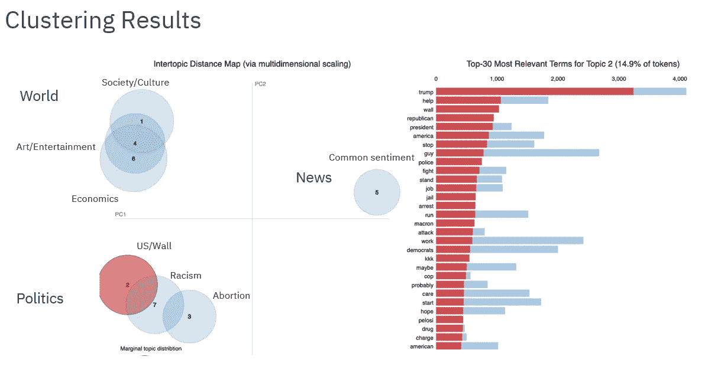*

*主题聚类结果-主题间距离源 IBM*

## *7.话题趋势检测和根本原因分析*

*文本分析的异常或异常检测可以被认为是异常帖子、不规则评论甚至是垃圾新闻，它们似乎与其余数据无关。*

***根本原因分析** (RCA)是识别导致制造产品缺陷或质量偏差的因素的过程。制造业中根本原因分析的常见例子包括鱼骨图等方法。为了使用机器学习来执行 RCA，我们需要能够检测出一些不寻常的东西，或者换句话说，异常或异常值的存在。下图概述了根本原因分析过程。*

*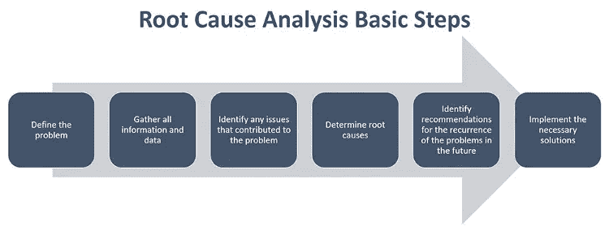*

*来源:[https://medium . com/ocean ize-geeks/root-cause-analysis-a992b 01685 b 2](https://medium.com/oceanize-geeks/root-cause-analysis-a992b01685b2)*

*机器学习模型经过训练，可以分析常规社交媒体订阅源、帖子和评论下的话题。与正常的馈入行为相比，异常值可以表现为信号的振幅、周期或同步相位的任何偏差模式。*

*该算法基于异常的当前行为模式形成预测。如果预测值超过在训练阶段确认的阈值，则发送警报。*

*使用机器学习执行根本原因分析时，我们需要能够检测出趋势。文本挖掘中机器学习的趋势分析是从非结构化、半结构化和结构化的文本数据中定义创新的、未知的知识的方法。它旨在根据事件和主题在特定源或领域中出现的频率来检测事件和主题的峰值。这为垃圾邮件和欺诈性新闻和帖子检测提供了重要的洞察力。*

*目标是分析新闻订阅源、评论和/或社交媒体帖子，并尝试识别事件流、社交媒体和新闻订阅源中出现频率高或似乎不符合其余内容或一般背景的趋势，例如垃圾邮件、欺诈性或趋势性帖子或主题趋势的变化。*

**

*自动编码器源的基本结构:[https://www.compthree.com/blog/autoencoder/](https://www.compthree.com/blog/autoencoder/)*

*这个领域中最成功的技术之一是使用自动编码器进行异常主题检测。[自动编码器](https://en.wikipedia.org/wiki/Autoencoder)是一个无监督的人工神经网络，它的主要用途之一是它能够**检测异常值**。请注意，离群值是从数据集的规范中“脱颖而出”的观察值。然后，如果模型用给定的数据集训练，离群点将是较高的重建误差，因此离群点将很容易通过使用该神经网络来检测。*

## *8.NLP 模型洞察和可视化*

*可视化表示自然语言处理模型或文本探索性分析的内容是文本挖掘领域最重要的任务之一。从数据科学和 NLP 的角度来看，我们不仅从不同的方面和不同的细节级别探索文档的内容，而且我们还总结单个文档，显示单词和主题，检测事件，并创建故事情节。在许多情况下，可视化非结构化(文本)数据和结构化数据之间存在一些差距。例如，许多文本可视化不直接表示文本，它们表示自然语言处理模型的输出，例如字数、字符长度、单词序列。*

*单变量或单变量可视化是最简单的可视化类型，它仅由对单个特征或属性的观察组成。单变量可视化包括直方图、条形图和折线图。*

*在下面的图表中，我们可以看到基于建议的客户评价的极性分布，等级为 1 到 1。*

*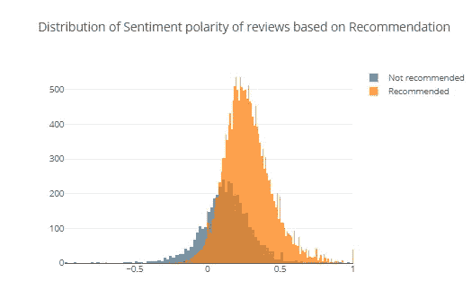*

*影评推荐上的情感极性分布来源:[https://towards data science . com/a-complete-explorative-data-analysis-and-visualization-for-text-data-29 fb1 b 96 FB 6a](/a-complete-exploratory-data-analysis-and-visualization-for-text-data-29fb1b96fb6a)*

*文字云是一种显示文字在文本集合中有多重要的流行方式。基本上，使用频率越高的单词在图像中占据的空间越大。词云的用途之一是帮助我们对文本集的内容有一个直觉。*

*假设你想建立一个文本分类系统。如果你想知道不同类别中有哪些不同的常用词，你可以为每个类别建立一个词云，看看每个类别中最流行的词是什么。*

**

*Worldcloud 显示文本中每个单词的含义来源:IBM*

*查看每个主题中最常用的单词，我们有一种感觉，我们可能无法在主题类别之间达到任何程度的分离。换句话说，我们不能使用主题建模技术按部门分离评论文本。*

*作为总结，本文的目的是概述 NLP 可以提供独特优势和可操作性的潜在领域。该列表将在未来随着更多用例的出现而增强。*

****免责声明:*** *此处表达的部分观点仅代表本文作者的观点，不一定代表 IBM 公司的观点。博客上的部分内容是版权所有，除非在 IBM Corporation 下另有说明，否则保留所有权利(例如照片、图像)。**