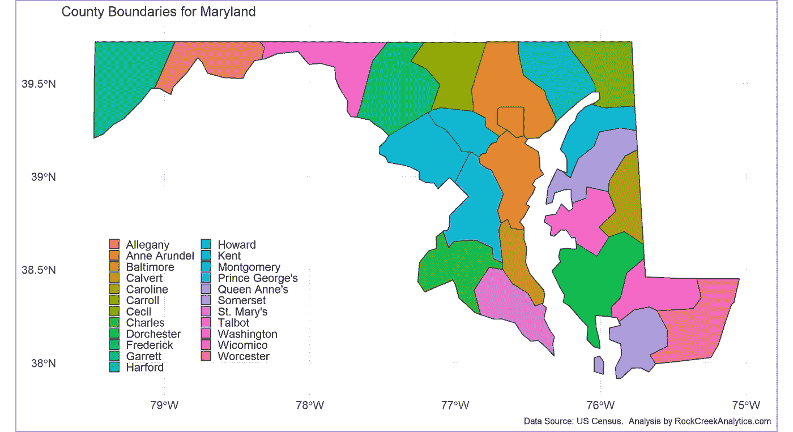
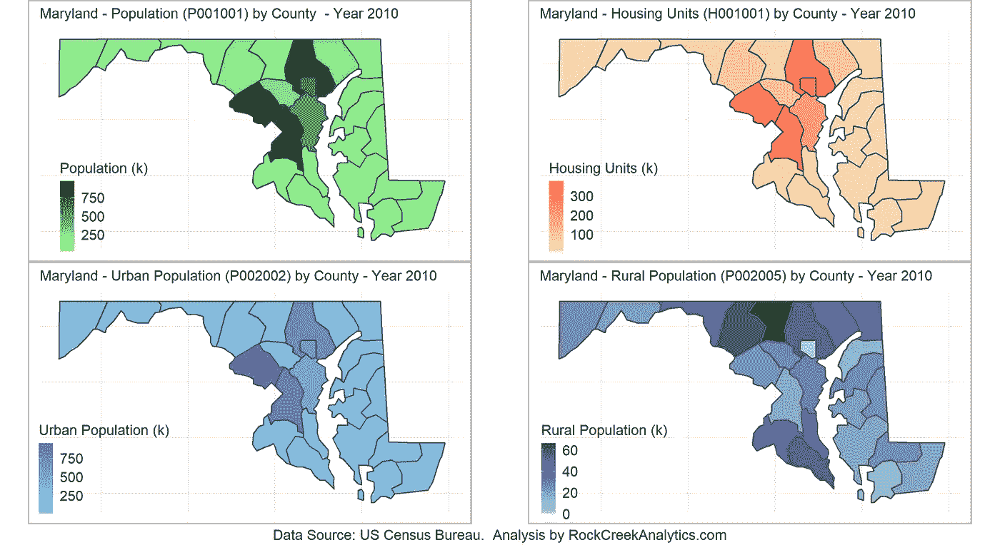
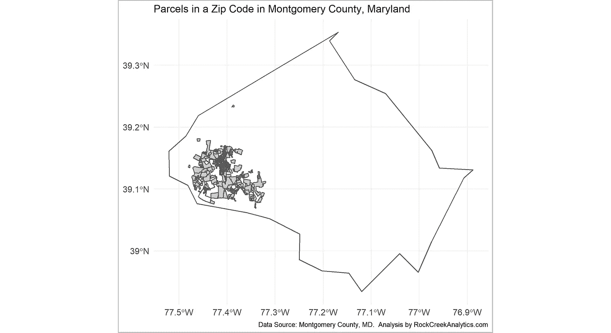
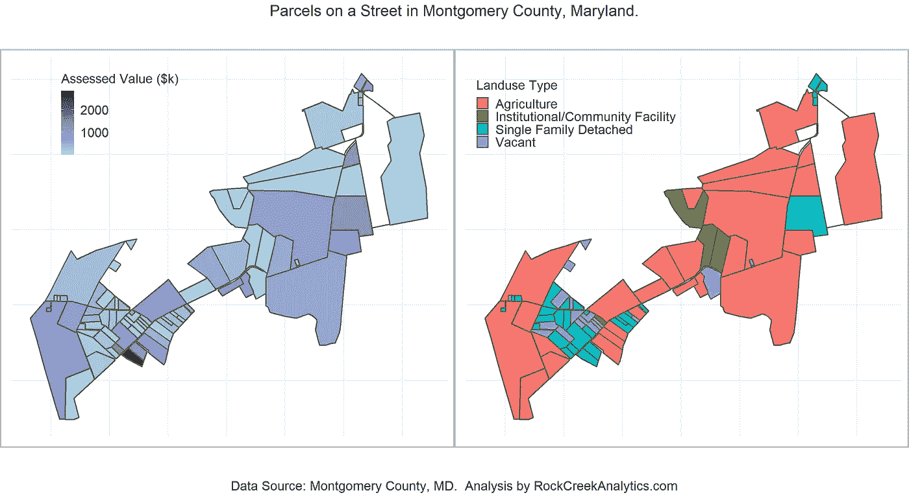
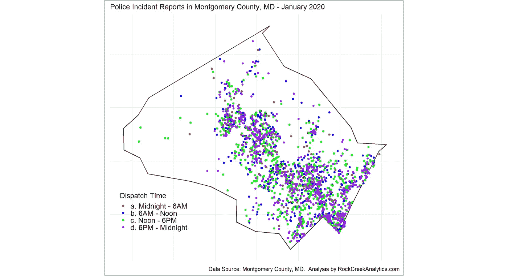
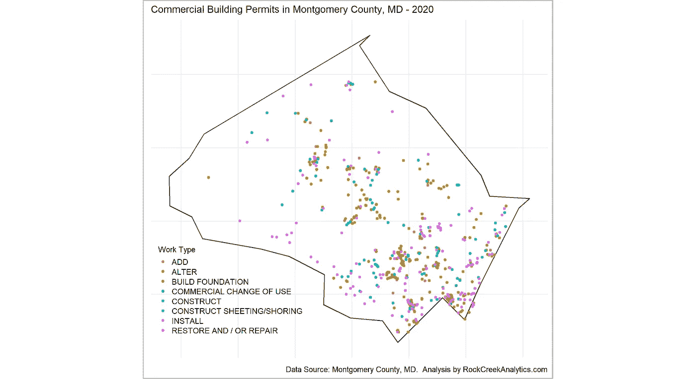

# 利用公共数据增强您的分析

> 原文：<https://towardsdatascience.com/leveraging-public-data-to-enhance-your-analysis-3b2db70eac43?source=collection_archive---------34----------------------->

## 在公共领域有更多的数据

本文介绍了联邦、州、县和地方级别的各种公共数据源，它们可以帮助增强典型的数据分析任务。

亚历山大·哈弗曼在 [Unsplash](https://unsplash.com?utm_source=medium&utm_medium=referral) 上拍摄的照片

# 一.导言

不同级别(联邦、州、县和地方)的美国政府的各种机构收集了大量数据，并将这些数据提供给公众。挑战在于将数据合并在一起以生成有意义的信息。在这份简短的说明中，我们将讨论如何使用公开可用的数据来增强典型的数据分析项目。

对于下面显示的分析，我们使用 R 软件平台，尽管分析可以通过许多软件平台和/或编程语言选项来完成。我们认识到，有许多商业和开源工具对于特定的分析(尤其是在处理、操作、分析和显示地理数据时)要强大得多，但是对于本文的目的，我们将只使用一个软件平台。

我们将回顾常用数据和不常用数据。我们从一张普通的地图开始，看看可以在地图上添加什么来创造一些东西，希望不仅仅是它各部分的总和。我们将使用马里兰州和马里兰州蒙哥马利县的数据进行本文讨论的所有分析。

# 二。常用数据

## 2.1 州和县地图

美国人口普查局提供不同地理级别的地图边界文件(国家、县、国会选区、部门、大都市地区、市区、邮政编码列表区等)。)的 shapefile 和 KML 格式[1]。这些文件可用于不同的年份，在某些情况下，不同的准确性水平，是人口普查局的 MAF/老虎地理数据库的一部分。使用人口普查 shapefile 创建的地图示例如图 1 所示，显示了马里兰州的县边界。

图 1:使用美国人口普查形状文件的马里兰州县界地图

## 2.2 人口数据

人口数据通常包括人口、就业、收入、住房单元等。以及他们在各种变量中的分布，如年龄、性别、教育程度、家庭规模等。美国人口普查局通过其优秀的 API 向公众提供非常详细的人口统计数据[2]；这些数据构成了一些最常见的数据分析项目的基础。例如，图 2 显示了马里兰州的人口和住房特征。

图 2:2010 年马里兰州各县的人口和住房单元

# 三。不常用的数据

## 3.1 包裹数据

宗地数据通常会提供县内物业的宗地边界信息。这些数据集通常伴随着财产税数据，这些数据在几种不同的分析中非常有用。

数据在县一级进行管理，因此在美国各县之间，数据格式、使用的字段名称和更新周期存在一定程度的不一致。即使有这个缺点，这也是一个非常有用的数据源，因为大多数县都以 shapefile 格式提供数据，并且数据属性非常相似，合并来自不同县的数据也相对容易。请注意，这些数据集非常大，因此数据处理时间可能因计算设备而异。

马里兰州蒙哥马利县的宗地数据示例如图 3 所示。使用的数据从县规划部门下载[3]，具体数据集包含在 *property.zip* 文件中[4]。该数据集附带的相关数据包括:所有者姓名、地址、财产税详细信息(如评估日期、评估值)、财产详细信息(如地址、分区类别、住宅类型等)。、销售详情，如转让日期、销售价格等。

图 3:马里兰州蒙哥马利县邮政编码的包裹边界

要了解这些数据的用处，请看图 4，它显示了马里兰州蒙哥马利县一条街道上的地块边界；总评估值(土地评估值、改善评估值和优惠土地评估值之和)和物业的土地使用类型显示在图的两个面板中。

图 4:马里兰州蒙哥马利县街道上的地产的地块边界

## 3.2 警方数据

全国各地的警察部门提供有价值的犯罪事件数据，这些数据可用于各种目的。数据元素通常包括事故信息，如地址、派遣日期和时间、事故类型、警察局信息等。马里兰州蒙哥马利县[5]的此类数据示例如图 5 所示，该图按调度时间显示了 2020 年的事故。

图 5:2020 年 1 月马里兰州蒙哥马利县的警察事件报告

## 3.3 施工数据

各县提供了大量与施工相关的数据。图 6 显示了马里兰州蒙哥马利县 2020 年颁发的商业建筑许可证的位置[6]。其他数据元素包括工作地点的街道地址、许可日期、建筑面积、申报估价、工作描述、工作类型、结构类型等。

图 6:马里兰州蒙哥马利县发放的商业建筑许可——2020 年

## 3.4 其他数据

还有几个其他数据元素我们没有在本文中探讨。这些包括结构数据、气象和天气数据、运输数据、金融和保险数据等。根据不同的目标，人们可以将这些数据添加到他们的方法中，并创建更强大和完整的分析。

# 四。关闭

本文介绍了联邦、州、县和地方级别的各种公共数据源，它们有助于增强您的数据分析。数据的格式通常有些不同，并且必须执行额外的步骤，以便数据可以被组合；分析师需要特别注意地理空间数据，以确保使用相同的参考系统。有时，需要进行一些地理编码来将地址数据转换为地理坐标。

# 参考

1.  美国人口调查局。*制图边界文件— Shapefile* 。[https://www . census . gov/geographies/mapping-files/time-series/geo/carto-boundary-file . html](https://www.census.gov/geographies/mapping-files/time-series/geo/carto-boundary-file.html.)
2.  蒙哥马利郡规划局。 *GIS 和制图—数据下载*。[https://Montgomery planning . org/tools/GIS-and-mapping/data-downloads/。](https://montgomeryplanning.org/tools/gis-and-mapping/data-downloads/.)
3.  蒙哥马利郡规划局。*蒙哥马利县房产数据文件*。[https://mcatlas.org/tiles/00\_Shapefiles/property.zip.](https://mcatlas.org/tiles/00\_Shapefiles/property.zip.)数据下载于 2020 年 10 月 24 日。
4.  美国人口调查局。十年一次的人口普查。[https://www . census . gov/data/developers/data-sets/decennial-census . html](https://www.census.gov/data/developers/data-sets/decennial-census.html.)
5.  蒙哥马利郡政府。*案发地图*。[https://data . montgomerycountymd . gov/Public-Safety/Crime-Incident-Map/df95-9nn 9？referrer =嵌入。](https://data.montgomerycountymd.gov/Public-Safety/Crime-Incident-Map/df95-9nn9?referrer=embed.)2020 年 10 月 25 日下载的数据。
6.  蒙哥马利郡政府。自 2000 年以来颁发的所有*商业建筑许可*的数据，包括状态和完成的工作。[https://data . montgomerycountymd . gov/Property/commercial permits-API/98z 8-bqz 4。2020 年 10 月 25 日下载的数据。](https://data.montgomerycountymd.gov/Property/CommercialPermits-API/98z8-bqz4.)