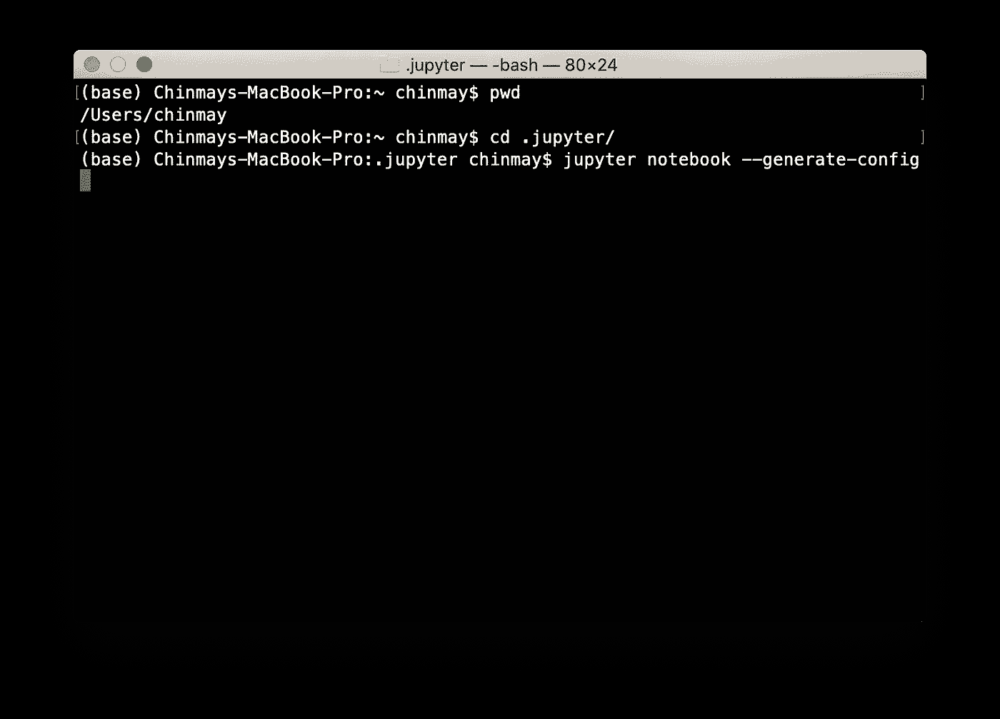
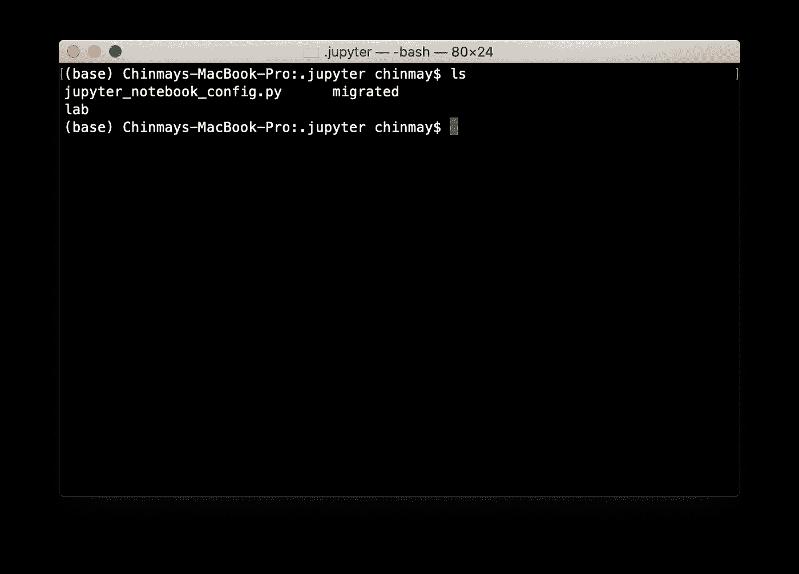
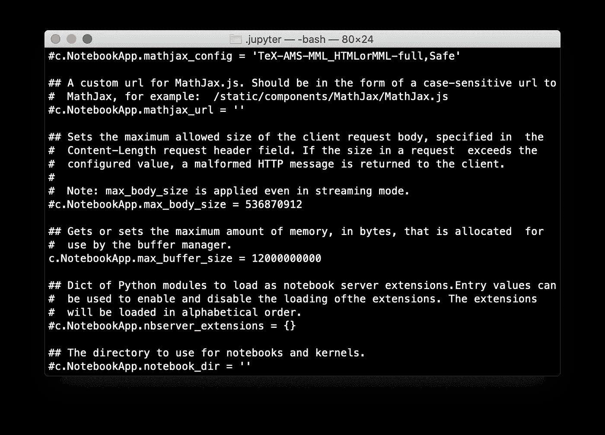

# 利用 Jupyter 笔记本电脑的强大功能

> 原文：<https://towardsdatascience.com/leveraging-the-power-of-jupyter-notebooks-26b4b8d7c622?source=collection_archive---------14----------------------->

## 数据科学工具


作者图片

Jupyter notebook 是执行数据分析或执行数据科学(密集型数据预处理、EDA 和数据可视化)的最佳平台。尽管 Jupyter 笔记本中出现了很多很酷的东西，但仍有可能是你没有充分利用你的机器的能力。即使有了高端配置的笔记本电脑，无论是 MacBook Pro 还是基于 Windows/Linux 的高端 GPU，它仍然没有发挥出全部潜力。

来源: [giphy](https://giphy.com/)

是的，那是真的。这是我最近在一个项目中的经历，我的数据集和所有文件总共大约有 37gb。每当我试图创建 spark 数据帧并在其上执行数据处理时，我的 RAM 就会崩溃，而在我的活动监视器中，我的 RAM 使用并不是问题。事实上，我的内存只有不到四分之一被使用。

这时我意识到问题可能出在 Jupyter 笔记本上。事实证明，Jupyter 达到了内存上限。现在，这是我觉得非常重要的事情，因为我以前在处理较小的数据集时没有遇到过这样的问题。

> 即使在拥有一台高端机器后，我也没有充分利用我的机器


来源: [dataquest](https://www.dataquest.io/blog/jupyter-notebook-tutorial/)

# 内存不足:

我是这样解决这个问题的:

我在 Mac 上做这个，但是这个过程对于 Windows 或者 linux 机器来说是非常相似的。

1.  打开你的终端，把目录改成**。jupyter** 并键入以下命令

>光盘。朱皮特

> jupyter 笔记本-生成-配置



这将在**中生成一个**jupyter _ notebook _ config . py**文件。jupyter** 文件夹。



2.打开 jupyter_notebook_config.py 文件并编辑以下属性:

```
NotebookApp.max_buffer_size = your desired value
```

您需要取消对该属性的注释，并根据您机器上的 RAM 数量添加您想要的值。这是我的样子:



在 Mac 中，属性以 c 为前缀:

```
c.NotebookApp.max_buffer_size = your desired value
```

请记住，所需的值是在**字节中。**例如，在我的例子中，我希望 Jupyter 的容量大约为 12g，所以我放了 **12000000000** 字节。

3.另一种更简单的方法是在终端中键入以下命令:

```
jupyter notebook --NotebookApp.max_buffer_size=your_value
```

瞧啊。你都准备好了。这将提高您的处理任务，并利用您的机器的高端配置。

# IOPub 数据速率:

使用 Jupyter 环境时可能遇到的另一个常见问题是 **IOPub 数据速率。**错误如下所示:

```
IOPub data rate exceeded.
The notebook server will temporarily stop sending output
to the client in order to avoid crashing it.
To change this limit, set the config variable
`--NotebookApp.iopub_data_rate_limit`.

Current values:
NotebookApp.iopub_data_rate_limit=1000000.0 (bytes/sec)
NotebookApp.rate_limit_window=3.0 (secs)
```

当您想要使用 python 可视化库(如 Plotly、matplotlib、seaborn 等)可视化大量数据时，通常会出现这种情况。jupyter 的默认配置未设置为处理过量的数据，因此出现此错误消息。我曾经在使用可视化库可视化大型数据集时遇到过这种错误，但是当您使用 Jupyter 处理大量数据或有大量数据交换时，您可能会遇到这种数据。

这里有一个简单的方法来解决这个问题:

```
jupyter notebook --NotebookApp.iopub_data_rate_limit=your_value
```

请记住，所需的值是以**字节表示的。**例如，在我的例子中，我希望 Jupyter 处理数据的上限达到 10g，所以我将**设为 10000000000** 字节。

```
jupyter notebook --NotebookApp.iopub_data_rate_limit=10000000000
```

你都准备好了！

编码快乐！:)

来源:[吉菲](https://giphy.com/)