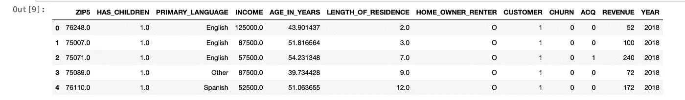
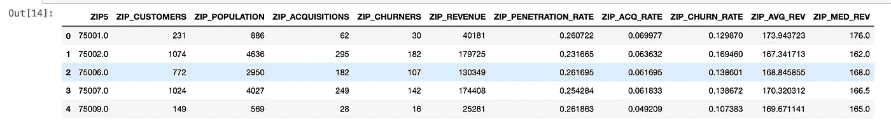
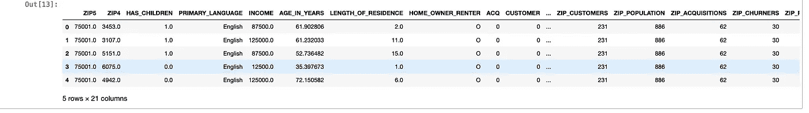

# 在机器学习模型中利用邮政编码、NAICS 编码、区号和其他古怪的分类变量的价值

> 原文：<https://towardsdatascience.com/leveraging-value-from-postal-codes-naics-codes-area-codes-and-other-funky-arse-categorical-be9ce75b6d5a?source=collection_archive---------28----------------------->

## *利用均值/目标编码提升结果。*

[](https://github.com/shadgriffin/zip_code/blob/master/Leveraging%20Mean/Target%20Encoding.ipynb) [## shad Griffin/邮政编码

### permalink dissolve GitHub 是超过 5000 万开发人员的家园，他们一起工作来托管和审查代码，管理…

github.com](https://github.com/shadgriffin/zip_code/blob/master/Leveraging%20Mean/Target%20Encoding.ipynb) 

你居住的邮政编码透露了你大量的信息。(至少在北美)。你住在哪里表明:你的年收入，你是否有孩子，你看的电视节目和你的政治倾向。

在美国，有超过 41，000 个唯一的邮政编码。邮政编码很大程度上是绝对的。邮政编码的前两位数字有一些宽泛的含义。例如，夏威夷的邮政编码以 9 开头，缅因州的邮政编码以 0 开头。除了非常普通的地理信息之外，代码本身真的没有什么价值。

如果我说乔住在 76092 号呢？这真的能让你了解他吗？

不完全是。

如果我谷歌一下那个邮政编码。我会发现 76092 是德克萨斯州的南湖。南湖是德克萨斯州最富裕的地区之一。住在 76092 意味着乔可能一年挣 10 万多，并且受过大学教育。

我的观点是代码本身并没有告诉我们太多。我们必须找到创造性的方法从邮政编码中提取价值。

因此，鉴于邮政编码可以告诉我们许多关于居住在其中的人的信息，我们如何提取这些信息并在机器学习模型中利用它们呢？

处理邮政编码之类的分类变量的一种方法是将它们分成虚拟变量。这就是“一个热编码器”的作用。不幸的是，当一个分类变量有 41，000 个唯一值时，虚拟变量真的帮不上什么忙。在邮政编码上使用“一个热编码器”意味着你将创建 40，999 个新的独立变量。呀，真是一团糟！

另一种方法叫做均值/目标编码。坦白地说，我使用这种技术已经超过 20 年了，直到最近我才听到它被这样称呼。不过这并不重要。不管你想叫它什么，它对分类变量都很适用，比如邮政编码、NAICS、人口普查区或任何其他有意义的分类变量，这些变量有许多不同的值。

在这个例子中，我浏览了一个客户创造用例。该公司希望扩大客户群，但营销/销售资源有限。因为他们没有足够的钱联系数据库中的每个人，所以他们将使用预测模型来预测那些最有可能购买他们产品的潜在客户。我不会在本笔记本中构建模型。相反，我将展示您可以利用您的历史数据和邮政编码来创建功能，从而构建更具预测性的机器学习模型。

当我写这篇文章的时候，是 2020 年 2 月。所以，我们的目标是建立一个能预测 2020 年的模型。为此，我们将使用 2019 年的数据。当我们进行特征工程时，最好不要使用与模型相同的数据。这样做会导致一些主要的因果问题和过度拟合。我将使用 2018 年的数据来构建我的特征，而不是 2019 年。所以，只是为了重新封顶。我将使用 2018 年的数据来构建我的功能。使用 2019 年的数据建立一个模型，并将该模型应用于 2020 年的当前潜在客户。

没有多年的数据怎么办？在这种情况下，我建议创建一个单独的数据集样本来构建您的要素。因此，在构建模型时，您会将数据分成四组。这将包括培训、测试、验证和特征构建数据集。

最后，我将创建针对客户获取问题的摘要，但这种技术几乎适用于所有情况。例如，您可以为医疗保健行业的供应商代码创建平均成本。或者，某些 NAICS 代码的商务费率。理解这一过程并认识到这一技术可以应用于许多不同的情况是很重要的。

第一步是导入 python 库。

```
import numpy as np
import numpy.dual as dual
import pandas as pd
```

正如我前面提到的，我们希望在 2019 年的数据上建立一个模型，来预测 2020 年的客户获取。为了构建我们的功能，我们将使用 2018 年的数据。

从 Github 拉入 2018 年的数据。

```
!rm YEAR_2018_1.csv
!wget [https://raw.githubusercontent.com/shadgriffin/zip_code/master/YEAR_2018_1.csv](https://raw.githubusercontent.com/shadgriffin/zip_code/master/YEAR_2018_1.csv)!rm YEAR_2018_2.csv
!wget [https://raw.githubusercontent.com/shadgriffin/zip_code/master/YEAR_2018_2.csv](https://raw.githubusercontent.com/shadgriffin/zip_code/master/YEAR_2018_2.csv)pd_datax = pd.read_csv("YEAR_2018_1.csv")
pd_datay = pd.read_csv("YEAR_2018_2.csv")df_data_1 = pd.concat([pd_datax,pd_datay])
```

探索数据。

```
df_data_1.head()
```



这是一个相当简单的数据集。以下是这些字段的描述。

ZIP5 —个人的邮政编码。

HAS_CHILDREN — 1 表示个人有孩子。0 表示没有。

PRIMARY_LANGUAGE —个人的主要语言。

收入——个人收入。

年龄-个人的年龄。

居住时间长度—个人在当前地址居住的时间长度。

HOME_OWNER_RENTER — O 表示个人拥有自己的家。

客户—指明记录是否属于客户。1 是客户，0 是非客户。

流失-1 表示个人在 2018 年取消了他们的产品。0 表示他们没有取消。

ACQ-1 表示个人在 2018 年获得该产品。

收入——个人 2018 年的总收入。

年份—个人记录的年份。

这可能是显而易见的，但是从特性工程的角度来看，最后五个领域是非常重要的。在接下来的几行代码中，对于每个邮政编码，我们将得到以下内容。

ZIP _ PENETRATION _ RATE——在一个邮政编码区内，消费者所占的百分比。

邮政编码流失率—特定邮政编码的流失率

ZIP_AQC_RATE —邮政编码的客户获取率。

ZIP _ AVG _ REV-特定邮政编码的客户的平均收入。

ZIP _ MEDIAN _ REV 特定邮政编码的客户的收入中值

ZIP_CUSTOMERS —特定邮政编码的客户总数。

ZIP_POPULATION —特定邮政编码中的总人数。

ZIP_CHURNERS —特定邮政编码中的 CHURNERS 总数。

ZIP _REVENUE —特定邮政编码的总收入。

通过创建这些新的字段，我们可以提取嵌入在邮政编码中的值。

```
dfx=df_data_1# Create churn features
zip_churn = pd.DataFrame(dfx.groupby(['ZIP5'])['CHURN'].agg(['sum']))
zip_churn['TOTAL']=dfx.CHURN.sum()zip_churn.columns = ['ZIP_CHURNERS','TOTAL_CHURNERS']#Create customer and popluation features
zip_cust = pd.DataFrame(dfx.groupby(['ZIP5'])['CUSTOMER'].agg(['sum','count']))
zip_cust['TOTAL_CUSTOMERS']=dfx.CUSTOMER.sum()
zip_cust['TOTAL_POPULATION']=dfx.CUSTOMER.count()zip_cust.columns = ['ZIP_CUSTOMERS','ZIP_POPULATION','TOTAL_CUSTOMERS','TOTAL_POPULATION']#create acquisition features
zip_acq = pd.DataFrame(dfx.groupby(['ZIP5'])['ACQ'].agg(['sum']))zip_acq['TOTAL']=dfx.ACQ.sum()zip_acq.columns = ['ZIP_ACQUISITIONS','TOTAL_ACQUISITIONS']#Create Total Revenue Features
zip_rev = pd.DataFrame(dfx.groupby(['ZIP5'])['REVENUE'].agg(['sum']))
zip_rev['TOTAL']=dfx.REVENUE.sum()zip_rev.columns = ['ZIP_REVENUE','TOTAL_REVENUE']#create median revenue features.
df_cust=dfx[dfx['CUSTOMER']==1]zip_med_rev = pd.DataFrame(df_cust.groupby(['ZIP5'])['REVENUE'].agg(['median']))
zip_med_rev['TOTAL']=df_cust.REVENUE.median()zip_med_rev.columns = ['MED_REVENUE','TOTAL_MED_REVENUE']
```

将要素追加到单个数据框中。

```
df_18 = pd.concat([zip_cust,zip_acq, zip_churn, zip_rev,zip_med_rev], axis=1)
df_18.reset_index(level=0, inplace=True)
```

请注意，在计算平均值和比率时，您必须小心小样本量。在这个例子中，如果一个邮政编码中有超过 100 人，我只计算这个邮政编码的比率或平均值。您希望避免仅仅因为样本少而导致指标高或低的情况。例如，如果在一个邮政编码区有两个人，其中一个是客户，渗透率将会非常高(50%)。这个高数字并不意味着邮政编码是潜在客户的沃土。也许是吧。也许不是。如果你的样本中只有两个人，那么这个统计数据就没有任何价值。

就像我前面提到的，我只在超过 100 人的情况下使用统计数据或比率。如果少于 100 人，我使用全球平均值或比率。注意，100 没什么神奇的。您应该使用一个符合逻辑并满足您的业务案例需求的数字。我也见过这样的例子，如果某个特定群体的样本量很小，人们会使用加权指标。也就是说，他们将采用邮政编码中的案例，并以加权方式与全球平均值/比率相结合。我认为这有点过分了，但是如果它能让你高兴，那就去做吧。

```
df_18[‘ZIP_PENETRATION_RATE’] = np.where(((df_18[‘ZIP_CUSTOMERS’] <100 )), (df_18[‘TOTAL_CUSTOMERS’])/(df_18[‘TOTAL_POPULATION’]), (df_18[‘ZIP_CUSTOMERS’])/(df_18[‘ZIP_POPULATION’]))
df_18[‘ZIP_ACQ_RATE’] = np.where(((df_18[‘ZIP_CUSTOMERS’] <100 )), (df_18[‘TOTAL_ACQUISITIONS’])/(df_18[‘TOTAL_POPULATION’]), (df_18[‘ZIP_ACQUISITIONS’])/(df_18[‘ZIP_POPULATION’]))
df_18[‘ZIP_CHURN_RATE’] = np.where(((df_18[‘ZIP_CUSTOMERS’] <100 )), (df_18[‘TOTAL_CHURNERS’])/(df_18[‘TOTAL_CUSTOMERS’]), (df_18[‘ZIP_CHURNERS’])/(df_18[‘ZIP_CUSTOMERS’]))
df_18[‘ZIP_AVG_REV’] = np.where(((df_18[‘ZIP_CUSTOMERS’] <100 )), (df_18[‘TOTAL_REVENUE’])/(df_18[‘TOTAL_CUSTOMERS’]), (df_18[‘ZIP_REVENUE’])/(df_18[‘ZIP_CUSTOMERS’]))
df_18[‘ZIP_MED_REV’] = np.where(((df_18[‘ZIP_CUSTOMERS’] <100 )), (df_18[‘TOTAL_MED_REVENUE’]), (df_18[‘MED_REVENUE’]))df_18=df_18[[‘ZIP5’, ‘ZIP_CUSTOMERS’, ‘ZIP_POPULATION’, ‘ZIP_ACQUISITIONS’, 
 ‘ZIP_CHURNERS’, ‘ZIP_REVENUE’,’ZIP_PENETRATION_RATE’,
 ‘ZIP_ACQ_RATE’, ‘ZIP_CHURN_RATE’, ‘ZIP_AVG_REV’, ‘ZIP_MED_REV’]]df_18.head()
```



很容易迷失在 python 代码中，但是让我们后退一步，记住我们的目标。我们的目标是提取包含 41000 个唯一值的分类变量中的隐藏值。也就是说，当变量的实际值没有用时，让变量变得有用。这就是我们所做的。比如值 75001 就不是很有用。然而，知道邮政编码 75001 的产品渗透率为. 260722 是非常有用的。

既然我们已经创建了邮政编码级别的要素，我们可以将它们追加到我们的建模数据集 2019 数据中。

从 GitHub 收集数据。并将特征附加到 2019 年的数据中。

```
!rm YEAR_2019.csv
!wget [https://raw.githubusercontent.com/shadgriffin/zip_code/master/YEAR_2019.csv](https://raw.githubusercontent.com/shadgriffin/zip_code/master/YEAR_2019.csv)
df_2019 = pd.read_csv("YEAR_2019.csv")df_2019 = pd.merge(df_2019, df_18, how='inner', on=['ZIP5'])df_2019.head()
```



现在，我们可以使用我们的功能，以 ACQ 为因变量建立一个收购模型。这些功能应该允许我们从邮政编码字段中提取完整的预测值。

最后一点。当您实际将模型部署到我们 2020 年的数据时，请使用 2019 年的数据来创建您的邮政编码特征变量，而不是 2018 年。这有道理吧？这些特征是从上一年的数据中提取的。当我们为 2019 年建立模型时，这是 2018 年。当我们为 2020 年部署模型时，这将是 2019 年。

我希望这有所帮助。