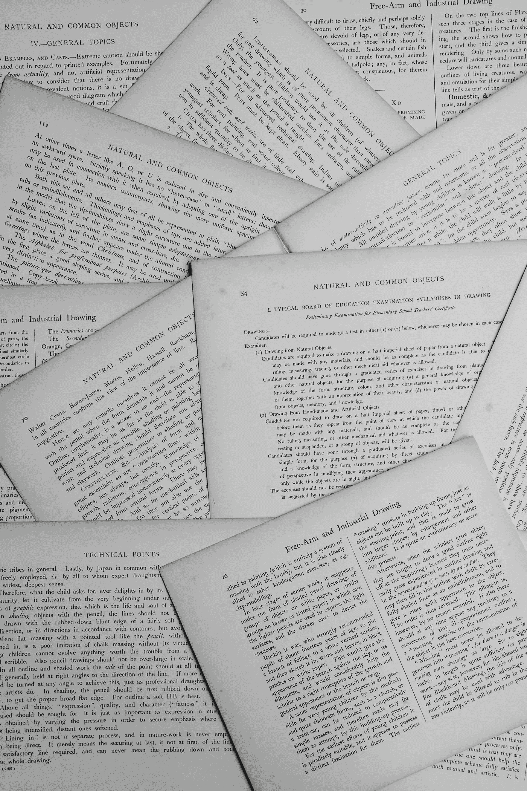

# 自然语言处理—从初级到高级(下)

> 原文：<https://towardsdatascience.com/lexical-processing-for-nlp-basic-9fd9b7529d06?source=collection_archive---------26----------------------->

## NLP 项目

## 基本的词汇处理——在进行任何类型的文本分析之前，对文本数据必须进行的预处理步骤。

安妮·斯普拉特在 [Unsplash](https://unsplash.com/s/photos/text?utm_source=unsplash&utm_medium=referral&utm_content=creditCopyText) 上的照片

在“NLP 项目”系列的这一部分中，我们将了解在进行任何类型的文本分析之前必须应用的各种预处理步骤，例如将机器学习应用于文本、构建语言模型、聊天机器人、情感分析系统等。几乎所有处理文本数据的应用程序都会用到这些步骤。

## 停止言语

现在，一篇文章由字母、单词、句子和段落组成。你能做的最基本的统计分析就是看**词频分布**，也就是把一个给定的文本数据的词频分布可视化。

概括地说，在任何文本数据中有三种类型的词—

*   出现频率最高的词称为停用词，例如“in”、“and”、“The”、“a”等。
*   最能解释数据的“重要”词有一个平均频率。
*   以及不常用或罕见的单词，这些单词也没有多大帮助。

通常，删除停用词有两个原因—

*   首先，它们没有为垃圾邮件检测器或搜索引擎等应用程序提供任何有用的信息。
*   第二，停用词的频率如此之高，以至于将它们从数据集中移除会导致文本数据的计算快得多。

然而，在某些情况下，这些停用词提供了有意义的(语法)信息，例如在词性标注、语法分析等概念中。因此不能被移除。但总的来说，它们并没有提供多少信息。

## 标记化

为了建立任何机器学习模型，人们需要为它提供算法可以接受并建立模型的特征/属性。但是，通用文本没有任何预先存在的特征，它只是单词、字母、句子等的组合。

因此，为了从文本中提取特征，我们需要标记化。

> 记号化是一种将给定文本分成更小部分的技术，比如字符、单词、句子，甚至段落，这取决于您正在使用的应用程序。

不同类型的记号化技术可以用来分解一个给定的文本，每一种都有它的用例。自然语言工具包(NLTK)为您提供了以下内容

*   **分词器**将文本拆分成单词，并将每个单词视为一个特征。
*   **句子分词器**将文本拆分成句子，并将每个句子视为一个特征。
*   **Tweet tokenizer** 甚至从社交媒体文本中提取表情符号和标签作为特征。
*   **正则表达式记号赋予器**让你使用你选择的正则表达式模式构建你自己的定制记号赋予器。

## 词干化和词汇化

现在，如果你使用单词标记器，你会得到每个单词作为一个特征用于模型的建立。因此，你会得到许多多余的特征，如“得到”和“得到”，“去”和“去”，“看到”和“看到”，以及许多其他重复的特征。它们当然不是重复的，但是它们是不必要的，因为它们没有给你关于消息的额外信息。

因此，将两者分开会妨碍机器学习算法的性能，因为它是不必要的信息。此外，这种重复增加了特征的数量，使得分类可以面对“维数灾难”。为了克服这个问题，我们有两种方法，词干化和词汇化。

**词干化**是一种基于**规则的**技术，它只是砍掉一个单词的后缀来获得它的词根形式，它被称为‘词干’。例如，如果您使用词干分析器来对字符串中的单词进行词干分析，例如“司机正开着他老板的车参加比赛”，那么只需去掉后缀“er”和“ing”，单词“driver”和“racing”就会转换为它们的词根形式。所以，‘driver’会转换成‘driv’，‘racing’会转换成‘RAC’。

你可能认为词根形式(或词干)不像词根——“drive”和“race”。你不必担心这一点，因为词干分析器会将“drive”和“racing”的所有变体只转换成那些根形式。所以，它会转换‘drive’，‘driving’等。到“驾驶”、“比赛”、“赛车”等。到“rac”。在大多数情况下，这给了我们满意的结果。

有两种流行的词干分析器:

*   波特词干分析器:这是 1980 年开发的，只对英语单词有效。你可以在这里找到这个词干分析器[的所有详细规则。](http://snowball.tartarus.org/algorithms/porter/stemmer.html)
*   这是一个更加通用的词干分析器，它不仅可以处理英语单词，还可以处理其他语言的单词，比如法语、德语、意大利语、芬兰语、俄语以及更多的语言。你可以在这里了解更多关于这个词干分析器[的信息。](http://snowball.tartarus.org/)

**词汇化**是一种更复杂的技术，它不会删除单词的后缀。取而代之的是，它接受输入的单词，遍历字典中单词的所有变体，并搜索它的源单词。在这种情况下，词根叫做引理。使用词干分析器无法将术语“英尺”、“驱动”、“向上”、“向上”和“购买”简化为它们正确的基本形式。但是 lemmatizer 可以将它们简化为正确的基本形式。最流行的词汇分类器是由普林斯顿大学的一组研究人员创建的 Wordnet 词汇分类器。你可以在这里了解更多关于[的信息。](https://wordnet.princeton.edu/)

但是，您有时可能会对是使用词干分析器还是词汇分析器感到困惑。以下因素可以帮助您做出决定:

*   斯特梅尔是一种基于规则的技术，因此它比词条解释器(它在字典中搜索以找到单词词条)快得多。另一方面，词干分析器通常比词汇分析器给出更准确的结果。
*   由于字典搜索，lemmatizer 速度较慢，但比词干分析器提供更好的结果。现在，作为旁注，要正确处理 lemmatizer，您需要输入输入单词的语音部分(名称、功能、形容词等。).我们还没有达到词性标注，但知道在文本中经常有词性标注不正确的情况就足够了，这也会影响 lemmatizer 的性能。简而言之，如果你注意到词性标注不合适，你可能要考虑一个 steamer 而不是 lemmatizer。

一般来说，您可以尝试这两种方法，看看是否值得在词干分析器上使用 lemmatizer。

今天就到这里了，伙计们。感谢反馈。此外，如果你想让我详细介绍以上任何话题，请在回复中留下。我将在下一篇文章中讨论词汇处理的高级主题。敬请关注。