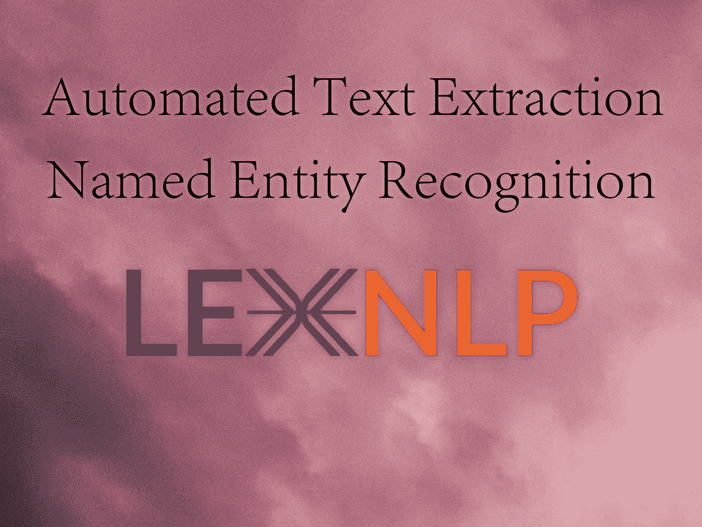

# LexNLP —自动文本提取和 NER 库

> 原文：<https://towardsdatascience.com/lexnlp-library-for-automated-text-extraction-ner-with-bafd0014a3f8?source=collection_archive---------16----------------------->



## 使用 LexPredict，即将推出的命名实体识别高级库(NER)来提取姓名、地址、日期等。

# 介绍

几周前，我不得不从一组文档中提取某些类型的数据，并想知道最好的方法是什么。这些文件都是租赁表格，上面有实体名称、地址、日期、金额、条件等数据。

我以传统的方式开始，使用正则表达式在每个文档中用它们各自的同义词来标识某些字段。我不得不手动设置提取每种类型字段的规则。


米卡·博斯韦尔在 [Unsplash](https://unsplash.com?utm_source=medium&utm_medium=referral) 上的照片

然而，我后来发现了 LexNLP 及其功能。我需要的所有数据都是用 LexNLP 提取的，无需编写任何规则。我对这个库感到非常惊讶，但是除了文档之外，我没有找到任何教程。因此，我在这里为其他数据专业人员创建了一个通向 LexNLP 的网关，他们可以从它的特性中受益。

下面是 LexNLP 的概述，它是由 ContraxSuite 制作的。我提供了提取某些类型数据的例子，比如日期、实体名称、金钱和地址。该图书馆目前有英文、西班牙文和德文版本。

**LexNLP 可以从文本数据中提取以下所有信息:**

*   [法案](https://lexpredict-lexnlp.readthedocs.io/en/latest/modules/extract/en/acts.html#extract-en-acts)，如《1986 年推进希望法案》第 1 条
*   [数量](https://lexpredict-lexnlp.readthedocs.io/en/latest/modules/extract/en/amounts.html#extract-en-amounts)，如“十磅”或“5.8 兆瓦”
*   [引文](https://lexpredict-lexnlp.readthedocs.io/en/latest/modules/extract/en/citations.html#extract-en-citations)，如“10 U.S. 100”或“1998 S. Ct。1"
*   [公司](https://lexpredict-lexnlp.readthedocs.io/en/latest/modules/extract/en/companies.html#extract-en-companies)，例如“Lexpredict LLC”
*   [条件](https://lexpredict-lexnlp.readthedocs.io/en/latest/modules/extract/en/conditions.html#extract-en-conditions)，例如“服从于……”或“除非并且直到……”
*   [约束](https://lexpredict-lexnlp.readthedocs.io/en/latest/modules/extract/en/constraints.html#extract-en-constraints)，例如，“不超过”或“
*   [版权](https://lexpredict-lexnlp.readthedocs.io/en/latest/modules/extract/en/copyright.html#extract-en-copyright)，如“版权 2000 Acme”
*   [法院](https://lexpredict-lexnlp.readthedocs.io/en/latest/modules/extract/en/courts.html#extract-en-courts)，如“纽约州最高法院”
*   [CUSIP](https://lexpredict-lexnlp.readthedocs.io/en/latest/modules/extract/en/cusip.html#extract-en-cusip) ，如“392690QT3”
*   [日期](https://lexpredict-lexnlp.readthedocs.io/en/latest/modules/extract/en/dates.html#extract-en-dates)，如“2017 年 6 月 1 日”或“2018-01-01”
*   [定义](https://lexpredict-lexnlp.readthedocs.io/en/latest/modules/extract/en/definitions.html#extract-en-definitions)，例如，“术语应指……”
*   [距离](https://lexpredict-lexnlp.readthedocs.io/en/latest/modules/extract/en/distances.html#extract-en-distances)，例如“十五英里”
*   [持续时间](https://lexpredict-lexnlp.readthedocs.io/en/latest/modules/extract/en/durations.html#extract-en-durations)，如“十年”或“三十天”
*   [地理和地缘政治实体](https://lexpredict-lexnlp.readthedocs.io/en/latest/modules/extract/en/geoentities.html#extract-en-geoentities)，如“纽约”或“挪威”
*   [货币和货币用法](https://lexpredict-lexnlp.readthedocs.io/en/latest/modules/extract/en/money.html#extract-en-money)，例如“5 美元”或“10 欧元”
*   [百分比和比率](https://lexpredict-lexnlp.readthedocs.io/en/latest/modules/extract/en/percents.html#extract-en-percents)，例如“10%”或“50 个基点”
*   [PII](https://lexpredict-lexnlp.readthedocs.io/en/latest/modules/extract/en/pii.html#extract-en-pii) ，如“212–212–2121”或“999–999–9999”
*   [比率](https://lexpredict-lexnlp.readthedocs.io/en/latest/modules/extract/en/ratios.html#extract-en-ratios)，例如“3:1”或“4 比 3”
*   [法规](https://lexpredict-lexnlp.readthedocs.io/en/latest/modules/extract/en/regulations.html#extract-en-regulations)，例如“32 CFR 170”
*   [商标](https://lexpredict-lexnlp.readthedocs.io/en/latest/modules/extract/en/trademarks.html#extract-en-trademarks)，例如“MyApp (TM)”
*   [网址](https://lexpredict-lexnlp.readthedocs.io/en/latest/modules/extract/en/urls.html#extract-en-urls)，例如“[http://acme.com/](http://acme.com/)”

# 要求

LexNLP 需要 python 3.6！所以建议你用 python 3.6 创建一个全新的虚拟环境，并从下面的 github 链接下载 LexNLP 库的所有需求。

[](https://github.com/LexPredict/lexpredict-lexnlp) [## LexPredict/lexpredict-lexnlp

### LexNLP 是一个用于处理真实的、非结构化的法律文本的库，包括合同、计划、政策、程序…

github.com](https://github.com/LexPredict/lexpredict-lexnlp) 

一旦你安装好了所有的东西，试试`import LexNLP`。如果它工作了，那么你就可以继续了，但是如果你遇到了一个错误，再次检查需求，确保你有正确的版本。如果你需要任何帮助，请在下面评论。

我们将从导入以下每个库开始。确保安装以下每个库:

```
from tika import parser
import glob, os
import pandas as pd
from bs4 import BeautifulSoup
import codecs
import re
import numpy as np
```

# 从 PDF/Word 文档中阅读文本。

因为我所有的文件都是 PDF/Doc 格式的，所以我只需要从每个文档中提取文本作为字符串。为此，我将使用图书馆 Tika。我下面写的函数给了我一个数据框，其中包含每个文件的信息，包括提取所需的文本。

```
def multipdftotxt(path): df = pd.DataFrame(columns = ['S.No', 'File_Name', 'Author', 'Creation_Date', 'Title','Content'])
    pdfs = []
    i=0
    os.chdir(path)
    types = ['*.pdf', '*.doc', '*.docx']
    textfiles = []

    for typ in types:
        textfiles.append(glob.glob(typ))
    flat_list = []
    for sublist in textfiles:
        for item in sublist:
            flat_list.append(item)
    textfiles = flat_list

    for file in textfiles:
        print(file)
        raw = parser.from_file(file)

        text = raw['content']
        dict2 = raw['metadata']
        Author = dict2.get('Author')
        Creation_Date = dict2.get('Creation-Date')
        title = dict2.get('title') i = i+1
        df1 = {'S.No': i,'File_Name': file,'Author': Author,'Creation_Date': Creation_Date, 'Title': title,'Content': text}
        df = df.append(df1, ignore_index=True)
    df = df.replace('\n', ' \n ', regex=True, ) 
    df = df.replace('\t', ' ', regex=True)
    df = df.dropna(subset=['Content'])

    return df
```

上图向我们展示了数据框的样子。我从这个数据框中需要的只是“文本”和“文件名”两列，因此我将使用另一个函数在字典中提取这两列。

```
def dftod(df): l = []
    for i in df['Content']:
        l.append(i)
    emailname = []
    for i in df['File_Name']:
        emailname.append(i) d = dict(zip(emailname, l))

    k = [v.strip() for k,v in d.items()]
    k = [re.sub(' +', ' ', temp) for temp in k]
    k = [re.sub('\n +', '\n', temp) for temp in k]
    k = [re.sub('\n+', '\n', temp) for temp in k]    d = dict(zip(emailname, k))
    return d
```

现在，我已经提取了字典中的文本，并准备使用 LexNLP 的提取特性。

# 提取，血统

从 LexNLP 导入正确的函数是正确使用这个库的关键。下面，我将向您展示如何提取特定类型的数据:实体名称、地址、日期和货币。

## 实体名称

```
import lexnlp.extract.en.entities.nltk_re*#Remember d is our dictionary containing filenames and text.
#For entity names, use* lexnlp.extract.en.entities.nltk_re.**get_companies**(text)for filename,text in d.items():
print(list(lexnlp.extract.en.entities.nltk_re.get_entities.nltk_re.get_companies(text)))***Output:*** ['Target Inc', 
'Hawthorne LLC', 
'Willburne & Co.']
```

## 地址

```
from lexnlp.extract.en.addresses import address_features#You want to use lexnlp.extract.en.addresses.address_features.**get_word_features**(text)for filename,text in d.items():
print(list(lexnlp.extract.en.addresses.address_features.**get_word_features**(text)))#Check for DateTime/Zip-code/Email-Address/URL:
lexnlp.extract.en.addresses.address_features.**is_datetime**(text)
lexnlp.extract.en.addresses.address_features.**is_zip_code**(text)
lexnlp.extract.en.addresses.address_features.**is_email**(text)
lexnlp.extract.en.addresses.address_features.**is_url**(text)
```

## 日期

可以按以下格式提取日期:

*   1998 年 2 月 1 日
*   2017–06–01
*   2017 年 6 月 1 日
*   2016 年 10 月 31 日
*   2000 年 3 月 15 日

```
import lexnlp.extract.en.datesfor filename,text in d.items():
print(list(lexnlp.extract.en.dates.get_dates(text)))***Output:***
[[datetime.date(1998, 2, 1)],
[datetime.date(2017, 6, 1)],
[datetime.date(2016, 10, 31)],
[datetime.date(2000, 3, 15)]]
```

## 金钱

可以通过以下方式提取资金:

*   五美元
*   5 美元
*   5 美元
*   $5

到目前为止，只有以下货币可以通过 LexNLP 进行检测:

*   美元/$:美元
*   欧洲/€:欧元
*   GBP/:英镑
*   JPY/:日元
*   CNY/RMB/元/¥: Chinese Yuan/Renminbi
*   INR/₨/₹:印度卢比

```
import lexnlp.extract.en.moneyfor filename,text in d.items():
print(list(lexnlp.extract.en.money.get_money(text)))**Output:** [(5000000.00, 'GBP'),
(100000.00, 'INR')]
```

有关更多信息和资源，请访问官方文档:

[https://lex predict-lex NLP . readthedocs . io](https://lexpredict-lexnlp.readthedocs.io/)

> 当 LexNLP 进行挖掘的时候，享受你的咖啡，等待那些结果展现出来！


内森·杜姆劳在 [Unsplash](https://unsplash.com?utm_source=medium&utm_medium=referral) 上的照片

> 继续跟着！我感谢你的爱。
> 在过去的几个月里，我没有写那么多，但我很高兴地说，我又回到了游戏中。