# 政治、Python 和维基百科

> 原文：<https://towardsdatascience.com/liberating-knowledge-from-the-free-encyclopedia-af8c8dbdb751?source=collection_archive---------39----------------------->

## 使用 Python 和 MediaWiki Action API 来查看维基百科修订版是否表明 2020 年民主党副总统提名人。


台虎钳照片。Gabriel Manlake 在 [Unsplash](https://unsplash.com/s/photos/vise?utm_source=unsplash&utm_medium=referral&utm_content=creditCopyText) 上拍摄的照片

上个月， *The Intercept* 发表了[一篇文章](https://theintercept.com/2020/07/02/kamala-harris-wikipedia/)声称，“在最近的总统选举周期中，对维基百科页面进行编辑的速度与副总统竞选伙伴的选择相关联。”这篇文章关注的是卡玛拉·哈里斯，以及 6 月份她维基百科页面上出现的越来越多的编辑。

这篇文章认为，编辑的速度可以被解释为她被提名为副总统候选人的潜力的信号。有意思。但是有效吗？

现在一个月过去了，仍然没有做出选择，我决定亲自看看这些变化。我想看看她的编辑率与其他潜在候选人相比如何。我也很好奇，想看看我们是否可以从这些结果中得出任何其他的关联，以加深我们对其意义的理解。所以，我转向 Python。

没有单一的 2020 年潜在民主党副总统候选人的确定名单，所以因为我们正在与维基百科合作，我将通过收集维基百科文章“ [2020 年民主党副总统候选人选择](https://en.wikipedia.org/wiki/2020_Democratic_Party_vice_presidential_candidate_selection)”的列表来保持真实的来源以下是被提名者。

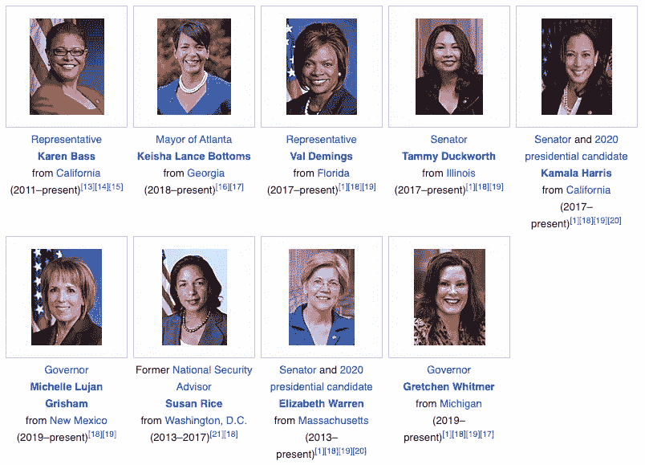

截图来自维基百科。

# 获取修订时间戳

为了实现我的目标，我需要从维基百科中检索每个潜在候选人的数据。为此，我们可以使用 [MediaWiki 操作 API](https://www.mediawiki.org/wiki/API:Main_page) 。我们开始吧！

## 取一些名字

我先准备一份名单。我们将使用这个名称列表来查找它们各自的维基百科文章的修订时间戳:

```
nominees = ['Karen Bass', 'Keisha Lance Bottoms', 'Val Demings', 'Tammy Duckworth', 'Kamala Harris', 'Michelle Lujan Grisham', 'Susan Rice', 'Elizabeth Warren', 'Gretchen Whitmer']
```

## 获取一些时间戳

现在我将部署一个函数，允许我们对 Wikipedia 进行 API 调用，并返回给定文章的修订时间戳列表。为此，我们将使用请求库:

因此，如果我在谭美·达克沃斯的维基百科文章上运行这个函数，它的用法如下:

```
get_revision_timestamps('Tammy Duckworth')
```

它会返回一个如下所示的列表:

```
print(get_revision_timestamps('Tammy Duckworth'))['2020-08-06T18:19:43Z', '2020-08-06T18:18:43Z', '2020-08-06T18:16:01Z', '2020-08-06T18:15:00Z', '2020-08-06T18:13:51Z', ...]
```

如您所见，我们已经返回了一个时间戳列表，按照从最新到最早的顺序存储为字符串。这只是完整列表的一部分，在编写本文时包含 2484 个时间戳。修改的真多啊！

# 绘制时间戳

既然我们知道了如何获得时间戳，我们就可以为我们的完整提名列表这样做了。但在此之前，让我们弄清楚如何将它们转换成图形。为此，我们将求助于 matplotlib 的 pyplot 模块。虽然 pyplot 可以方便地管理日期，但我们首先必须以 Python 可以正确解释的方式准备数据。

## 反转我们的时间戳列表

因为我们的修订时间戳列表是从最新到最老生成的，所以我们也应该反转它，以便及时向前绘制。

```
timestamps = get_revision_timestamps('Tammy Duckworth')
timestamps.reverse()print(timestamps)['2006-01-11T23:50:14Z', '2006-01-11T23:50:48Z', '2006-01-12T00:04:03Z', '2006-01-12T00:04:45Z', '2006-01-12T00:06:14Z', ...]
```

现在它们按时间顺序排列。太好了！

## 将时间戳列表从字符串转换为日期时间对象

不幸的是，我们的时间戳仍然只是字符串。为了将它们转换成可解释的日期格式，我们必须将它们转换成[日期时间对象](https://docs.python.org/3/library/datetime.html)。为此，我们可以使用 Python 内置的 datetime 库。注意，我在日期时间库中使用了日期时间模块*。*

```
from datetime import datetimedates = []    
for stamp in timestamps:        
    d = datetime.strptime(stamp, '%Y-%m-%dT%H:%M:%SZ')        
    dates.append(d)
```

好吧！我们已经成功地将时间戳转换为日期时间对象:

```
print(dates)[datetime.datetime(2006, 1, 11, 23, 50, 14), datetime.datetime(2006, 1, 11, 23, 50, 48), datetime.datetime(2006, 1, 12, 0, 4, 3), ...]
```

## 绘制日期时间对象

既然我们的日期可以被 Python 解释，我们就可以继续绘制它们了。对于这一步，我们将使用 pyplot 的“plot_date”函数。这个函数有两个参数:x 值和 y 值。对于 x 值，我们使用日期时间对象列表。对于 y 值，我使用了一个与我的 datetime 对象列表长度相同的数字范围。这将允许我为绘制的每个日期(沿 x 轴)将计数(y 轴)增加 1。

```
import matplotlib.pyplot as pltplt.plot_date(dates, range(len(dates)))
```

“plot_date”函数查看我们的日期列表，并找到最大值和最小值。然后，它创建一个等间距的日期序列作为我们的 x 轴，并相应地绘制日期。它还检测我们的 x 或 y 值是否包含日期，并强制这些值沿着 x 轴移动。

与任何 matplotlib 图形一样，我们可以调整标签和格式。我将保持它的最小化，这样我们就可以切到一些结果。我添加了一个标题，并在坐标轴上贴了标签:

```
plt.title('Tammy Duckworth Wikipedia Revisions')
plt.xlabel('Time')
plt.ylabel('Revisions count')
plt.show()
```

结果是:

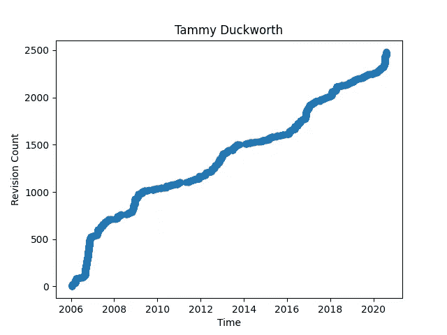

谭美·达克沃斯维基百科页面的修订计数。图片作者。

瞧啊。有趣的是，这是同样的图表，但是是乔·拜登的维基百科页面。我认为这是这种绘图方法叙事能力的一个很好的例子:

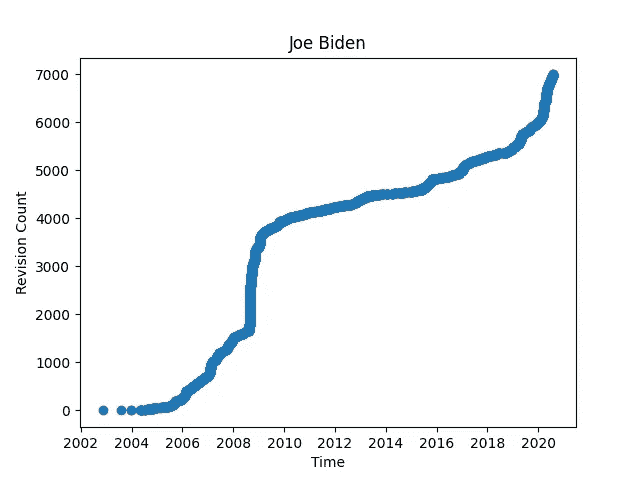

乔拜登维基百科页面的修订计数。图片作者。

# 比较页面修订

所以就眼前的事情来说。现在我们可以获得时间戳，将它们转换为日期时间对象，并绘制它们，让我们为潜在的民主党副总统提名人的完整列表做这件事。注意，我从导入“GetRevisionTimestamps”开始，这是包含我的时间戳检索函数“get_revision_timestamps”的模块。如果您想避免这种导入，只需将定义的函数复制/粘贴到这个块上面的某个地方。

# 结果:

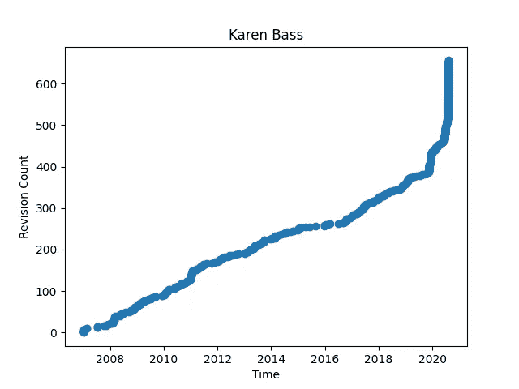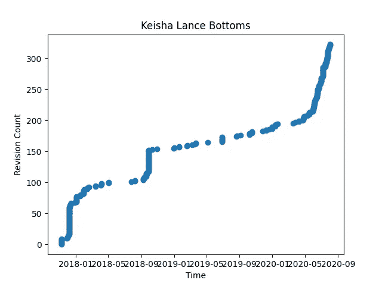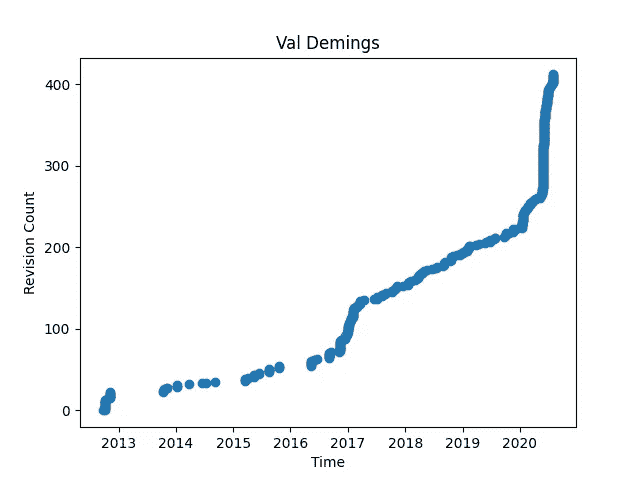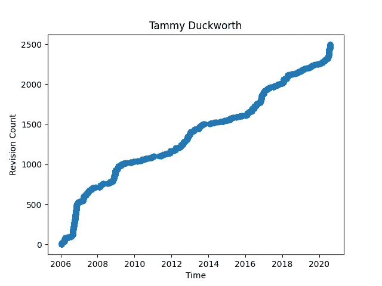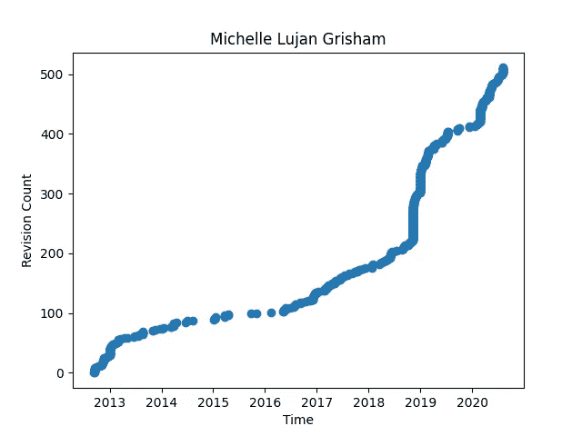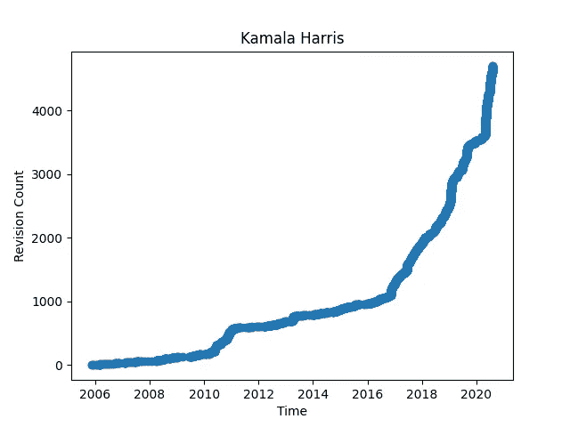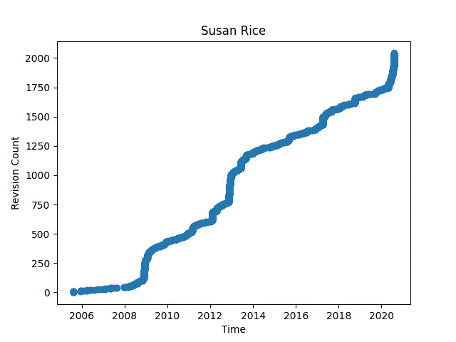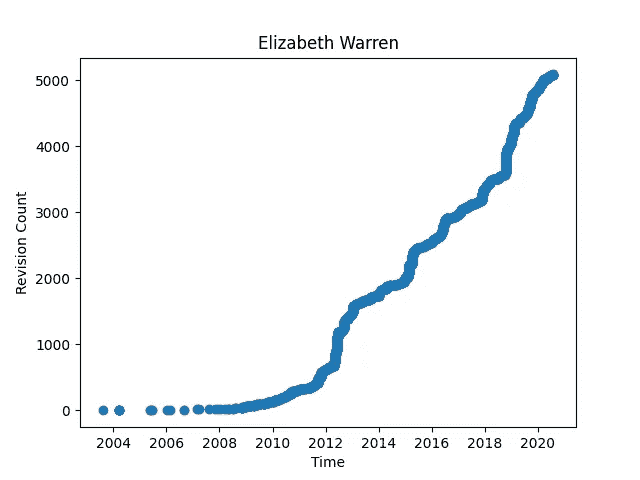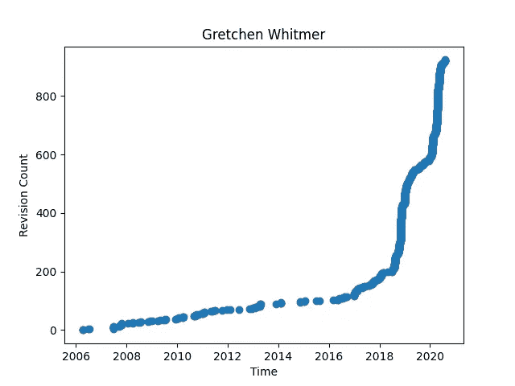

正如我们所见，并非所有曲线都是相同的。这些曲线在所表示的数据量以及比例上有所不同。它们在时间跨度上也各不相同。

尽管如此，我们已经可以看到一些有趣的趋势。有些曲线呈线性，有些呈阶梯状，有些接近二次曲线。有些人两者都有。当我们在一些图中看到中断时，我们可以推断没有提交修订。然而，我们仍然可以绘制出上升的轨迹。

现在，上面的图像代表了每篇文章的所有修订。但是，如果我想过滤所有的图，只反映一个特定的日期范围，就像在*截距的*片段中那样，该怎么办呢？我可以编写一个函数，将开始和结束日期作为可选参数，并且只绘制在所述范围内的日期:

## 过滤和缩放后的结果:

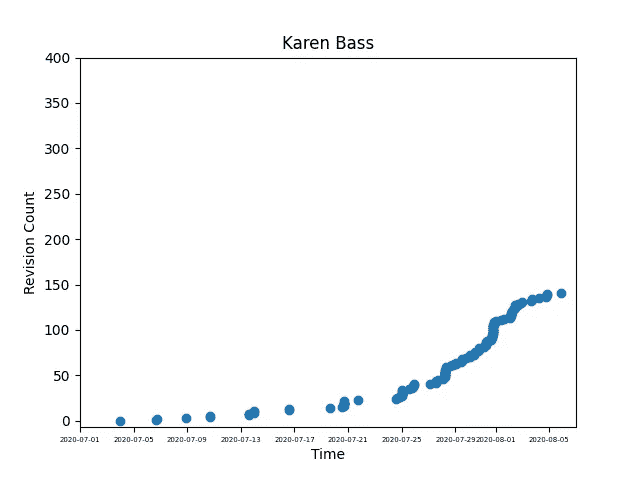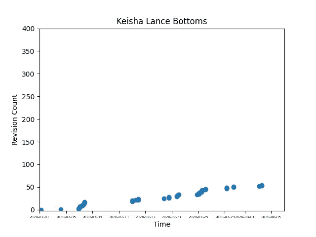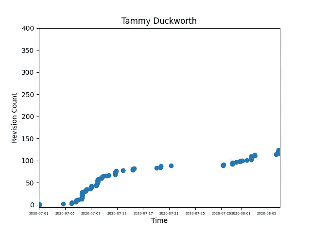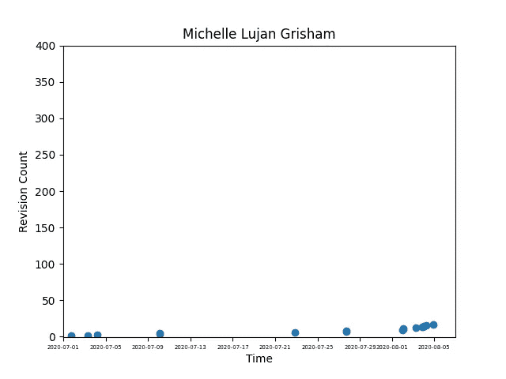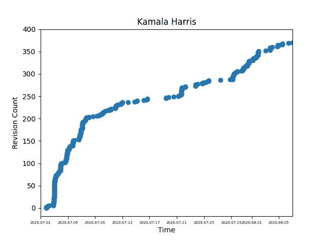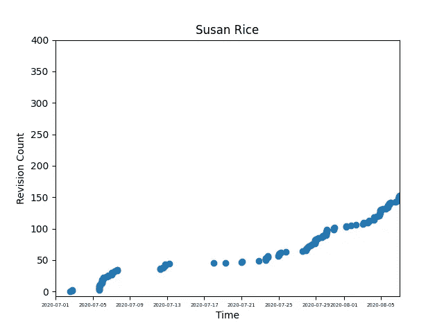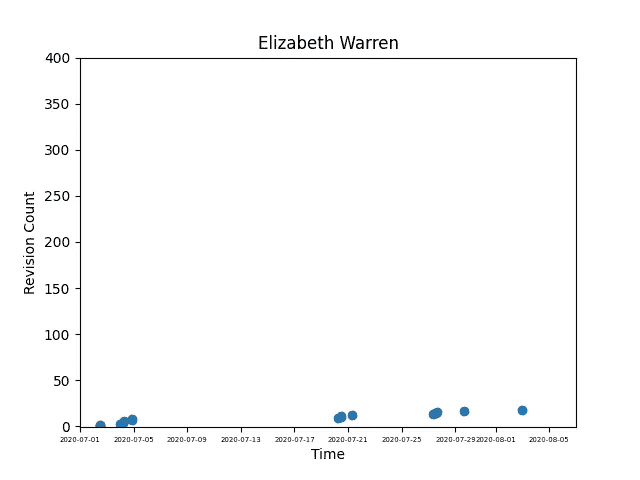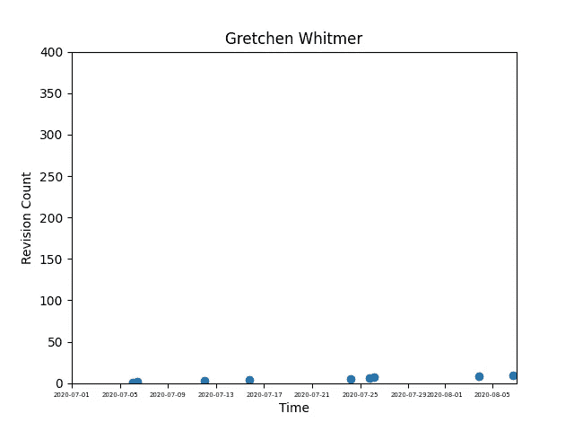

现在一些结果开始显现。我们可以看到在 *The Intercept 的*文章中确定的趋势确实仍然适用于卡玛拉·哈里斯。虽然还不太容易说出这意味着什么，但我们也可以注意到凯伦·巴斯、谭美·达克沃斯和苏珊·赖斯的一些新兴增长。让我们再放大一点。我只看过去三周，就像 *The Intercept 的*文章所做的那样:

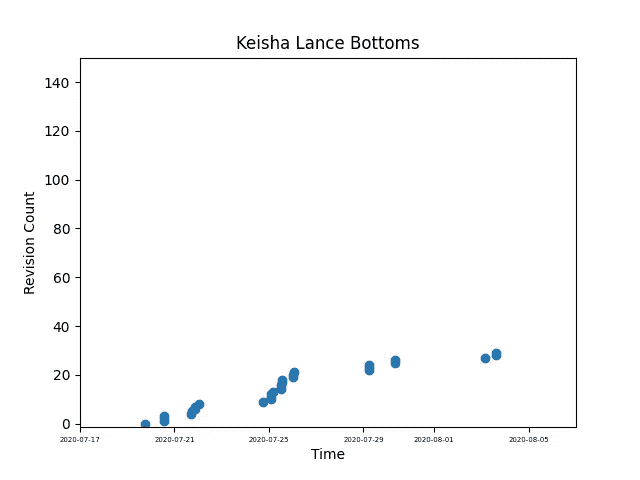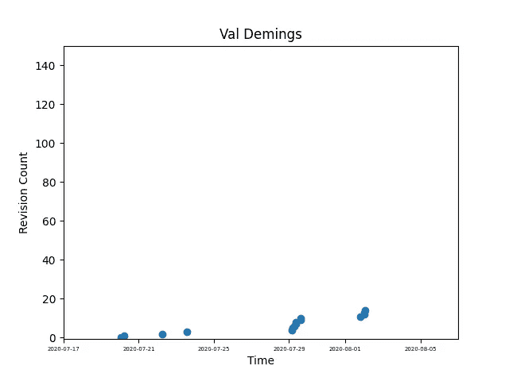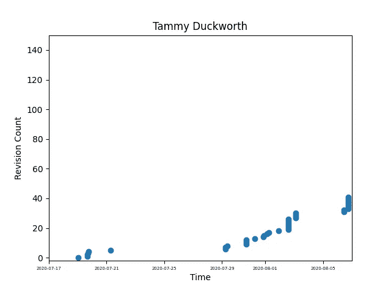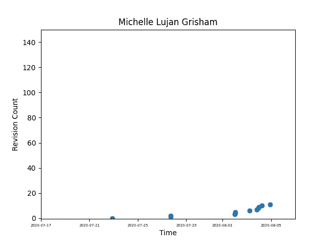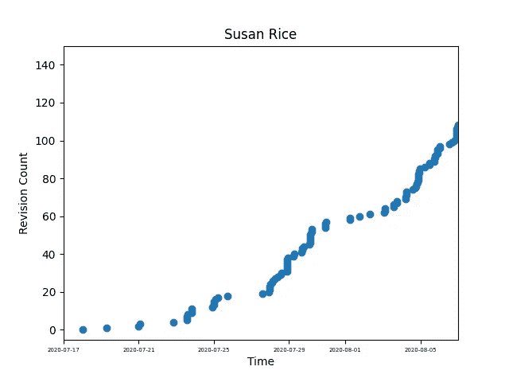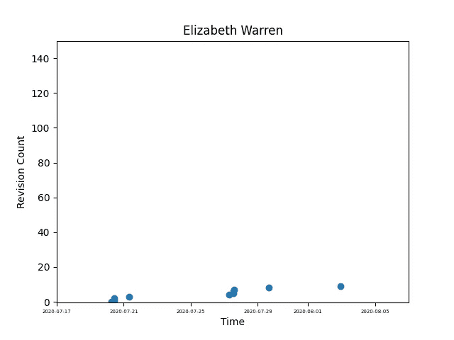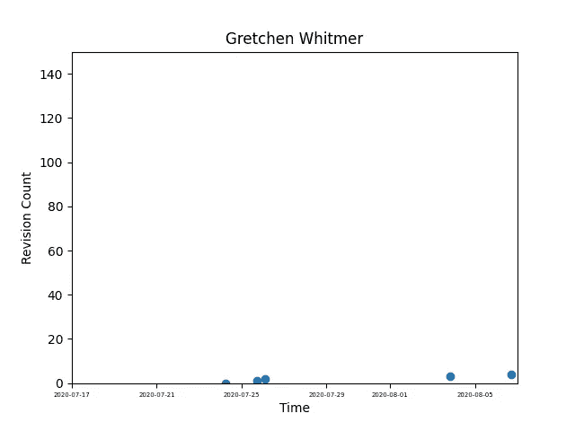

好吧。现在出现了一种模式。让我们关注最近编辑次数最多的四个候选人:

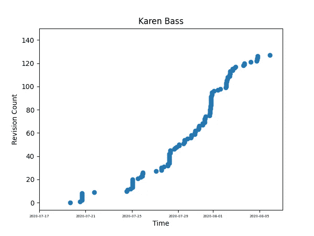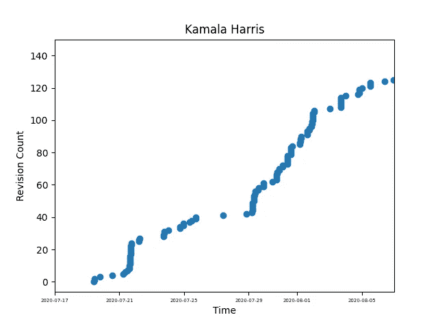

好吧。这无疑使故事变得复杂了。如果这一标准可信，那么卡玛拉·哈里斯似乎有了新的竞争对手。但是，现在我们应该问自己，我们能在多大程度上信任这一措施？

《截击》的文章详细描述了哈里斯维基百科页面被修改的本质，这无疑为控制她在平台上的公众形象的动机提供了令人信服的论据。然而，这一批评与最初的主张截然不同。最初的说法是，副总统候选人的选择与维基百科页面的修改速度相关。虽然考虑所做修改的性质可能是值得的，但现在我想把重点放在这个最初的声明上。如果这种说法是真的，这将表明衡量修正可以为理解拜登竞选策略提供一个有用的指标。但是，至少在目前，这一措施提供了一个不确定的结果。

## 与谷歌趋势形成对比

出于好玩和好奇，我从 Google Trends 上抓取了一些数据，看看他们在相同的三周内是如何报告对相同的四个候选人的兴趣的。然后我用 pyplot 绘制数据:

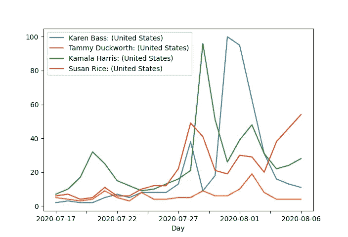

潜在的 2020 年民主党副总统候选人的谷歌趋势数据(非累积)，2020 年 7 月 17 日-2020 年 8 月 6 日。图片作者。

结果和我们在维基百科上看到的相似。请记住，维基百科的结果是累积的，因此显示的加速度不同，我们必须小心进行直接比较。让我们继续修正谷歌的结果，以反映一个累积的措施:

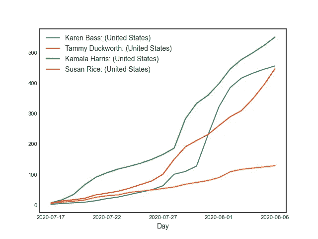

潜在的 2020 年民主党副总统候选人的谷歌趋势数据(累积)，2020 年 7 月 17 日-2020 年 8 月 6 日。图片作者。

我们又开始看到一幅熟悉的画面。看来，至少对这些候选人来说，维基百科的修改次数似乎与整体兴趣水平一致。那么，这真的是一个可能选择的指标吗？

# 附加注释

## 改进的余地

这种情节比较当然可以改进。作为一个例子，我要提到的是，虽然 *The Intercept* piece 的声明处理的是编辑的速度，但他们的分析内容实际上只处理了编辑的原始数量。如果我们真的想探索编辑速度的变化，一个可能的方法是将最近每天的平均编辑次数标准化为文章生命周期中每天的平均编辑次数。

我没有把这个分析进行到底，但也许有人会！下面是一系列函数，将返回给定文章在给定时间单位内的平均编辑次数:

为了快速获得结果，我编写了一个脚本，修改“avg_wiki_edits”函数来生成给定时间段和时间单位的平均最近编辑，然后使用“avg_wiki_edits”来生成给定时间单位的平均生命周期编辑。有了这两个结果，它计算出一个比率，然后把结果以句子的形式表达出来:

## 标准化结果:

**凯伦·巴斯:**

```
Average number of edits per day over article lifetime:    1.94
Average number of edits per day between 2020-07-17 and 2020-08-07:     8.53
Between 2020-07-17 and 2020-08-07, Karen Bass's Wikipedia page has received 4.396907216494845 times more edits per day than average.
```

**谭美·达克沃斯:**

```
Average number of edits per day over article lifetime:    2.96
Average number of edits per day between 2020-07-17 and 2020-08-07:     4.67
Between 2020-07-17 and 2020-08-07, Tammy Duckworth's Wikipedia page has received 1.5777027027027026 times more edits per day than average.
```

**卡玛拉·哈里斯:**

```
Average number of edits per day over article lifetime:    3.81
Average number of edits per day between 2020-07-17 and 2020-08-07:     7.0
Between 2020-07-17 and 2020-08-07, Kamala Harris's Wikipedia page has received 1.837270341207349 times more edits per day than average.
```

苏珊·赖斯:

```
Average number of edits per day over article lifetime:    2.79
Average number of edits per day between 2020-07-17 and 2020-08-07:     6.06
Between 2020-07-17 and 2020-08-07, Susan Rice's Wikipedia page has received 2.172043010752688 times more edits per day than average.
```

当我们将活动正常化时，凯伦·拜斯就走到了最前面。有意思。但这会转化为副总裁的选择吗？只有时间能证明一切。

你对如何改进这些图表有什么想法吗？你从结果中获得了什么见解吗？有改进流程的想法，或者进一步推动分析？如果有，请在评论中分享！