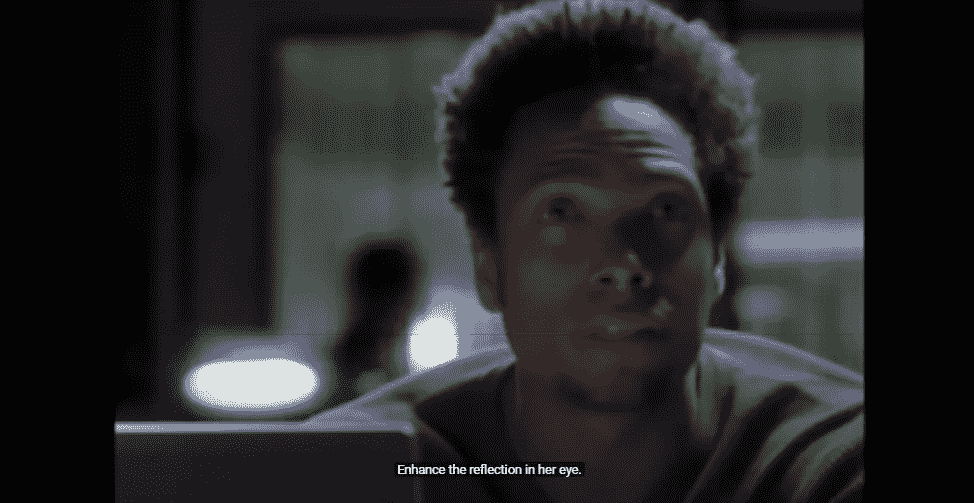
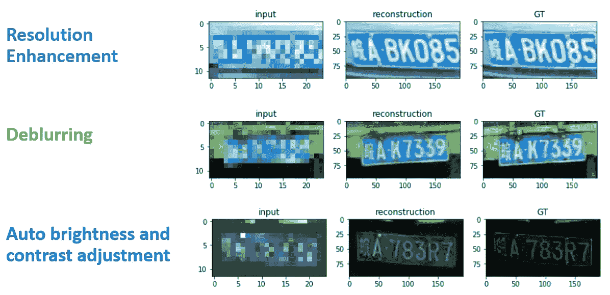
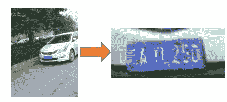
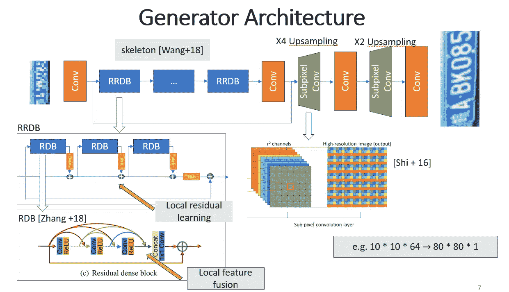
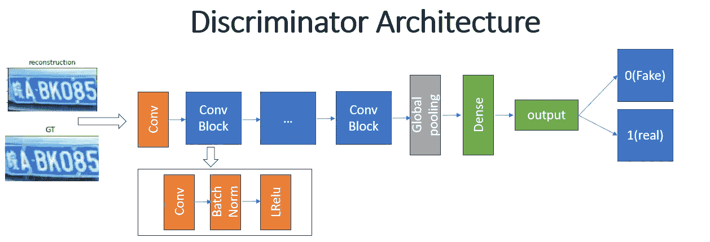
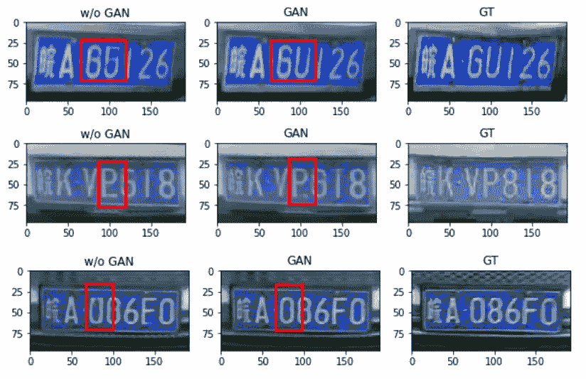
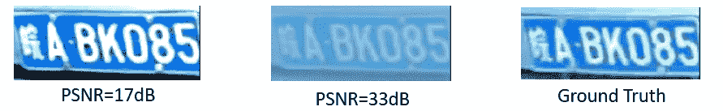
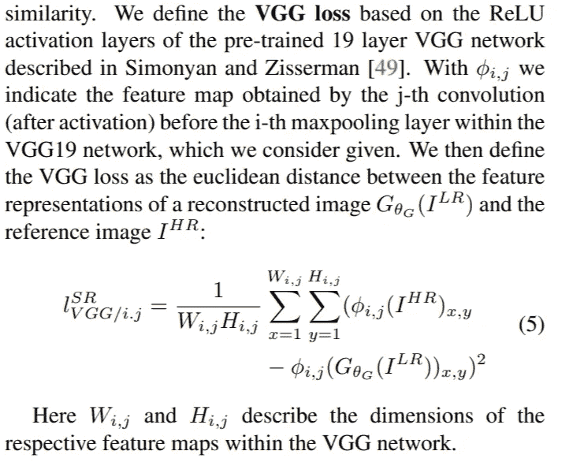
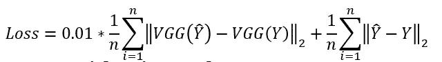
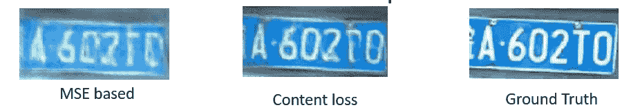

# 车牌图像增强

> 原文：<https://towardsdatascience.com/license-plate-image-enhancement-5a170475bec1?source=collection_archive---------21----------------------->

## 从银幕到现实

在好莱坞的犯罪电影中，我们经常看到侦探在一个电脑高手的帮助下突破一个难题，这个电脑高手可以从模糊的低质量图像中揭示隐藏的信息。用专业术语来说，电影中的黑魔法叫做**单幅图像超分辨率(SISR)**

https://www.youtube.com/watch?v=Vxq9yj2pVWk

在各种 SISR 应用中，汽车牌照的超分辨率无疑是潜力最大的。例如，它可以用于执法。它还可用于提高车牌识别和街道名称识别的准确性(地图服务)。在本文中，我将向您介绍我用 Python 实现的图版增强。Jupyter 笔记本教程可以在[这里](https://github.com/zzxvictor/License-super-resolution)找到。

# 走廊

在深入模型架构和培训策略的本质细节之前，我想向您展示该模型的能力:

我们在失控事故案例中看到的一个问题是，车牌通常是在黑暗条件下由低质量相机拍摄的。因此，我们的模型被训练成不仅增加分辨率，而且通过对图像去噪并调整其亮度和对比度来增强车牌号码的易读性。

# 系统结构

## 预处理

我们在这个项目中使用的数据集叫做[中国城市停车数据集](https://github.com/detectRecog/CCPD)，它包含了各种条件下汽车的 200k+图像。然而，原始数据不能被我们的模型消耗，它只想要车牌的图像而不是街景和汽车。因此，第一步是使用数据集提供的注释从图像中裁剪出板。

剪下车牌

我们还想过滤掉亮度和对比度不好的图像，只保留好的部分作为标签。我们人工生成(输入，标签)对，其中输入被下采样，被噪声和随机亮度和对比度破坏，而标签处于良好状态。

## 模型细节

我们的模型灵感来自于 [ESRGAN](https://arxiv.org/abs/1809.00219) 模型。顾名思义，我们的模型是以对抗的方式训练的——在一个极小极大的游戏中，生成器对鉴别器。

**发电机**

我们的发电机建立在两个最先进的模型之上——ESR gan[中的 RRDB 网](https://arxiv.org/abs/1809.00219)和[剩余密集网络](https://arxiv.org/abs/1802.08797)。发生器使用子像素卷积(在 [tensorflow](https://www.tensorflow.org/api_docs/python/tf/nn/depth_to_space) 中也称为深度到空间，在 [pyTorch](https://pytorch.org/docs/master/generated/torch.nn.PixelShuffle.html) 中称为像素混洗)将低分辨率图像向上采样 8 倍。本质上，子像素卷积所做的是将一个大小为 10×10×64 的特征图挤压成另一个更大的浅深度特征图(如果上采样率为 8，则为 80×80×1)。

**鉴别器**

鉴别器是一个简单的 VGG 式网络，输出 0(假)或 1(真)。理想情况下，鉴别器应该能够区分图像重建和地面真实图像。

增加一个鉴别器而不是三角化一个最小化均方误差的生成器的好处是，后者往往会产生过度平滑的伪像，一点也不像合法的字母。使用鉴别器来约束输出空间有助于创建类似字母的重建。

**损失函数和评估**

板重建的一个问题是，像均方误差或峰值信噪比这样的常用指标在描述高水平特征方面不是特别好。例如，与具有偏离亮度和高对比度的良好重建相比，模糊重建可以实现更高的 PSNR。

因此，关注边缘和字母方向等高级特征至关重要。在 SRGAN 的论文中，研究人员发现了一种新的内容损失函数，它在 VGG 网络的特征空间中计算 MSE，突出图像特征，而不是在图像空间中。他们将 **VGG 损失**定义为

[SRGAN](https://arxiv.org/pdf/1609.04802.pdf) ，在麻省理工学院许可下复制

我们的模型被优化以最小化被称为**内容损失**的 VGG 损失和 MSE 的混合:

内容损失迫使模型注意重建中的边缘，确保高级骨架与地面真相相匹配。

内容丢失的好处

# 结束了

就是这样！如你所见，重建车牌并不难！如果您对模型的详细实现感兴趣，请查看我们在 Github 上的回购！

[https://github.com/zzxvictor/License-super-resolution](https://github.com/zzxvictor/License-super-resolution)

感谢您阅读我的文章，并保持安全！