# 激光雷达三维目标检测方法

> 原文：<https://towardsdatascience.com/lidar-3d-object-detection-methods-f34cf3227aea?source=collection_archive---------1----------------------->

这篇博文最适合那些对基于图像的 2d 物体检测网络有基本了解，并且有兴趣了解如何使用 2d 物体检测网络中使用的标准方法并针对点云 3d 物体检测任务进行调整的人。

在这篇博客文章中，首先，我们回顾了 KITTI 数据集中表示的激光雷达点云的数据格式。然后，我们正式定义了三维目标检测任务，并提出了常用的回归和分类损失来衡量模型处理三维目标检测任务的性能。接下来，我们将激光雷达 3d 对象检测网络分为两类，一类是具有输入排列不变性的网络，其展示了直接处理原始点云的对称性，另一类是具有依赖于点云的有序结构化表示的点云网格表示的网络。我们将详细讨论这两类网络的优缺点。

关于这篇博文的更详细的概要，请阅读下面的介绍部分。

# 介绍

这篇博客分为三个主要部分:激光雷达点云，三维物体检测背景和三维物体检测神经网络。

在激光雷达点云部分，首先，我们回顾一下已经成为自动驾驶感知任务标准基准的 KITTI 数据集。然后，我们正式定义激光雷达坐标框架，该坐标框架用作表示返回的激光雷达点的坐标以及检测网络输出处的预测定向 3d 框的坐标框架。接下来，描述返回的激光雷达点的数据格式。

我们从 3d 对象检测背景部分开始，正式定义 3d 对象检测任务，以及回顾编码每个预测的定向 3d 框的 6 个自由度。然后，我们提出焦点损失和硬负挖掘作为解决三维目标检测网络分类损失中背景类别不平衡的常用方法，以及平滑 L1 作为针对离群点的稳健回归损失。此外，我们比较了具有和不具有锚盒的 3d 对象检测网络的回归目标。此外，讨论了数据扩充作为 3d 对象检测网络的训练管道的必要部分，以确保更好的推广，并且提供了两种基于搜索的方法，其使用 RL 和进化算法来解决寻找最优数据扩充策略。

在 3d 对象检测神经网络部分，首先，我们讨论由点云作为无序点集的排列不变性引起的通过神经网络处理激光雷达点的挑战。然后，我们将三维目标检测网络分为两类:具有输入排列不变性的网络和具有点云有序网格表示的网络。关于具有输入方式排列不变性的 3d 对象检测网络，讨论了用于基于 lidar 的分类和分割的排列不变性架构[点网](https://arxiv.org/abs/1612.00593)。此外，我们回顾了[平截头体点网](https://arxiv.org/abs/1711.08488)，其依赖于基于图像的 2d 对象检测网络来扩充点网以用于 3d 对象检测任务。

然后，我们切换我们的齿轮集中在三维物体检测网络与点云有序网格表示。由于这些网络属于 CNN 目标检测网络的范畴，我们首先回顾 CNN 目标检测网络的两种主要类型:单镜头和基于区域提议的。此外，包括 [FPN](https://arxiv.org/abs/1612.03144) 和 [PANet](https://arxiv.org/abs/1803.01534) 的骨干网络和特征金字塔网络被讨论为 CNN 对象检测网络的主要构建块。此外，非最大值抑制作为后处理步骤被提出，以过滤由密集对象检测网络做出的预测。接下来，我们解释距离图像表示的优缺点，距离图像表示将点云解释为由激光雷达传感器拍摄的 3d 环境中的 360 度照片。引入 3d 体素化表示作为围绕激光雷达传感器的 3d 立方体子空间的量化。讨论了 3d 体素化表示的存储和计算效率低的问题。此外，3d 卷积被呈现为自然卷积层，以处理 3d 体素化张量。

最后，我们关注 2d 体素化表示作为 3d 体素化表示的替代，其通过使用 2d 卷积层而不是 3d 卷积层展示了更好的计算效率。此外，我们比较了作为 3d 对象检测网络一部分的手工设计和机器学习的特征编码器，3d 对象检测网络依赖于 2d 体素化表示作为其输入。

# 激光雷达点云

在本节中，首先，我们回顾作为激光雷达 3d 对象检测任务的最流行基准的 [KITTI](http://www.cvlibs.net/datasets/kitti/) 数据集。然后，我们解释了 KITTI 数据集中使用的激光雷达坐标框架。最后，讨论了返回激光雷达点的数据格式。

## Kitti 数据集

**[**KITTI**](http://www.cvlibs.net/datasets/kitti/)**数据集已经成为自动驾驶感知任务的标准基准数据集，包括基于图像的单目和立体深度估计、光流、语义和实例分割以及 2d 和 3d 对象检测。**该数据集由所示的多传感器记录平台(一辆配备有激光雷达传感器和两个前向摄像头的汽车)通过在德国[卡尔斯鲁厄](https://www.google.com/maps/place/Karlsruhe,+Germany/@49.0157643,8.2694498,11z/data=!3m1!4b1!4m5!3m4!1s0x47970648a2e07809:0xb6fc55734cb7ee7f!8m2!3d49.0068901!4d8.4036527)街道上衍生生成。**

**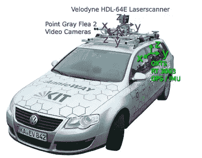**

**[KITTI 多模态传感器套件。](http://www.cvlibs.net/publications/Geiger2013IJRR.pdf)**

****KITTI 数据集是一个多模态数据集，每个训练示例都是通过两个前置摄像头生成的两个摄像头图像和安装在车顶的威力登 HDL-64E 激光雷达传感器生成的点云捕获的带标签的 3d 场景。**在 KITTI 数据集中存在 7481 个训练场景和 7581 个测试场景。由于激光雷达传感器的 100 毫秒 360 度扫描时间，该多模式传感器套件从外部 3d 世界的采样频率为 10HZ。**

****因此，每个训练示例都是汽车周围 3d 世界的 100 毫秒快照，并由激光雷达点云(您可以将激光雷达点云视为在 100 毫秒内捕获的 360 度照片)和与扫描激光雷达传感器同步的两个相机图像形成。**对于依赖于相机图像和激光雷达点云融合的感知方法，两个相机与激光雷达传感器的同步是必不可少的。这种同步要求相机在激光雷达扫描处于其视野中心时捕捉图像。**

**KITTI 多模态传感器套件中的激光雷达传感器是威力登 HDL-64E，如下所示。**该激光雷达传感器提供 3d 场景的时空离散化扫描，其中其空间离散化由仰角(垂直)和方位角分辨率表征，其时间离散化过程由 100 毫秒的扫描时间表征。**它的仰角分辨率为 0.4 度，根据它的 64 个激光束转换成 26.9 度的垂直视场。此外，它的方位分辨率等于 0.08 度。因此，给定 64 个通道(64 个激光束)和 0.08 度的方位分辨率，由威力登 HDL-64E 生成的 3d 点云照片是具有 64 行和 4500 列的图像。**

**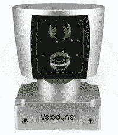**

**[威力登 HDL-64E](https://velodynelidar.com/products/hdl-64e/)**

## **激光雷达坐标框架**

****在 KITTI 传感器套件中，安装在车顶顶部的激光雷达传感器的坐标框架的重要性在于，不仅返回的激光雷达点会显示在激光雷达坐标框架中，预测的 3d 边界框也会显示在该坐标框架中。**换句话说，3d 物体检测模型的输入和输出都呈现在激光雷达坐标框架中。在下图中，您可以看到激光雷达坐标框架，其中汽车被描绘为灰色框。特别地，这个坐标框架的原点是激光雷达传感器的中心；它的 x 轴指向车头；它的 y 轴指向驾驶座的左侧，z 轴指向天空。**

**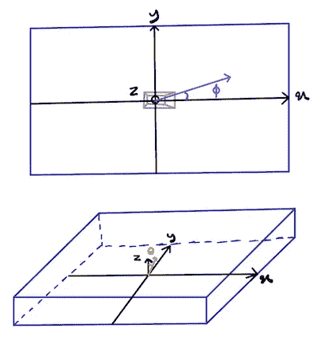**

**激光雷达坐标框架:笛卡尔坐标和球面坐标。**

**所描述的激光雷达坐标框架中的点可以用其笛卡尔坐标(x，y，z)或球坐标(θ，ϕ，r)来表示。在球坐标中，θ称为仰角，是相对于 z 轴正方向的角度，ϕ称为方位角，是在 x-y 平面中相对于 x 轴正方向的角度，r 是该点到原点的距离。笛卡尔坐标和球坐标之间存在如下一对一映射:**

**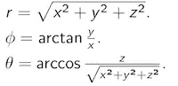**

## **点云数据格式**

**每个点云都是返回的激光雷达点的无序集合。每个返回的激光雷达点的数据格式是由其相对于激光雷达坐标框架的坐标及其强度ρ形成的 4 元组。在 KITTI 数据集中，ρ是介于 0 和 1 之间的归一化值，它取决于激光雷达光束反射的表面特征。返回的激光雷达点可由其笛卡尔坐标(x，y，z)或球面坐标(θ，ϕ，r)表示。KITTI 数据集使用激光雷达坐标系中的笛卡尔坐标及其强度来表示返回的激光雷达点，如下所示:(x，y，z，ρ)。下面，你可以看到一个点云的插图。KITTI 数据集中的每个场景点云平均有大约 100K 个点。请注意，每个场景返回的激光雷达点的数量根据场景的特征(如场景中行人或汽车的数量)而有所不同。**

**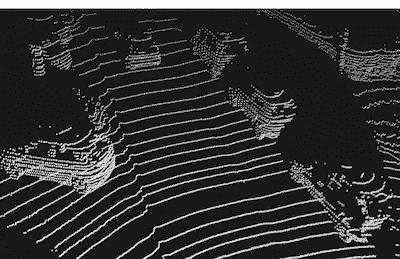**

**[旁边儿的云](https://arxiv.org/abs/1907.03670)**

# **3d 对象检测背景**

**在本节中，我们将重点介绍制定 3d 对象检测任务所需的背景。我们首先从正式定义点云三维物体检测任务开始。然后，我们介绍了如何使用回归和分类损失来测量这项任务的性能。最后，我们回顾了数据扩充作为一种基本方法，以提高处理三维物体检测任务的 ML 模型的泛化能力。**

## **3d 对象检测任务**

****这里，我们将基于 lidar 的 3d 对象检测任务正式定义如下:给定由返回的 lidar 点(在 lidar 坐标框架中表示)形成的场景的点云，预测与场景中的目标演员相对应的定向 3d 边界框(在 lidar 坐标框架中表示)。**对于自动驾驶应用，你可以假设最本质的这类目标行为者是汽车、自行车和行人。此外，定向 3d 框是相对于 3d 框的主体坐标框架增加了航向角的 3d 框。**

**务必充分理解在激光雷达坐标框架中表示定向 3d 边界框的含义。通常用由盒子尺寸、盒子中心坐标和航向角组成的 6 个自由度来编码定向的 3d 边界盒子。**注意，仅编码航向角而不编码俯仰角和横滚角的原因是航向角对自动驾驶系统的跟踪、预测和规划堆栈的逻辑的影响，而俯仰角和横滚角在这些堆栈中做出的决策中不起主要作用。****

**盒子的尺寸仅仅是它的宽度、长度和高度(w，l，h ),同时考虑到长度总是大于宽度的不变性。盒子中心的坐标(x，y，z)相对于激光雷达坐标框架来表示。盒子的航向角ϕ在盒子的主体坐标系中测量，该坐标系是激光雷达坐标系到盒子中心的平移版本。特别地，盒子的航向角θ指的是其长度尺寸(x-y 平面上的较长边)平行于其主体坐标框架的 x 轴的情况。**

# **分类损失和回归损失**

**无论使用什么 ML 模型来实现 3d 对象检测任务，我们都期望模型输出对每个预测框的 6 个自由度及其类别进行编码。这些分类和回归预测分别被合并到分类和回归损失中，以便为 3d 对象检测模型提供训练信号。**

# **分类损失**

**目标检测网络的默认分类损失是交叉熵，其等于地面真实类的负对数似然。目标检测网络的分类损失的主要复杂性是解决背景(负面)类别和正面类别之间的类别不平衡。可以观察到，对于给定的图像或场景，大多数潜在的 2d 和 3d 边界框候选包含背景场景，而不是目标演员和对象。因此，在目标检测训练数据集中存在显著的类别不平衡。解决这种等级不平衡的两种标准方法是[硬负开采](https://arxiv.org/abs/1504.08083)和/或[焦损](https://arxiv.org/abs/1708.02002)。**在硬否定挖掘方法中，目标是对每个图像/场景的否定边界框进行子采样，使得否定框的数量最多是肯定框数量的 3 倍，同时为每个图像/场景选择最硬的否定框。**用于量化负盒硬度的度量是其交叉熵损失，其中较大的交叉熵损失指定较难的示例。**

****另一方面，** [**焦点损失**](https://arxiv.org/abs/1708.02002) **通过在训练过程中自适应地调整每个样本在分类损失中的贡献权重来解决背景类和正面类的类不平衡，而不是显式地对负面样本进行子采样**。焦点损失主要基于这样的想法，即大多数背景框对于网络来说非常容易识别，使得它们的基础真实类概率(背景类概率)在训练过程的早期变得非常接近 1.0。因此，自适应地调整样本的贡献权重，使其与它们的当前基本真实概率和实数 1.0 之间的绝对差成比例，导致大多数负样本对分类损失的贡献可以忽略，这减轻了背景类和正类之间的类不平衡。**

# **回归目标和损失**

**回归损失根据对应于盒子的 6 个自由度的回归目标来定义。**通常的做法是预测这 6 个自由度的转换版本(称为回归目标)，而不是直接预测它们，以增加模型预测的动态范围，并通过提供具有潜在更高熵的梯度来帮助训练过程。****

## **带有定位框的回归目标**

**首先，我们回顾依赖于锚盒的对象检测网络的回归目标。**如果输入遭受像自然图像那样的比例模糊，其中图像中出现的对象的尺寸取决于它们到摄像机的距离，或者如果网络需要检测具有不同典型尺寸的不同类别对象，如旨在检测汽车、自行车和行人的激光雷达 3d 对象检测网络，则使用锚定框变得至关重要。**在这种情况下，锚框允许网络学习关于一组具有不同比例和纵横比的预定义锚框的回归偏移，这些锚框被设计为模型的超参数，以最佳匹配具有不同维度的类对象。设计锚定框的目标是，在训练过程结束时，每种类型的锚定框都将专用于一个与锚定框的比例和纵横比最匹配的类对象。**

**下面，你可以看到带有定位框的回归目标。在这些公式中，下标 *gt* 指地面真相箱，下标 *a* 指锚箱。**标准做法是使用 *log* 刻度来表示盒子的宽度、长度和高度，以增加预测尺寸的动态范围。**此外，根据锚盒的尺寸的划分确保预测目标是相对于匹配的锚盒的偏移校正的形式。中心框坐标是根据它们相对于锚框中心坐标的偏移来预测的，并通过它们相应的锚框尺寸来进一步归一化。**最后，航向角目标被编码为地面真实航向角和锚箱航向角之差的 *sin* 和 *cos* 。这种编码方案消除了明确实现预测角度必须在 0 和 2π范围内的约束的要求。****

**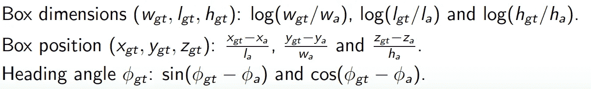**

## **没有定位框的回归目标**

**在没有锚盒的对象检测模型的情况下，回归目标如下。**

**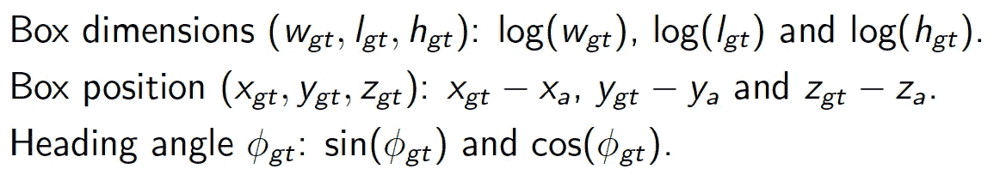**

**注意，对于中心框坐标目标，我们仍然将它们预测为相对于参考点的偏移，这取决于用于该预测的特征地图条目的空间坐标。不需要锚定框的对象检测任务的一个例子是 3d lidar 对象检测任务，其仅关注于检测汽车并且不会遭受比例模糊。**

## **回归损失**

**[平滑 L1 损失](https://arxiv.org/abs/1504.08083)已经成为目标检测回归目标的标准损失，可以写成**

**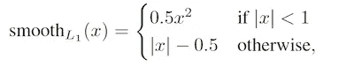**

**其中 *x* 表示网络预测值和回归目标值之间的差值。因此，我们将有 6 个平滑 L1 项，对应于每个盒子的 6 个自由度。**平滑 L1 损失优于 L2 损失，主要是因为它对异常值更稳健。离群值导致具有大绝对值的误差，而与误差幅度成比例的 L2 损失导数导致 SGD 训练过程变得不稳定并被离群值支配。另一方面，对于 *|x| > 1* 的平滑 L1 损失的导数是常数，并且与误差幅度不成比例，这使得它对于异常值是鲁棒的。****

# **数据扩充**

**数据扩充是每个对象分类和检测模型的训练管道的基本部分。**数据增强的目标是提高泛化能力，使分类和检测网络相对于图像像素值和点云激光雷达点的旋转、平移和自然变化保持不变**。在本节中，我们首先回顾图像的数据扩充技术，因为它们将为讨论点云的数据扩充方法提供相关背景。**

## **图像数据增强**

**展示数据增强对于感知任务的重要性的突出作品是 [AlexNet](https://papers.nips.cc/paper/4824-imagenet-classification-with-deep-convolutional-neural-networks.pdf) 。在 AlexNet 之后，用于图像分类和检测模型的数据扩充方法成为训练管道的标准步骤。这种增强技术的例子是随机裁剪、缩放、旋转、水平翻转和光度变换。**注意，这些数据扩充方法的随机性对提高网络的泛化能力起着重要作用。**特别地，对于训练的每个时期和对于每个图像，除了是否应用给定的数据扩充方法之外，这些数据扩充方法的参数(像旋转数据扩充的旋转角度)在训练期间被随机绘制。另一种最近流行的数据扩充方法是 [Cutout](https://arxiv.org/abs/1708.04552) ，它在训练过程中随机屏蔽图像的正方形区域。**

**所有上述数据扩充方法都是图像级数据扩充方法，并且最初是针对图像分类任务提出的，但是已经显示出对于对象检测任务也是有用的。**最近，将这些数据增强方法单独应用于对象的边界框也变得很常见，这被称为对象级数据增强方法。**换句话说，除了影响整个图像的图像级变换之外，我们还可以将这些变换分别应用于每个对象的边界框。例如，通过旋转单个对象的相应边界框并用值 0 填充堤岸区域，可以将随机旋转应用于单个对象。**

****与为每个输入图像即时随机创建数据增强方法的组合相反，有理由假设存在数据增强方法的特定组合，其更好地模拟图像和我们周围世界中自然发生的变换。因此，学习这样的作文将潜在地导致更好的概括。遵循这一思想，[自动增强](https://arxiv.org/pdf/1805.09501.pdf)将数据增强方法的哪些组合应用于图像以用于图像分类任务的顺序离散决策问题公式化为增强学习(RL)问题，奖励信号是测试数据集上训练模型的准确性。****

**在 [*学习用于对象检测的数据增强策略*](https://arxiv.org/abs/1906.11172) *中，将上述策略梯度 RL 方法进一步应用于对象检测任务。* **在提议的 RL 框架中，RL 代理被建模为 RNN 网络，其中在每个时间步，它通过其输出 softmax 层做出离散决策，以选择数据扩充方法或为已经选择的数据扩充方法选择超参数值。**RL 代理被要求生成五个数据增强子策略，其中每个子策略是两种数据增强方法的组合。在训练期间，对于每个输入图像，随机选择五个子策略中的一个并应用于该图像。结果表明，使用 RL 代理生成的数据扩充策略优于随机数据扩充方法。**

## **点云数据扩充**

****应用于激光雷达点云的数据增强方法主要受最初为图像设计的增强方法的启发**。**点云数据扩充方法必须符合控制激光束传播的物理定律。**例如，我们希望点云随着远离激光雷达传感器而变得越来越稀疏。因此，如果数据扩充方法不符合此约束，则不应在训练期间使用，因为它不模拟任何真实世界的场景。**

**一些常见的点云数据增强是围绕激光雷达坐标框架的 z 轴的旋转、相对于激光雷达坐标框架的 x-z 和 y-z 平面的翻转、激光雷达点的稀疏化、应用于激光雷达点的加性高斯噪声、平截头体缺失和具有对象点云的场景增强。这些数据扩充方法中的大多数既可以应用于场景级，也可以应用于对象级。在实时训练期间，对于每个给定的点云场景，我们做出是否应用每个场景级数据扩充方法的随机二元决策，以及场景中每个对象的随机二元决策，以便确定是否应用每个对象级数据扩充方法。下面，您可以看到应用于点云的潜在数据增强方法的示例，这些示例来自论文[通过基于渐进人群的增强改进 3D 对象检测](https://arxiv.org/abs/2004.00831)。**

**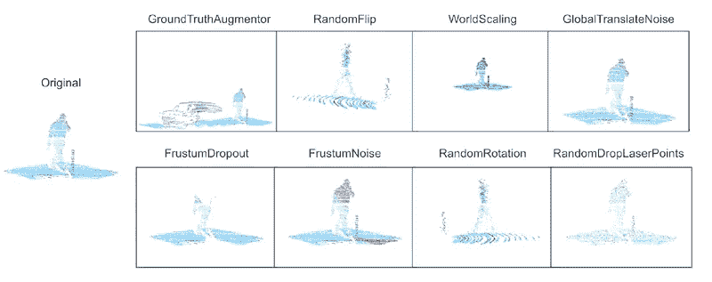**

**[应用于点云的数据增强方法。](https://arxiv.org/abs/2004.00831)**

****受为图像开发的** [**自动增强**](https://arxiv.org/pdf/1805.09501.pdf) **框架的启发，开发了用于点云的类似的** [**框架**](https://arxiv.org/abs/2004.00831) **，其将寻找点云数据增强方法的最基本组合的问题公式化为搜索问题，其中搜索空间跨越所有潜在的这种组合。所采用的搜索方法是一种进化算法，称为基于渐进人群的增强(PPBA)。**有人认为，选择这种进化搜索方法而不是基于 RL 的搜索方法是因为其效率更高，这一点至关重要，因为点云数据增强方法的搜索空间大于其图像对应物。**

# **三维物体检测神经网络**

**在本节中，我们将重点关注 3d 对象检测神经网络及其挑战。在回顾了 3d 对象检测神经网络所面临的挑战之后，我们将点云 3d 对象检测网络分为两个主要类别:具有输入方式排列不变性的网络和具有点云有序网格表示的网络。**

**点云的主要特征阻止我们容易地采用 CNN 对象检测神经网络，这是因为它们的排列不变性，而 CNN 对象检测网络假定它们的输入是以网格形式表示的有序数据结构。网格有序数据结构的例子是图像，这意味着改变图像的像素顺序会修改图像的内容。**

**点云是无序的点集，意味着改变点的顺序不会改变由点云表示的 3d 对象。这一特性要求处理点云的神经网络相对于它们的输入是置换不变性的，如果它们打算直接消耗点云的话。特别是，神经网络预测的 3d 盒子不应受到输入激光雷达点顺序变化的影响。**存在一类激光雷达 3d 物体检测神经网络，其是输入方式排列不变性的，并且直接消耗点云作为其输入，而不依赖于点云的任何中间表示形式。****

**此外，存在另一类点云 3d 对象检测神经网络，其依赖于将点云变换为类似于图像的有序网格表示，使得它们不再受点云的排列不变性的限制，并且结果，它们可以将 CNN 对象检测网络开箱即用地应用于点云的网格表示。**

# **具有输入方式排列不变性的 3d 对象检测网络**

****输入方式排列不变性神经网络通过直接处理原始点云来执行点云 3d 对象检测任务，而不依赖于它们的有序网格表示**。因此，为了尊重点云是激光雷达点的无序集合的属性，要求它们是输入方式的置换不变性。考虑到这一特性，更改网络输入处激光雷达点的顺序不会更改网络的输出预测。**

**[PointNet](https://arxiv.org/abs/1612.00593) 是一种输入方式排列不变性神经网络，设计用于点云分类和语义分割任务(不用于 3d 对象检测任务)。**point net 背后的主要思想是以下通用近似定理:任何连续的输入方式排列不变性函数 *f* 可以通过两个函数 *h* 和 *g* 的组合来近似，其中 *g* 必须是对称函数，以确保*f***的排列不变性。特别地，首先，函数 *h* 被单独地(逐点地)应用于每个激光雷达点，该函数将每个激光雷达点变换为然后，函数 *g* 获取由函数 *h* 生成的 lidar 点嵌入，并生成对应于输入点云的维度 *d* 的单个全局特征嵌入。这种对称函数 g 的例子是基于元素的最大池和平均池。如果嵌入维数 *d* 足够大，以保证函数 f 通过函数 h 和 g 的合成相对于给定的逼近边界误差的逼近，则通用逼近定理是有效的。下图显示了对应于四个激光雷达点的函数 *h* 和对称函数 *g* 的组成。**

**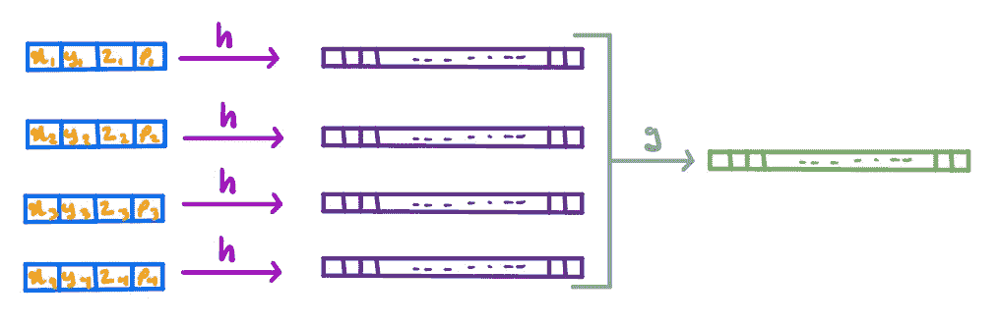**

**通过将点网络应用于 4 个激光雷达点来说明建议的架构。首先，函数 h 分别应用于每个激光雷达点，并将它们转换为维数为 d 的嵌入。然后，对称函数 g 采用这 4 个嵌入，并输出单个全局特征向量。**

**下图显示了为点云分类和语义分割任务提议的点网络架构。顶部的蓝色路径指定分类网络，而底部的黄色路径是语义分割网络。在分类网络中，从输入层到最大池层的层形成函数 *h* ，而最大池层被选为对称函数 *g* 。嵌入维数 *d* 选择为 1024。在 PointNet 中，以逐点方式应用于每个激光雷达点的函数 *h* 由全连接层(MLP)和[空间变换网络](https://arxiv.org/abs/1506.02025)形成。PointNet 中有两个空间转换器网络，在下图中称为 T-Net。空间变换网络在其输入点上执行数据相关的仿射变换。依赖于数据导致应用于输入点的仿射变换被即时确定为输入点本身的函数。**空间变换网络的主要目标是确保分类网络对于应用于点云的仿射变换的不变性。****

**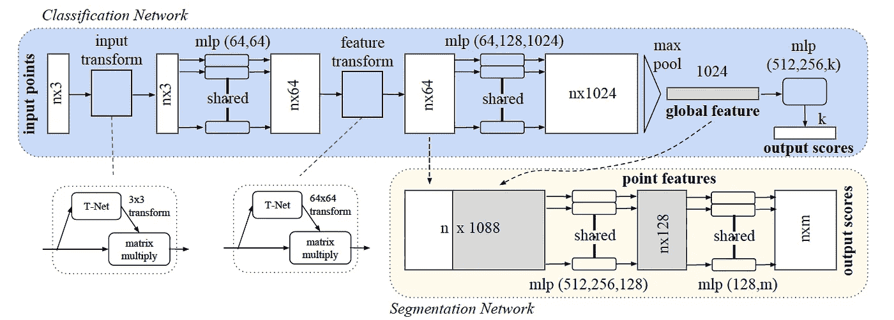**

**[点网](https://arxiv.org/abs/1612.00593)**

**如上图所示，虽然 PoinNet 分类网络的最终输出代表输入点云的单个分类决策(k 个输出得分),但语义分割网络依赖于点云的全局特征(维度为 1024)和局部特征(维度为 64)的串联，以针对每个点云做出单独的分类决策(m 个输出得分)。**

**点网无法执行 3d 对象检测任务，因为点网的分类网络假设输入点云的所有激光雷达点都属于单个对象。[**平截头体点网**](https://arxiv.org/abs/1711.08488) **用 3d 区域提议网络来扩充点网，以便将 3d 输入场景划分为子空间，使得每个子空间潜在地仅包含单个对象的 lidar 点。**作为这种划分的结果，类似点网的网络可以用于聚焦于对应于特定 3d 提议区域的子空间的 3d 对象检测任务。下图显示了平截头体点网的建议架构。3d 区域提议网络是左边的块，它被称为平截头体提议。**该建议网络基于由基于 2d 图像的对象检测网络预测的 2d 边界框的 3d 投影。因此，平截头体点网络是一个多模态(图像和激光雷达)3d 物体检测网络**。中间的块被称为 3d 实例分割，其获取 3D 提议区域内的激光雷达点，并执行逐点二元分类以确定每个给定的激光雷达点是否属于感兴趣的对象。最后的块是模型 3d 框估计，其将通过 3d 实例分割预测的那些 lidar 点视为属于感兴趣的对象，并输出对应于 3D 提议区域的 3D 定向框的尺寸、中心坐标和航向角。**

**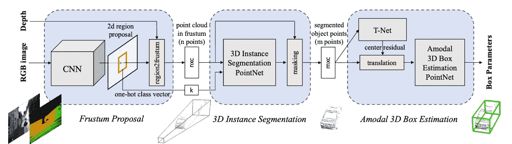**

**[锥台点网](https://arxiv.org/abs/1711.08488)**

# **具有点云有序网格表示的 3d 对象检测网络**

**在本节中，我们关注一类 3d 对象检测网络，其依赖于有序网格张量来表示点云，以便去除它们的置换不变性约束。特别地，这些检测网络不是直接消耗原始点云，而是以类似图像的有序网格的形式获取点云的中间表示作为它们的输入。**这类 3d 物体检测网络的主要特点是将类似于图像的点云表示为结构化网格，以便它们可以受益于现有的基于图像的 CNN 物体检测网络。****

**通过将点云表示为有序网格，这些有序网格表示可以直接传递给 CNN 对象检测网络，如[fast-RCNN](https://arxiv.org/abs/1506.01497)和 [SSD](https://arxiv.org/abs/1512.02325) 。也就是说，这些网络的回归头需要进行一些改变，以适应 3d 对象检测任务的回归目标。例如，需要在激光雷达坐标框架中而不是在 2d 图像平面坐标框架中进行盒子尺寸和坐标的预测。此外，回归头需要预测箱子的航向角。具有有序网格表示输入的点云 3d 对象检测网络主要采用了 2d 对象检测网络的现有架构，并进行了较小的修改。因此，我们首先回顾 2d 对象检测网络的两个主要类别:单触发和基于区域提议的网络，以及作为这些 2d 对象检测网络的主要构建块的骨干网络和特征金字塔网络。**

## **单发探测网络**

**[单发探测网络](https://arxiv.org/abs/1512.02325)通常被称为实时目标探测网络。**这些检测网络的快速响应时间是基于它们预测箱子的单阶段过程。通过由卷积层作为回归和分类头实现的密集预测范例，这种单级预测机制是可能的。**该密集预测过程为每个输入图像生成大约 100K 个盒子，这些盒子需要通过非最大抑制( [NMS](https://arxiv.org/abs/1704.04503) )后处理步骤进行滤波。这些 100K 预测框中的大多数是背景框，因此容易过滤掉。另一方面，具有不同于背景类别的类别的预测的盒子需要被传递到 NMS，从而在重叠的盒子中仅选择具有最高置信度得分的盒子。NMS 将在下面的章节中详细讨论。**

**下图展示了名为 [RetinaNet](https://arxiv.org/abs/1708.02002) 的单次检测网络的架构。每个单镜头检测网络由以下三个主要的构建模块组成:(1)主干网络(2)特征金字塔网络(3)分类和回归头。在接下来的章节中，我们将详细介绍主干网络和特征金字塔网络。**

****分类和回归头负责单发检测网络的密集预测。他们将特征图作为输入，并对特征图的每个条目预测一个盒子，这实现了单触发网络的密集预测范式**。分类和回归头是完全卷积网络，以便执行高分辨率密集预测。这些全卷积网络将特征图作为它们的输入，并为每个特征图条目生成表示类逻辑和回归目标的输出特征图。**

**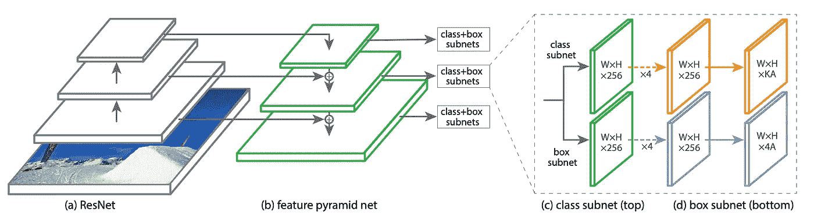**

**[视网膜网](https://arxiv.org/abs/1708.02002)**

## **基于区域提议的检测网络**

****基于区域提议的检测网络是两级检测网络，其不依赖于在单次检测网络中使用的密集预测范例，而是采用显式区域提议网络，该网络输出将被传递到分类和回归头的区域候选。**基于区域提议的检测网络的代表网络是[更快的 R-CNN](https://arxiv.org/abs/1506.01497) ，如下图所示。与针对特征图的每个条目预测一个框的单次检测网络不同，在基于区域提议的检测网络中，区域提议网络生成大约 2000 个区域候选，其中，首先，它们的特征图使用 ROI(感兴趣区域)汇集层来汇集。然后，候选区域的汇集特征图被分别传递到分类和回归头，以便对每个候选区域预测一个盒子。显式区域提议网络和单独处理区域候选使得基于区域提议的检测网络不如单次检测网络那样快。然而，类似于单次检测网络，基于区域提议的检测网络依赖于主干网络和特征金字塔网络作为特征编码器和特征地图增强模块。**

**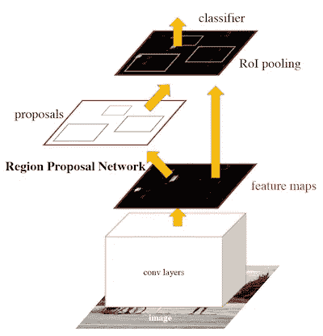**

**[更快的 R-CNN](https://arxiv.org/abs/1506.01497)**

## **主干网络**

**主干网络是输入图像或输入点云有序网格表示的特征生成器(编码器)。通常使用为 [ImageNet](http://www.image-net.org/) 分类任务(具有 1000 个类别和大约 1M 训练图像的图像分类任务)设计的 CNN 网络作为对象检测网络的骨干网络。特别是，ImageNet 分类网络在其最终的 1000 路 softmax 层之前被切割，并用作主干网络。最知名和常用的骨干网有: [AlexNet](https://papers.nips.cc/paper/4824-imagenet-classification-with-deep-convolutional-neural-networks.pdf) 、 [VGG](https://arxiv.org/pdf/1409.1556.pdf) 、 [Inception](https://arxiv.org/abs/1512.00567) 、 [ResNet](https://arxiv.org/abs/1512.03385) 、 [DenseNet](https://arxiv.org/abs/1608.06993) 、 [MobileNetV2](https://arxiv.org/abs/1801.04381) 、 [NasNet](https://arxiv.org/abs/1707.07012) 、 [AmoebaNet](https://arxiv.org/abs/1802.01548) 、 [MnasNet](https://arxiv.org/abs/1807.11626) 和[efficent net](https://arxiv.org/abs/1905.11946)。对于检测网络，骨干网络的选择取决于感知系统的延迟要求以及可用的存储器和计算资源。高效的骨干网有 Inception、MobileNetV2、MnasNet、EfficientNet。**

**当使用骨干网络作为对象检测网络的特征生成器时，另一个设计选择是选择由骨干网络生成的哪些特征图将被传递到检测网络内的下游模块。**不仅处理主干网络的最终特征图，而是传递在主干网络的不同阶段生成的若干特征图背后的主要动机是处理输入传感器模态(如自然图像)的比例模糊问题，或/和检测具有不同类别的对象，这些对象表现出显著不同的维度。**后一种情况的一个例子是自动驾驶应用，其中 3d 对象检测网络旨在检测具有不同尺寸的汽车、卡车、自行车和行人。**

**特别是，主干网络不同阶段的特征地图具有不同的空间感受域，这使它们成为解决传感器模态(如图像或不同维度对象的检测)的尺度模糊性的自然解决方案。这种方法在感知系统中被称为多尺度特征地图。要了解更多关于多尺度特征图的特征以及不同类型的卷积层如何影响特征图的感受野，可以回顾我们以前的博客文章，名为[多尺度 CNN 特征图的分析和应用](/analysis-and-applications-of-multi-scale-cnn-feature-maps-a6804bbac8)。**

## **特征金字塔网络**

****特征金字塔网络用于主干网络之上，以丰富和扩充主干网络生成的特征地图。该增强过程的主要目标是增强特征图的表示能力，针对 2d 和 3d 对象检测回归和分类任务而定制。**特征金字塔网络采用在骨干网络的 *C* 不同阶段(可能具有 *C* 不同的空间分辨率)生成的 *C* 特征地图，并输出通常具有与输入特征地图空间分辨率相同的空间分辨率的 *C* 增强特征地图。**

**提出的突出特征金字塔网络是下图所示的 [FPN](https://arxiv.org/abs/1612.03144) 。左边的路径是自下而上的路径，是主干网络的一部分。在主干网络的不同阶段，具有不同空间分辨率的三个特征地图被选择并传递到特征金字塔网络，该网络由右侧自上而下的路径示出。通常选择空间分辨率为 *H/4* x *W/4，H/8* x *W/8* 和 *H/16* x *W/16* 的骨干特征图作为特征金字塔网络的输入，其中 *H* 和 *W* 表示输入图像的高度和宽度。**

**更深的特征地图在语义上更强，FPN 的目标是使具有更高空间分辨率的更浅的特征地图在语义上与更深的特征地图一样强。这是通过 FPN 自上而下的上采样路径将编码的语义信息从较深的特征图转移到较浅的特征图来实现的。然而，FPN 自上而下的上采样路径缺乏对目标定位至关重要的粒度空间信息。通过使用横向连接将自顶向下路径中的上采样特征图与自底向上路径中的特征图融合，这种空间信息的缺乏得以缓解。**

**在特征金字塔网络的设计过程中，存在着如何对自顶向下路径中的特征地图进行上采样以及如何将自底向上路径的特征地图与自顶向下路径的特征地图相结合的自由度。虽然 FPN 使用最近邻插值作为上采样方法，但上采样的其他选项有[钉床、双线性插值、最大解卷积和转置卷积(解卷积)](/transposed-convolution-demystified-84ca81b4baba)。**在这些上采样方法中，唯一依靠训练数据来学习定制的上采样操作的方法是转置卷积。因此，它是最有前途的上采样层类型，并在最近的神经网络架构中受到欢迎**。然而，由于其可学参数，如果模型大小是一个问题，应避免。**

**另一个自由度是如何将由横向逐像素卷积层从自底向上路径转换的特征图与自顶向下路径的上采样特征图融合。两种常见的方法是:(1)元素相加，它要求特征映射具有相同数量的通道(2)通道相连接。逐通道连接方法具有更高的表示能力，但计算成本更高。FPN 使用元素相加作为融合方法，并进一步依靠 3×3 卷积层来平滑融合的特征图，以减轻混叠效应。**

**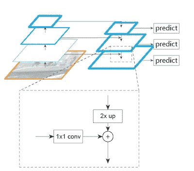**

**[FPN](https://arxiv.org/abs/1612.03144)**

**另一个最近提出的特征金字塔网络是下图所示的[面板](https://arxiv.org/abs/1803.01534)。它是作为 FPN 的延伸而建造的。特别是，它为 FPN 增加了一条新的自下而上的道路。在 PANet 框图中，块 *a* 是原来的 FPN，块 *b* 是新增加的自底向上路径。这个新的自下而上的路径以 FPN 自上而下的路径生成的特征地图(P2，P3，P4，P5)作为输入，并生成一组新的特征地图(N2，N3，N4，N5)作为输出。**这种新的自下而上路径背后的动机是确保具有较低空间分辨率的较深特征地图包含基本语义信息，例如由较浅特征地图编码的边缘、拐角和斑点。在主干网络中，从较浅的层到较深的层获取此类基本信息的可能性较小，因为它必须经过许多层，而在 PANet 的自下而上路径中，它只需要经过 3 层，如下图中绿色定向路径所示。****

**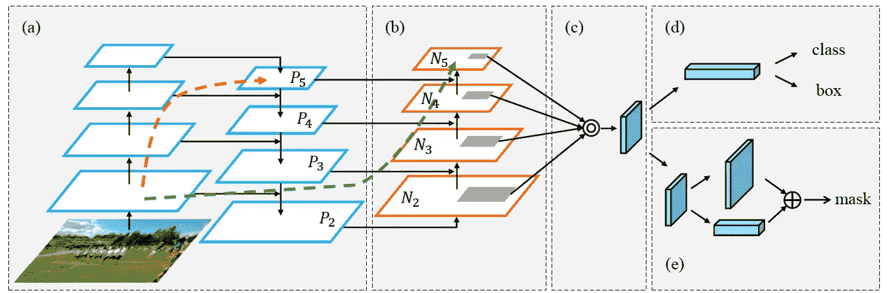**

**[面板](https://arxiv.org/abs/1803.01534)**

**另外 [NAS-FPN](https://arxiv.org/abs/1904.07392) 将寻找最佳特征金字塔网络公式化为神经架构搜索问题。所发现的架构由自顶向下和自底向上的连接组合而成。最近， [BiFPN](https://arxiv.org/abs/1911.09070) 提出了一种加权双向(自顶向下和自底向上路径)特征金字塔网络块，该网络块可以根据计算资源和所需精度重复。**

## **非最大抑制**

**[非极大值抑制](https://arxiv.org/abs/1704.04503) (NMS)是大多数目标检测网络的后处理步骤。对象检测网络为场景中的每个对象生成几个肯定的预测。**因此，要求 NMS 只选择重叠边界框中具有最高置信度得分的那些肯定预测边界框。对象检测网络为每个对象生成若干预测的这一特征源于训练范例，该范例为每个对象分配若干肯定目标。**例如，在具有锚框的[对象检测网络的情况下，与基础事实边界框具有大于 0.5 的交集(IOU)的每个锚框与该基础事实边界框匹配，并被认为是正面示例。因此，在这个过程的最后，每个基础事实框潜在地存在几个正锚框。此外，在没有锚框](https://arxiv.org/abs/1512.02325)的[对象检测网络的情况下，地面真实边界框内的每个参考特征地图条目被认为是旨在预测对应于目标对象的边界框的正面示例。](https://arxiv.org/abs/1902.06326)**

# **距离图像表示**

**在回顾了单镜头和基于区域提议的目标检测网络类别及其主干和特征金字塔网络形式的构建块之后，我们将注意力转向点云的网格表示。**在本节中，我们重点关注点云的距离图像表示，它将点云解释为激光雷达传感器拍摄的 3d 环境的 360 度照片。****

**在下图所示的网格表示中，点云被转换为一个图像张量，其中行维度表示激光束的仰角θ，列维度表示激光雷达传感器的方位角ϕ。对于威力登 HDL-64E，由于其 64 个激光束，其相应的距离图像具有 64 行，由于其 0.08 度的方位分辨率，其相应的距离图像具有 4500 列。此影像的每个条目的像素值等于其对应的返回激光雷达点的范围。然而，对于此图像中的大量条目，没有返回的激光雷达点，这主要是因为激光束射向天空，没有击中任何障碍物。此外，标准做法是为没有返回激光雷达点的条目分配零值来表示缺失的观测值。**

**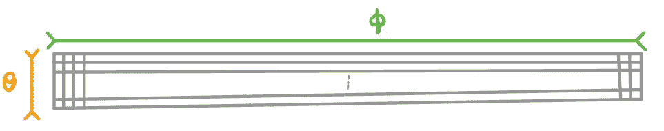**

**距离图像表示，其中行表示仰角θ，列表示方位角ϕ.**

**距离图像表示的主要优点有两个:(1)距离图像可以直接馈入 CNN 目标检测网络(2)距离图像导致在将点云转换为网格表示时添加最少的冗余信息。特别地，添加的冗余信息是指没有返回的激光雷达点的距离图像表示的那些条目。这种信息冗余是最小的，因为距离图像的大小至多与发射的激光束的数量一样大。另一方面，原始点云表示是最有效的表示，因为它只对返回的激光雷达点进行编码。**

****深度图像表示的主要缺点是自然图像普遍存在的尺度模糊和遮挡。**比例模糊问题源于这样一个事实，即距离激光雷达传感器较近的物体在距离图像中比距离较远的物体显得更大。这使得检测网络很难在不同距离图像上以不同尺寸出现的一类物体之间进行归纳。此外，比例模糊增加了 3d 盒的尺寸推断的复杂性。**理论上，人们可能会认为使用距离图像预测盒子尺寸应该是简单明了的，因为每个像素的深度都可以作为距离信息。然而，即使对象检测网络可以访问像素深度，卷积层也没有被设计成明确地使用该深度信息来消除比例模糊。特别地，CNN 对象检测网络将深度图像的深度信息视为特征通道。****

**距离图像也会受到遮挡的影响。通常，遮挡降低了 CNN 目标检测网络的性能，主要是因为卷积滤波器的矩形结构。**卷积滤波器的矩形结构允许信息从遮挡物体泄漏到将用于检测其他物体的特征图条目中。****

**在使用全卷积网络的 3D 激光雷达的[车辆检测中，提出了基于距离图像表示的检测网络](https://arxiv.org/abs/1608.07916)。如下图所示，该网络将点云的距离图像表示作为输入，由左上角的点地图表示。然后，它通过将输入的距离图像通过主干网络进行处理。最后，由主干网络生成的特征图被分类和回归头使用。**

****

**[使用全卷积网络从 3D 激光雷达检测车辆](https://arxiv.org/abs/1608.07916)**

# **3d 体素化网格表示**

****点云的另一种网格表示形式是 3d 体素化，通过量化激光雷达传感器周围的 3d** [**长方体**](https://en.wikipedia.org/wiki/Cuboid) **子空间来实现。选择 3d 长方体是因为它们的几何形状与张量的立方体形状兼容。为了实现 3d 体素化，首先，对于给定的 lidar 传感器，根据 lidar 传感器的范围以及给定应用的目标范围，选择围绕 lidar 传感器的 3d** [**长方体**](https://en.wikipedia.org/wiki/Cuboid) **。**激光雷达传感器范围的含义是避免激光雷达超范围空间的量化，以便节省存储器和计算。特别地，沿着激光雷达坐标框架的 x 和 y 轴的 3d 立方体的尺寸主要根据激光雷达传感器的范围来选择。例如，假设威力登 HDL-64E 的范围是 120 米，假设激光雷达传感器在立方体的中心，则其相应的 3d 立方体体素化的 x 和 y 维度不应大于 240 米。**

**此外，影响 3d 长方体尺寸的另一个因素是 3d 对象检测网络所设计的应用的目标范围。例如，在自动驾驶应用的情况下，高度大于激光雷达传感器(安装在自动驾驶汽车车顶上的激光雷达传感器)高度 2 米的子空间并不重要，因为自动驾驶汽车路径的规划是在激光雷达坐标系的 x-y 平面中执行的，并且在我们发明飞行自动驾驶汽车之前，自动驾驶汽车不会沿着激光雷达坐标系的 z 轴移动:)。在激光雷达坐标系中，3d 长方体的 z 尺寸的典型范围是从-2.5 米到 1.5 米，其中考虑到激光雷达传感器安装在自动驾驶汽车的车顶上，并且需要对地面上的物体进行检测，因此选择了-2.5 米的较低范围。**

**在选择围绕激光雷达传感器的 3d 立方体子空间的尺寸之后，下一步是量化 3d 立方体，以便将它们转换成张量，用作 3d 对象检测网络的输入。下图说明了这种量化过程，其中 3d 立方体在 x、y 和 z 维度上被量化。每个量化的子立方体称为一个体素单元。量化分辨率通常在三个维度上是相同的。这种分辨率的一个[典型值是 0.1 米](https://arxiv.org/abs/1902.06326)，这导致每个体素单元是一个 0.1 米×0.1 米×0.1 米的立方体。**

**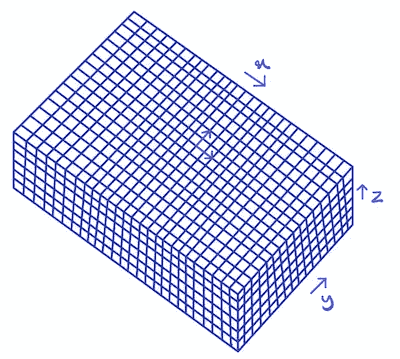**

**3d 体素化。**

****量化后的最后一步是为每个体素单元选择一个表示。**最常见的表示形式是给每个体素单元分配一个二进制值，如果体素单元包含至少一个激光雷达点，则分配值为 1，否则为 0。这种表示将把每个场景转换成 3d 张量。体素细胞的另一类表示是特征向量，其可以是手工设计的特征或机器学习的特征。为体素单元选择特征向量表示导致场景被编码为 4d 张量。**

**3d 体素化表示的主要优点如下。(1)因为 3d 体素化表示将原始点云转换成结构化网格表示，所以它们可以直接用作 CNN 对象检测网络的输入。这将允许 3d 体素化表示方法受益于 CNN 对象检测网络的最新进展。(2)与距离图像表示不同，3d 体素化表示不会遭受比例模糊和遮挡，因为它们不将激光雷达点投影到 2d 视点平面上。**

**另一方面，这种表示法的主要缺点是量化误差以及计算和存储效率低。 3d 体素化表示是一种类似于任何其他量化方法的有损变换。具体而言，给定体素单元内的所有激光雷达点将由标量或固定大小的矢量表示，该矢量可能不传达体素单元激光雷达点中编码的所有信息。**此外，3d 体素化生成的张量大小比原始点云表示大几个数量级。**例如，在 KITTI 数据集中，每个点云场景平均包含 100k 个激光雷达点，而其对应的具有 80m×80m×3m 尺寸的立方体和 0.1m 量化分辨率的 3d 体素化表示将是大小为 800x800x30 的 3d 张量，其具有大约 19M 个条目，比原点云表示大约大 200 倍。这种表示的计算和存储效率低下是由于这些体素单元的大部分(97%)是空的，这消耗了存储器并将被卷积滤波器处理。**

****与 3d 体素化表示相关联的额外计算成本的另一个来源是在 3d 对象检测网络中使用 3d 卷积层，3d 对象检测网络将这些表示作为输入。**下图显示了一个 3d 3x3x3 卷积滤波器。类似于依赖于 x-y 平面中局部邻域的空间相关性的沿 x 和 y 轴的 2d 卷积运算，这种局部邻域相关性也存在于 3d 体素化表示的 z 维中，这证明了沿所有 x、y 和 z 维使用 3d 卷积的合理性。尽管事实上 3d 卷积是 3d 体素化表示的自然选择，但是与 2d 卷积相比，3d 卷积的问题在于其额外的计算成本以及比 2d 卷积更多的参数。**

****

**3d 卷积。**

# **2d 体素化网格表示**

****2d 体素化网格表示类似于 3d 体素化网格表示，主要区别在于，在基于传感器的范围和目标范围选择围绕激光雷达传感器的 3d 立方体子空间之后，我们仅沿着 3d 立方体的 x 和 y 轴而不是 z 轴对其进行体素化**。下图显示了这样的 2d 体素化过程。作为 2d 体素化的结果，立方体子空间被分割成 x-y 平面中的 2d 体素单元。请注意，这些 2d 体素单元实际上是跨越立方体子空间的高度维度的高 3d 体素单元，并且被称为 2d 体素单元仅仅是因为在 2d x-y 平面上执行的量化过程。**

**这些 2d 体素单元的大部分是空的，这使得 2d 体素化的计算和存储效率低于原始的原始点云表示。标准做法是用固定大小的特征向量来表示每个 2d 体素单元。这样做从 2d 体素化过程得到的张量将是 3d 张量。量化误差是 2d 体素化的另一个问题，它是通过固定大小的特征向量来表示 2d 体素单元内的点云的预期结果。**

**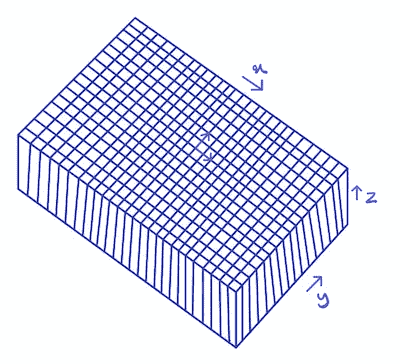**

**二维体素化。**

**类似于 3d 体素化的 2d 体素化是将由 CNN 对象检测网络处理的结构化网格形式的自然表示。**处理 2d 体素化网格的 CNN 对象检测网络比那些将 3d 体素化网格作为输入的检测网络在计算上更高效。**是因为依赖 2d 卷积层而不是检测网络处理 3d 体素化网格所使用的 3d 卷积层。另一方面，类似于 3d 体素化，2d 体素化表示不会遭受尺度模糊和遮挡。**

**每个 2d 体素单元被称为柱，其是与 3d 立方体体素表示具有相同高度的体素单元。**与对应于 2d 体素化表示的最终 3d 张量中的每个支柱相关联的表示是固定大小的向量，其可以由手工设计的支柱编码器或机器学习的支柱编码器生成。**在接下来的章节中，我们将提供手工设计和机器学习的特征向量的优缺点。**

# **柱式编码器**

**柱子编码器是映射，其获取给定柱子内部的激光雷达点，并生成对应于柱子的固定大小的特征向量。由柱子编码器生成的柱子特征向量形成点云的 3d 张量网格表示。下图显示了一个带有相关激光雷达点的柱子。请注意，与每个矿柱相关联的激光雷达点的数量不是固定的，而是因矿柱而异。**柱子编码器必须具有输入排列不变性，因为改变柱子内激光雷达点的顺序不会影响这些激光雷达点所代表的几何形状和语义类别。****

**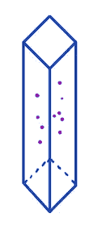**

**标有紫色点的柱子及其关联的激光雷达点。**

**支柱编码器的两个类别是手工设计的和机器学习的编码器，这将在下面的章节中进一步讨论。**

## **手工设计的柱式编码器**

****手工设计的柱子编码器是由实践者和研究人员设计的输入方式排列不变性编码器，并且不是从数据中学习的，以便表示柱子的激光雷达点的统计。**手工设计的支柱编码器的设计需要专家的工程努力，并不保证能产生支柱的最佳表现。依赖手工设计的编码器的另一个挑战是，它们可能无法在不同的数据集和任务之间转移。这意味着切换到新的数据集将需要全新的编码器，这需要额外的工程努力。**

**下图所示的 [PIXOR](https://arxiv.org/abs/1902.06326) 是一个带有手工设计的柱状编码器的著名激光雷达 3d 物体探测网络。该网络依赖于具有 x = [0，70]，y = [-40，40]和 z = [-2.5，1]的尺寸(以米为单位)的 3d 立方体的 2d 体素化，量化分辨率为 0.1m。柱特征向量的尺寸为 38，其转化为对应于 800×700×38 的 2d 体素化表示的 3d 张量的尺寸。首先，这个 3d 张量表示由残余块形成的主干网络处理。然后，由该主干网络生成的特征地图被特征金字塔网络扩充。具有 200×175×96 尺寸的特征金字塔网络的最终特征地图输出将被传递到分类和回归头。**

****

**[PIXOR](https://arxiv.org/abs/1902.06326) 。注意输入张量 36 的 z 维不正确，应该是 38。**

**现在，我们把重点放在 [PIXOR](https://arxiv.org/abs/1902.06326) 手工设计的立柱编码器上。PIXOR 柱子编码器是输入方式置换不变性映射，其将柱子的 lidar 点变换为具有维度 38 的固定大小的特征向量。**这些特征向量中的大多数条目编码了在不同高度的柱子上的激光雷达点的存在。**具体来说，每个支柱沿 z 轴被分割成高度为 0.1 米的分段。因此，假设每个支柱的高度为 3.5 米，则每个支柱将有 35 个这样的分段。每个线段都表示为一个二元变量，如果线段中至少存在一个激光雷达点，则该变量的值为 1，否则为 0。除了这 35 个与高度相关的特征之外，另一个特征条目被设置为等于矿柱中激光雷达点的平均强度。此外，还有两个特征条目，它们表示与沿 z 轴的每个支柱相对应的越界点。如果在其 x-y 边界内的支柱上方(下方)至少存在一个激光雷达点，则顶部(底部)超出范围要素条目将设置为 1，否则设置为 0。**

## **机器学习支柱编码器**

****机器学习支柱编码器是以端到端的方式学习的，作为激光雷达 3d 对象检测网络的一部分，依赖于标记的训练数据。**机器学习的支柱编码器必须具有输入排列不变性，因此类似于已经讨论过的[点网](https://arxiv.org/abs/1612.00593)架构。机器学习的立柱编码器相对于手工设计的立柱编码器的优势有两方面，如下所述。(1) **机器学习的支柱编码器映射作为 3d 对象检测网络的一部分直接从数据中学习，它们表示针对 3d 对象检测网络的回归和分类任务精确定制的特征。** (2)改变训练数据和目标任务不需要额外的工程努力来重新设计支柱特征向量，因为支柱特征编码器是以自动方式从数据中学习的。**

**[PointPillars](https://arxiv.org/abs/1812.05784) 是机器学习支柱编码器中的一个突出模型，如下图所示。机器学习的柱子编码器(简称柱子特征网)是[点网](https://arxiv.org/abs/1612.00593)的简化版本，其中点态函数 *h* 是一个 64 个神经元的全连接层，后面是 BatchNorm 和 ReLU。此外，在这个类似 PointNet 的结构中，对称函数 *g* 是一个基于元素的 max-pooling 层。首先，映射 *h* 被单独应用于给定支柱中的每个激光雷达点，这为每个激光雷达点生成维度 64 的嵌入。然后，基于元素的最大池层 *g* 获取矿柱的所有激光雷达点的嵌入，并生成维数为 64 的单个矿柱特征向量。基于 2d 体素化和所描述的柱编码生成的 3d 张量被传递到 3d 对象检测网络的主干网络。**

**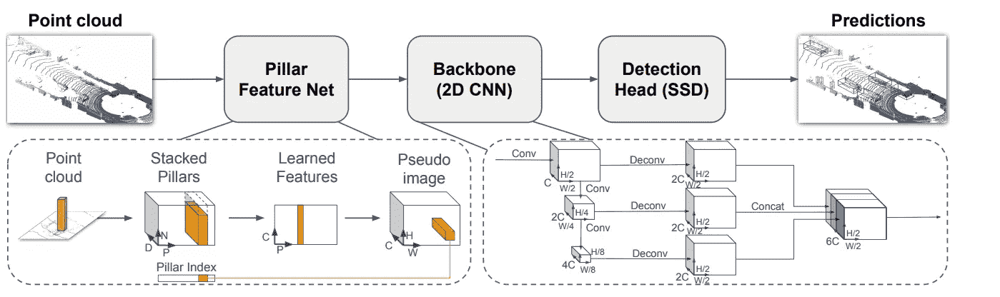**

**[点柱](https://arxiv.org/abs/1812.05784)。**