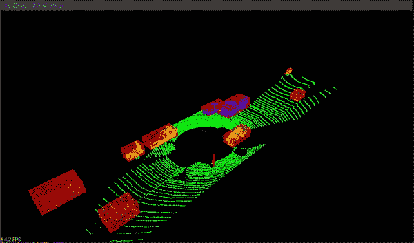
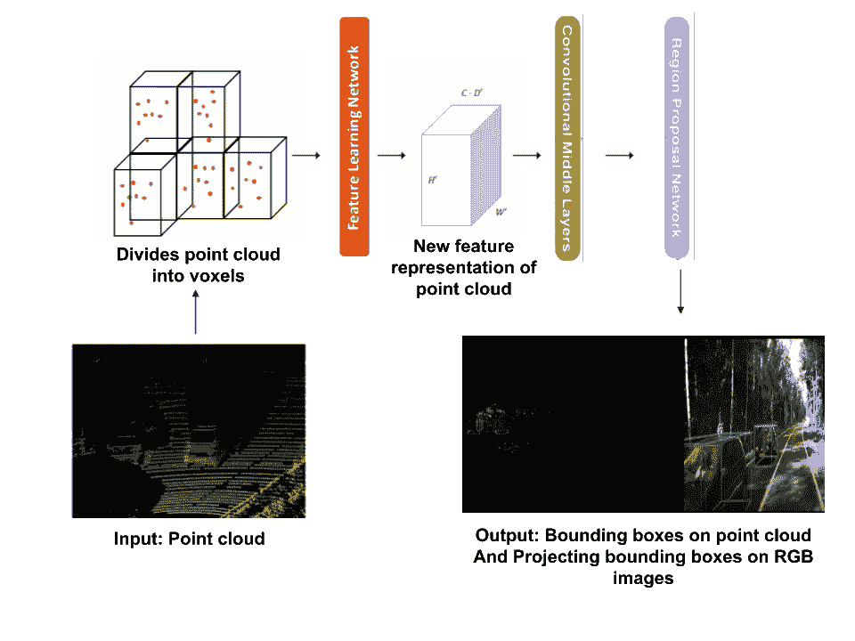
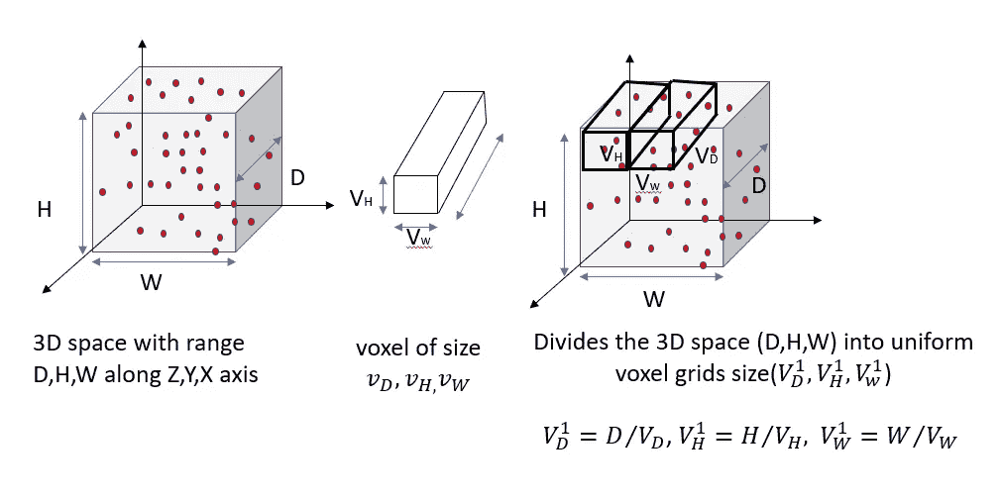
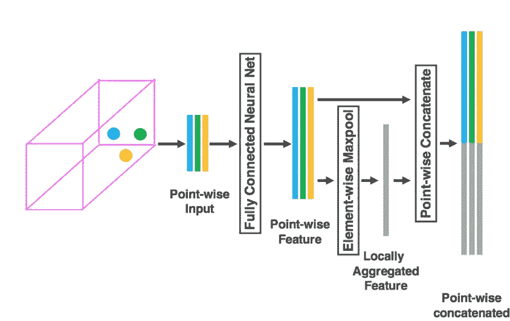
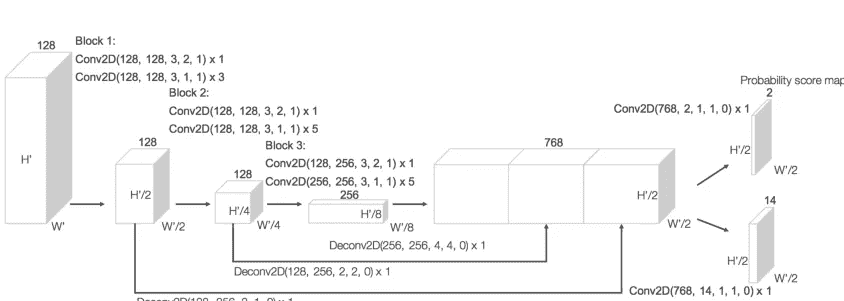
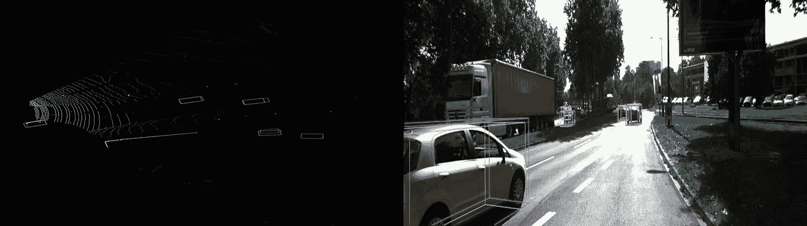
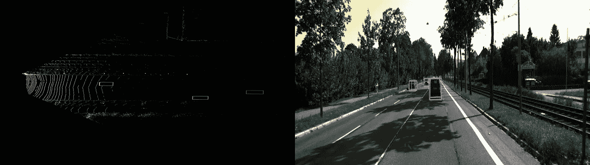
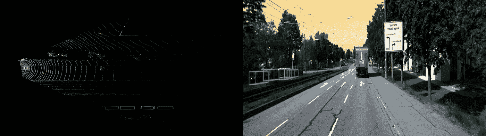

# 用 colab 实现基于激光雷达点云的三维目标检测(第 1 部分，共 2 部分)

> 原文：<https://towardsdatascience.com/lidar-point-cloud-based-3d-object-detection-implementation-with-colab-part-1-of-2-e3999ea8fdd4?source=collection_archive---------6----------------------->

我们将了解使用 KITTI 激光雷达点云数据实现 3D 车辆检测的体素网算法所需的概念

环境感知在构建自主车辆、自主导航机器人和其他现实世界应用中扮演着不可或缺的角色。相机、雷达和激光雷达等传感器用于感知环境的 360 度视图。从传感器获得的数据被解释为检测静态和动态物体，如车辆、树木和行人等。

## **3D 物体检测的需要**

计算机视觉中最先进的技术在 2D 数据如图像、视频(图像帧序列)上实时高精度地检测物体。但是使用相机传感器进行诸如定位、测量物体之间的距离以及计算深度信息之类的活动可能不是有效的，并且在计算上是昂贵的。

图片来源: [engin Bozkurt](https://github.com/enginBozkurt/LidarObstacleDetection) 带 KITTI 点云浏览器

激光雷达是一种主要的传感器，它根据点云提供物体的 3D 信息，以定位物体并表征形状。

最近，许多先进的 3D 对象检测器，如 VeloFCN、3DOP、3D YOLO、PointNet、PointNet++等，被提出用于 3D 对象检测。但在本文中，我们将讨论**体素网**这是一种 3D 物体检测算法，其性能超过了上述所有最先进的模型*。

## 体素网:基于点云的三维物体检测的端到端学习。

作者:尹舟，Oncel Tuzel - Apple Inc

论文的 DF 可以在这里下载，发表日期:*2017 年 11 月 17 日*

## 体素网应对的挑战

*   代替手动特征提取:在手动特征提取中，将点云投影到俯视图中，然后应用基于图像的特征提取方法进行检测。但是这些技术造成了信息瓶颈，并且不能提取检测任务所需的 3D 信息。

为了有效地提取三维形状信息，本文引入了机器学习特征提取器——特征学习网络。

*   减少计算并关注存储器限制:体素分组和随机采样技术用于处理体素中包含多于 T 个点的体素。
*   端到端 3D 检测架构:同时从原始点云数据中学习特征表示，并以端到端的方式预测精确的 3D 边界框。

> 体素网简而言之是“将点云划分为等距的 3D 体素，通过堆叠的 VFE 层将每个体素编码为矢量，然后使用 3D 卷积层聚集(组合)局部体素特征，将点云转换为高维体积表示。最后，修改的 RPN 网络引入体积表示并提供检测结果”。

## 体素网架构

体素网架构主要包含三个模块

1.  特征学习网络
2.  卷积中间层
3.  区域提案网络

体素网架构。a)输入细分成等间距体素的点云数据 b)特征学习网络，将体素中的一组点转换成作为 3D 张量的新特征表示 c) 3D 卷积 d) RPN 网络以绘制 3D 边界框。 [P](https://arxiv.org/abs/1711.06396) ic 学分:【https://arxiv.org/abs/1711.06396 T3

# 特征学习网络:

特征学习网络用于通过处理体素中的单个点云来从体素网格中提取描述性特征，以获得逐点特征，然后将这些逐点特征与局部聚集特征聚集。特征学习网络被应用于包含多于 T 个数目的点的所有体素。

**体素分割**:将 3D 空间细分成等间距的体素

体素分割:用体素分割 3D 空间。作者图片

以下是体素分区的代码片段:

> 注意:为体素网格定义的测量将根据对象的类别而变化

*   __cfg__。MAX_POINT_NUMBER 表示点云阈值，该阈值用于处理包含超过 35 个点云的选择性体素网格
*   x，Y，Z 最小值，最大值以米为单位定义 3D 空间
*   体素 X 尺寸表示体素网格尺寸(固定)

体素分割

**随机抽样**

点云被划分到体素网格中。因为处理所有点在计算上是昂贵的，并且增加了存储器的使用，这又增加了计算设备的负荷。为了应对这一挑战，对包含“T”个以上点云的体素网格进行采样。

有了这个策略，我们可以实现

1.  计算节省
2.  减少体素之间点的不平衡，从而减少采样偏差，并为训练增加更多变化。

**堆叠体素特征编码**

应用于单个体素的特征学习网络。 [pic 积分](https://arxiv.org/abs/1711.06396)

**全连接神经网络的逐点输入:**我们考虑包含多于 T 个数目的点的体素网格。体素中的每个点云用 4 个坐标[x，y，z，r]表示；其中 x、y、z 表示坐标，r 表示反射率。我们计算局部平均值作为体素网格内所有点的质心( **V)。**然后，我们用局部均值的偏移来增加体素中的每个点，以获得逐点输入特征集。

**全连接神经网络(FCN 网):**逐点输入特征集被馈送到全连接神经网络，以聚集所有逐点特征，从而对体素所包含的表面形状进行编码。

FCN 网络由线性层、批量归一化和递归组成。

**基于元素的最大池:**基于元素的最大池用于从基于点的输入特征中获取局部聚集的特征

最后，逐点连接用于聚合逐点特征和局部聚合特征。

使用批量标准化和最大池定义逐点输入、聚合要素的 VFE 图层代码片段:

# 卷积中间层

该层将体素特征转换为密集的 4D 特征图，并使用卷积、批量归一化、ReLU 将特征图的大小减少到原始的四分之一。

ConvMD(cin，cout，k，s，p)表示 M 维卷积运算符，其中 cin 和 cout 表示输入和输出通道的数量，k、s 和 p 分别表示内核大小、步长和填充大小。

显示 3D 卷积层的代码片段:

# 区域提案网络

改进的区域提议网络具有三个完全卷积层的块。每个块的第一层通过步长为 2 的卷积对特征图进行减半下采样，之后是步长为 1 的卷积序列(×q 表示滤波器的 q 次应用)。在每个卷积层之后，应用 BN 和 ReLU 操作。然后，我们将每个块的输出上采样到固定大小，并连接以构建高分辨率特征图。

最后，该特征图被映射到期望的学习目标:

(1)概率得分图和

(2)回归图。

定义卷积和反卷积层的代码片段:

修改后的 RPN 架构 [pic 信用](https://arxiv.org/abs/1711.06396)

感谢阅读！！！

在下一篇文章中，我们将实现三维物体检测的体素网代码

以下是在 colab 中实现该模型所获得的一些结果

KITTI 验证数据集上的预测结果

**特别感谢:**

**Uma K Mudenagudi 博士，KLE 理工大学，项目导师。**

参考

1.  [体素网:基于点云的三维物体检测的端到端学习](https://arxiv.org/pdf/1711.06396.pdf)
2.  [PointNet:用于三维分类和分割的点集深度学习](https://arxiv.org/abs/1612.00593)
3.  [基于深度学习的物体检测综述](https://arxiv.org/pdf/1907.09408)
4.  KITTI 原始数据集:@ARTICLE{ [Geiger2013IJRR](http://www.cvlibs.net/publications/Geiger2013IJRR.pdf) ，作者= { [Andreas Geiger](http://www.cvlibs.net/) 和 [Philip Lenz](http://www.mrt.kit.edu/mitarbeiter_lenz.php) 和 [Christoph Stiller](http://www.mrt.kit.edu/mitarbeiter_stiller.php) 和 [Raquel Urtasun](http://ttic.uchicago.edu/~rurtasun) }，标题= {视觉与机器人:KITTI 数据集}，期刊= {国际机器人研究期刊(IJRR)}，年份= {2013}