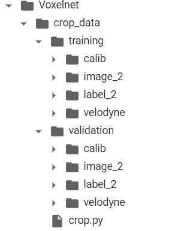
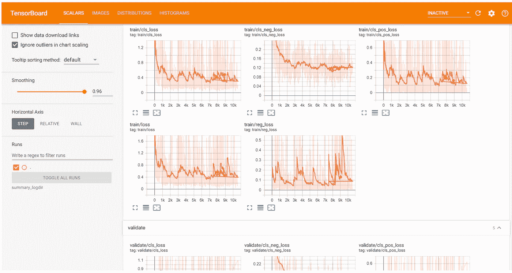
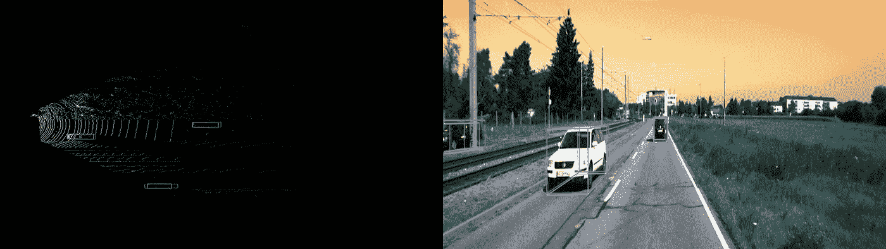
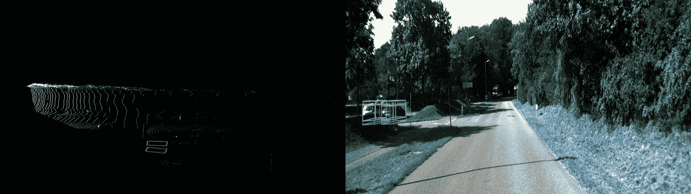

# 用 colab 实现基于激光雷达点云的三维目标检测(第 2 部分，共 2 部分)

> 原文：<https://towardsdatascience.com/lidar-point-cloud-based-3d-object-detection-implementation-with-colab-part-2-of-2-f3ad55c3f38c?source=collection_archive---------16----------------------->

使用 google colab 实现了基于点云的三维物体检测算法。

在我以前的文章中，我解释了实现体素网所需的关键概念，体素网是一种端到端的 3d 对象检测学习模型，您可以在这里找到

延续[上一篇文章](https://medium.com/@gkadusumilli/lidar-point-cloud-based-3d-object-detection-implementation-with-colab-part-1-of-2-e3999ea8fdd4)，我们将使用 KITTI 点云数据实现三维物体检测的体素网算法

**第一步:处理 KITTI 数据集训练模型【详细步骤】**

以下步骤对于准备数据来训练模型至关重要。KITTI 数据集需要下载、裁剪、处理并保存在驱动器中。

登录 [google colab](https://colab.research.google.com/) ，打开笔记本，暂时不需要 GPU。

> 注意:如果选择了 GPU，请注意，每个用户都有大约 30GB 的虚拟空间，整个数据集的大小为大约 40+ GB，然后解压缩数据集的内存将耗尽。在接下来的步骤中，我们将下载 KITTI 数据集、处理、裁剪和创建。压缩并移动到驱动器，以便将来使用这些数据

*   必需的数据集

1.  威力登点云(29 GB):将数据输入到体素网

2.对象数据集的训练标签(5 MB):体素网的输入标签

3.目标数据集的摄像机校准矩阵(16 MB):用于预测的可视化

4.对象数据集的左侧彩色图像(12 GB):用于预测的可视化

```
#clone the voxelnet git repo
!git clone [https://github.com/gkadusumilli/Voxelnet.git](https://github.com/gkadusumilli/Voxelnet.git)
#change the cwd
%cd /content/drive/My Drive/Voxelnet/crop_data
```

*   下载数据集(。zip)直接加载到 colab 虚拟机[~ 15–20 分钟]

```
#Data label file
!wget (enter the link)#Calib file
!wget (enter the link )#Velodyne file
!wget (enter the link)# Image file
!wget (enter the link)
```

*   解压缩数据集(。zip)到文件夹中(大约 20- 30 分钟)

```
#Unzip the velodyne training folder
!unzip /content/Voxelnet/crop_data/data_object_velodyne.zip 'training/*' -d /content/Voxelnet/crop_data#Unzip the image training folder
!unzip /content/Voxelnet/crop_data/data_object_image_2.zip 'training/*' -d /content/Voxelnet/crop_data#unzip the object label
!unzip /content/Voxelnet/crop_data/data_object_label_2.zip#unzip the data object calib
!unzip /content/Voxelnet/crop_data/data_object_calib.zip 'training/*' -d /content/Voxelnet/crop_data
```

*   用于训练和验证的裁剪点云数据。图像坐标外的点云被移除。裁剪的点云将覆盖现有的原始点云[40–45 分钟]

```
#to run the 'crop.py' lower version of scipy is needed
!pip install scipy==1.1.0#run crop.py
!python crop.py
```

*   创建验证数据以评估模型[~ 10–15 分钟]

```
#create a folder 'validation' and copy the content in training #folder!mkdir /content/Voxelnet/crop_data/validation%cp -av /content/Voxelnet/crop_data/training /content/Voxelnet/crop_data/validation/
```

*   我们将根据协议[在这里](https://xiaozhichen.github.io/files/mv3d/imagesets.tar.gz)【2-3 分钟】分开训练

最后一步…

*   创造。压缩已处理、裁剪数据的文件夹[30–40 分钟]

```
!zip -r /content/VoxelNet/data/data_lidar.zip /content/VoxelNet/crop_data
```

*   移动。压缩文件夹到驱动器[~5 分钟]

```
#rename the folder as you need in the drive, I've stored in dtive with the folder named 'AI'!mv "/content/VoxelNet/data/data_lidar.zip" "/content/gdrive/My Drive/AI"
```

> 下面是[链接](https://github.com/gkadusumilli/Voxelnet/blob/master/VoxelNet_data_creation.ipynb)到 colab jupyter 笔记本的所有上述步骤。

## 步骤 2:训练模型

*   登录 [google colab](https://colab.research.google.com/) ，创建一个新的笔记本
*   要访问 GPU:点击**运行时>更改运行时类型> GPU**

> 注意:colab GPU 运行时间大约在 12 小时后，运行时间将被断开，存储的数据将会丢失。因为在我们的情况下，每个历元将花费大约 2 小时，并且需要训练超过 20 个历元来观察初步结果。所以将使用 google drive 作为存储代码、检查点、预测结果等的路径

*   将当前工作目录(CWD)更改为 drive

```
#voxelnet is the folder name, you can rename as you need
%cd /content/drive/My Drive/Voxelnet
```

*   体素网的实现需要几个依赖项。因此，我们将克隆整个存储库。

```
!git clone [https://github.com/gkadusumilli/Voxelnet.git](https://github.com/gkadusumilli/Voxelnet.git)
```

*   建立档案

```
%cd /content/drive/My Drive/Voxelnet!python setup.py build_ext --inplace
```

*   将处理后的数据集解压缩到 crop_data 文件夹中[35–40 分钟]

```
%cd /content/drive/My Drive/Voxelnet/crop_data#Locate the zip folder in the drive and unzip using !unzip command
!unzip "/content/drive/My Drive/AI/data_lidar.zip"
```



数据文件夹结构

*   训练模型

```
%cd /content/drive/My Drive/Voxelnet/
```

重要参数解析

```
!python train.py \--strategy="all" \--n_epochs=16 \--batch_size=2 \--learning_rate=0.001 \--small_addon_for_BCE=1e-6 \--max_gradient_norm=5 \--alpha_bce=1.5 \--beta_bce=1 \--huber_delta=3 \#if dump_vis == yes, boolean to save visualization results
--dump_vis="no" \--data_root_dir="/content/drive/My Drive/Voxelnet/crop_data" \--model_dir="model" \--model_name="model6" \--dump_test_interval=3 \--summary_interval=2 \--summary_val_interval=40 \--summary_flush_interval=20 \--ckpt_max_keep=10 \
```

## 用张量板可视化测井方向

```
%load_ext tensorboard#summary_logdir is the logdir name
%tensorboard --logdir summary_logdir
```

下面的快照是日志目录结果@ epoch6



张量板-logdir

## 评估模型

```
!python predict.py \
--strategy="all" \
--batch_size=2 \
--dump_vis="yes" \
--data_root_dir="../DATA_DIR/T_DATA/" \
--dataset_to_test="validation" \
--model_dir="model" \
--model_name="model6" \
--ckpt_name="" \
```

*   下载、裁剪和处理 KITTI 数据集的代码可以在这里找到
*   从第 2 步开始执行的代码可以在[这里](https://github.com/gkadusumilli/Voxelnet/blob/master/VoxelNet_implementation.ipynb)找到

以下是对模型进行 30 个时期的训练后获得的一些结果。



所有车辆都被检测到



检测到两辆车


一辆车不见了

特别感谢[清华机器人学习实验室](https://github.com/tsinghua-rll)、[黄千贵](https://github.com/qianguih)、[大卫·夏羽](https://github.com/steph1793)为实现体素网做出的宝贵贡献

**特别感谢:**

**Uma K Mudenagudi 博士，KLE 理工大学，项目导师。**

参考资料:

KITTI 原始数据集:@ ARTICLE {[Geiger 2013 jrr](http://www.cvlibs.net/publications/Geiger2013IJRR.pdf)，作者= { [Andreas Geiger](http://www.cvlibs.net/) 和 [Philip Lenz](http://www.mrt.kit.edu/mitarbeiter_lenz.php) 和 [Christoph Stiller](http://www.mrt.kit.edu/mitarbeiter_stiller.php) 和 [Raquel Urtasun](http://ttic.uchicago.edu/~rurtasun) }，标题= {视觉与机器人:KITTI 数据集}，期刊= {国际机器人研究期刊(IJRR)}，年份= {2013}