# 数据可视化中的测谎仪技术

> 原文：<https://towardsdatascience.com/lie-detector-techniques-in-data-visualizations-b2838651a946?source=collection_archive---------40----------------------->

## 深思熟虑地查看数据的艺术…

马库斯·温克勒在 [Unsplash](https://unsplash.com?utm_source=medium&utm_medium=referral) 上的照片

人类大脑处理视觉数据的速度非常快。它的大量能量用于视觉处理。这可能是一种进化特征，帮助人类在早期充满敌意的环境中生存下来。在那些时候，迅速注意到甚至一个很小的动作，识别动物的脚印，并正确解释危险信号往往在挽救一个人的生命方面发挥着至关重要的作用。

这解释了为什么当数据以视觉形式(图表、图形等)呈现时，我们比以原始格式(表格)呈现时更容易理解。我们倾向于更好地识别图片或图像中的模式或趋势。 ***“一图胜千言”*** 这句古老的格言有很大的道理

然而，正确解释数据可视化是一门艺术。图表和图形经常会误导人们，有时是由于错误的解释，有时是由于创作者的错误意图。许多政治和营销活动旨在通过故意提供可疑信息来诱惑和误导人们。

本文试图解释常用数据可视化背后的思想，以及如何有效地解释它们。

# 尺度和比例

在 ***时间*** 内发生的变化可以被认为是一种**趋势**。例如，股票价格在一周/一月/一年内的变化、一个国家多年来的 GDP 增长、一个月内气温的上升和下降等。可视化趋势的最佳图表是折线图。考虑以下 6 个月产品销售的虚拟数据:

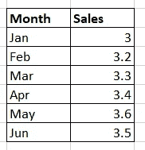

这些数据可以通过以下两种方式可视化:

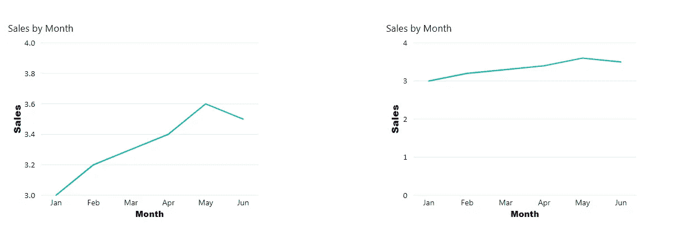

左边的图表显示几个月来销售额增加了，而右边的图表显示销售额大致保持不变。这是怎么回事？

> **提示 1:始终检查两个轴上的刻度。**

在左图中，垂直轴从 3 开始，而在右图中，垂直轴从 0 开始。从技术上来说，两个图表显示的是相同的数据，但由于在轴上的缩放方式不同，解释可能会有很大的不同。

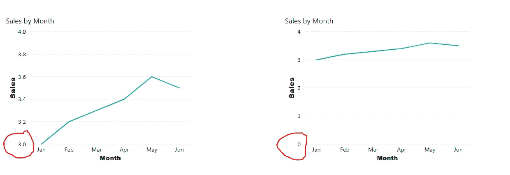

如果我们在左图中保持起点为 3，但将数据放大到 10，那么也会出现更真实的画面

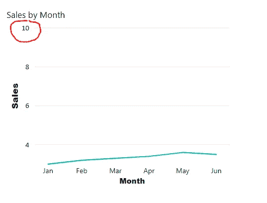

让我们看看下面显示印度两个邦识字率的数据

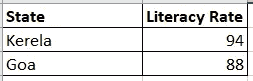

现在，如果我们将这些数据表示如下:

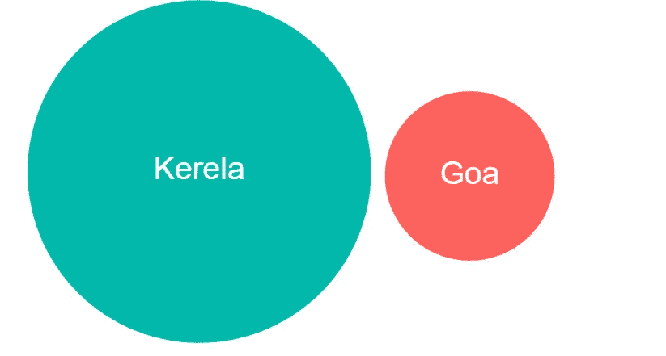

这给人一种感觉，果阿的识字率比 Kerela 低得多，但这不是事实。也许正确的表述应该是这样的，果阿的气泡仅比 Kerela 略小。

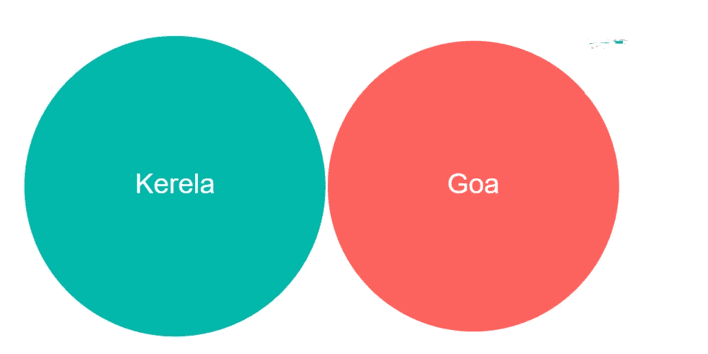

> **提示 2:在进行比较时，一定要检查数据的比例**

现在，它正确地表明，与 Kerela 相比，果阿的识字率并没有很低，但差别并不明显。

我们的下一个建议来了

> **提示 3:当跨类别比较数据时，条形图几乎总是更好**

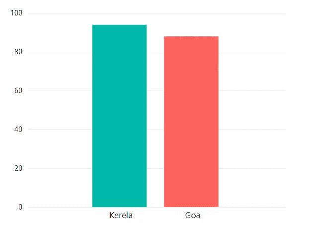

# 频率与百分比

让我们看看下面的数据。它的虚假数据显示了各种职业中被报告为抑郁症的人的百分比和数量。

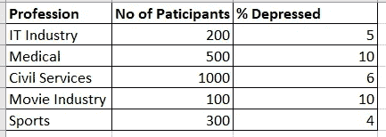

如果我们绘制各职业中抑郁者的百分比，图表如下所示:

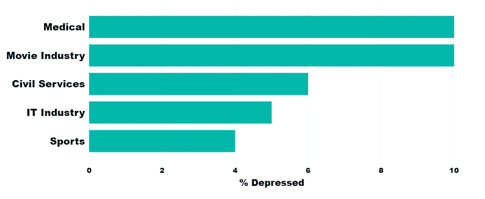

这给我们的印象是，医疗行业和电影行业的%的人都差不多。它掩盖了一个重要的事实，即不同职业中接受采访或分析的人数有显著差异。这是显示数据不足的典型例子。如果我们把某一特定职业的受访人数包括在内，这张图表会更有用，更真实地反映出潜在的数据。下图描绘了这一指标

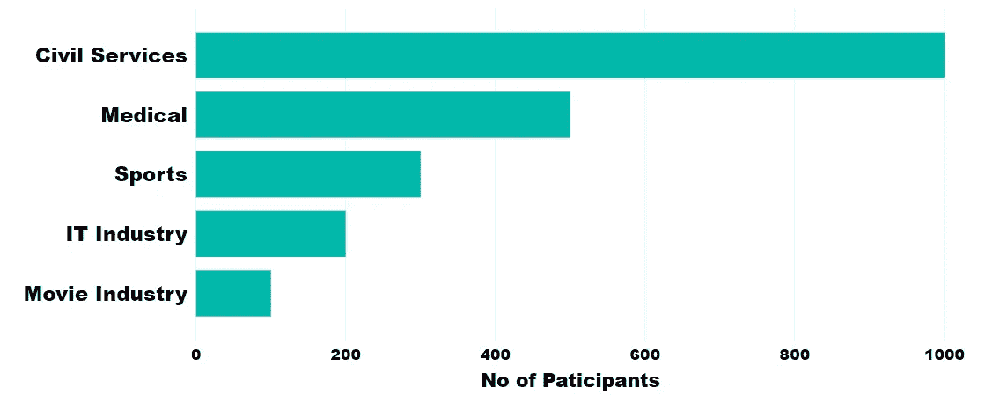

现在，解释完全不同了。

> ***提示 4:如果你看到的是百分比，而不是频率，那就要持怀疑态度，反之亦然。查看百分比和频率*** 总是一个好主意

# **数据不足**

可能会有这样的情况，某些数据点是精心挑选的，以推动叙述朝着特定的方向发展。检查下面的数据

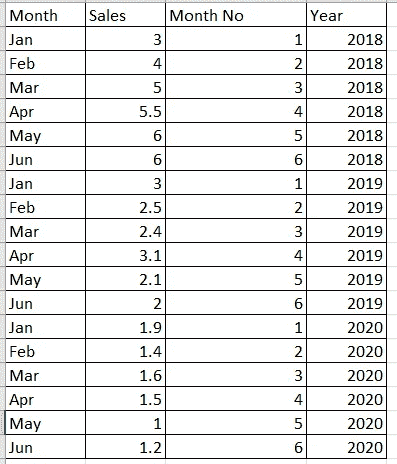

数据绘制如下:

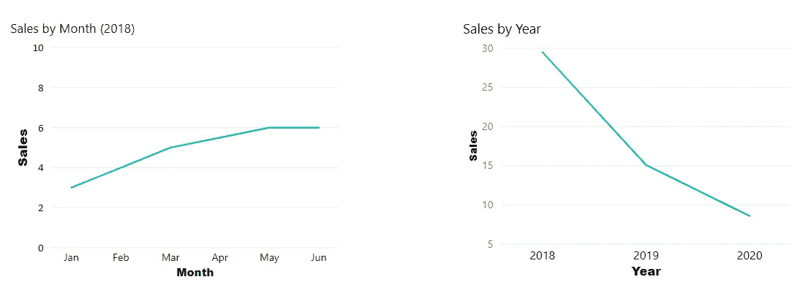

在左边，图表显示上升趋势，而在右边，它显示下降趋势。图表的读者可能会被欺骗，认为随着时间的推移，销售会增加，如果他不注意左边的图表只绘制了 2018 年的情况。如果跨年度分析销售趋势(右图)，销售额实际上是下降的。

> ***提示 5:经常检查数据的完整性。不要仅凭图表的外观就做出判断。检查已经包含(或省略)的数据点。***

我们很多人都有一个根本性的缺陷。我们患有 ***确认偏差*** ，这是一种倾向于相信和回忆那些确认或支持我们先前信念或价值观的信息。

> 我们往往只看到那些我们想看到的东西！

因此，我们的数据可视化可能会遭受同样的缺陷，有时是无意的，有时是故意的。让我们试着不要用数据可视化来欺骗自己或他人！