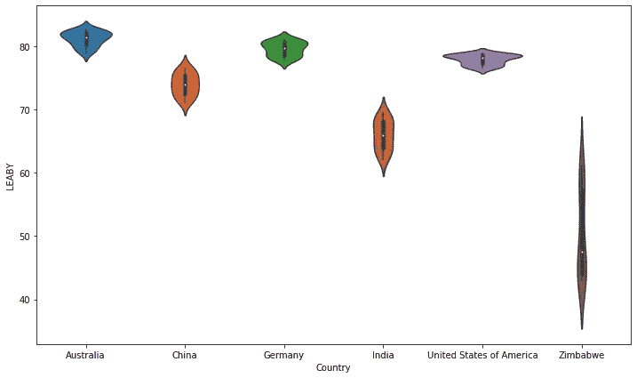
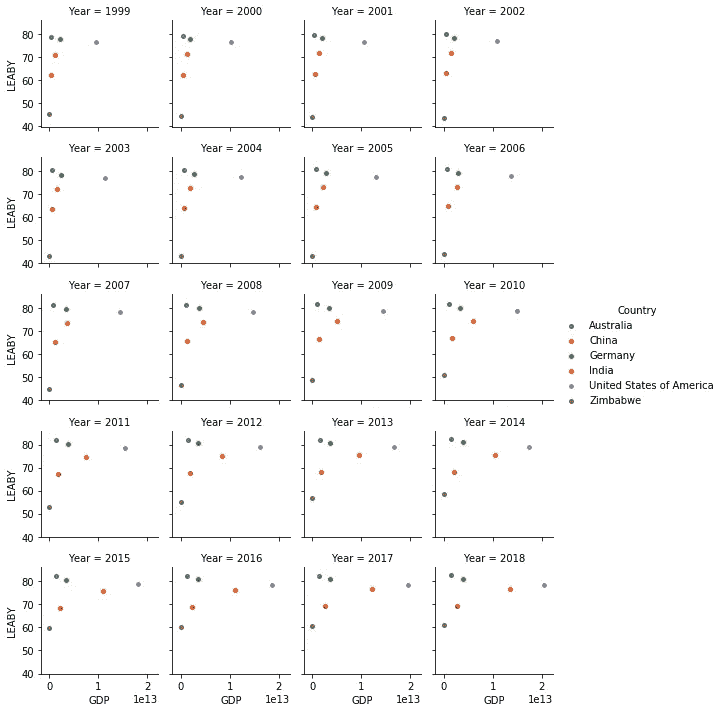
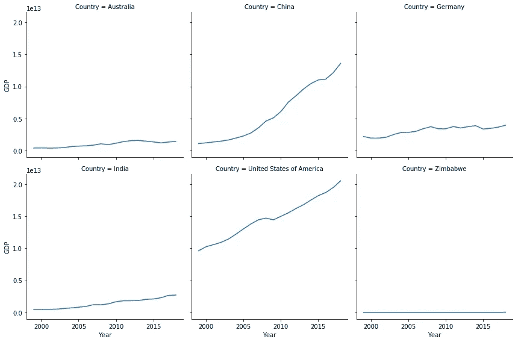
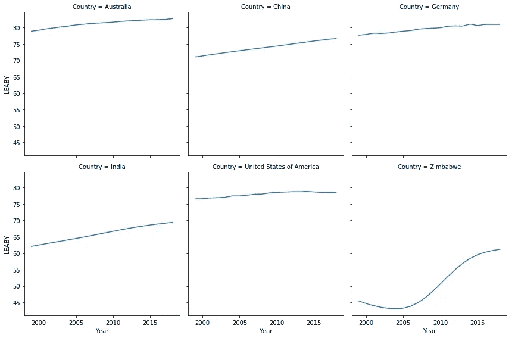

# 使用数据分析对比预期寿命和国内生产总值！

> 原文：<https://towardsdatascience.com/life-expectancy-vs-gross-domestic-product-using-data-analytics-bc0d5c78043f?source=collection_archive---------42----------------------->

## 数据分析

## 一个数据分析练习，看看我们能否找到这两个术语之间的关系。

数据分析是指提高生产力和商业效益的数据处理方法。数据来自各种来源，并被清理和分类以解释不同的行为模式。在这里，国内生产总值和出生年份预期寿命之间的关系是借助于六个不同国家过去 20 年的数据来分析的。


艾萨克·史密斯在 [Unsplash](https://unsplash.com?utm_source=medium&utm_medium=referral) 上拍摄的照片

## 使用的术语:

1.  **GDP:** 国内生产总值(GDP)是一个国家在一定时期内生产的所有成品和服务的总体货币或消费者价值。它是衡量国内总产出的一个重要指标，是一个国家经济健康状况的详细记分卡。GDP 以美元计算。
2.  出生时的预期寿命(LEABY): “预期寿命”这个词指的是一个人预期能活多少年。根据定义，预期寿命是基于对特定人口群体成员死亡时的平均年龄的估计。

本项目中使用的数据来自世界银行。该项目旨在借助数据可视化，尝试确定澳大利亚、中国、德国、印度、美国和津巴布韦这六个国家的国内生产总值与预期寿命之间的关系。

在这里找到这个项目[的代码，在](https://github.com/jackfrost1411/gdpvsleaby) [LinkedIn](https://www.linkedin.com/in/dhruvilshah28/) 上和我联系。让我们进入编码部分。

# 1.可视化过去 20 年(1999 年至 2018 年)每个国家的 LEABY

> Violin 图帮助我们一次可视化和比较多个分布。沿着中线有两个对称的“KDE —核密度估计—图”。中间的“黑色粗线”表示四分位数范围，而从四分位数延伸到两端的线表示 95%的置信区间。中间的白点表示分布的中间值。点击了解更多关于小提琴的剧情[。](https://seaborn.pydata.org/generated/seaborn.violinplot.html)

下面是创建六个国家的小提琴情节的代码。

```
from matplotlib import pyplot as plt
import pandas as pd
import seaborn as snsdf = pd.read_csv("final.csv")fig = plt.subplots(figsize=(12, 7))
sns.violinplot(data=df, x='Country', y='LEABY', fontsize='large', fontweight='bold')
plt.savefig("violin.png",bbox_inches='tight')
```

输出:



小提琴情节:出生年份的预期寿命(利比)与国家

我们可以看到方差在津巴布韦国家的数据中最高，在美国最低。此外，澳大利亚的平均预期寿命最高，津巴布韦最低。

# 2.可视化 GDP 和 LEABY 之间的相关性

> 一个 [FacetGrid](https://seaborn.pydata.org/generated/seaborn.FacetGrid.html) 接受一个函数并创建您指定参数的独立图形。

接下来，为了了解 GDP 和 LEABY 之间的相关性，让我们看看散点图的分面网格，将 GDP 映射为各个国家预期寿命的函数。以下是 matplotlib 散点图(LEABY vs GDP)。

```
g = sns.FacetGrid(df, col='Year', hue='Country', col_wrap=4, size=2)
g = (g.map(plt.scatter, 'GDP', 'LEABY', edgecolor="w").add_legend())
```



预期寿命与国内生产总值

散点图很容易解释。从上面的图表中，我们可以注意到这些国家在过去 20 年中发生的变化。中国和美国是沿 x 轴移动最多的国家，即国内生产总值多年来一直在增长，而津巴布韦是沿 y 轴移动最多的国家，即预期寿命随着时间的推移而增加。此外，澳大利亚和美国的预期寿命在过去 20 年中似乎保持不变。

此外，可视化变量随时间变化的一个很好的方法是使用折线图。现在，如果我们分别用线形图来表示 GDP 和预期寿命，而不是散点图，我们可以更容易地看到随着时间的变化。下面是按国家绘制的 GDP 线图。

```
g3 = sns.FacetGrid(df, col="Country", col_wrap=3, size=4)
g3 = (g3.map(plt.plot, "Year", "GDP").add_legend())
```



按国家绘制 GDP 的折线图

在这些国家中，美国的国内生产总值最高，而且这一数字逐年稳步上升。正如我们所看到的，中国的 GDP 在过去的 10 年里急剧增长，我们很想知道中国发生了什么事情导致了这种突然的变化？这背后有很多原因，你可以在下面的文章中找到。

[](https://www.weforum.org/agenda/2016/06/how-has-china-s-economy-changed-in-the-last-10-years/) [## 这就是中国经济在过去 10 年中的变化

### 即使国内生产总值的增长率有所下降，普通中国人现在的富裕程度是 2006 年的两倍多…

www.weforum.org](https://www.weforum.org/agenda/2016/06/how-has-china-s-economy-changed-in-the-last-10-years/) 

现在让我们来看一个类似上面 LEABY 的图。下面是按国家划分的预期寿命曲线图。

```
g3 = sns.FacetGrid(df, col="Country", col_wrap=3, size=4)
g3 = (g3.map(plt.plot, "Year", "LEABY").add_legend())
```



FacetGrid 绘制各国预期寿命的线图

从 2010 年到 2015 年，这六个国家的预期寿命发生了巨大变化。随着时间的推移，美国的预期寿命变化最小，这可能是高 GDP 的结果吗？但是澳大利亚的情况是，与其他国家相比，它的国内生产总值较低，但是预期寿命仍然几乎与美国相当。GDP 和预期寿命之间的关系似乎不是那么简单。


马克·弗莱彻·布朗在 [Unsplash](https://unsplash.com?utm_source=medium&utm_medium=referral) 上的照片

“这非常令人惊讶，”加州洛杉矶大学经济学教授阿德里亚娜·勒拉斯-穆尼说。“我们知道，富裕国家的人比贫穷国家的人寿命长。国内生产总值和预期寿命之间有很强的关系，这表明收入越高越好。然而，当经济表现良好时，当经济增长高于正常水平时，我们发现更多的人正在死亡。”也就是说，致富有很大的好处。但是致富的方法，听起来很冒险。

总之，经济学家们一致认为，当一个国家的经济表现——其国内生产总值——高于预期时，死亡率往往高于预期。这种关系很明显，但影响程度很小。当国内生产总值比平均水平高出 5%时，成年人的死亡率可能会增加 1 %,这是一个不错的增长。阅读下面的文章，更好地理解国内生产总值和预期寿命之间的关系。

[](https://www.weforum.org/agenda/2016/10/the-relationship-between-gdp-and-life-expectancy-isnt-as-simple-as-you-might-think) [## GDP 和预期寿命之间的关系并不像你想象的那么简单

### 每个人都希望经济增长，对吗？这是每个政治家一揽子承诺的一部分。扩张的经济使…

www.weforum.org](https://www.weforum.org/agenda/2016/10/the-relationship-between-gdp-and-life-expectancy-isnt-as-simple-as-you-might-think)