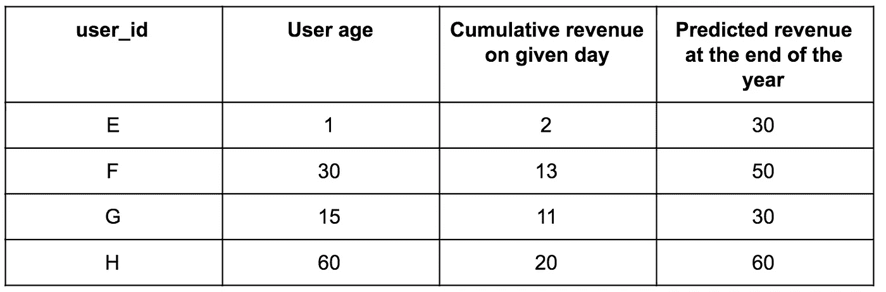
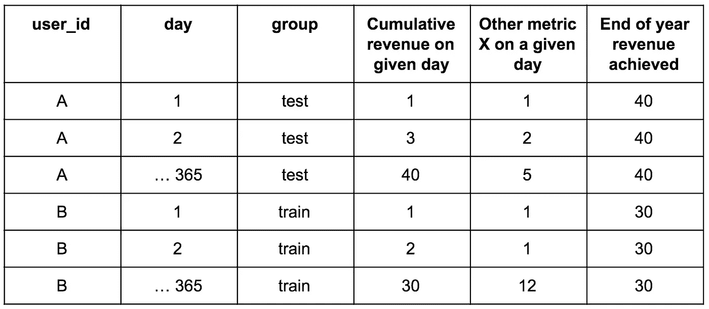

# 我们为一家大型科技客户部署的终身价值模型

> 原文：<https://towardsdatascience.com/lifetime-value-model-we-deployed-for-a-big-tech-client-fc6be23e685?source=collection_archive---------27----------------------->

查尔斯·德鲁维奥在 [Unsplash](https://unsplash.com?utm_source=medium&utm_medium=referral) 上拍摄的照片

让我深入研究一下。我曾与一家科技公司合作，该公司为零售商提供数字化传单和优惠券。公司是怎么赚钱的？本质上，优惠券的点击量。

有一天，公司的高层路过我们的办公室，问我们——“我们能知道用户在年底积累了什么价值吗？”就这样，我们开始了机器学习的冒险。

我们着手建立一个预测客户终身价值的模型。而且，我们将它生产化，并让它在服务器上端到端地自动运行，以预测所有用户的生命周期价值。

我想利用这次经历来强调实际模型的部署与学校教授机器学习的方式有多么不同。

**模型目标和用例**

我们想看看年底客户的价值是多少。用例是使用预测的客户终身价值来为用户定制营销策略，并限制每个给定已获得用户群的购买支出。

**技术堆栈**

该模型是在 Spark 上创建的，我们使用 Scala MLlib 来创建模型和转换器类。如果你不熟悉 MLlib，不要太担心它——它与 scikit learn 非常相似，只是它是针对分布式数据集而不是本地 pandas 数据帧的。

**我们如何设置数据**

我们拥有的数据是用户和这些用户随时间积累的一些参与度指标。我们可以使用这些参与度指标来计算任何给定用户在任何给定日期累积的收入。我不会深入研究数据的结构，因为这个模型是为一个真实的客户设计的，我想确保不会透露太具体的内容。但是在他们的许可下，这里有一个数据外观的摘要。

用户年龄定义为用户在我们平台上的天数

如您所知，这是一个为期 1 年的终身价值计算。因此，要构建一个模型来预测给定日期一年后的收入，我们需要确保我们有至少 365 天的用户数据。

从原始的非结构化数据创建基表需要相当多的聚合。此外，可伸缩性变得非常重要，因为聚合大量非结构化数据的成本非常高。

另外，关于建筑特征的说明。我们创造了很多很多功能。然后，我们将使用特征选择、维数减少和特征重要性标准来减少特征的数量。

下一步是将数据分成训练和测试数据。

**设置列车并测试**

然后，数据集被分成训练和测试子集。训练数据集用于训练模型，测试数据集用于跟踪模型的表现。

在生产中，我们如何使用测试数据集？我们首先用它来选择最佳模型。此外，我们用它来跟踪误差的训练模型随着时间的推移。所以，我们会在第一天训练一个模型。然后我们想在第 1、2、3 天等测试模型。然后，我们希望看到误差从哪一天开始增加，这决定了我们希望重新训练模型的时间间隔。

**车型**

我们做了一些探索性的数据分析，并深入到模型中。我们有一堆预测变量，比如用户第一天的收入，等等。我们想要预测的变量是用户在第 365 天的收入。

这显然是一个回归问题，所以我们用了几个回归算法来解决它，在数据维数相当高的情况下，最有效的算法是回归树和回归树的集合。

我们想尝试不同的算法。我们想尝试使用和不使用 PCA 的算法来降低维数。我们想尝试使用不同的列功能集。这个名单还在继续。我们想尝试许多不同的排列。我们是怎么做到的？我们设置了一个接口函数，允许我们在不重写整个脚本的情况下为每个模型迭代尝试许多不同的参数。

**误差度量和监控误差**

我们选择的误差函数是 RMSE。因此，每次模型迭代的目标都是最小化 RMSE 成本函数。

**管道结构:**

那么，我们来想一想，模型在生产中是如何工作的？

首先，我们创建测试和训练数据集。这些测试每天运行，我们收集测试数据集的错误指标。这让我们知道模型性能显著下降大约需要多长时间。然后，如果模型性能在 x 天后下降，我们根据最新数据单独重新训练模型。

然后，重新训练的模型被保存到 S3。在 S3，这些模型每天都被用来给用户打分。因此，在任何一天，我们都会调用我们所有的用户。每个用户都有不同的年龄。每个用户，以及他们在某个年龄积累的指标，都将被输入到机器学习模型中。一旦模型完成了对所有用户的预测，我们就为每个用户生成一个预测。所以，下面提供了最终的表格。

**结论**

我几乎没有触及我们如何部署机器学习模型的复杂逻辑。因此，我在这篇文章中想要做的是摆脱大多数课程中如何教授机器学习以及它实际上如何部署的范式。首先，没有干净的数据集可供你进行机器学习。实际上，你要做的大部分工作将是为机器学习构建特征和基表。此外，当您在数据上拟合实际的机器学习算法时，您会希望拟合许多参数排列。因此，构建函数时要允许你尝试不同的组合。

最后，最好考虑一下所有的东西是如何联系在一起的。新的基表什么时候生成，机器学习模型什么时候运行？您将如何使用来自已训练模型的错误度量来告知模型重新训练的频率？你将如何给你的用户打分？所有这些细微差别都是机器学习如此复杂和迷人的原因。