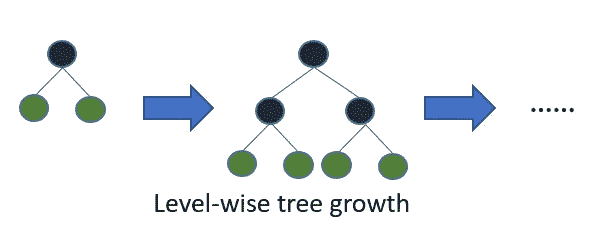
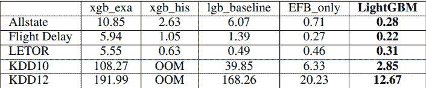

# LightGBM

> 原文：<https://towardsdatascience.com/lightgbm-800340f21415?source=collection_archive---------28----------------------->

## [梯度助推器](http://towardsdatascience.com/tagged/the-gradient-boosters)

## 那个说国王裸体的人

在准确性和性能方面，XGBoost 统治了一段时间，直到一个竞争者接受了挑战。LightGBM 来自微软研究院，是一种更高效的 GBM，随着数据集的规模不断增长，它成为了当务之急。LightGBM 比 XGBoost 更快，并且在某些情况下精度也更高。尽管 XGBoost 做了一些改变并实现了 LightGBM 提出并赶上的创新，但 LightGBM 已经引起了轰动。它成为许多卡格尔比赛中获胜组合的主要组成部分。

来源: [Unsplash](https://unsplash.com/photos/-IZ2sgQKIhM)

LightGBM 的起点是 [XGBoost](https://deep-and-shallow.com/2020/02/12/the-gradient-boosters-iii-xgboost/) 。所以本质上，他们采用了 XGBoost 并对其进行了优化，因此，它拥有了 XGBoost 的所有创新(或多或少)，以及一些额外的创新。让我们来看看 LightGBM 所做的增量改进:

# 树木逐叶生长

与所有其他 GBM(如 XGBoost)的主要变化之一是树的构造方式。在 LightGBM 中，采用了逐叶的树生长策略。

所有其他流行的 GBM 实现都遵循一种叫做逐层树生长的方法，在这种方法中，你可以找到最好的节点进行分割，然后将它向下分割一层。这种策略将产生对称树，其中一级中的每个节点都有子节点，从而产生额外的深度层。

在 LightGBM 中，逐叶树生长会找到最大程度上减少损失的叶子，并且只分裂那片叶子，而不关心同一层中的其余叶子。这导致不对称的树，其中随后的分裂很可能仅发生在树的一侧。

与逐层生长策略相比，逐叶树生长策略倾向于实现较低的损失，但是它也倾向于过度拟合，尤其是小数据集。如此小的数据集，水平方向的增长就像一个正则化来限制树的复杂性，而叶子方向的增长往往是贪婪的。

# 基于梯度的单侧采样(GOSS)

子采样或下采样是我们在集合中引入多样性并加速训练过程的方式之一。这也是一种正则化形式，因为它限制了对完整训练数据的拟合。通常，这种二次采样是通过从训练数据集中抽取随机样本并在该子集上构建一棵树来完成的。但是 LightGBM 引入了一种智能的方式来进行下采样。

这个想法的核心是，不同样本的梯度是一个指标，表明它在树构建过程中发挥了多大的作用。具有较大梯度(训练不足)的实例比具有小梯度的实例对树构建过程贡献更多。因此，当我们向下采样时，我们应该努力保持具有大梯度的实例，以便树的构建是最有效的。

最直接的想法是丢弃低梯度的实例，只在大梯度的实例上构建树。但这将改变数据的分布，进而损害模型的准确性。因此，高斯方法。

算法非常简单:

1.  保留所有具有大梯度的实例
2.  对具有小梯度的实例执行随机采样
3.  当在树构建过程中计算信息增益时，为具有小梯度的数据实例引入常数乘数。

如果我们选择梯度大的 *a* 实例，随机采样梯度小的 *b* 实例，我们通过 *(1-a)/b* 放大采样数据

# 独家功能捆绑(EFB)

EFB 背后的动机是 LightGBM 和 XGBoost 的共同主题。在许多现实世界的问题中，虽然有很多特征，但大多数都很稀疏，就像热门的编码分类变量。LightGBM 处理这个问题的方式略有不同。

这个想法的关键在于这样一个事实，即这些稀疏特征中的许多是排他的，即它们不同时取非零值。我们可以有效地将这些功能捆绑在一起，并将其视为一体。但是找到最佳的特性包是一个 NP 难的问题。

为此，本文提出了一种贪婪的近似方法，即排他性特征捆绑算法。该算法本质上也有点模糊，因为它将允许并非 100%互斥的捆绑特征，但是当选择捆绑时，它试图保持准确性和效率之间的平衡。

该算法在较高层次上是:

1.  构建一个包含所有特征的图，用代表特征间冲突总数的边进行加权
2.  按照图中要素的度数以降序对其进行排序
3.  检查每个特性，或者将其分配给存在小冲突的现有包，或者创建一个新包。

# 基于直方图的树分裂

构建一棵树所花费的时间与需要评估的分裂数量成正比。当具有高基数的连续或分类要素时，这一时间会急剧增加。但是，可以为一个特性进行的大多数拆分在性能上只会带来微小的变化。这个概念就是为什么基于直方图的方法被应用于树构建。

核心思想是将特征分组到一组箱中，并基于这些箱执行分割。这降低了从 *O(#data)* 到*O(# bin)*的时间复杂度。

# 稀疏输入

在另一项创新中，与 XGBoost 类似，LightGBM 在创建直方图时会忽略零特征值。并且这将构建直方图的成本从*O(#数据)*降低到*O(#非零数据)*。

# 分类特征

在许多真实世界的数据集中，分类特征大量存在，因此适当地处理它们变得至关重要。最常见的方法是将分类特征表示为一键表示，但这对于树学习者来说是次优的。如果您有高基数分类特征，您的树需要非常深才能达到准确性。

LightGBM 接受一个分类特征列表作为输入，以便更好地处理它。它从 Fisher，Walter D .的“关于最大同质性的分组”中获得灵感，并使用以下方法来寻找分类特征的最佳分割。

1.  对累积梯度统计的直方图进行排序
2.  在排序的直方图上找到最佳分割

有几个超参数可以帮助您调整处理分类特征的方式[4]:

*   `cat_l2`，默认= `10.0`，类型=双精度，约束:`cat_l2 >= 0.0`
*   `cat_smooth`，默认= `10.0`，类型=双精度，约束:`cat_smooth >= 0.0`
*   用于分类特征
*   这可以减少分类特征中噪声的影响，特别是对于数据很少的类别
*   `max_cat_to_onehot`，默认= `4`，类型= int，约束:`max_cat_to_onehot > 0`

# 性能改进

大多数增量性能改进是通过戈斯和 EFB 完成的。

xgb_exa 是最初的 XGBoost，xgb_his 是基于直方图的版本(后来出的)，lgb_baseline 是没有 EFB 和戈斯的 LightGBM，LightGBM 有 EFB 和戈斯。很明显，与 lgb_baseline 相比，戈斯和 EFB 的改进是显著的。

其余的性能改进来自并行化学习的能力。并行学习过程有两种主要方式:

# 特征平行

特征并行试图以分布式方式并行化“寻找最佳分割”部分。评估不同的拆分是在多个工人之间并行完成的，然后他们互相交流，决定谁的拆分最好。

# 数据并行

数据并行试图将整个决策学习并行化。在这种情况下，我们通常会分割数据，并将数据的不同部分发送给不同的工作人员，他们根据收到的数据部分计算直方图。然后，它们进行通信以在全局级别合并直方图，并且该全局级别直方图是在树学习过程中使用的。

# 平行投票

投票并行是数据并行的一个特例，其中数据并行的通信开销被限制为一个常数。

# 超参数

LightGBM 是一种有很多超参数的算法。它是如此的灵活，以至于对初学者来说是令人生畏的。但是有一种方法可以使用该算法，并且仍然不需要调整 80%的参数。让我们看看几个参数，你可以开始调整，然后建立信心，并开始调整其余的。

*   `objective` [🔗︎](https://github.com/microsoft/LightGBM/blob/master/docs/Parameters.rst#objective) ，默认= `regression`，类型=枚举，选项:`regression`，`regression_l1`，`huber`，`fair`，`poisson`，`quantile`，`mape`，`gamma`，`tweedie`，`binary`，`multiclass`，`multiclassova`，`cross_entropy`，`cross_entropy_lambda`，`lambdarank`，`rank_xendcg`，别名:`objective_type`，`app`，`application`
*   `boosting` [🔗︎](https://github.com/microsoft/LightGBM/blob/master/docs/Parameters.rst#boosting) ，默认= `gbdt`，类型=枚举，选项:`gbdt`，`rf`，`dart`，`goss`，别名:`boosting_type`，`boost`
*   `learning_rate` [🔗︎](https://github.com/microsoft/LightGBM/blob/master/docs/Parameters.rst#learning_rate) ，默认= `0.1`，类型=双精度，别名:`shrinkage_rate`，`eta`，约束:`learning_rate > 0.0`
*   收缩率
*   在`dart`中，它也影响被丢弃树木的归一化权重
*   `num_leaves` [🔗︎](https://github.com/microsoft/LightGBM/blob/master/docs/Parameters.rst#num_leaves) ，默认= `31`，类型= int，别名:`num_leaf`，`max_leaves`，`max_leaf`，约束:`1 < num_leaves <= 131072`
*   `max_depth` [🔗︎](https://github.com/microsoft/LightGBM/blob/master/docs/Parameters.rst#max_depth) ，默认= `-1`，类型= int
*   `min_data_in_leaf` [🔗︎](https://github.com/microsoft/LightGBM/blob/master/docs/Parameters.rst#min_data_in_leaf) ，默认= `20`，类型= int，别名:`min_data_per_leaf`，`min_data`，`min_child_samples`，约束:`min_data_in_leaf >= 0`
*   `min_sum_hessian_in_leaf` [🔗︎](https://github.com/microsoft/LightGBM/blob/master/docs/Parameters.rst#min_sum_hessian_in_leaf) ，默认= `1e-3`，类型=双精度，别名:`min_sum_hessian_per_leaf`，`min_sum_hessian`，`min_hessian`，`min_child_weight`，约束:`min_sum_hessian_in_leaf >= 0.0`
*   `lambda_l1` [🔗︎](https://github.com/microsoft/LightGBM/blob/master/docs/Parameters.rst#lambda_l1) ，默认= `0.0`，类型=双精度，别名:`reg_alpha`，约束:`lambda_l1 >= 0.0`
*   `lambda_l2` [🔗︎](https://github.com/microsoft/LightGBM/blob/master/docs/Parameters.rst#lambda_l2) ，默认= `0.0`，类型=双精度，别名:`reg_lambda`，`lambda`，约束:`lambda_l2 >= 0.0`

[*中的其他文章*](http://towardsdatascience.com/tagged/the-gradient-boosters)

*   [良好的旧梯度增强](/the-good-old-gradient-boosting-f4614b0e62b0)
*   [正规化的贪婪森林](/regularized-greedy-forest-a17cd0c85f06)
*   [XGBoost](/xgboost-b736c2ab10ce)
*   [LightGBM](/lightgbm-800340f21415)
*   CatBoost(你在这里)

1.  贪婪函数近似:一种梯度推进机器。安。统计学家。29 (2001 年)，第 5 号，1189-1232。
2.  柯，等(2017)。LightGBM:一种高效的梯度推进决策树。神经信息处理系统进展，3149-3157 页
3.  沃尔特·d·费希尔。[关于最大同质性的分组](http://www.csiss.org/SPACE/workshops/2004/SAC/files/fisher.pdf)。美国统计协会杂志。第 53 卷，第 284 期(1958 年 12 月)，第 789-798 页。
4.  LightGBM 参数。[https://github . com/Microsoft/light GBM/blob/master/docs/parameters . rst # core-parameters](https://github.com/microsoft/LightGBM/blob/master/docs/Parameters.rst#core-parameters)

*原载于 2020 年 2 月 20 日*[*http://deep-and-shallow.com*](https://deep-and-shallow.com/2020/02/21/the-gradient-boosters-iii-lightgbm/)*。*