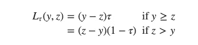
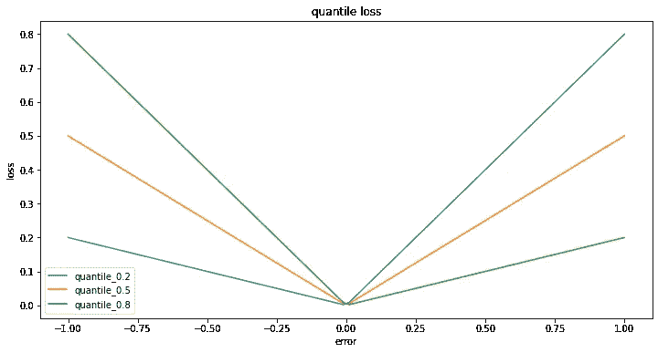
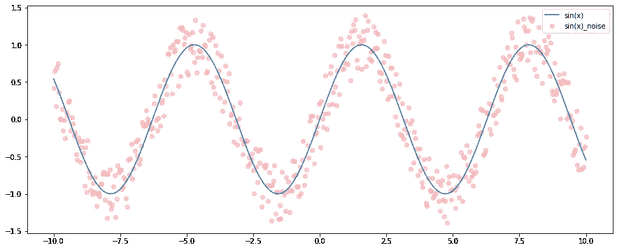
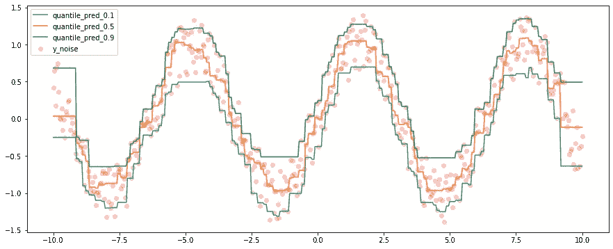

# 分位数回归的 LightGBM

> 原文：<https://towardsdatascience.com/lightgbm-for-quantile-regression-4288d0bb23fd?source=collection_archive---------11----------------------->

## 了解分位数回归

对于回归预测任务，并非所有时候我们都只追求绝对准确的预测，事实上，我们的预测总是不准确的，因此，我们不寻求绝对精度，有时需要预测区间，在这种情况下，我们需要分位数回归，即我们预测目标的区间估计。

# 损失函数

幸运的是，强大的`lightGBM`使分位数预测成为可能，分位数回归与一般回归的主要区别在于损失函数，这被称为弹球损失或分位数损失。弹球损失[在这里](https://www.lokad.com/pinball-loss-function-definition#:~:text=The%20pinball%20loss%20function%20is,forecast%20is%20a%20subtle%20problem.)有一个很好的解释，它有公式:

其中`y`是实际值，`z`是预测值，𝛕是目标分位数。所以第一眼看到损失函数，我们可以看到，除了当分位数等于 0.5，损失函数是不对称的。让我们来看看:

实现可以在我的 [Git Repo](https://github.com/MJeremy2017/Machine-Learning-Models/blob/master/quantile-regression/lgb-quantile-regression.ipynb) 上找到。在图中，绘制了三个不同的分位数，以分位数 0.8 为例，当误差为正时(`z > y` —预测值高于实际值)，损失小于误差为负时的损失。在另一个世界中，更高的误差受到更少的惩罚，这是有意义的，因为**对于高分位数预测，损失函数鼓励更高的预测值，反之对于低分位数预测**。

# 生成样本数据集

现在让我们为 lightGBM 预测生成一些数据。

这里我们使用一个 sin(x)函数和一些额外的噪声作为训练集。

# LightGBM 预测

发起`LGMRegressor`:

注意和一般回归不同的是，`objective`和`metric`都是`quantile`，`alpha`是我们需要预测的分位数(详情可以查看我的 [Repo](https://github.com/MJeremy2017/Machine-Learning-Models/blob/master/quantile-regression/lgb-quantile-regression.ipynb) )。

## 预测可视化

现在让我们看看分位数预测结果:

我们可以看到，大多数噪声点位于预测范围内，其中绿线是 0.9 分位数的上限，蓝色是 0.1 分位数。

这篇文章最初是受 [this](http://ethen8181.github.io/machine-learning/ab_tests/quantile_regression/quantile_regression.html) 的启发，这是一个很好的起点分位数回归启动器。