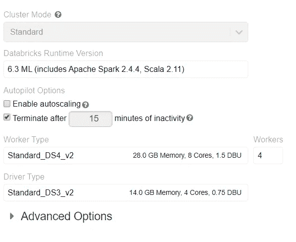

# Spark 中的 LightGBM 超参数调谐

> 原文：<https://towardsdatascience.com/lightgbm-hyper-parameters-tuning-in-spark-6b8880d98c85?source=collection_archive---------13----------------------->

## 网格搜索，顺序搜索，远视…


克里斯多夫·伯恩斯在 [Unsplash](https://unsplash.com?utm_source=medium&utm_medium=referral) 上拍摄的照片

LightGBM 在各行各业的数据科学家中非常受欢迎。lightgbm 包用 Python 和 r 开发的很好，当数据越来越大的时候，人们希望在分布式数据框架的集群上运行模型。

我最近在 Azure Databricks 上开发一个推荐系统。项目中使用了 LightGBM 模型。超参数调整部分不像在 Python 中那样平滑。在这篇博客中，我将分享我在调优时尝试过的 3 种方法。正在调整的参数有:

*   numLeaves
*   最大深度
*   袋装馏分
*   特征分数
*   明苏姆·谢宁利夫
*   lambdaL1
*   lambdaL2

这里用的 LightGBM 包是 [mmlspark](https://github.com/Azure/mmlspark) ，微软机器学习 for Apache Spark。

# 网格搜索

网格搜索是一种蛮力方法。如果你有无限的计算能力，这种方法可以保证你的最佳超参数设置。以下代码显示了如何对 LightGBM 回归器进行网格搜索:

我们应该知道网格搜索有维度的诅咒。随着参数数量的增加，网格呈指数增长。在我的实践中，上面的网格设置永远不会在我的 exploring 集群上以下面的设置结束:



事实是，即使大幅缩小网格，计算也很可能失败(由于内存问题)。

# 顺序搜索

降低计算压力的实质是降维。因此出现了按顺序进行调优的想法。在做了一些研究后，我发现这个由拜伦·吴写的中文博客非常有帮助。这个概念是一步一步地进行调整:

> *第一步:设定一个相对较高的学习率，降低你的迭代次数。*

这允许您在下面的步骤中更快地进行调优。完成调优后，您可以增加迭代次数，降低学习速度，以获得不错的性能。

> 步骤 2:调整 numLeaves 和 maxDepth

这两个参数控制树模型的复杂性。值越高，模型越复杂。理论上，numLeaves ≤ 2^maxDepth.你可以检查你调好的值是否满足这个条件。你的模型可能会有高方差和低偏差。因此，在接下来的几个步骤中，我将尝试通过调整其他变量来减少过拟合

对了，CrossValidatorModel API 真的不友好。你可以输出 bestModel，但是你不能轻易地检查你的最终超参数。我写了一个函数来轻松地提取超参数信息进行检查。

> 步骤 3:调整 minSumHessianInLeaf

这个参数有很多别名，比如 min_sum_hessian_per_leaf，min_sum_hessian，min_hessian，min_child_weight。简而言之，它告诉你“一旦你在一个节点中达到一定程度的纯度，并且你的模型能够适应它，就不要试图分裂”。minSumHessianInLeaf 的正确值可以减少过度拟合。

> 步骤 4:调整 bagging fraction & feature fraction

这两个参数必须同时调整。baggingFraction 控制实例子采样，featureFraction 控制要素子采样。它们都服务于减少过拟合的目的。(更小的分数也允许更快的计算)

```
# similar code here
```

> 步骤 5:调整λ1 和λ2

L1 和 L2 法规参数也有助于减少过度拟合

```
# similar code here
```

> 步骤 6:调整学习速度和迭代次数以适应模型

通过这个连续的过程，尽管很繁琐，但您最终可以得到一个合理的调优结果。这种方法的主要问题是，首先需要初始化一个合理大小的网格。如果最优值位于您的网格之外，您需要重新分配一个合适的范围。一些尝试是不可避免的。你最好是一个有经验的数据科学家来做调整。因为每次尝试都要耗费大量的计算资源。

# 远视

[Hyperopt](https://github.com/hyperopt/hyperopt) 是一个 Python 库，用于在笨拙的搜索空间上进行串行和并行优化，搜索空间可能包括实值、离散和条件维度

“目前，hyperopt 中实施了三种算法:

*   随机搜索
*   [Parzen 估计器树(TPE)](https://papers.nips.cc/paper/4443-algorithms-for-hyper-parameter-optimization.pdf)
*   [自适应 TPE](https://www.electricbrain.io/blog/learning-to-optimize)

Hyperopt 已经被设计为适应基于高斯过程和回归树的贝叶斯优化算法，但是这些算法目前还没有实现。"

Hyperopt 到目前为止还没有广泛使用，我发现一些帖子给出了指导性的 Python 实现: [1。超参数调谐部分 0](/hyperparameter-optimization-in-python-part-0-introduction-c4b66791614b) ， [2。超参数调谐部分 2](/hyperparameter-optimization-in-python-part-2-hyperopt-5f661db91324) 。然而，尽管 Azure Databricks 已经准备好使用 hyperopt，但在任何网站上都找不到 spark 实现。

幸运的是，hyperopt 的实现非常简单。经过几次测试后，我能够在 spark 上运行调优。而且和我之前试过的所有方法相比真的很快。调音结果也很令人满意。下面是我如何在 PySpark 中实现的:

# 结论

总之，据我所知，Hyperopt 可能是目前在 spark 数据框架上调整 LightGBM 的超参数的最佳选择。它比强力网格搜索快得多，比顺序搜索更可靠。但是它确实还没有被很好的记录。如果没有我在 Python 中找到的关于 hyperopt 的帖子，我可能无法在 spark 上实现它。

我一直在 spark 上学习机器学习。然而，到目前为止，该材料仅限于在线使用；大部分的模型文件都不足以供外人使用。spark ml 实现的一些示例代码是共享的。希望越来越多的数据科学家可以分享他们的工作和故事，互相帮助。

*喜欢讨论就上* [*LinkedIn*](https://www.linkedin.com/in/yi-cao-data/) *找我。*