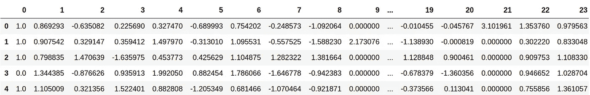
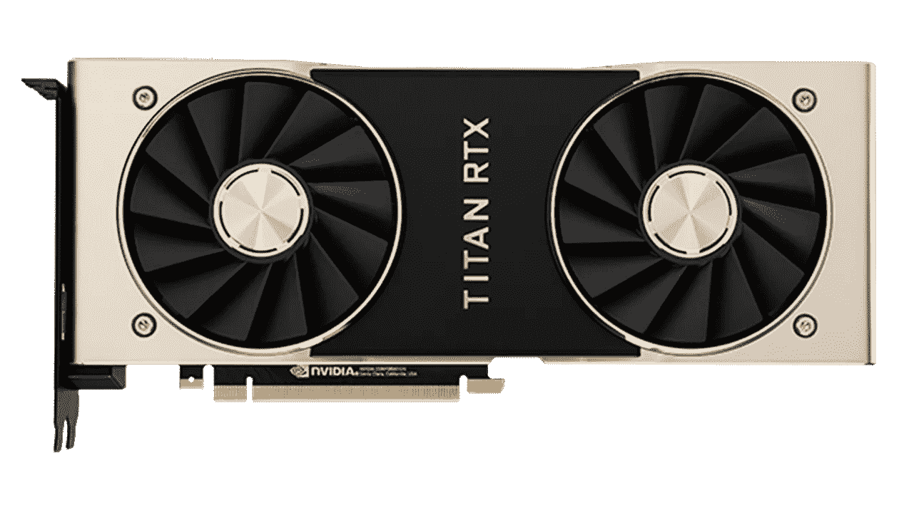
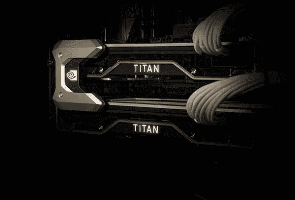
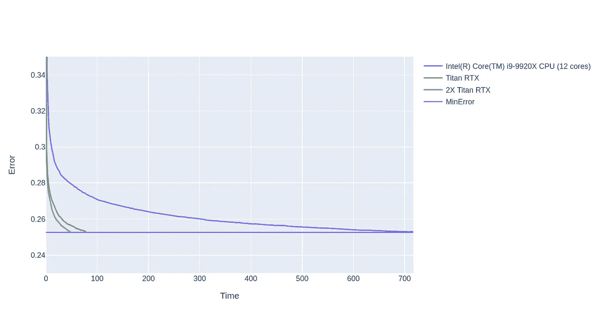

# 多个 GPU 上的闪电般快速 XGBoost

> 原文：<https://towardsdatascience.com/lightning-fast-xgboost-on-multiple-gpus-32710815c7c3?source=collection_archive---------9----------------------->


图片来自 [Pixabay](https://pixabay.com/?utm_source=link-attribution&utm_medium=referral&utm_campaign=image&utm_content=67646) 的[维基图片](https://pixabay.com/users/WikiImages-1897/?utm_source=link-attribution&utm_medium=referral&utm_campaign=image&utm_content=67646)

## 无需大量的代码更改

XGBoost 是数据科学中最常用的库之一。

在 XGBoost 出现的时候，它比它最接近的竞争对手 Python 的 Scikit-learn GBM 快得多。但随着时间的推移，它已经被一些令人敬畏的库如 LightGBM 和 Catboost 所竞争，无论是在速度还是准确性上。

就我而言，我使用 LightGBM 来处理大多数我刚刚得到 CPU 进行培训的用例。但是当我拥有一个或多个 GPU 时，我仍然喜欢用 XGBoost 进行训练。

为什么？

因此，我可以将 XGBoost 提供的优秀 GPU 功能与 Dask 结合使用，在单 GPU 和多 GPU 模式下使用 XGBoost。

怎么会？

***这个帖子是关于在多 GPU 机器上运行 XGBoost 的。***

# 数据集:



UCI·希格斯

我们将使用 [UCI 希格斯数据集](https://archive.ics.uci.edu/ml/datasets/HIGGS)。这是一个具有 11M 行和 29 列的二进制分类问题，可能需要相当长的时间来解决。

从 UCI 网站:

> 这些数据是使用蒙特卡罗模拟产生的。前 21 个特征(第 2-22 列)是由加速器中的粒子探测器测量的运动特性。后 7 个特征是前 21 个特征的函数；这些是由物理学家得出的高级特征，有助于区分这两个类别。人们有兴趣使用深度学习方法来消除物理学家手动开发这些特征的需要。基准测试结果使用贝叶斯决策树从一个标准的物理包和 5 层神经网络提出了在原来的文件。最后 500，000 个示例用作测试集。

我们可以通过使用我从 NVidia post 的[借用的漂亮函数将这个数据集加载到内存中。](https://devblogs.nvidia.com/gradient-boosting-decision-trees-xgboost-cuda/)

这个函数下载 Higgs 数据集，并创建 Dmatrix 对象供以后 XGBoost 使用。

# XGBoost:CPU 方法


[来源](https://pixabay.com/illustrations/processor-cpu-computer-chip-board-2217771/)

因为我们已经加载了数据，所以我们可以用 CPU 来训练 XGBoost 模型，以便进行基准测试。

```
print("Training with CPU ...")
param = {}
param['objective'] = 'binary:logitraw'
param['eval_metric'] = 'error'
param['silent'] = 1
param['tree_method'] = 'hist'tmp = time.time()
cpu_res = {}
xgb.train(param, dtrain, num_round, evals=[(dtest, "test")], 
          evals_result=cpu_res)
cpu_time = time.time() - tmp
print("CPU Training Time: %s seconds" % (str(cpu_time)))---------------------------------------------------------------CPU Training Time: **717.6483490467072 seconds**
```

这段代码耗时 717 秒，大约需要 12 分钟才能完成。这很好，值得称赞，但我们能做得更好吗？

# XGBoost:单一 GPU 方法



[来源](https://www.google.com/url?sa=i&rct=j&q=&esrc=s&source=images&cd=&cad=rja&uact=8&ved=2ahUKEwiKwMPphI3nAhXtzzgGHeLNB1QQjhx6BAgBEAI&url=https%3A%2F%2Fwww.nvidia.com%2Fen-us%2Fdeep-learning-ai%2Fproducts%2Ftitan-rtx%2F&psig=AOvVaw3QFPz_lTQrqraHJQz_ewwh&ust=1579433051897517)

最棒的是，我们不需要对上面的代码做太多修改，就可以使用单个 GPU 来构建模型。

> 我们可以用 GPU 为什么要用 CPU？

我们将`tree_method`改为`gpu_hist`

```
print("Training with Single GPU ...")param = {}
param['objective'] = 'binary:logitraw'
param['eval_metric'] = 'error'
param['silent'] = 1
**param['tree_method'] = 'gpu_hist'**
tmp = time.time()
gpu_res = {}xgb.train(param, dtrain, num_round, evals=[(dtest, "test")], 
          evals_result=gpu_res)
gpu_time = time.time() - tmp
print("GPU Training Time: %s seconds" % (str(gpu_time)))----------------------------------------------------------------
GPU Training Time: 78.2187008857727 seconds
```

***我们实现了 10 倍的加速*** ，我们的模型现在只需 1.3 分钟就能完成。这很好，但是如果我们有多个 GPU，我们能做得更好吗？

# XGBoost:多 GPU 方法



[来源](https://www.google.com/imgres?imgurl=https%3A%2F%2Fwww.nvidia.com%2Fcontent%2Fdam%2Fen-zz%2FSolutions%2Ftitan%2Ftitan-rtx%2Fnvidia-titan-rtx-nvlink-300-t%402x.jpg&imgrefurl=https%3A%2F%2Fwww.nvidia.com%2Fen-us%2Fdeep-learning-ai%2Fproducts%2Ftitan-rtx%2F&docid=LXUW4PiXbaOvoM&tbnid=2aobaeCTl1m0CM%3A&vet=10ahUKEwi2uovhhI3nAhXVcn0KHf9pB_YQMwhLKAIwAg..i&w=600&h=408&client=ubuntu&bih=2025&biw=1879&q=gpu%20titan%20rtx%20dual&ved=0ahUKEwi2uovhhI3nAhXVcn0KHf9pB_YQMwhLKAIwAg&iact=mrc&uact=8)

例如，我的机器中有 2 个 GPU，而上面的代码只使用了 1 个 GPU。随着 GPU 现在变得越来越便宜，集群拥有 4 个以上的 GPU 并不罕见。那么我们可以同时使用多个 GPU 吗？

> 两个 GPU 总比一个好

要使用 MultiGPUs，过程并不是像上面那样加一点参数那么简单，涉及到几个步骤。

首先是数据加载的差异:

数据加载有多个步骤，因为我们需要 dask DMatrix 对象来训练 XGBoost 使用多个 GPU。

1.  使用熊猫阅读 CSV 文件。
2.  从 Pandas 数据帧创建 Dask 数据帧，以及
3.  使用 dask 数据帧创建 Dask 数据矩阵对象。

为了使用多 GPU 来训练 XGBoost，我们需要使用 Dask 来创建一个 GPU 集群。这个命令创建了一个 GPU 集群，dask 稍后可以通过使用`client`对象来使用它。

```
cluster = LocalCUDACluster()
client = Client(cluster)
```

我们现在可以加载 Dask Dmatrix 对象并定义训练参数。注意`nthread`被设置为`one`，而`tree_method`被设置为`gpu_hist`

```
ddtrain, ddtest = load_higgs_for_dask(client)param = {}
param['objective'] = 'binary:logitraw'
param['eval_metric'] = 'error'
param['silence'] = 1
**param['tree_method'] = 'gpu_hist'
param['nthread'] = 1**
```

我们现在可以在多个 GPU 上训练，使用:

```
print("Training with Multiple GPUs ...")
tmp = time.time()
output = **xgb.dask.train**(client, param, ddtrain, num_boost_round=1000, evals=[(ddtest, 'test')])
multigpu_time = time.time() - tmp
bst = output['booster']
multigpu_res = output['history']
print("Multi GPU Training Time: %s seconds" % (str(multigpu_time)))
---------------------------------------------------------------
Multi GPU Training Time: 50.08211898803711 seconds
```

请注意对`xgb.train` 的调用如何变为`xgb.dask.train`，以及它如何也需要 dask 客户端来工作。

这大约需要 0.8 分钟，比单个 GPU 的速度提高了 1.5 倍。我只有 2 个 GPU 可供我使用，所以我不能测试它，但我相信它是线性增长的，即更多的 GPU 和更多的时间减少。

# 结果

以下是所有三种设置的结果:



虽然多 CPU 和单 CPU 之间的区别现在看起来有些多余，但在运行手头的[多个超参数调优任务](/automate-hyperparameter-tuning-for-your-models-71b18f819604)时，可能需要运行多个具有不同超参数的 GBM 模型，这种区别将是相当可观的。

此外，当我们将其扩展到许多 GPU 时，这个结果可能会发生变化。

所以继续缩放。

你可以在 [Github](https://github.com/MLWhiz/data_science_blogs/blob/master/xgb_dask/XGB%20with%20Dask%2BGPU.ipynb) 上找到这篇文章的完整代码。

# 继续学习

如果你对深度学习感兴趣，并想为此使用你的 GPU，我想推荐这门关于计算机视觉中的[深度学习的优秀课程。](https://coursera.pxf.io/7mKnnY)

谢谢你的阅读。将来我也会写更多初学者友好的帖子。在 [**中**](https://medium.com/@rahul_agarwal?source=post_page---------------------------) 关注我或者订阅我的 [**博客**](http://eepurl.com/dbQnuX?source=post_page---------------------------) 了解他们。一如既往，我欢迎反馈和建设性的批评，可以通过 Twitter[**@ mlwhiz**](https://twitter.com/MLWhiz?source=post_page---------------------------)联系

此外，一个小小的免责声明——这篇文章中可能会有一些相关资源的附属链接，因为分享知识从来都不是一个坏主意。