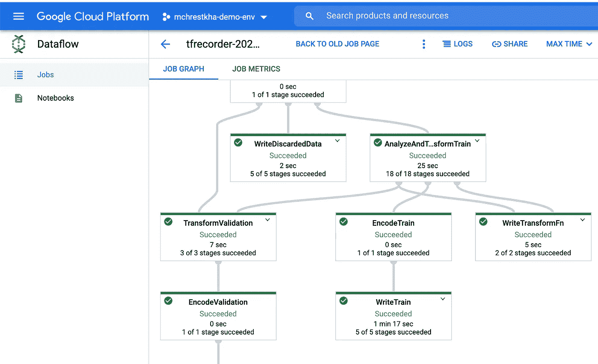

# Google Cloud 上轻量级但可扩展的 TensorFlow 工作流

> 原文：<https://towardsdatascience.com/lightweight-yet-scalable-tensorflow-workflow-on-google-cloud-b32e0ba410c6?source=collection_archive---------27----------------------->

## 我的超能力工具包:TFRecorder、TensorFlow Cloud、人工智能平台预测和权重与偏差


图片由作者使用[figma.com](https://www.figma.com/)

我正要说出来。今天，机器学习(ML)的广度和深度越来越大，这让我完全不知所措。

*   需要建立一个高性能的数据管道？学习 Apache Beam 或 Spark 和协议缓冲区
*   需要缩放你的模型训练？了解全还原和多节点分布式架构
*   需要部署您的模型吗？学习 Kubernetes、TFServing、量化和 API 管理
*   需要跟踪管道？建立一个元数据库，学习 docker，成为一名 DevOps 工程师

这甚至还不包括算法和建模空间，这也让我觉得自己像一个没有研究背景的冒名顶替者。一定有更简单的方法！

过去几周，我一直在思考这个两难的问题，以及我会向一位与我有相似思维模式的数据科学家推荐什么。上面的许多主题都很重要，尤其是如果你想专注于 MLOps 这一新领域，但有没有工具和技术可以让你站在巨人的肩膀上？

下面是 4 个这样的工具，它们抽象出许多复杂性，可以让你更有效地开发、跟踪和扩展你的 ML 工作流程。

*   [**TFRecorder**](https://github.com/google/tensorflow-recorder) **【通过数据流】**:通过导入 CSV 文件，轻松将数据转化为 TFRecords。对于图像，只需在 CSV 中提供 JPEG URIs 和标签。通过数据流扩展到分布式服务器，无需编写任何 Apache Beam 代码。
*   [**TensorFlow Cloud**](https://github.com/tensorflow/cloud)**(通过 AI 平台训练):**通过一个简单的 API 调用，将您的 tensor flow 模型训练扩展到 AI 平台训练的单节点和多节点 GPU 集群。
*   **AI 平台预测:**将您的模型作为 API 端点部署到 Kubernetes 支持的带有 GPU 的自动缩放服务，与 [Waze](https://cloud.google.com/blog/products/ai-machine-learning/how-waze-predicts-carpools-using-google-cloud-ai-platform) 使用的相同！
*   **权重&偏差:**记录工件(数据集和模型)来跟踪整个开发过程中的版本和沿袭。自动生成你的实验和工件之间的关系树[。](https://www.wandb.com/articles/announcing-artifacts)

# 工作流程概述

我将使用一个典型的猫和狗的计算机视觉问题来浏览这些工具。此工作流程包含以下步骤:

*   将原始 JPEG 图像保存到对象存储中，每个图像位于指定其标签的子文件夹下
*   以所需格式生成带有图像 URIs 和标签的 CSV 文件
*   将图像和标签转换为 TFRecords
*   从 TFRecords 创建数据集，并使用 Keras 训练 CNN 模型
*   将模型存储为 SavedModel，并部署为 API 端点
*   JPEG 图像、TFRecords 和 SavedModels 都将存储在对象存储中
*   实验和人工制品的传承将通过权重和偏差进行跟踪

我使用的笔记本和脚本都在这个 [GitHub 库](https://github.com/mchrestkha/machine_learning_examples/tree/master/catsdogs/tensorflow)里。

现在让我们深入了解每种工具。

# TF 记录器

TFRecords 还是让我很困惑。我理解它们提供的性能优势，但是一旦我开始处理一个新的数据集，我总是很难使用它们。显然我不是唯一的一个，谢天谢地，TFRecorder 项目最近才发布。使用 TFRecords 从未如此简单，它只需要(1)以逻辑目录格式组织您的图像，以及(2)使用 PANDAS 数据帧和 CSV。以下是我采取的步骤:

*   创建一个包含 3 列的 CSV 文件，包括指向每个图像目录位置的图像 URI


作者图片

*   将 CSV 读入 PANDAS 数据帧，并调用 TFRecorder 函数转换数据流上的文件，指定输出目录

```
dfgcs = pd.read_csv(FILENAME)dfgcs.tensorflow.to_tfr(
    output_dir=TFRECORD_OUTPUT,
    runner='DataFlowRunner',
    project=PROJECT,
    region=REGION,
    tfrecorder_wheel=TFRECORDER_WHEEL)
```

就是这样！不到 10 行代码就可以将数百万张图像转换成 TFRecord 格式。作为一名数据科学家，您刚刚为高性能培训渠道奠定了基础。如果你对后台发生的奇迹感兴趣，你也可以看看数据流控制台中的数据流作业图和指标。



作者图片

通读了一点 GitHub repo 之后，tfrecord 的模式如下:

```
tfr_format = {
            "image": tf.io.FixedLenFeature([], tf.string),
            "image_channels": tf.io.FixedLenFeature([], tf.int64),
            "image_height": tf.io.FixedLenFeature([], tf.int64),
            "image_name": tf.io.FixedLenFeature([], tf.string),
            "image_width": tf.io.FixedLenFeature([], tf.int64),
            "label": tf.io.FixedLenFeature([], tf.int64),
            "split": tf.io.FixedLenFeature([], tf.string),
        }
```

然后，您可以使用下面的代码将 TFRecords 读入 Keras 模型定型管道的 TFRecordDataset 中:

```
IMAGE_SIZE=[150,150]
BATCH_SIZE = 5def read_tfrecord(example):
    image_features= tf.io.parse_single_example(example, tfr_format)
    image_channels=image_features['image_channels']
    image_width=image_features['image_width']
    image_height=image_features['image_height']
    label=image_features['label']
    image_b64_bytes=image_features['image']

    image_decoded=tf.io.decode_base64(image_b64_bytes)
    image_raw = tf.io.decode_raw(image_decoded, out_type=tf.uint8)
    image = tf.reshape(image_raw, tf.stack([image_height,    image_width, image_channels]))
    image_resized = tf.cast(tf.image.resize(image, size=[*IMAGE_SIZE]),tf.uint8)
    return image_resized, labeldef get_dataset(filenames):
    dataset = tf.data.TFRecordDataset(filenames=filenames, compression_type='GZIP') 
    dataset = dataset.map(read_tfrecord)
    dataset = dataset.shuffle(2048)
    dataset = dataset.batch(BATCH_SIZE)
    return datasettrain_dataset = get_dataset(TRAINING_FILENAMES)
valid_dataset = get_dataset(VALID_FILENAMES)
```

# TensorFlow 云(AI 平台训练)

现在我们有了一个 tf.data.Dataset，我们可以将它输入到我们的模型训练调用中。下面是一个使用 Keras 顺序 API 的 CNN 模型的简单例子。

```
model = tf.keras.models.Sequential([
    tf.keras.layers.Conv2D(16, (3,3), activation='relu', input_shape=(150, 150, 3)),
    tf.keras.layers.MaxPooling2D(2, 2),
    tf.keras.layers.Conv2D(32, (3,3), activation='relu'),
    tf.keras.layers.MaxPooling2D(2,2),
    tf.keras.layers.Conv2D(64, (3,3), activation='relu'),
    tf.keras.layers.MaxPooling2D(2,2),
    tf.keras.layers.Conv2D(64, (3,3), activation='relu'),
    tf.keras.layers.MaxPooling2D(2,2),
    tf.keras.layers.Flatten(),
    tf.keras.layers.Dense(256, activation='relu'),
    tf.keras.layers.Dense(1, activation='sigmoid')
])model.summary()
model.compile(loss='binary_crossentropy',
              optimizer=RMSprop(lr=1e-4),
              metrics=['accuracy'])
model.fit(
    train_dataset,
    epochs=10,
    validation_data=valid_dataset,
    verbose=2
)
```

我首先在我的开发环境中对一部分图像(在我的例子中是一个 Jupyter 笔记本)运行这个，但是我想让它扩展到所有的图像并使它更快。TensorFlow Cloud 允许我使用单个 API 命令来封装我的代码，并提交作为分布式 GPU 作业运行。

```
import tensorflow_cloud as tfctfc.run(entry_point='model_training.ipynb',
        chief_config=tfc.COMMON_MACHINE_CONFIGS['T4_4X'],
        requirements_txt='requirements.txt')
```

这不是愚人节的玩笑。上面的代码(< 5 行代码)是完整的 python 脚本，您需要将它放在与 Jupyter 笔记本相同的目录中。最棘手的部分是遵循所有的设置说明，以确保您正确地通过了 Google 云平台项目的身份验证。这是一种巨大的超级力量！

让我们更深入地了解一下这是怎么回事。

首先，将构建一个 docker 容器，其中包含您需要的所有库和笔记本，并保存在 Google Cloud 的容器注册服务中。


作者图片

该容器然后被提交给完全管理的无服务器培训服务，AI 平台培训。无需设置任何基础设施和安装任何 GPU 库，我就可以在一台 16 vCPU 60GB RAM、配有 4 个英伟达 T4 GPU 的机器上训练这个模型。我只在需要的时候使用这些资源(大约 15 分钟)，并且可以使用 IDE 或 Jupyter 笔记本在我的本地环境中继续开发。


作者图片

SavedModel 最终存储在对象存储中，这是在我的训练脚本的最后指定的。

```
MODEL_PATH=time.strftime("gs://mchrestkha-demo-env-ml-examples/catsdogs/models/model_%Y%m%d_%H%M%S")
model.save(MODEL_PATH)
```

# 人工智能平台预测

通过对象存储中的 SavedModel，我可以将它加载到我的开发环境中，并运行一些示例预测。但是，如果我想允许其他人使用它，而不需要他们设置 Python 环境和学习 TensorFlow，该怎么办？这就是人工智能平台预测发挥作用的地方。它允许您将模型二进制文件部署为 API 端点，可以使用 REST、简单的 Google Cloud SDK (gcloud)或各种其他客户端库来调用这些端点。最终用户只需要知道所需的输入(在我们的例子中，JPEG 图像文件被转换为[150，150，3] JSON 数组)并可以将您的模型嵌入到他们的工作流中。当你做了一个改变(在一个新的数据集上重新训练，一个新的模型架构，甚至一个新的框架)，你可以发布一个新的版本。

下面简单的 gcloud SDK 是将您的模型部署到这个 Kubernetes 支持的自动缩放服务的超级力量。

```
MODEL_VERSION="v1"
MODEL_NAME="cats_dogs_classifier"
REGION="us-central1"gcloud ai-platform models create $MODEL_NAME \
    --regions $REGIONgcloud ai-platform versions create $MODEL_VERSION \
  --model $MODEL_NAME \
  --runtime-version 2.2 \
  --python-version 3.7 \
  --framework tensorflow \
  --origin $MODEL_PATH
```

[人工智能平台预测](https://cloud.google.com/blog/products/ai-machine-learning/ai-platform-prediction-better-reliability-ml-workflows)是一项让我特别兴奋的服务，因为它消除了让你的模型进入世界(内部和外部)并开始从中创造价值的许多复杂性。虽然这个博客的范围是一个实验性的工作流程[像 Waze](https://cloud.google.com/blog/products/ai-machine-learning/how-waze-predicts-carpools-using-google-cloud-ai-platform) 这样的公司正在使用人工智能平台预测来部署和服务他们的大规模生产模型。

# 权重和偏差

现在我已经完成了一个实验，但是我未来的实验呢？我可能需要:

*   本周晚些时候运行更多的实验，并跟踪我的工作
*   一个月后再来，试着记住我每个实验的所有输入和输出
*   与有希望将我的工作流程拼凑起来的队友分享工作

在 ML 管道领域有很多工作要做。这是一个令人兴奋但仍处于萌芽状态的领域，最佳实践和行业标准仍有待开发。一些很棒的项目包括 MLFlow、Kubeflow Pipelines、TFX 和 Comet.ML。对于我的工作流的需求，MLOps 和连续交付超出了范围，我想要简单的东西。我选择了 Weights & bias(WandB ),因为它易于使用，并且可以轻量级集成来跟踪实验和工件。

先说实验。WandB 提供了许多定制选项，但是如果你使用任何一个流行的框架，你不需要做太多。对于 TensorFlow Keras API，我简单地(1)导入了 *wandb* python 库(2)初始化了我的实验运行，以及(3)在模型拟合步骤中添加了一个回调函数。

```
model.fit(
    train_dataset,
    epochs=10,
    validation_data=valid_dataset,
    verbose=2,
   ** callbacks=[WandbCallback()**]
)
```

这将自动将现成的指标流入集中的实验跟踪服务。看看人们使用 [WandB 的所有方式](https://www.wandb.com/articles)。


作者图片

WandB 还提供了一个工件 API，它比当今一些笨重的工具更适合我的需求。我在整个管道中添加了简短的代码片段，以定义 4 个关键项目:

1.  初始化管道中的一个步骤
2.  使用现有的工件(如果有的话)作为这个步骤的一部分
3.  记录由该步骤生成的工件
4.  说明一个步骤已经完成

```
run = wandb.init(project='cats-dogs-keras', job_type='data', name='01_set_up_data')***<Code to set up initial JPEGs in the appropriate directory structure>***artifact = wandb.Artifact(name='training_images',job_type='data', type='dataset')
artifact.add_reference('gs://mchrestkha-demo-env-ml-examples/catsdogs/train/')
run.**log_artifact**(artifact)
run.finish()run = wandb.init(project='cats-dogs-keras',job_type='data', name='02_generate_tfrecords')artifact = run.**use_artifact**('training_images:latest')***<TFRecorder Code>***artifact = wandb.Artifact(name='tfrecords', type='dataset')
artifact.add_reference('gs://mchrestkha-demo-env-ml-examples/catsdogs/tfrecords/')
run.**log_artifact**(artifact)
run.finish()run = wandb.init(project='cats-dogs-keras',job_type='train', name='03_train')
artifact = run.**use_artifact**('tfrecords:latest')***<TensorFlow Cloud Code>***artifact = wandb.Artifact(name='model', type='model')
artifact.add_reference(MODEL_PATH)
run.**log_artifact**(artifact)
```

这个简单的工件 API 存储了每次运行和工件的元数据和沿袭，因此您可以完全清楚您的工作流。UI 也有一个漂亮的树形图来图形化地查看它。


作者图片

# 摘要

如果你被无休止的机器学习主题、工具和技术吓倒，你并不孤单。我每天与同事、合作伙伴和客户谈论数据科学、MLOps、硬件加速器、数据管道、AutoML 等的各个方面时，都会感到一种冒名顶替综合症。请记住，重要的是:

1.  **实际一点**:让我们所有人都成为开发操作系统、数据和机器学习领域的全栈工程师是不现实的。选择一两个你感兴趣的领域，和其他人一起解决整个系统的问题。
2.  关注你的问题:我们都被新的框架、新的研究论文、新的工具冲昏了头脑。从您的业务问题、数据集和最终用户需求开始。不是每个人都需要每天对生产中的数百个 ML 模型进行重新训练，并提供给数百万用户(至少现在还不是)。
3.  **识别超级工具:**找到一套核心工具，作为效率倍增器，提供可伸缩性并消除复杂性。我浏览了我的 Tensorflow 工具包(**TF recorder+tensor flow Cloud+AI 平台预测+权重&偏差**)，但是找到了映射到您的问题和工作流的正确工具包。

有问题或者想聊天？在 [Twitter](https://twitter.com/mchrestkha) 上找到我

这个博客的笔记本例子可以在[我的 GitHub](https://github.com/mchrestkha/machine_learning_examples/tree/master/catsdogs/tensorflow) 上找到。

非常感谢 [Mike Bernico](https://www.linkedin.com/in/mike-bernico/) 、[Rajesh thal am](https://www.linkedin.com/in/rajeshthallam/)和 [Vaibhav Singh](https://www.linkedin.com/in/1vaibhavsingh/) 帮助我完成这个示例解决方案。