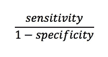
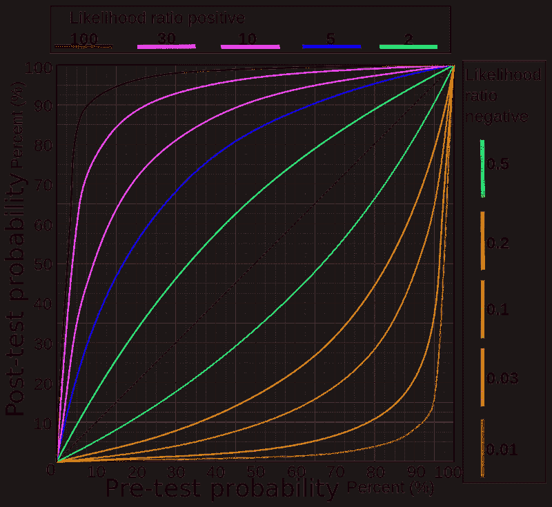

# 可能性比率会让你(和你的算法)更聪明

> 原文：<https://towardsdatascience.com/likelihood-ratios-will-make-you-and-your-algorithms-smarter-55c1929c1681?source=collection_archive---------24----------------------->

## 非统计人员的统计数据

有人，不是披头士，使用艾比路人行横道。几率有多大？Sparragus / CC BY

很多人(我希望不是你)都有一种印象，认为统计数字可以证明事情。他们不能。他们所做的只是估计一种现象发生的可能性。

但是概率很难适应这个世界。我们(和我们的算法)必须基于不完美的信息做出二元决策——是/否，停止/继续。我们必须把可能性当作确定无疑的事情来对待。一种方法是尝试完善这些信息——创建一个完美的测试，从不失败，并且总是给出正确的结果。

我们都知道这种方法在现实世界中是不现实的。根据定义，这个世界比测试或算法中的任何描述都要复杂。更糟糕的是，从产品开发的角度来看，完善测试的努力很快就会产生递减的回报。这会耗费时间和资源，让你在老板或客户面前显得很笨。

摆脱这个陷阱的方法是在你的决策中加入其他信息。我们都知道这一点，我们都这样做。但是我们并不总是做得很好。似然比允许您将测试结果与其他信息结合起来，并且做到严谨和精确。

## 医疗保健中的 LRs

似然比被开发用于医疗保健决策。这就是我的背景，所以我将从这里开始，但是如果血肉之躯让你厌烦，并且你想要一个机器学习的例子，请随意跳到下一部分。原理完全一样。

我在这里抱怨被过度宣传的癌症测试的缺点。有问题的测试表面上表现良好，但由于流行率低，会产生令人发指的假阳性。然而，似然比可能拯救这样的测试，并使其对人类有用。

让我们从任何诊断测试的基础开始:它的敏感性和特异性。敏感性是测试呈阳性的真阳性(患病患者)的比例。特异性是测试阴性的真阴性(无疾病的患者)的分数。

在我用于肺癌的例子中，液体活检测试的灵敏度为 80%，特异性为 93%。因为肺癌很罕见，每年有 0.05%的人口出现新病例，阳性结果并不意味着你得了癌症。事实上，你患癌症的几率仍然低于百分之一。阳性检测结果本身比没用更糟糕。

在这张照片中，一名医生看起来很担心。他可能正在决定是否根据不确定的测试结果采取行动。要是他知道可能性比率就好了。乔纳森·博尔巴在 [Unsplash](https://unsplash.com?utm_source=medium&utm_medium=referral) 上的照片

似然比利用了这个结果。正似然比定义为

插入上述灵敏度和特异性的数字，测试结果意味着你患肺癌的可能性是没有阳性结果时的 11 倍。这是一个非常小的数字的 11 倍，所以它仍然是一个很小的数字，并不是真正可行的。

但是现在你可以把它和其他信息结合起来。吸烟会使你患肺癌的几率增加 24 倍(T4)。这是一个很大的数字，但不足以证明干预的合理性——24x 0.0005(基线几率)仅为 0.012。但现在乘以测试后的增长，你的几率已经上升到 11 x 24 x 0.0005 = 0.13，或 12%*的概率。这足以证明干预是正当的。似然比允许你结合一些不充分的信息，得出一个有用的结论。

## 模式识别中的 LRs

假设你正在研究人工智能中最难的问题之一——物体识别。也许你的工作是提出一种算法来识别自动驾驶车辆的停车标志。您的产品需求文档声明您的代码必须具有小于 1/1000 的假阴性率(即，丢失停止标志)，以及小于 1/1000 的假阳性率(当没有标志时停止)。

安瓦尔·阿里在 [Unsplash](https://unsplash.com?utm_source=medium&utm_medium=referral) 上的照片

你的编码(和往常一样)很棒，很有创新性。但你还是碰壁了。虽然你能单独击中每个目标，但你不能同时满足两个目标。降低概率阈值以减少失误，代码开始抛出误报，在没有停止标志的地方看到停止标志。降低假阳性，你的车开始运行停止标志。不太好。

您已经进行了广泛的测试，并且知道(在最大的准确度下)您的代码具有 99.5%的灵敏度(*即*它每 1000 个符号会遗漏 5 个)。

您因无法编写更好地识别停车标志的代码而感到沮丧。为了缓解压力(并摆脱老板对状态更新的要求)，你带着你的老瘸腿狗去散步。当它嗅树时环顾四周，你意识到你不需要更好的识别代码。你只需要独立的信息，并把它与认知结合起来。

一项城市调查显示，80%的人行横道也有停车标志。可能性比率让你使用这些信息来满足你的规格。

要使用 LRs，请遵循以下步骤:

1.  将某个对象是停止标志的概率转换为 odds (P/(1-P))。如果你的算法检测到 99.5%的停车标志，检测到停车标志的几率是 0.995/(1–0.995)= 199。对你的贝叶斯先验做同样的处理，人行横道也有停止标志的概率(0.8/(1–0.8)= 4)。
2.  乘以赔率:4 * 199 = 796。
3.  换算回概率:796/(1+796) = 99.9%

瞧啊。问题解决了。你现在能发现 99.9%的停车标志。似然比让你结合贝叶斯先验，人行横道通常有停止标志。这些信息，再加上您出色的对象识别代码，就能完成任务。

## 运用所有的知识

没有一个测试是完美的，无论它多么复杂和优雅。所有这些都有可能出现假阳性和假阴性。似然比调动了其他信息以服务于更好的测试性能。它们让你使用完全独立的，甚至形式上完全不同的信息。如果你的测试包含了可能性比率，它更有可能让世界变得更美好。

*要将赔率转换为概率，将赔率除以(1+赔率)。这种转换对于小概率值并不重要。