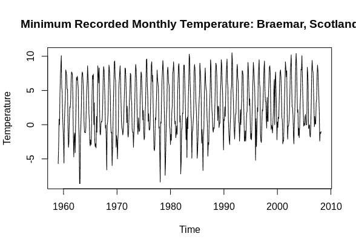
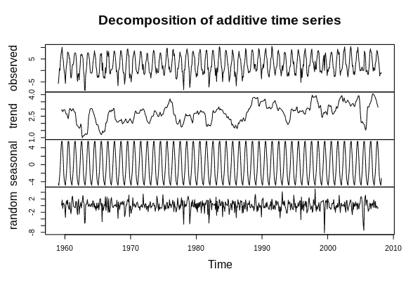
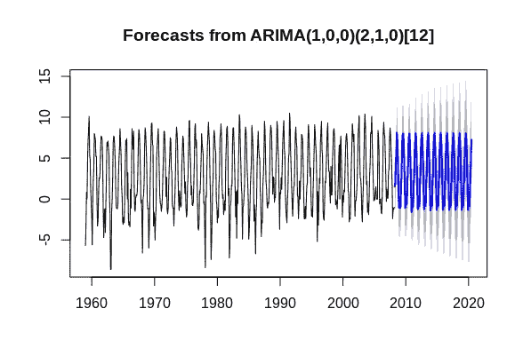
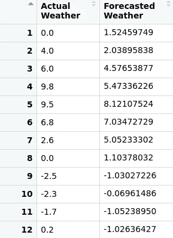
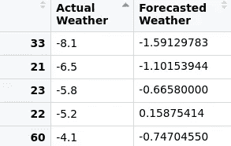
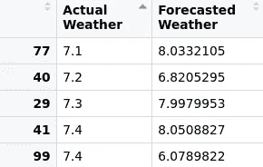
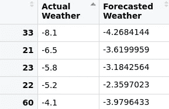

# ARIMA 的局限性:处理异常值

> 原文：<https://towardsdatascience.com/limitations-of-arima-dealing-with-outliers-30cc0c6ddf33?source=collection_archive---------16----------------------->

## 为什么要谨慎解读 ARIMA 预测

当涉及到对一个序列的总体趋势和季节模式进行建模时，ARIMA 模型可以是相当熟练的。

在之前一篇名为 [SARIMA:用 Python 和 R](https://medium.com/analytics-vidhya/sarima-forecasting-seasonal-data-with-python-and-r-2e7472dfad83) 预测季节性数据的文章中，使用了 ARIMA 模型来预测爱尔兰都柏林的最高气温值。

结果显示了显著的准确性，70%的预测与实际温度值相差在 10%以内。

# 预测更极端的天气状况

也就是说，前一个示例中使用的数据采用的温度值没有特别显示极值。例如，最低温度值为 4.8°C，而最高温度值为 28.7°C。这两个值都没有超出爱尔兰典型的全年天气标准。

然而，让我们考虑一个更极端的例子。


来源:图片由 [Pixabay](https://pixabay.com/photos/river-dee-braemar-deeside-scotland-554306/) 的[迪默](https://pixabay.com/users/deemur-622209/)拍摄

Braemar 是一个位于阿伯丁郡苏格兰高地的村庄，被称为英国冬季最冷的地方之一。1982 年 1 月，根据英国气象局的记录，该地区的最低温度为-27.2 摄氏度，这与 1981 年至 2010 年间记录的-1.5 摄氏度的平均最低温度明显不同。

ARIMA 模式在预测布雷默异常寒冷的冬天时表现如何？

利用 1959 年 1 月至 2020 年 7 月的英国气象局月度数据(包含公共部门信息)构建了一个 ARIMA 模型。

时间序列是这样定义的:

```
weatherarima <- ts(mydata$tmin[1:591], start = c(1959,1), frequency = 12)
plot(weatherarima,type="l",ylab="Temperature")
title("Minimum Recorded Monthly Temperature: Braemar, Scotland")
```

这是月度数据的图表:



来源:英国气象局天气数据

以下是单个时间序列组件的概述:



资料来源:RStudio

# ARIMA 模型配置

80%的数据集(前 **591** 个月的数据)用于构建 ARIMA 模型。然后，后 20%的时间序列数据被用作验证数据，以比较预测值与实际值的准确性。

使用 auto.arima，选择最佳拟合的 **p** 、 **d** 和 **q** 坐标:

```
# ARIMA
fitweatherarima<-auto.arima(weatherarima, trace=TRUE, test="kpss", ic="bic")
fitweatherarima
confint(fitweatherarima)
plot(weatherarima,type='l')
title('Minimum Recorded Monthly Temperature: Braemar, Scotland')
```

最佳配置选择如下:

```
> # ARIMA
> fitweatherarima<-auto.arima(weatherarima, trace=TRUE, test="kpss", ic="bic")Fitting models using approximations to speed things up...ARIMA(2,0,2)(1,1,1)[12] with drift         : 2257.369
 ARIMA(0,0,0)(0,1,0)[12] with drift         : 2565.334
 ARIMA(1,0,0)(1,1,0)[12] with drift         : 2425.901
 ARIMA(0,0,1)(0,1,1)[12] with drift         : 2246.551
 ARIMA(0,0,0)(0,1,0)[12]                    : 2558.978
 ARIMA(0,0,1)(0,1,0)[12] with drift         : 2558.621
 ARIMA(0,0,1)(1,1,1)[12] with drift         : 2242.724
 ARIMA(0,0,1)(1,1,0)[12] with drift         : 2427.871
 ARIMA(0,0,1)(2,1,1)[12] with drift         : 2259.357
 ARIMA(0,0,1)(1,1,2)[12] with drift         : Inf
 ARIMA(0,0,1)(0,1,2)[12] with drift         : 2252.908
 ARIMA(0,0,1)(2,1,0)[12] with drift         : 2341.9
 ARIMA(0,0,1)(2,1,2)[12] with drift         : 2249.612
 ARIMA(0,0,0)(1,1,1)[12] with drift         : 2264.59
 ARIMA(1,0,1)(1,1,1)[12] with drift         : 2248.085
 ARIMA(0,0,2)(1,1,1)[12] with drift         : 2246.688
 ARIMA(1,0,0)(1,1,1)[12] with drift         : 2241.727
 ARIMA(1,0,0)(0,1,1)[12] with drift         : Inf
 ARIMA(1,0,0)(2,1,1)[12] with drift         : 2261.885
 ARIMA(1,0,0)(1,1,2)[12] with drift         : Inf
 ARIMA(1,0,0)(0,1,0)[12] with drift         : 2556.722
 ARIMA(1,0,0)(0,1,2)[12] with drift         : Inf
 ARIMA(1,0,0)(2,1,0)[12] with drift         : 2338.482
 ARIMA(1,0,0)(2,1,2)[12] with drift         : 2248.515
 ARIMA(2,0,0)(1,1,1)[12] with drift         : 2250.884
 ARIMA(2,0,1)(1,1,1)[12] with drift         : 2254.411
 ARIMA(1,0,0)(1,1,1)[12]                    : 2237.953
 ARIMA(1,0,0)(0,1,1)[12]                    : Inf
 ARIMA(1,0,0)(1,1,0)[12]                    : 2419.587
 ARIMA(1,0,0)(2,1,1)[12]                    : 2256.396
 ARIMA(1,0,0)(1,1,2)[12]                    : Inf
 ARIMA(1,0,0)(0,1,0)[12]                    : 2550.361
 ARIMA(1,0,0)(0,1,2)[12]                    : Inf
 ARIMA(1,0,0)(2,1,0)[12]                    : 2332.136
 ARIMA(1,0,0)(2,1,2)[12]                    : 2243.701
 ARIMA(0,0,0)(1,1,1)[12]                    : 2262.382
 ARIMA(2,0,0)(1,1,1)[12]                    : 2245.429
 ARIMA(1,0,1)(1,1,1)[12]                    : 2244.31
 ARIMA(0,0,1)(1,1,1)[12]                    : 2239.268
 ARIMA(2,0,1)(1,1,1)[12]                    : 2249.168Now re-fitting the best model(s) without approximations...ARIMA(1,0,0)(1,1,1)[12]                    : Inf
 ARIMA(0,0,1)(1,1,1)[12]                    : Inf
 ARIMA(1,0,0)(1,1,1)[12] with drift         : Inf
 ARIMA(0,0,1)(1,1,1)[12] with drift         : Inf
 ARIMA(1,0,0)(2,1,2)[12]                    : Inf
 ARIMA(1,0,1)(1,1,1)[12]                    : Inf
 ARIMA(2,0,0)(1,1,1)[12]                    : Inf
 ARIMA(0,0,1)(0,1,1)[12] with drift         : Inf
 ARIMA(0,0,2)(1,1,1)[12] with drift         : Inf
 ARIMA(1,0,1)(1,1,1)[12] with drift         : Inf
 ARIMA(1,0,0)(2,1,2)[12] with drift         : Inf
 ARIMA(2,0,1)(1,1,1)[12]                    : Inf
 ARIMA(0,0,1)(2,1,2)[12] with drift         : Inf
 ARIMA(2,0,0)(1,1,1)[12] with drift         : Inf
 ARIMA(0,0,1)(0,1,2)[12] with drift         : Inf
 ARIMA(2,0,1)(1,1,1)[12] with drift         : Inf
 ARIMA(1,0,0)(2,1,1)[12]                    : Inf
 ARIMA(2,0,2)(1,1,1)[12] with drift         : Inf
 ARIMA(0,0,1)(2,1,1)[12] with drift         : Inf
 ARIMA(1,0,0)(2,1,1)[12] with drift         : Inf
 ARIMA(0,0,0)(1,1,1)[12]                    : Inf
 ARIMA(0,0,0)(1,1,1)[12] with drift         : Inf
 ARIMA(1,0,0)(2,1,0)[12]                    : 2355.279Best model: ARIMA(1,0,0)(2,1,0)[12]
```

该模型的参数如下:

```
> fitweatherarima
Series: weatherarima 
ARIMA(1,0,0)(2,1,0)[12]Coefficients:
         ar1     sar1     sar2
      0.2372  -0.6523  -0.3915
s.e.  0.0411   0.0392   0.0393
```

使用配置的模型 **ARIMA(1，0，0)(2，1，0)【12】**，生成预测值:

```
forecastedvalues=forecast(fitweatherarima,h=148)
forecastedvalues
plot(forecastedvalues)
```

这是一张预测图:



资料来源:RStudio

现在，可以生成一个数据框来比较预测值和实际值:

```
df<-data.frame(mydata$tmin[592:739],forecastedvalues$mean)
col_headings<-c("Actual Weather","Forecasted Weather")
names(df)<-col_headings
attach(df)
```



资料来源:RStudio

此外，使用 R 中的**度量**库，可以计算 RMSE(均方根误差)值。

```
> library(Metrics)
> rmse(df$`Actual Weather`,df$`Forecasted Weather`)
[1] 1.780472
> mean(df$`Actual Weather`)
[1] 2.876351
> var(df$`Actual Weather`)
[1] 17.15774
```

据观察，在平均温度为 2.87°C 的情况下，记录的 RMSE 为 1.78，与平均值相比明显较大。

让我们进一步研究数据中更极端的值。



资料来源:RStudio

我们可以看到，当涉及到预测特别极端的最低温度(为了便于讨论，低于-4°C)时，我们看到 ARIMA 模型明显高估了最低温度的值。

在这方面，相对于测试集中 2.87°C 的平均温度，RMSE 的大小刚刚超过 60%，这是因为 RMSE 对较大错误的惩罚更重。

在这方面，似乎 ARIMA 模型在捕捉更在正常值范围内的温度方面是有效的。



资料来源:RStudio

然而，该模型在预测更极端的数值方面存在不足，特别是在冬季月份。

也就是说，如果使用 ARIMA 预测的下限会怎样？

```
df<-data.frame(mydata$tmin[592:739],forecastedvalues$lower)
col_headings<-c("Actual Weather","Forecasted Weather")
names(df)<-col_headings
attach(df)
```



资料来源:RStudio

我们看到，虽然模型在预测最小值方面表现更好，但实际最小值仍然超过预测值。

此外，这并没有解决问题，因为这意味着模型现在将大大低估高于平均值的温度值。

因此，RMSE 显著增加:

```
> library(Metrics)
> rmse(df$`Actual Weather`,df$`Forecasted Weather`)
[1] 3.907014
> mean(df$`Actual Weather`)
[1] 2.876351
```

在这方面，应该谨慎解释 ARIMA 模型。虽然它们可以有效地捕捉季节性和总体趋势，但它们可能无法预测明显超出正常范围的值。

在预测这些数值时，蒙特卡罗模拟等统计工具可以更有效地模拟更极端数值的潜在范围。这里有一篇[后续文章](https://medium.com/@firstclassanalyticsmg/using-a-monte-carlo-simulation-to-forecast-extreme-weather-events-d17671149d3e)讨论了如何使用这种方法模拟极端天气事件。

# 结论

在这个例子中，我们看到了 ARIMA 在预测极值方面的局限性。虽然该模型擅长模拟季节性和趋势，但异常值很难预测 ARIMA 的情况，因为它们不在该模型捕捉的总体趋势之内。

非常感谢您的阅读，您可以在[michael-grogan.com](https://www.michael-grogan.com/)找到更多我的数据科学内容。

*免责声明:本文是在“原样”的基础上编写的，没有担保。本文旨在提供数据科学概念的概述，不应以任何方式解释为专业建议。本文中的发现和解释是作者的，不以任何方式得到英国气象局的认可或隶属于该局。*