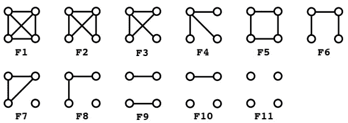
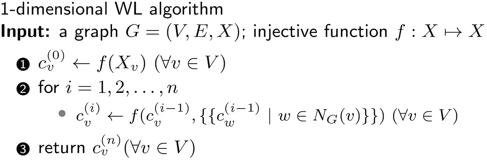
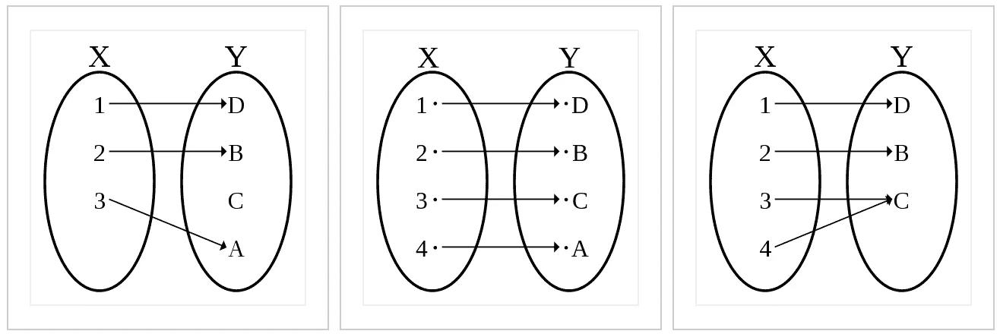
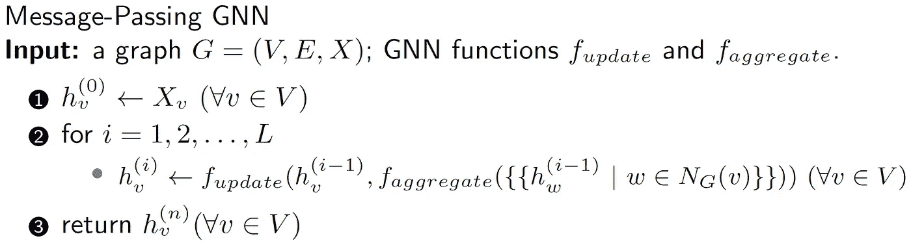
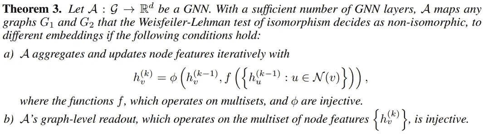
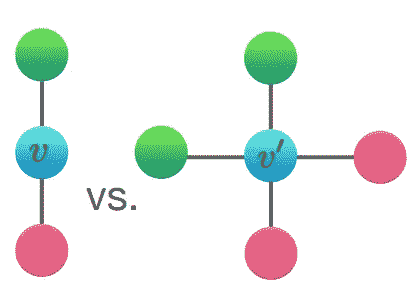
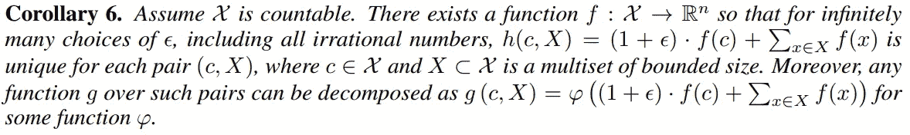
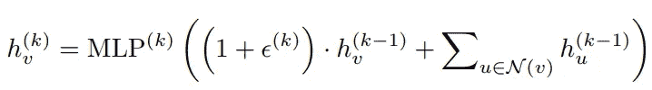

# 图形神经网络的局限性

> 原文：<https://towardsdatascience.com/limitations-of-graph-neural-networks-2412fffe677?source=collection_archive---------11----------------------->

走向更强大的 GNN。[来源。](https://www.shutterstock.com/)

图形表示有两种范式:**图形内核**和**图形神经网络**。图核通常基于分解以无监督的方式创建图的嵌入。例如，我们可以计算一个图中每种类型的三角形或者更一般的三元组的数量，然后使用这些计数来得到嵌入。这是 graphlet 内核的一个实例。

所有尺寸为 4 的小图。计算一个图中所有四元组中每个 graphlet 的数量将得到一个 graphlet 内核。来源:[用于大型图形比较的高效 graphlet 内核](http://proceedings.mlr.press/v5/shervashidze09a/shervashidze09a.pdf)

这种范式的主要研究动机是创建一种保持图之间同构的嵌入，即两个图同构当且仅当它们对应的嵌入相同。不用说，如果我们有这样的嵌入，我们就解决了图同构问题，这是目前已知的比 p 类问题更难的问题。然而，有像[匿名行走嵌入](https://arxiv.org/abs/1805.11921)这样的嵌入保持同构，当然是以运行时间计算为代价的。尽管如此，这里的主要信息是图形内核被设计来解决*图形同构问题*。您的嵌入能够区分的图形越多，您的嵌入就越好。这是原则。

对于图形神经网络，原理已经改变。我们可以尝试解决任何给定的问题，而不是解决一个问题，即图同构，比如寻找最短路径或检测循环。这是很有希望的，因为它允许我们通过它所能解决的问题来指导我们的网络设计。这听起来很神奇:不用使用一些成熟的组合算法，你只需训练你的网络，它就会为你找到解决方案。但这也是可疑的:神经网络正在通过 SGD 搜索解决方案，并涉及许多其他技术问题，如果你陷入了糟糕的局部最优怎么办——那么它如何解决任何问题？事实上，图形神经网络有一些限制，我将在下面描述。

# GNN 强大的条件。

我将从作品开始，[图神经网络](https://arxiv.org/abs/1810.00826)有多强大，它引发了很多关于 GNN 理论解释的研究。特别地，将 GNNs 与一个被充分研究的图同构算法，Weisfeiler-Lehman (WL)算法相比较。

## 关于 WL 算法。

这个算法很容易描述。你从一个图开始，其中每个节点都有一些颜色(如果没有，放一个度数)。在每次迭代中，每个节点都获得其邻居的一组颜色，并以特定的方式更新其颜色。具体来说，有一个*内射*函数，它从节点的先前颜色 c 和邻域颜色 x 的有序列表中创建节点的新颜色 c’。该算法在`n`次迭代后停止，更新图的颜色。

注意:重要的是 WL 算法使用内射函数，因为它保证不同的输入将得到不同的输出。WL 使用的一个特殊的内射函数是，它为每个输入参数创建了一个以前没有遇到过的新颜色。因为它在分类(可数)域(颜色)中操作，所以它总是可以创建这样的映射。

内射、双射和满射映射(从左到右)。[来源。](https://en.wikipedia.org/)

该算法的主要用途是测试两个图之间的同构。如果最终着色不同，那么两个图不是同构的。如果两个图具有相同的最终着色，那么 WL 算法输出它们可能是同构的，这意味着它们仍然有微小的机会不是同构的。

这种算法是 70 年代在苏联的秘密实验室里设计的，当时计算机仍然使用[穿孔卡](https://en.wikipedia.org/wiki/Punched_card#IBM_80-column_punched_card_format_and_character_codes)。但是从那时起，世界各地的研究人员研究了它的性质，特别是，当 WL 算法失败时，我们知道不同的图族。例如，对于任意两个具有`n`顶点的`d`-正则图，最终的着色将是相同的。尽管如此，这是一个非常强大的同构测试，有定理表明，当`n`趋于无穷大时，WL 失败的可能性为 0。所以这是一个相当强的算法。

## 回到 GNN。

如果你研究过 GNN，你会发现 GNN 更新节点特征的方式和 WL 算法更新节点颜色的方式有很多相似之处。特别是，GNN 使用消息传递机制更新特性。

不同 GNN 之间的区别在于它们使用的聚合和读出函数。但是很容易理解，如果聚合函数是内射的，那么如果 WL 把图映射到不同的着色，那么 GNN 也会把这些图映射到不同的嵌入。定理 3 是这种说法的正式方式。

换句话说，GNN 的参数化函数`phi`和`f`如果是内射的，那么它们保证 GNN 的强幂。这并不奇怪，因为 WL 算法也要求它的函数是内射的，而在其他方面，这两个过程是等价的。

请注意我们更新节点嵌入的特殊方式。我们得到先前嵌入`h_v^(k-1)`和邻居先前嵌入的多重集作为两个不同的自变量，而不是当你把这两个合并在一起时作为一个自变量。这一点很重要。

> 所以，你可以用 GNN 来判断图是否同构，这相当于用 WL 算法。

这是*神奇的*部分。GNN 突然变成了著名的算法。但是它的局限性在哪里呢？

# 关于 GNN 的局限性。

来自上面的主要限制是你需要有内射函数`phi`和`f`。这些功能是什么？这些是将多重嵌入集映射到新嵌入集的函数。例如，您可以使用均值函数。该函数将取嵌入的平均值，并将其指定为新的嵌入。然而，很容易看出，对于一些不同的图，这些将给出相同的嵌入，因此*均值函数不是内射的*。

节点 v 和 v’的嵌入的平均聚合(这里嵌入对应于不同的颜色)将给出相同的嵌入，即使图是不同的。来源:[图神经网络有多强大？](https://arxiv.org/abs/1810.00826)

但是如果你以特定的方式求和并变换嵌入，就有可能得到内射函数。这里是引理 5:

这里真正重要的是，你可以首先使用*一些*函数`f(x)`将和下的每个嵌入映射到一个新的嵌入，然后取和，得到一个内射函数。在证明中，他们实际上明确地陈述了这个函数 f，它需要两个附加条件，即`X`是可数的，并且任何多重集是有界的。我认为这两个假设都不可靠，因为无论如何，我们将 GNN 应用于有限图，其中特征和邻域的基数是有限的。但是至少我们现在知道，如果我们使用变换 f，然后加法，我们可以得到一个内射映射。

然而，从上述定理 3(条件 a)应该有一个特定的聚合方案，除了邻居的聚合之外，该聚合方案使用当前节点`h_v^(k-1)`的先前嵌入。为了包含它，我们需要另一个语句:

注意，这里函数`h`像以前一样取变换后的邻居特征的总和，但是此外，加上`(1+eps)f(c)`并且这个`eps`是任何无理数。这样函数`h`就是内射的。

好吧，我们知道些什么？我们知道我们的聚集函数`phi`和`f`应该是内射的，并且我们有内射的函数`h`。如果我们的目标是构建强大的嵌入，那么我们就完成了。但是我们尝试的不仅仅是构建嵌入，而是以监督的方式解决下游任务，比如节点分类。并且函数`h`不具有可以拟合数据的可学习参数(可能`eps`除外)。

GIN architecture 提出的是用 MLP 代替函数`phi`和`f`，由于通用逼近定理，我们知道 MLP 可以逼近任何函数，包括内射函数。因此，特别地，GIN 的嵌入更新具有以下形式:

注意，MLP 内部的东西不再保证是内射的，而且 MLP 本身也不保证是内射的。事实上，对于第一层，如果输入特征是一位热编码的，那么 MLP 内部的和将是内射的，原则上，MLP 可以学习一个内射函数。但是在第二层和更高层，节点嵌入变得不合理，并且很容易得出嵌入的和不再是内射的例子(例如，有一个嵌入等于 2 的邻居或者有两个嵌入等于 1 的邻居)。

> 所以，如果 MLP 和嵌入的和是内射函数，那么 GIN 和 WL 算法一样强大。

但事实上，在训练中没有任何东西可以保证这种内射性，可能有一些图形是金不能区分的，而 WL 可以。所以这是关于杜松子酒的一个很强的假设，如果违反了这个假设，那么杜松子酒的力量是有限的。

这一限制稍后在论文[判别结构图分类](https://arxiv.org/abs/1905.13422)中进行了讨论，其中显示了为了使 MLP 内射，输出嵌入的大小应该与输入要素的大小成指数关系，尽管分析是针对无界邻域(无限图)进行的。找到一个具有内射聚合并对下游任务有足够表达能力的架构是一个公开的问题，即使有几个架构将 GIN 推广到更高维的 WL 算法以及其他问题；然而，还不能保证学习的 GNN 架构将解决所有输入图的特定任务。[关于图形神经网络表达能力的调查](https://arxiv.org/abs/2003.04078)很好地解释了 GNN 能力理论解释的最新进展。

## 结论。

对 GNN 房地产的研究现在是一个活跃的研究领域(你可以查看[的最新趋势](/top-trends-of-graph-machine-learning-in-2020-1194175351a3))，有许多开放性的问题需要解决。这篇文章的主要信息是要表明，GNN 目前不能保证收敛到像 WL 算法那样强大的状态，尽管一般来说，当 GNN 算法变得强大时，它会有一组参数。GNN 可以解决图上的不同问题，但是到目前为止，研究都集中在*它们能解决什么*不能解决什么，而不是*它如何对得到的解有一些保证，我认为这将是下一篇研究论文的重点。*

*P.S .我会继续写关于图机器学习的文章，所以如果你有兴趣，可以在 medium 上关注我或者订阅我的* [*电报频道*](https://t.me/graphML) *(我每天更新的)或者* [*我的 twitter*](https://twitter.com/SergeyI49013776) *(我每周更新一次)。*