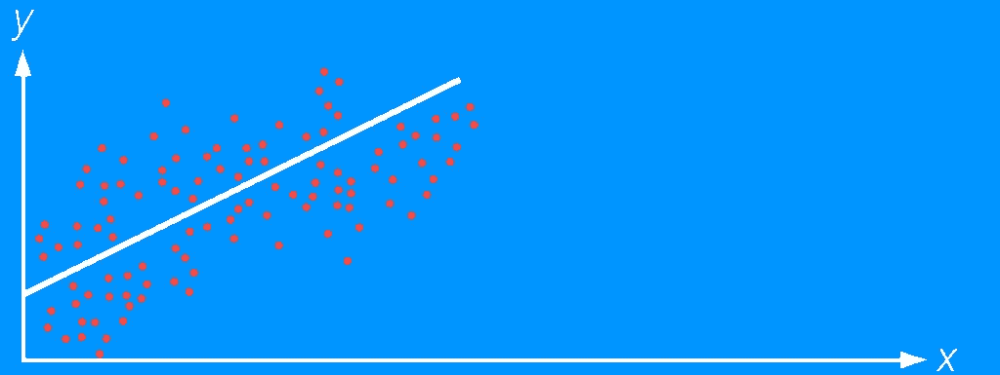
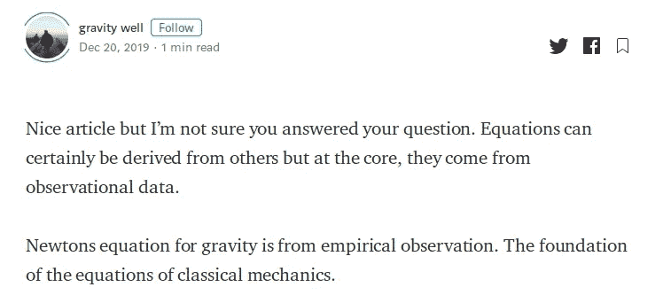
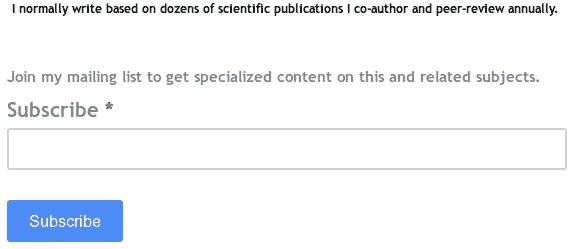

# 回归的局限性

> 原文：<https://towardsdatascience.com/limitations-of-regression-in-scientific-formulation-of-new-equations-7f1e3c6a99a4?source=collection_archive---------17----------------------->

## 在科学公式中

回归分析的作者说明

回归分析是一种统计技术，常用于建立因变量或解释变量与自变量或预测变量之间的关系。例如，一个销售人员可能想知道为什么一种产品的销售，比如说报纸在一个月的某些时候销量很高。然后，他将首先尝试确定确切的日期或星期，即销售波动的时间，并寻找影响转换的独特事件。在这些发现之后，通常会做出旨在改进流程或降低成本的决策。因此，回归是基于可验证的观察或经验，而不是理论或纯逻辑，因此有时被称为经验模型。

呈现回归模型的最普通的方式是将被解释或响应变量 *Yᵢ* 写成自变量 *Xᵢ* 的函数，由系数 *β限定。*一个额外的误差项， *ϵ* 通常被添加来表示可能或可能不直接与响应变量相关的未捕获信息。无论回归模型是线性的还是非线性的，方程通常遵循以下形式:

情商。(1)

回归分析的最早形式是广为人知的最小二乘法，由勒让德于 1805 年提出，后来高斯于 1809 年提出了一个改进版本。虽然回归已经辉煌了三个多世纪，但它受到了难以置信的限制，尤其是在面向自然科学的科学出版方面。

我们最近探索了[科学家如何遵循一种叫做“激进”的方法来制定新的方程式](https://medium.com/cantors-paradise/how-the-do-scientists-create-new-equations-f1059c11c0a1)。我认为其中一个回答很有分量，值得一个体面的回答，来自[重力井](https://medium.com/u/22abe9089838?source=post_page-----7f1e3c6a99a4--------------------------------)(见下面截图中的帖子)

图 1:对文章“科学家如何建立新方程”的回应

这是一个有效的关注，因此我们将解决它以及为什么经验模型可能不是第一选择的其他原因，只要制定新的方程是一个关注。

## 回归分析的问题

回归可能不起作用的第一个也是最明显的原因是，你在寻找全新的方程，因此很可能文献中没有数据支持你的假设。因此，我们正在探索方法，甚至在开始进行实验之前，甚至在获得获得实验装置的资金之前，就开始你的研究。接下来将适用以下场景:

1.  因此，建议甚至在建立实验之前就采用激进的方法。这样，你的目标就是大幅削减成本。例如，你的最终方程是 *p=mv* ，如果你在进行实验之前得到这个，你的工作会更容易，因为你事先知道，例如，你不期望任何常数。还要记住，你不知道这些变量是什么，这就是为什么所有的回归方程看起来像: *y=ax + b* 。该常数几乎是不可避免的，因为在大多数情况下(如果不是全部的话)，它是由实验设置误差造成的。我同行评议过许多文章，在这些文章中，作者完全没有意识到他们所拥有的潜力，如果他们多做一点努力，将方程转换成动态形式的话。
2.  其次，虽然回归分析有利于数据探索，但你很少能得到所有的信息，尤其是关于单位或维度的信息。你会意识到这些报告中的讨论部分只关注统计测量，如相关性、现场数据和实验之间的最佳拟合等。，就差不多了。
3.  经验模型很难概括。这意味着，如果你进行实验，并提出方程，只讨论相关性，以及(2)中提到的一些其他统计参数，该模型将只属于进行实验的特定系统。但是，如果您将其一般化，那么您就有很好的机会为其他类似的系统共享(并应用)这种方法。这在经济学和认识论上都很重要，因为有人可以从你的研究中学到新的东西。
4.  最后，你可能意识到有些方程没有实验方法。一些实验无法完成，因为无法进入系统，例如，相对论宇宙学和当代量子力学中的许多实验，薛定谔就是一个很好的例子。据我们所知，例如薛定谔的方程，没有标准的推导方法，它就是有效的——甚至薛定谔自己也不能解释他自己的魔法。因此，在这种情况下，最可靠的方法是执行本文中解释的方法。它也是可行的，假设你有所有的实验工具，但你不知道到底要测量什么或从哪里开始研究——这种情况比你想象的要经常发生。即使在进行回归分析之前，你通常也知道要测量什么，但大多数情况下，如果你没有做好计划，你可能最终会放弃所有这些结果——这是许多博士生的常见问题，尤其是在他们的第一年。他们只是后来才意识到这一点，已经花费了数百小时和数吨的项目研究资金。因此，回归分析可能不是严肃研究的第一步。尽管它对销售分析和其他一些事情很有效，但在大多数其他情况下却不尽如人意。特别是，如果你要执行一个更健壮的项目，就像运筹学中绝大多数需要深入分析的项目一样，你很少能触及本质。

## 结论

虽然回归分析是分析观察结果和得出结论的重要工具，但它也可能令人望而生畏，尤其是当目标是提出新的方程来全面描述新的科学现象时。在大多数情况下，数据可用性是不准确的，因此衍生模型的通用化和跨平台应用将受到限制。最后，我们仍然无法接触到一些系统特别是相对论宇宙学和当代量子力学中的大多数情况。因此，如果要对一种新现象进行数学研究，一种基于理论分析的更稳健的方法是不可避免的。

