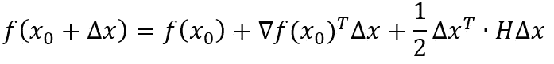
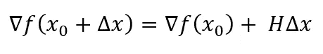
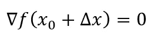
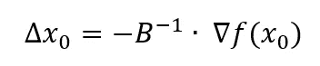

# ML 中的有限内存 Broyden-Fletcher-goldf ARB-Shanno 算法。网

> 原文：<https://towardsdatascience.com/limited-memory-broyden-fletcher-goldfarb-shanno-algorithm-in-ml-net-118dec066ba?source=collection_archive---------24----------------------->

## 对 L-BFGS 算法及其使用 ML.NET 实现的简短理论介绍。


由[500photos.com](https://www.pexels.com/@500photos-com-15338)从[派克斯](https://www.pexels.com/photo/93405)

前一段时间，我发表了一篇关于使用 ML.NET 实现朴素贝叶斯的文章。今天继续这个系列，我将向你介绍有限记忆的 Broyden-Fletcher-goldf ARB-Shanno 方法。我将从一个理论开始，并解释这个方法是关于什么的，它是用来做什么的。

**一些事实**

该算法的创造者是豪尔赫·诺塞达尔。它是由阿贡国家实验室和西北大学的合资企业优化中心创建的。最初的[源代码](http://users.iems.northwestern.edu/~nocedal/lbfgs.html)是用 FORTRAN 写的。它被称为大规模无约束优化软件。正如您从名字中所料，这种方法类似于 BFGS，但是它使用的内存更少。因此，它非常适合大型数据集。

**左旋 BFGS**

这是一个来自拟牛顿法族的算法。这些是求函数局部极值的算法，是基于牛顿求函数驻点的方法。

**该做些数学了**

在这些方法中，使用二次近似来寻找最小值函数 *f(x)。*函数 *f(x)* 的泰勒级数如下:



其中δ***f***是函数的一个梯度， ***H*** 是其黑森。

泰勒级数的梯度看起来是这样的:



我们想找到最小值，也就是解方程:



从这里开始:



现在，应该任命海森。属于这个家族的每个方法都有不同的指定方式。我想我们可以结束这部分了。我不想用这些公式来烦你，但是我想让你对这是怎么回事有一个简单的概念。

**BFGS 和 L-BFGS 的区别**

正如我前面提到的，L-BFGS 算法适用于大型数据集，因为它比标准 BFGS 需要更少的内存。两种算法都使用 Hessian 逆矩阵估计来控制变量空间搜索。虽然 BFGS 存储了对逆黑森的密集***【n】****x***n***逼近，但 L-BFGS 只存储了几个隐式表示逼近的向量。这就是节省内存的区别。*

***数据集***

*我在实验中使用了 UCI 机器学习库中的[皮肤分割](https://archive.ics.uci.edu/ml/datasets/Skin+Segmentation)数据集。所分析的数据集具有 3 个特征和 2 个类别。这些类确定样本是否被认为是皮肤。该数据集有 245057 个实例，因此 L-BFGS 算法在这里将完美地工作。*

***实施***

*在创建了一个控制台应用程序项目并从 NuGet 包中下载了 ML.NET 之后，您可以继续进行实现和模型创建。开始时，您应该创建对应于数据集属性的类。清单中显示了创建的类:*

*然后，您可以继续加载数据集，并将其分为训练集和测试集。我建议采用流行的划分，即 70%是训练集，30%是测试集。*

```
*var dataPath = "../../skin-segmentation.csv";var ml = new MLContext();var DataView = ml.Data.LoadFromTextFile<Features>(dataPath, hasHeader: true, separatorChar: ',');var partitions = ml.Data.TrainTestSplit(DataView, testFraction: 0.3);*
```

*现在您需要使模型结构适应 model 图书馆提出的标准。这意味着指定类的属性必须称为 Label。其余的属性必须压缩在名称 Features 下。*

```
*var pipeline = ml.Transforms.Conversion.MapValueToKey(inputColumnName: "Class", outputColumnName:"Label")
.Append(ml.Transforms.Concatenate("Features", "V1","V2","V3")).AppendCacheCheckpoint(ml);*
```

*现在是建立培训渠道的时候了。在这里，选择 L-BFGS 形式的分类器，在参数中指定标签和要素的列名。您还指示了表示预测标签的属性。*

```
*var trainingPipeline = pipeline.Append(ml.MulticlassClassification.Trainers.LbfgsMaximumEntropy("Label","Features")).Append(ml.Transforms.Conversion.
MapKeyToValue("PredictedLabel"));*
```

*完成前面的步骤后，您现在可以开始训练和测试模型了:*

```
*var trainedModel = trainingPipeline.Fit(partitions.TrainSet);var testMetrics = ml.MulticlassClassification.
Evaluate(trainedModel.Transform(partitions.TestSet));*
```

***结果和总结***

*L-BFGS 算法的准确率为 91.8%。结果似乎很好，但是当然，需要更深入的分析和使用其他度量来确认其价值。在本文中，我向您介绍了 L-BFGS 算法，并展示了如何通过 ML.NET 来使用它。它在 lines 的使用仅限于几行代码，但是我认为了解一下这个算法是关于什么的是值得的。*