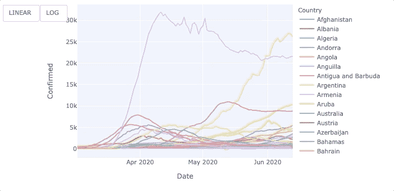

# Jupyter 上 Plotly 的折线图动画

> 原文：<https://towardsdatascience.com/line-chart-animation-with-plotly-on-jupyter-e19c738dc882?source=collection_archive---------13----------------------->

## Plotly 统一悬停模式，按钮，等等


[盖伊·川崎](https://unsplash.com/@guykawasaki?utm_source=medium&utm_medium=referral)在 [Unsplash](https://unsplash.com?utm_source=medium&utm_medium=referral) 上拍照

```
**Table of Contents**[**Introduction**](#0c1e)1\. [Data preparation](#0dc9)
2\. [All countries line chart](#90a6)
3\. [Adding LOG and LINEAR buttons](#a093)
4\. [Changing hovermode](#2b8b)
5\. [Line chart animation](#7b32)
6\. [Scatter and bar chart animations](#e0ab)[**Conclusion**](#2bbc) 
```

# 介绍

在本文中，我将尝试使用 Jupyter 上的 [Plotly 动画](https://plotly.com/python/animations/)在数据图表中重现我们的世界之一。

ourworldindata.org 是一个优秀的网站，我非常喜欢他们的视觉效果。


图片来自[ourworldindata.org](https://ourworldindata.org)

[上图](https://ourworldindata.org/epi-curve-covid-19)可以动画显示图形，高亮显示线条，在右侧选择不同的案例，选择线性和对数按钮，选择想要显示的国家。

该项目是一个开源项目，你可以探索他们的 GitHub repo。

它是一个基于 JavaScript 的 app，使用 MySQL 作为数据库和 React、Mobx、TypeScript、Node、Express、D3 和[其他 JavaScript](https://github.com/owid/owid-grapher/blob/master/package.json)。

[Plotly](https://plotly.com/python/animations/) 支持创建动画、按钮和可选线条。

然而，目前的 Plotly 动画有一些限制，平滑的帧间过渡只可能用于散点图和条形图。它不支持复选框，尽管用于构建 web 应用程序的 Python 框架 PlotlyDash 支持`[Checklist](https://dash.plotly.com/dash-core-components/checklist)`。

> *本文假设你已经熟悉 JupyterLab/Jupyter 笔记本的基本操作。*

**Plotly 安装**

plotly.py 可以使用 pip 安装。

```
$ pip install plotly==4.8.1
```

或者康达。

```
$ conda install -c plotly plotly=4.8.1
```

## JupyterLab 支持(Python 3.5 以上)

使用画中画:

```
$ pip install jupyterlab "ipywidgets>=7.5"
```

或康达:

```
$ conda install jupyterlab "ipywidgets=7.5"
```

然后运行以下命令(您需要安装节点):

```
# JupyterLab renderer support 
$ jupyter labextension install jupyterlab-plotly@4.8.1  
# OPTIONAL: Jupyter widgets extension 
$ jupyter labextension install @jupyter-widgets/jupyterlab-manager plotlywidget@4.8.1
```

[](/how-to-run-jupyter-notebook-on-docker-7c9748ed209f) [## 如何在 Docker 上运行 Jupyter 笔记本

### 不再有 Python 环境和包更新

towardsdatascience.com](/how-to-run-jupyter-notebook-on-docker-7c9748ed209f) [](/how-to-create-an-animated-bar-chart-in-jupyter-9ee1de8d0e80) [## 如何在 Jupyter 中创建动画条形图

### 使用 Plotly Python 显示最新美国失业率的数据可视化

towardsdatascience.com](/how-to-create-an-animated-bar-chart-in-jupyter-9ee1de8d0e80) [](/how-to-create-an-animated-choropleth-map-with-less-than-15-lines-of-code-2ff04921c60b) [## 如何用不到 15 行代码创建一个动画的 Choropleth 地图

### 在 Jupyter 上使用 Python 中的 Plotly Express

towardsdatascience.com](/how-to-create-an-animated-choropleth-map-with-less-than-15-lines-of-code-2ff04921c60b) 

# 数据准备

你可以从[我们的数据世界](https://ourworldindata.org/epi-curve-covid-19)或[本报告](https://raw.githubusercontent.com/shinokada/covid-19-stats/master/data/daily-new-confirmed-cases-of-covid-19-tests-per-case.csv)中下载数据集。

```
import pandas as pd
import plotly.express as px
df = pd.read_csv('[https://raw.githubusercontent.com/shinokada/covid-19-stats/master/data/daily-new-confirmed-cases-of-covid-19-tests-per-case.csv](https://raw.githubusercontent.com/shinokada/covid-19-stats/master/data/daily-new-confirmed-cases-of-covid-19-tests-per-case.csv)')display(df.head())
display(df.shape)
```


原始数据集。它有 26123 行 x 5 列。作者图片

```
import pandas as pd
import plotly.express as pxdf = pd.read_csv('https://raw.githubusercontent.com/shinokada/covid-19-stats/master/data/daily-new-confirmed-cases-of-covid-19-tests-per-case.csv') excludes = ["World", "Africa", "North America", "South America", "Asia", "Europe", "European Union", "High income", "Low income", "Lower middle income", "Oceania", "Upper middle income", "World excl. China", "World excl. China and South Korea", "International",            "World excl. China, South Korea, Japan and Singapore","Asia excl. China"] df=df[~df['Entity'].isin(excludes)]
df.columns = ['Country','Code','Date','Confirmed','Days since confirmed']
df['Date']= pd.to_datetime(df['Date']).dt.strftime('%Y-%m-%d')
df_all=df[(df['Date']>'2020-03-01') & (df['Date'] <'2020-06-14')]
```

*   导入必要的库、Pandas 和 Plotly.express，将一个**逗号分隔值(csv)** 文件读入 DataFrame。
*   `excludes`是我们想要排除的`Entity`列中的名称列表。
*   `isin`方法在`Entity`列中找到`excludes`值，我们使用`~`来排除这些行。
*   我们将列名重命名为 Country、Code、Date、Confirmed、Days since confirmed。
*   我们将`Date`列的数据类型从`object`更改为`datetime`。我们也将它格式化为年-月-日。
*   我们在`Date`列中选择从`2020-03-01`到`2020-06-14`的行。

```
display(df.head())
display(df.shape)
```


准备好的数据集。它有 23414 行 x 5 列。作者图片

# 所有国家折线图

让我们使用`df_all`创建一个折线图。我们设置`Date`为 x 轴，`Confirmed`为 y 轴，使用`Country`为线条颜色。

```
fig = px.line(df_all, x="Date", y="Confirmed", color="Country")
fig.show()
```


折线图。作者图片

通过将鼠标光标移动到数据点上，图表能够揭示关于该数据点的更多信息。我们可以通过点击右侧的国家名称来隐藏或显示线条。

# 添加对数和线性按钮

我们将添加两个改变 y 轴刻度的按钮。

```
fig = px.line(df_all, x="Date", y="Confirmed", color="Country")

fig.update_layout(
    updatemenus=[
        dict(
            type = "buttons",
            direction = "left",
            buttons=list([
                dict(
                    args=[{"yaxis.type": "linear"}],
                    label="LINEAR",
                    method="relayout"
                ),
                dict(
                    args=[{"yaxis.type": "log"}],
                    label="LOG",
                    method="relayout"
                )
            ]),
        ),
    ]
)
fig.show()
```

使用`[update_layout](https://plotly.com/python-api-reference/generated/plotly.graph_objects.Figure.html#plotly.graph_objects.Figure.update_layout)`方法更新图形布局的属性。增加`LINEAR`和`LOG`两个按钮，并将`yaxis.type`相应改为`linear`和`log`。



线性和对数按钮。作者图片

# 更换`hovermode`

Plotly 有三种不同的`[hovermode](https://plotly.com/python/hover-text-and-formatting/)`。默认设置是`hovermode='closest'`，正如我们在上图中看到的，光标正下方的点会出现一个悬停标签。

对于这个图表，我们将使用统一的`hovermode='x unified'`。它显示一个包含所有数据信息的悬停标签。为了清楚起见，我们选择了四个国家。

```
import numpy as np
import pandas as pd
import plotly.graph_objects as go  #plotly 4.0.0rc1 df = pd.read_csv('https://raw.githubusercontent.com/shinokada/covid-19-stats/master/data/daily-new-confirmed-cases-of-covid-19-tests-per-case.csv')
df.columns = ['Country','Code','Date','Confirmed','Days since confirmed']
df['Date']= pd.to_datetime(df['Date']).dt.strftime('%Y-%m-%d')
df=df[(df['Date']>'2020-03-15') & (df['Date'] <'2020-06-14')] includes=['United States','Russia', 'India','Brazil']df_selected=df[df['Country'].isin(includes)] fig = px.line(df_selected, x="Date", y="Confirmed", color="Country") fig.update_layout(
    hovermode='x unified',
    updatemenus=[
        dict(
            type = "buttons",
            direction = "left",
            buttons=list([
                dict(
                    args=[{"yaxis.type": "linear"}],
                    label="LINEAR",
                    method="relayout"
                ),
                dict(
                    args=[{"yaxis.type": "log"}],
                    label="LOG",
                    method="relayout"
                )
            ]),
        ),
    ]
)
fig.show()
```


`hovermode='x unified' in a line chart. Image by the author`

# 折线图动画

Plotly 动画有一些限制，并且不支持折线图。

可以制作折线图动画，但它不如其他动画(如条形图和散点图)简洁。

```
import numpy as np
import pandas as pd
import plotly.graph_objects as godf = pd.read_csv('[https://raw.githubusercontent.com/shinokada/covid-19-stats/master/data/daily-new-confirmed-cases-of-covid-19-tests-per-case.csv'](https://raw.githubusercontent.com/shinokada/covid-19-stats/master/data/daily-new-confirmed-cases-of-covid-19-tests-per-case.csv'))
df.columns = ['Country','Code','Date','Confirmed','Days since confirmed']
df['Date']= pd.to_datetime(df['Date']).dt.strftime('%Y-%m-%d')
df=df[(df['Date']>'2020-03-15') & (df['Date'] <'2020-06-14')]usa=df[df['Country'].isin(['United States'])]
brazil=df[df['Country'].isin(['Brazil'])]
india=df[df['Country'].isin(['India'])]
russia=df[df['Country'].isin(['Russia'])]trace1 = go.Scatter(x=usa['Date'][:2],
                    y=usa['Confirmed'][:2],
                    mode='lines',
                    line=dict(width=1.5))trace2 = go.Scatter(x = brazil['Date'][:2],
                    y = brazil['Confirmed'][:2],
                    mode='lines',
                    line=dict(width=1.5))trace3 = go.Scatter(x = india['Date'][:2],
                    y = india['Confirmed'][:2],
                    mode='lines',
                    line=dict(width=1.5))trace4 = go.Scatter(x = russia['Date'][:2],
                    y = russia['Confirmed'][:2],
                    mode='lines',
                    line=dict(width=1.5))frames = [dict(data= [dict(type='scatter',
                           x=usa['Date'][:k+1],
                           y=usa['Confirmed'][:k+1]),
                      dict(type='scatter',
                           x=brazil['Date'][:k+1],
                           y=brazil['Confirmed'][:k+1]),
                      dict(type='scatter',
                           x=india['Date'][:k+1],
                           y=india['Confirmed'][:k+1]),
                      dict(type='scatter',
                           x=russia['Date'][:k+1],
                           y=russia['Confirmed'][:k+1]),
                     ],
               traces= [0, 1, 2, 3],  
              )for k  in  range(1, len(usa)-1)]layout = go.Layout(width=700,
                   height=600,
                   showlegend=False,
                   hovermode='x unified',
                   updatemenus=[
                        dict(
                            type='buttons', showactive=False,
                            y=1.05,
                            x=1.15,
                            xanchor='right',
                            yanchor='top',
                            pad=dict(t=0, r=10),
                            buttons=[dict(label='Play',
                            method='animate',
                            args=[None, 
                                  dict(frame=dict(duration=3, 
                                                  redraw=False),
                                                  transition=dict(duration=0),
                                                  fromcurrent=True,
                                                  mode='immediate')]
                            )]
                        ),
                        dict(
                            type = "buttons",
                            direction = "left",
                            buttons=list([
                                dict(
                                    args=[{"yaxis.type": "linear"}],
                                    label="LINEAR",
                                    method="relayout"
                                ),
                                dict(
                                    args=[{"yaxis.type": "log"}],
                                    label="LOG",
                                    method="relayout"
                                )
                            ]),
                        ),
                    ]              
                  )layout.update(xaxis =dict(range=['2020-03-16', '2020-06-13'], autorange=False),
              yaxis =dict(range=[0, 35000], autorange=False));fig = go.Figure(data=[trace1, trace2, trace3, trace4], frames=frames, layout=layout)
fig.show()
```

如果我们愿意，我们可以增加更多的国家。

*   我们创建四个独立的数据帧。您可以增加或减少国家的数量。
*   我们用自己的`x`、`y`、`mode`和`line`值创建四个轨迹。如果你改变了国家的数量，你也需要在这里进行调整。
*   我们用`data`列表值创建框架。`traces=[0,1,2,3]`用于迭代`frame[k]['data'][0]`、`frame[k]['data'][1]`等。如果您更改国家的数量，同样，您需要调整这里的代码。如`traces=[0,1,2,3,4,5]`。
*   我们设置了`width`、`height`、`hovermode`和`updatemenus`。我们设置了两种按钮，一种用于播放，另一种用于`LINEAR`和`LOG`。
*   `[update](https://plotly.com/python-api-reference/generated/plotly.graph_objects.Figure.html?highlight=update#plotly.graph_objects.Figure.update)`用带有关键字参数的`dict`更新图形的属性。

我们创建一个新的`Figure`实例，并添加我们在第 15–33 行创建的所有跟踪。如果您更改了国家的数量，您需要更新这一行。


Plotly 折线图动画。图片由作者提供。

# 散点图和条形图动画

Plotly 支持散点图和条形图动画。

你可以在这里找到代码。


散点图动画。图片由作者提供。

您可以通过添加`fig["layout"].pop("updatemenus")`来删除动画按钮，并将其用作滑块。

[代码](https://gist.github.com/shinokada/ad63d4cfa393ae326bcf4bbb960c7a61)


pop("updatemenus ")放下动画按钮。图片由作者提供。

在条形图动画中，我们可以悬停以查看更多详细信息，并且可以通过单击右侧菜单来隐藏/显示项目。

[代码](https://gist.github.com/shinokada/6505c9b94ad5ec02272e01101f0a57f9)


条形图动画。图片由作者提供。

# 结论

它与我们在数据网站中的世界并不完全相同，但我们学会了如何创建折线图、折线图动画、添加统一的悬停模式以及添加按钮。

目前，Plotly 需要更多代码来制作折线图动画。此外，如果散点图可以为动画绘制轨迹线和速度控制参数，那就太好了。

**通过** [**成为**](https://blog.codewithshin.com/membership) **会员，获得媒体上所有故事的访问权限。**


[https://blog.codewithshin.com/subscribe](https://blog.codewithshin.com/subscribe)

[](/how-to-create-a-grouped-bar-chart-with-plotly-express-in-python-e2b64ed4abd7) [## 如何用 Python 中的 Plotly Express 创建分组条形图

### Python melt 函数将数据帧从宽到长格式化

towardsdatascience.com](/how-to-create-a-grouped-bar-chart-with-plotly-express-in-python-e2b64ed4abd7) [](/how-to-create-an-attractive-bubble-map-5cf452c244e9) [## 如何在 Jupyter 中创建一个有吸引力的气泡图

### 从 Github repo 抓取数据的分步指南

towardsdatascience.com](/how-to-create-an-attractive-bubble-map-5cf452c244e9) [](/how-to-create-an-interactive-dropdown-in-jupyter-322277f58a68) [## 如何在 Jupyter 中创建交互式下拉列表

### 用下拉菜单更新图表

towardsdatascience.com](/how-to-create-an-interactive-dropdown-in-jupyter-322277f58a68)