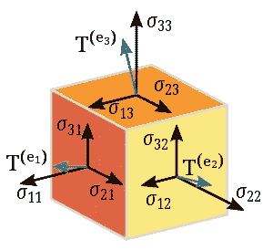

# 线性代数

> 原文：<https://towardsdatascience.com/linear-algebra-4bf8aeb3c19?source=collection_archive---------65----------------------->

## 机器学习的隐藏引擎

迈克尔·泽兹奇在 [Unsplash](https://unsplash.com?utm_source=medium&utm_medium=referral) 上的照片

一个代数最早是取自 Khwarizmi(780-850 CE)写的一本关于计算和方程的书。它是数学的一个分支，用字母代替数字。每个字母在一个地方可以代表一个特定的数字，在另一个地方可以代表一个完全不同的数字。在代数中，记号和符号也被用来表示数字之间的关系。记得大概 17 年前我还是一个应用数学的普通学生(今天普通毕业生！)，我对哈佛大学玛丽亚姆·米尔扎哈尼(1977-2017)在代数方面的一些研究非常好奇，这些研究是关于类比计数问题的。这门科学在历史上发展了很多，现在包括了许多分支。

初等代数包括四种主要运算的基本运算。在定义了分隔定数和变量的符号之后，就可以用一些方法来求解这些方程。多项式是有限个非零项之和的表达式，每个项都由一个常数和有限个整数次幂的变量的乘积组成。

抽象代数或近世代数是代数家族中研究群、环、域等高级代数结构的一个群。代数结构及其相关的同态构成了数学范畴。范畴理论是一种形式主义，它允许用一种统一的方式来表达各种结构的相似性质和结构。抽象代数是如此受欢迎，并在数学和工程科学的许多领域使用。例如，代数拓扑使用代数对象来研究拓扑。2003 年证明的庞加莱猜想断言，流形的基本群编码了关于连通性的信息，可以用来确定流形是否是球面。代数数论研究推广整数集合的各种数环。

我相信其他科学中最有影响力的代数分支是线性代数。让我们假设你出去慢跑，在新冠肺炎一级防范禁闭的情况下，这可不容易，突然一朵美丽的花吸引了你所有的注意力。请不要急着去摘，只是拍张照片，其他人也可以欣赏。过一会儿当你看这张照片时，你可以认出图像中的花，因为人类的大脑已经进化了数百万年，能够探测到这样的东西。我们不知道在我们大脑的背景中发生的操作，这些操作使我们能够识别图像中的颜色，它们被训练为自动为我们做这些。但是，用机器做这样的事情并不容易，这就是为什么这是机器学习和深度学习中最活跃的研究领域之一。实际上，最根本的问题是:“机器是如何存储这个图像的？”你可能知道今天的计算机只能处理两个数字，0 和 1。现在，像这样有不同特征的图像如何存储？这是通过将像素强度存储在一个称为“矩阵”的结构中来实现的。

线性代数的主要课题是向量和矩阵。向量是有长度和方向的几何对象。例如，我们可以提到速度和力，它们都是矢量。每个向量由一个箭头表示，箭头的长度和方向表示向量的大小和方向。两个或多个矢量的相加可以基于使用平行四边形方法或图像方法的易用性来完成，在图像方法中，每个矢量被分解成沿坐标轴的分量。向量空间是向量的集合，这些向量可以通过标量相加和相乘。标量通常可以从任何字段中选取，但通常是实数。

矩阵是二维的有序数字阵列，通常有 m 行和 n 列。如果两个矩阵大小相同，这意味着每个矩阵都有相同的行数和列数，就像另一个一样，它们可以逐个元素地相加或相减。只有当第一个矩阵的列数与第二个矩阵的行数相同时，我们才能将这些矩阵相乘。例如，假设内部维度是相同的，一个(m×n)矩阵的 n 乘以一个(n×p)，则得到一个(m×p)矩阵。

机器学习中广泛使用的另一个重要概念是张量。张量是描述与向量空间相关的代数对象集之间的多线性关系的代数对象。张量可以有几种不同的形式，一般来说，二维和更高的二维张量也称为矩阵。矩阵用于创建问题数据与其信息分类之间的顺序。

三维张量

例如，张量用于图像处理，可能一个维度用于宽度，一个维度用于高度，一个维度用于颜色，还有一个维度用于焦点信息。为了联系所有的概念，我们从上面了解到，我们可以说，零维的张量是标量，一维的是向量，最后二维的是矩阵。近年来，开发了用于编程语言的库，以方便张量的使用及其快速处理。其中之一是谷歌开发的 TensorFlow。谷歌还开发了一种专用集成电路，称为张量处理器单元(TPU)，用于高效、快速地计算神经网络的张量。

特征向量和特征值是机器学习中广泛使用的另一个重要概念。线性变换的特征向量是一个非零向量，当对其应用线性变换时，该向量按一个标量因子变化。特征值是一组特殊的非零尺度，特征向量将被它拉伸。如果标度是负的，方向将是相反的。

前缀“eigen”来源于德语，意思是特征。特征向量在工程科学中有各种应用，其中之一是它在机器学习算法中的应用，以执行特征约简和维度操作。

蓝色箭头是这个剪切映射的特征向量，因为它不改变方向，并且由于它的长度不变，所以它的特征值是 1。

在机器学习中，我们需要处理向量和矩阵形式的数据的基础知识，获得解线性代数方程组的技能，找到基本的矩阵分解，并对它们的适用性有一个大致的了解。实际上，你必须知道什么是向量和矩阵，以及如何使用它们，包括特征值和特征向量的棘手问题，以及如何使用这些来解决问题。

如果你想学习更多的线性代数知识，不要从零开始，以一种学术的风格。依靠定义，尝试用机器学习算法及其隐藏引擎方法解决一些问题。

# 参考

*班纳吉、苏迪普托；Roy，Anindya (2014)，用于统计的线性代数和矩阵分析，统计科学文本(第 1 版。)，查普曼和霍尔/CRC，ISBN 978–1420095388*

*斯特朗，吉尔伯特(2005 年 7 月 19 日)，《线性代数及其应用》(第 4 版。)，布鲁克斯·科尔，ISBN 978–0–03–010567–8*

*夏普(2000 年 11 月 21 日)。微分几何:卡坦对克莱因的埃尔兰根程序的推广。施普林格科学&商业媒体。第 194 页。ISBN 978–0–387–94732–7。*

威廉·布朗(1991)，矩阵与向量空间，纽约:m .德克尔，ISBN 978–0–8247–8419–5

[*西亚达提，萨曼。(2014).代数的第一课。10.13140/*T3](https://doi.org/10.13140/RG.2.2.16017.04962)