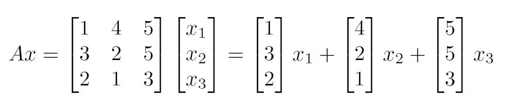
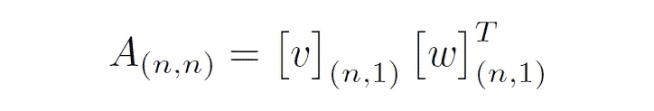
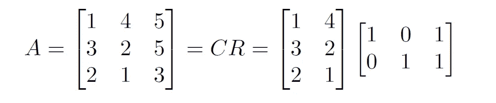

# 数据科学的线性代数:一种新的开始方式—第 1 部分

> 原文：<https://towardsdatascience.com/linear-algebra-for-data-science-a-new-way-to-start-part-1-c2fe0cf1b247?source=collection_archive---------48----------------------->

## 数据科学的思考

## 吉尔伯特·斯特朗教授关于线性代数的观点和建议

安迪·霍姆斯在 Unsplash 上的照片

线性代数可能是数据科学、模式识别和机器学习的最基本的构建模块之一。我认为，理解基础是任何人在追求高级主题之前应该做的第一件事。为什么？因为我们不想陷入在高级话题和基础知识之间来回循环的怪圈！

在这一系列中，我将讨论 Gilbert Strang 教授在其最新系列讲座“2020 年线性代数展望”中涉及的主题。这是一个优秀的系列讲座，他在应用线性代数教学中采用自上而下的方法。我在这里的目的是与你们分享我对相关细节的理解，我相信这将有助于以更好和细致入微的方式理解讲座。

所以让我们开始吧！

# 第 1 部分涵盖的主题:

1.  *矩阵的行列空间*
2.  *秩、零空间和无效性*
3.  *秩 1 矩阵*
4.  *CR 分解*

## 列间距和行间距

为了理解**列空间**和行空间，我们首先需要理解“**跨度**”，它只不过是一组向量的所有可能的线性组合的集合。因此，矩阵 A 的列间距和行间距被定义为矩阵 A 的列和行的跨度。

的列的线性组合

*A 的列间距= C(A)* =所有向量 *Ax。*换句话说，就是矩阵 *A.* 中线性无关列所跨越的空间，这里我们可以看到，第 3 列( *c3* )可以表示为第 1 列( *c1* )和第 2 列( *c2* ) *，*我们只有两个线性无关列 *(c1 和 c2)。*这里的 *c1* 和 *c2* 称为列空间的**基础**。形式上，一个空间的基被定义为一组线性独立并跨越该空间的向量。

矩阵 A 跨越 R(平面)而不是 R *(3D 空间)，尽管*是一个 *3x3* 矩阵。

同样的概念也适用于行空间。在这种情况下，只需用行替换列。此外，列空间的维度总是与行空间的维度相同。这只是到达同一点的另一种方式。当研究线性代数的四个基本空间时，我们将详细地重新讨论行空间和列空间。

## 军阶

秩被定义为向量空间的列所跨越的维度，其等于线性无关列的数量(列秩)以及线性无关行的数量(行秩)。请注意，行秩总是等于列秩，数学家证明超出了本文的范围，但是直观上，因为列和行空间跨越相同的向量空间，所以它们的维数必须相同。计算矩阵秩的一种常用方法是通过高斯消去法和计算枢轴数(行梯队形式中每行的第一个非零元素)来减少**行梯队形式**的矩阵。

矩阵及其行梯队形式

这里，矩阵的秩等于 2，因为在其行梯队形式中有两个枢纽元素。

## 零空间和无效

既然我们一直在谈论不同种类的空间，我们不要忘记它的起源。毕竟，不定义原点就不能定义空间。我们将零空间定义为所有向量乘上矩阵 *A，*即 **Ax = 0 后变成零(原点落地)的空间。**

零度被定义为零空间的维数。它给我们带来了一个非常特殊的结果**秩(A) +无效性(A) =维数(A)。**这就是*秩零定理*。

## 秩 1 矩阵

秩 1 矩阵本质上是矩阵代数的构造块。您现在一定已经猜到了，如果矩阵只有一个独立的列和一个独立的行，那么它的秩是 1。奇怪吗？你一定想知道这个矩阵会包含什么信息？它包含的信息比看起来要少得多。我们稍后将回到他们身上。

矩阵 A 是两个向量的外积

秩 1 矩阵可以被视为两个向量的外积。这是一个非常特殊的结果，因为它可以被看作矩阵 A 有很大的维数，但它只跨越了一个 1D 空间！还有，任何矩阵变换都可以看成是 *n* 秩为 1 的矩阵之和(给你一个小作业！).

# 铬分解

现在，在了解了基本概念之后，让我们深入了解一种独特的分解技术，这种技术在许多数据科学、统计学和数据分析问题中被高度使用，即 CR 分解。

在 CR 分解中，像任何其他矩阵分解一样，我们将矩阵 *A* 表示为两个矩阵 *C* 和 R *的乘积。*矩阵 C 和 R 被描述为:

*   矩阵 ***C*** 包含矩阵 ***A*** 的独立列
*   矩阵 ***R*** 包含了行空间 ***A*** 的基础

让我们看一个例子:

矩阵 A 的 CR 分解

## 观察结果:

1.  可以看到，矩阵*有两个独立的列 *c1* 和 *c2* 构成了矩阵 ***C*** ，矩阵*包含了行空间的基础，也就是说，告诉我们如何使用矩阵 ***C* 的列来重构矩阵****
2.  ****的 ***r*** (= 2)列是独立的(根据它们的构造)****
3.  *****A*** 的每一列都是那些 ***r*** 列的组合。**
4.  ***的 ***r*** (= 2)行是独立的。***
5.  **每一排 ***A*** 都是那些 ***r*** 排的组合。**

## **关键要点:**

1.  *****C*** 有列直接来自 ***A*** 。它可以提供关于矩阵*的向量空间的有意义的信息。***
2.  ******R*** 原来是**排的缩减梯队形式**的矩阵 ***一个*** 。***
3.  **矩阵的行秩=列秩**
4.  ******C*** :列基， ***R*** :矩阵的行基 ***A*** 。***
5.  **如果 ***A*** 是可逆矩阵那么***C = A******R = I***。**

***在本系列接下来的部分中，我将涉及的主题包括但不限于:***

*   ***线性代数的大局。***
*   ***正交矩阵及其应用。***
*   ***不同的矩阵分解技术及其应用。***
*   ***奇异值分解、主成分分析，以及它们之间的相互关系。***
*   ***矩阵分解在一些现实应用中的应用。***

**希望这对你有帮助。下次见。谢谢大家！**

# **参考**

**[1]吉尔伯特斯特朗。线性代数的 2020 年愿景。【2020 年春季。麻省理工学院:麻省理工学院开放课件，【https://ocw.mit.edu】T2。许可:[知识共享协议 BY-NC-SA](https://creativecommons.org/licenses/by-nc-sa/4.0/) 。**

**[2]吉尔伯特·斯特朗。 *18.06 线性代数。2010 年春天。麻省理工学院:麻省理工学院开放课件，[https://ocw.mit.edu](https://ocw.mit.edu/courses/mathematics/18-06-linear-algebra-spring-2010)。许可:[知识共享协议 BY-NC-SA](https://creativecommons.org/licenses/by-nc-sa/4.0/) 。***