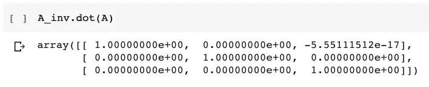

# 数据科学的线性代数 Ep 3-恒等矩阵和逆矩阵

> 原文：<https://towardsdatascience.com/linear-algebra-for-data-science-ep-3-identity-and-inverse-matrices-70820a3fbdb9?source=collection_archive---------39----------------------->

## 用 NumPy 的线性代数类求解线性方程组


[点积](/dot-product-in-linear-algebra-for-data-science-using-python-f113fb60c8f) (Ep2)帮助我们表示方程组，我们可以继续讨论恒等式和逆矩阵。正如我们将看到的，这两种类型的矩阵帮助我们求解线性方程组。基于上述概念，我们将使用 NumPy 进一步求解一个由 2 个方程组成的系统。

如果你想看我向你解释这些概念，而不是读这个博客:

# 恒等式矩阵

一种特殊的矩阵，其主对角线单元格用 1 填充，其余单元格用 0 填充。以下是 3×3 身份矩阵的样子:


3×3 恒等式矩阵

## 属性:

恒等式矩阵类似于 1(标量)，表示将恒等式矩阵应用(相乘)到向量或矩阵对受试者没有影响。

例如:

***Ix = x***

在那里，

**I**为身份矩阵

**x**是一个向量


## 代码:

我们可以使用 NumPy 的`eye()`方法创建一个身份矩阵。

```
import numpy as np
I = np.eye(3)
```

上面的代码返回一个 3×3 的身份矩阵，如下所示:


在代码中确认属性后，我们可以用向量或矩阵计算点积，如下所示:


> 注:确保满足[乘法规则](/dot-product-in-linear-algebra-for-data-science-using-python-f113fb60c8f)。

# 逆矩阵

***A*** 矩阵的逆是矩阵乘以 ***A*** 本身，返回恒等式矩阵。它是由 ***一*** ⁻所表示的。

数学上:


直觉告诉我们，如果我们用矩阵 ***A、*** 对空间进行线性变换，我们可以通过将 A⁻再次应用于空间来恢复变化。

> 注:如果**矩阵**的行列式为零，则**没有**和**的逆**；**矩阵**被认为是奇异的。只有非奇异**矩阵才有逆**。

## 代码:

我们可以用 NumPy 的 `array()`方法创建一个 2D 阵列，然后用`linalg.inv()`方法找出它的逆阵。

```
A = np.array([[3,0,2], [2,0,-2], [0,1,1]])
A_inv = np.linalg.inv(A)
```


现在，既然我们已经生成了逆，我们就可以通过计算 ***A*** 与 ***A*** ⁻的点积来检查属性:



返回单位矩阵

因此，该性质对逆矩阵成立。

# 求解线性方程组

正如在[ep2](/dot-product-in-linear-algebra-for-data-science-using-python-f113fb60c8f)中所解释的，我们可以用矩阵来表示线性方程组。现在，我们可以用逆矩阵来求解。

对于任何方程 ***Ax = b，*** 我们可以简单地将方程两边的 ***A*** ⁻相乘，我们将得到一个对 ***x*** 没有任何影响的单位矩阵，因此我们的 ***x*** 将是***a***⁻***b***为


## 示例:

假设我们有一个如下所示的方程组，现在这个方程组首先需要用一种格式来表示，在这种格式中，它可以用右边的方法以 ***Ax = b*** 的形式来表示。


将所有未知项移至左侧，常数移至右侧后，我们现在可以写出上述系统的矩阵形式:


现在，我们需要做的就是使用 NumPy 在代码中创建这些矩阵和向量，然后找出***x***=***a***⁻***b .***

**代号:**

```
A = np.array([[2,-1], [1,1]])A_inv = np.linalg.inv(A)b = np.array([[0], [3]])x = A_inv.dot(b)
```


输出:x = [[1]，[2]]

我们计算过的 ***x(1，2)*** 就是系统中 2 个方程的交点。

我们可以通过使用 matplotlib 绘制这两条线来确认我们的答案:

```
x = np.arange(-10, 10)
y1 = 2*x
y2 = -x + 3import matplotlib.pyplot as plt
plt.figure()
plt.plot(x, y1)
plt.plot(x, y2)
plt.xlim(0,3)
plt.ylim(0,3)
plt.grid(True)plt.show()
```

下面是您将得到的输出图，它证实了我们的答案:


## 摘要

这是关于单位矩阵和逆矩阵，它们是其他重要概念的基础。下一集将介绍线性相关和跨度。敬请关注 Harshit，继续学习[数据科学。](https://www.youtube.com/c/DataSciencewithHarshit)

# Harshit 的数据科学

通过这个渠道，我计划推出几个覆盖整个数据科学领域的[系列](/hitchhikers-guide-to-learning-data-science-2cc3d963b1a2?source=---------8------------------)。以下是你应该订阅[频道](https://www.youtube.com/channel/UCH-xwLTKQaABNs2QmGxK2bQ)的原因:

*   该系列将涵盖每个主题和子主题的所有必需/要求的高质量教程，如 [Python 数据科学基础](/python-fundamentals-for-data-science-6c7f9901e1c8?source=---------5------------------)。
*   解释了为什么我们在 ML 和深度学习中做这些事情的数学和推导。
*   与谷歌、微软、亚马逊等公司的数据科学家和工程师以及大数据驱动型公司的首席执行官的播客。
*   [项目和说明](/building-covid-19-analysis-dashboard-using-python-and-voila-ee091f65dcbb?source=---------2------------------)实施到目前为止所学的主题。

你可以在[推特](https://twitter.com/tyagi_harshit24)或 [LinkedIn](https://www.linkedin.com/in/tyagiharshit/) 上与我联系。