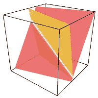
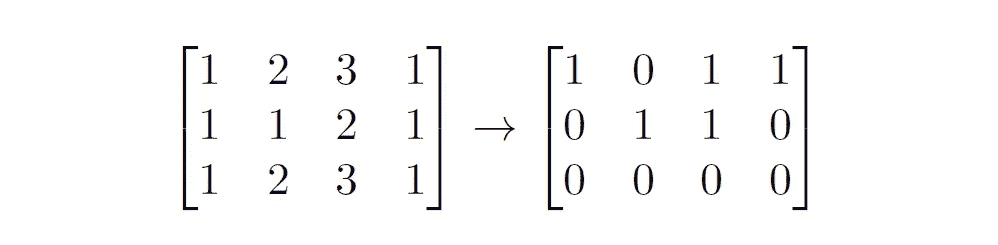
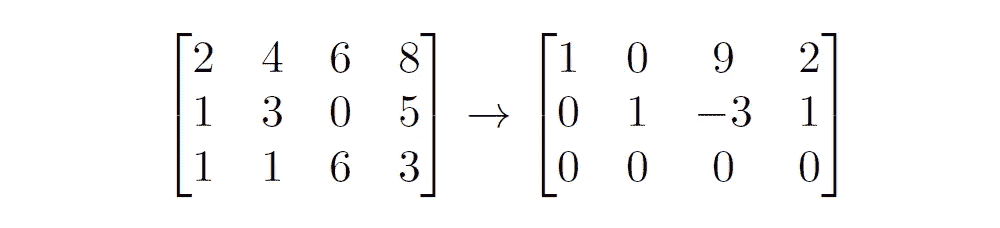
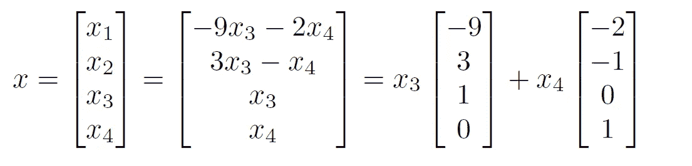
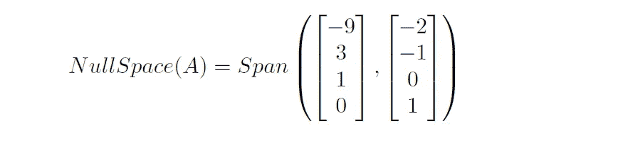
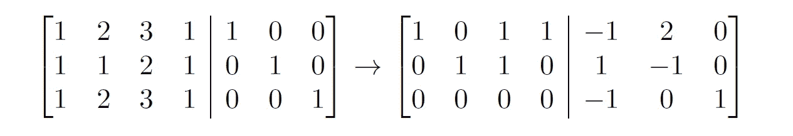
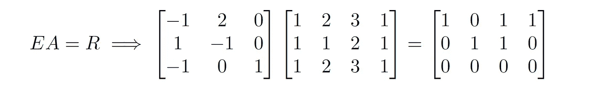
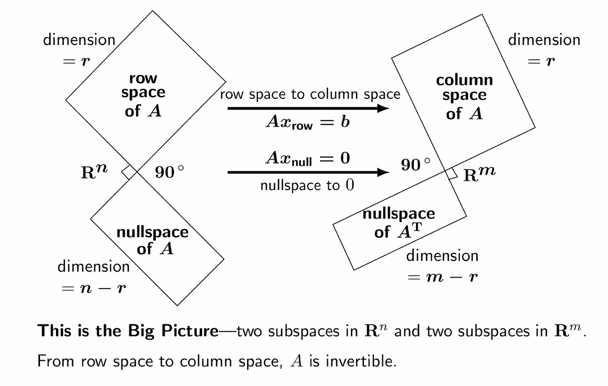

# 数据科学中的线性代数:线性代数的大图景—第 2 部分

> 原文：<https://towardsdatascience.com/linear-algebra-for-data-science-the-bigger-picture-of-linear-algebra-part-2-6e2ecee40f71?source=collection_archive---------66----------------------->

## 数据科学的思考

## 线性代数基本定理的序言

格雷格·拉科齐在 Unsplash 上的照片

快速介绍一下，在这个系列中，我将重温吉尔伯特·斯特朗教授在其最新系列讲座“[2020 年线性代数展望](https://ocw.mit.edu/resources/res-18-010-a-2020-vision-of-linear-algebra-spring-2020/)”中讨论的主题。这篇文章是“数据科学的线性代数”系列的第二部分，我建议你浏览第一部分，这样你就不会错过流程。

我在这里的目的是与你们分享我对相关细节的理解，我相信这将有助于以更好和细致入微的方式理解讲座。

所以让我们开始吧！

# 第 2 部分涵盖的主题:

在这一部分，我将主要讨论线性代数的四个基本子空间以及它们之间的关系。

1.  向量空间的子空间
2.  四个基本子空间
3.  基本子空间的基
4.  大局！

## 子空间

如果 *V* 是实数域上的向量空间，定义为并且 *W* 是 *V* 的子集，那么 *W* 是*V*的**子空间**例如，让向量空间 *V* 是实数坐标空间 R 并且 *W* 是最后一个分量为 0 的 *V* 中所有向量的集合那么 *W* 就是 *V* 的子空间。矩阵方面，设 *A* 是一个 3 乘 2 的矩阵，那么列空间是子空间如果 R，行空间是子空间如果 R。

在 **R** 中，两个不同的二维子空间的交集。牡蛎弗雷德，CC BY-SA 4.0

## 四个基本子空间

吉尔伯特·斯特朗的《线性代数基本定理》描述了一个 m 乘 n 矩阵 *A* 的作用。矩阵 *A* 产生从 R^n 到 R^m 的线性变换，但是这个图片本身太大了。关于 ***Ax* = b** 的“真值”用四个子空间来表示(两个是 R^n 的，两个是 R^m).的第一步是把 ***Ax*** 看成 a 的列的组合，这一步把视点上升到子空间。我们在列空间中看到 ***Ax*** 。求解 ***Ax = b*** 就是找到列空间中产生 b 的列的所有组合。

四个基本子空间是:

*   **列空间** *C(A)，R^m 的一个*子空间
*   **行空间**c*(a’)，*r^n 的一个子空间(a’= a 的转置)
*   **零空间** *N(A)，R^n 的*子空间
*   **左零空间***n(a’)*，R^m 的子空间

## 列间距的基础

从第 1 部分我们知道列空间的维数等于行空间的维数，等于矩阵 *A，*的秩 *r* 即***dim(C(A))= dim(C(A’)= r***。

我们还看到，为了计算列空间的基础，我们需要减少矩阵 *A* 的行梯队形式，并挑选对应于枢纽元素的列。现在我们来看看如何计算其他三个子空间的基。

## 行空间的基础

在继续之前，让我们与我们将使用的符号保持一致:

*   *A* 是一个*m×n*矩阵
*   *A’*是转置如果 *A*
*   *R* 是 *A 的缩减行梯队形式*这是一个特例，当每个前导 1 是其列中唯一的非零条目。

矩阵 A 及其简化的行梯型 R

为了找到行空间的基础，我们首先将矩阵简化为简化的行梯队形式，并在 *R* 中选取行，这构成了大小等于秩 *r.* 的单位矩阵如上图所示，行空间的基础是前两行。所以，这里行空间的基础是 *R* 的前两行。

请注意，在从 *A* 到 *R* 的转换中，行间距保持不变，但列间距发生了变化。

## 零空间的基础

为了得到 A 的零空间的基，我们需要解齐次方程组， ***Ax = 0*** 。我们首先获得对应于矩阵 A 的缩减行梯队形式矩阵，然后找到对应于**自由变量**的系数(对应于缩减行梯队形式中非枢纽列的变量)。让我们试着借助一个例子来理解:

矩阵 A 及其简化的行梯型 R

求解 Ax = 0，我们得到上面的解

## 左零空间的基

左边的零空间也可以看作是零空间。所以，在这种情况下，我们求解 ***A' y = 0。*** 你可能会奇怪为什么会“留下”零空间？嗯，这背后没有数学上的原因，但只是为了证明我们的选择，让我们建立一个解释(所有信贷斯特朗教授！).让我们在方程的两边进行转置 ***A'y = 0。*** 现在相当于 ***y' A = 0。*** 请注意，这里的零点向量现在是一个行向量。由于***y’***现在出现在矩阵 *A* 的左边，我们称这个空间为左零空间。

找到左零空间的一个显而易见的方法是像我们求解零空间一样求解方程，但是等等，干！(不重复！).我们换一种方式做吧！耶！

从我们的第二个公式中，我们知道***y’***现在是 *A* 左边的一个行向量，它在右边产生一个零的行向量。让我们利用这一点。

记住我们在确定行空间时所做的，我们将我们的矩阵 ***A*** 转换为*R .【Let】，将一个 *m x m* 单位矩阵扩充为 *m x n* 矩阵 A，并执行相同的步骤，现在将把**【A | I】**转换为**【R | E】，** 其中 R 是*m x n*E 是 *m x m.* 让我们花一分钟来观察发生了什么……我们应用了与应用于矩阵 ***A*** 相同的行变换来获得 ***R*** 到矩阵 ***I*** 来获得 ***E.*** 它的意思是，【T42*

> *请注意:当 A 可逆时，R = I，E =逆(A)*

****

*将**【A | I】**还原为**【R | E】***

**

*如上式， ***EA = R*** 同解 ***y' A = 0，*** 从矩阵 ***R*** 我们可以看到，秩(A) = 2。所以，左零空间的维数= 3-2 = 1，即列空间-秩的维数。因此， ***A*** 的左零空间的基对应于 E 中产生 R 中零行的行，即 **[ -1 0 1】。***

## *大局！*

**

*现在看到大图，你就能猜到为什么叫“大图”了。它是所有四个基本子空间的本质都在一个地方！因此，让我们注意它包含哪些信息:*

*   *有四个基本的子空间，行空间、列空间、零空间和左零空间*
*   *维度(行空间)=维度(列空间)=等级*
*   *Dim(零空间)= n-r，其中 n =行的维度*
*   *Dim(左零空间)= m-r，其中 m =列的维度*
*   *任何转换 **Ax = b** 将 **x** 从行空间转换到列空间。*
*   *任何转换 **Ax = 0** 将 **x** 从行空间转换到左零空间。*
*   *行空间和零空间是正交的，列空间和左零空间彼此正交(我们将在接下来的部分中讨论正交性)*

*我希望这有所帮助。下次见。谢谢大家！*

# *参考*

*[1]吉尔伯特斯特朗。线性代数的 2020 年愿景。【2020 年春季。麻省理工学院:麻省理工学院开放课件，【https://ocw.mit.edu】T2。许可:[知识共享协议 BY-NC-SA](https://creativecommons.org/licenses/by-nc-sa/4.0/) 。*

*[2]吉尔伯特·斯特朗。 *18.06 线性代数。2010 年春天。麻省理工学院:麻省理工学院开放课件，[https://ocw.mit.edu](https://ocw.mit.edu/courses/mathematics/18-06-linear-algebra-spring-2010)。许可:[知识共享协议 BY-NC-SA](https://creativecommons.org/licenses/by-nc-sa/4.0/) 。**