# 面向数据科学家的线性代数—用 NumPy 解释

> 原文：<https://towardsdatascience.com/linear-algebra-for-data-scientists-explained-with-numpy-6fec26519aea?source=collection_archive---------32----------------------->

## 线性代数的核心概念和实践。

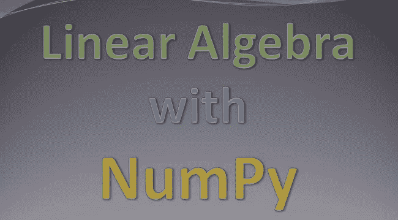

作者图片

机器学习和深度学习模型需要大量数据。它们的性能高度依赖于数据量。因此，我们倾向于收集尽可能多的数据，以便建立一个稳健而准确的模型。数据以多种不同的格式收集，从数字到图像，从文本到声波。然而，我们需要将数据转换成数字，以便对其进行分析和建模。

仅仅将数据转换成标量(单个数字)是不够的。随着数据量的增加，用标量完成的操作开始变得低效。我们需要矢量化或矩阵运算来有效地进行计算。这就是**线性代数**发挥作用的地方。

线性代数是数据科学领域中最重要的课题之一。在这篇文章中，我们将通过使用 **NumPy** 的例子来介绍线性代数中的基本概念。

> NumPy 是 Python 的科学计算库，是许多库(如 Pandas)的基础。

# **线性代数中的对象类型**

线性代数中的对象(或数据结构)类型:

*   标量:单一数字
*   Vector:数字数组
*   矩阵:数字的二维数组
*   张量:N 维数组，其中 n > 2

一个**标量**只是一个数字。正如我们将在下面的例子中看到的，它可以用于矢量化运算。

向量**是一个数字数组。例如，下面是一个包含 5 个元素的向量:**

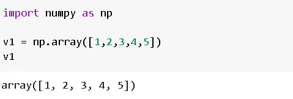

我们可以在矢量化运算中使用标量。对向量和标量的每个元素执行指定的操作。

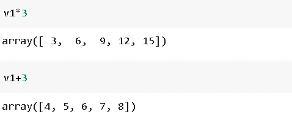

矩阵**是一个二维向量。**

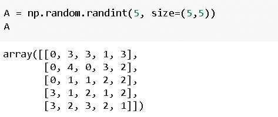

它看起来像一个有行和列的熊猫数据框架。实际上，熊猫数据帧被转换成矩阵，然后输入机器学习模型。

张量**是一个 N 维数组，其中 N 大于 2。张量主要用于深度学习模型，其中输入数据是三维的。**

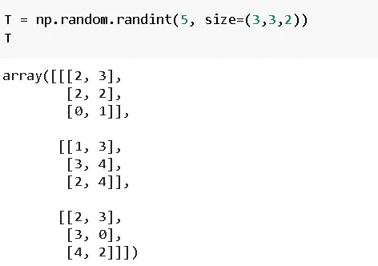

很难用数字来表示，但是可以把 T 想象成 3 个 3x2 的矩阵。

shape 方法可用于检查 numpy 数组的**形状**。

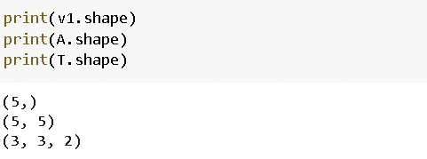

数组的**大小**通过乘以每个维度的大小来计算。

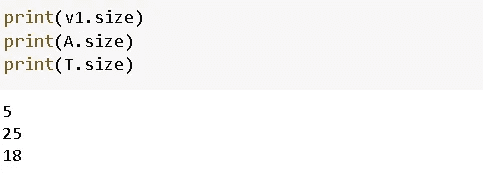

# **常见矩阵术语**

如果行数等于列数，则称一个矩阵为**方阵**。因此，上面的矩阵 A 是一个方阵。

**单位矩阵，**表示为 **I，**是对角线上有 1 而其他位置都有 0 的方阵。NumPy 的单位函数可以用来创建任意大小的单位矩阵。

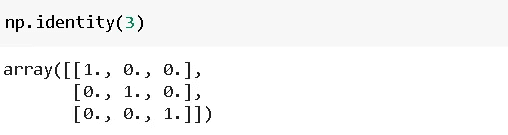

单位矩阵的特殊之处在于它在相乘时不会改变矩阵。在这个意义上，它类似于实数中的数字 1。我们将在这篇文章的矩阵乘法部分用单位矩阵做例子。

矩阵的**逆**是与原矩阵相乘时给出单位矩阵的矩阵。

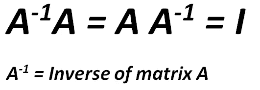

不是每个矩阵都有逆矩阵。如果矩阵 A 有逆，则称其为**可逆**或**非奇异。**

# **点积和矩阵乘法**

点积和矩阵乘法是复杂机器学习和深度学习模型的构建模块，因此全面了解它们是非常有价值的。

两个向量的点积是关于它们位置的元素乘积的和。第一个向量的第一个元素乘以第二个向量的第一个元素，依此类推。这些乘积之和就是点积。NumPy 中计算点积的函数是 **dot()** 。

让我们首先以 numpy 数组的形式创建两个简单的向量，并计算点积。

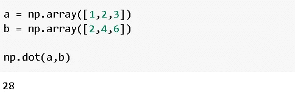

点积的计算方法是(1*2)+(2*4)+(3*6)，即 28。

> 因为我们在相同的位置乘元素，为了得到点积，两个向量必须有相同的长度。

在数据科学领域，我们主要处理矩阵。矩阵是一组以结构化方式组合的行和列向量。因此，**两个矩阵的乘法涉及许多向量的点积运算**。当我们复习一些例子时会更清楚。我们先用 NumPy 创建两个 2x2 矩阵。

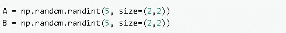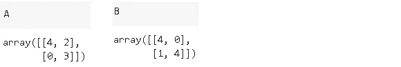

2×2 矩阵有 2 行 2 列。行和列的索引从 0 开始。例如，的第一行(索引为 0 的行)是[4，2]的数组。的第一列是[4，0]的数组。第一行第一列的元素是 4。

我们可以访问单独的行、列或元素，如下所示:

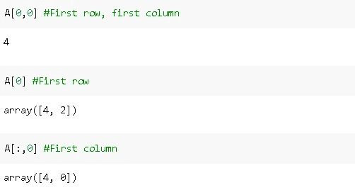

这些是理解矩阵乘法的重要概念。

两个矩阵的乘法涉及第一矩阵的行和第二矩阵的列之间的点积。第一步是 A 的第一行和 b 的第一列之间的点积。该点积的结果是结果矩阵在位置[0，0](即第一行，第一列)的元素。

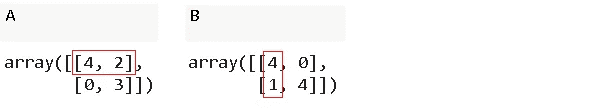

所以得到的矩阵 C 在第一行和第一列有一个(4*4) + (2*1)。 **C[0，0] = 18。**

下一步是 A 的第一行和 b 的第二列的点积。

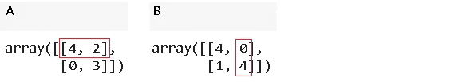

c 将在第一行和第二列有一个(4*0) + (2*4)。 **C[0，1] = 8。**

第一行 A 已完成，因此我们从 A 的第二行开始，并遵循相同的步骤。

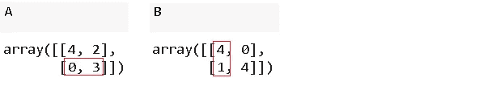

c 在第二行第一列有一个(0*4) + (3*1)。 **C[1，0] = 3。**

最后一步是 A 的第二行和 b 的第二列之间的点积。

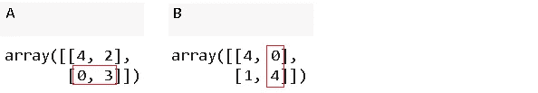

c 将在第二行第二列有一个(0*0) + (3*4)。 **C[1，1] = 12。**

我们已经看到它是如何一步一步完成的。所有这些操作都是用一个 **np.dot** 操作完成的:

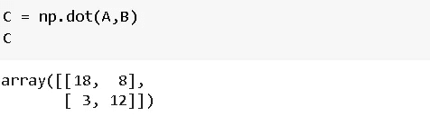

您可能还记得，我们提到过单位矩阵在相乘时不会改变矩阵。我们来做一个例子。

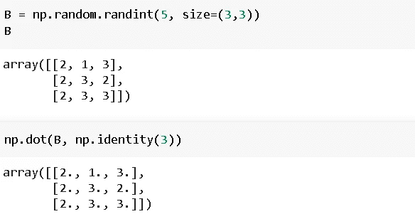

我们也提到过，当一个矩阵乘以它的逆矩阵时，结果就是单位矩阵。让我们首先创建一个矩阵，并找到它的逆。我们可以用 NumPy 的 **linalg.inv()** 函数求一个矩阵的逆。

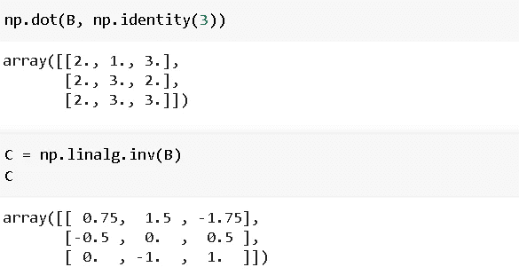

让我们把 B 和它的逆矩阵 C 相乘:

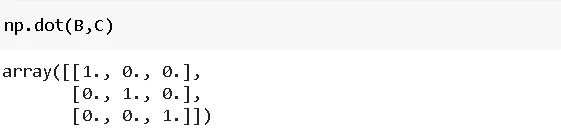

答对了。我们有单位矩阵。

正如我们从矢量点积中回忆的那样，**两个矢量必须有相同的长度，才能得到点积**。矩阵乘法中的每个点积运算都必须遵循这个规则。点积在第一个矩阵的行和第二个矩阵的列之间完成。因此，**第一矩阵的行和第二矩阵的列必须具有相同的长度。**

> 矩阵乘法的要求是第一个矩阵的列数必须等于第二个矩阵的行数。

例如，我们可以将一个 3×2 的矩阵乘以一个 2×3 的矩阵。

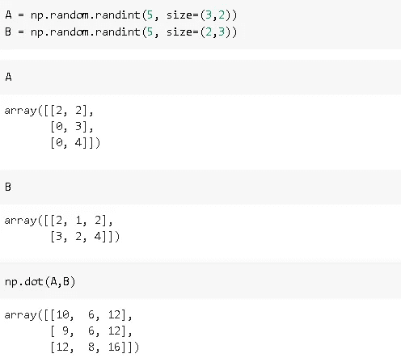

结果矩阵的形状将是 3x3，因为我们对 A 的每一行进行 3 次点积运算，而 A 有 3 行。确定最终矩阵形状的一个简单方法是从第一个矩阵中获取行数，从第二个矩阵中获取列数:

*   3x2 和 2x3 相乘得出 3x3
*   3x2 和 2x2 相乘得出 3x2
*   2x4 和 4x3 乘法返回 2x3

我们已经讨论了线性代数的基本但非常基础的运算。这些基本操作是复杂机器学习和深度学习模型的构建模块。在模型的优化过程中，需要进行大量的矩阵乘法运算。因此，理解基础知识也是非常重要的。

感谢您的阅读。如果您有任何反馈，请告诉我。